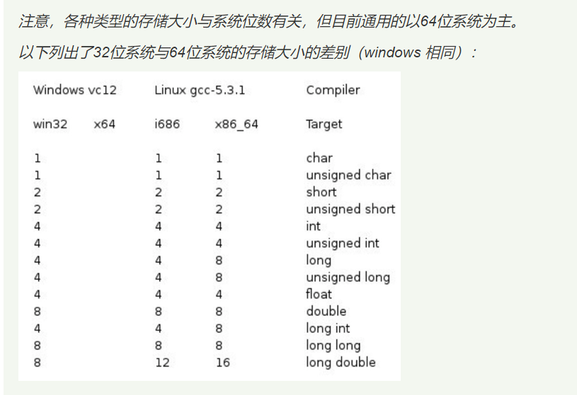
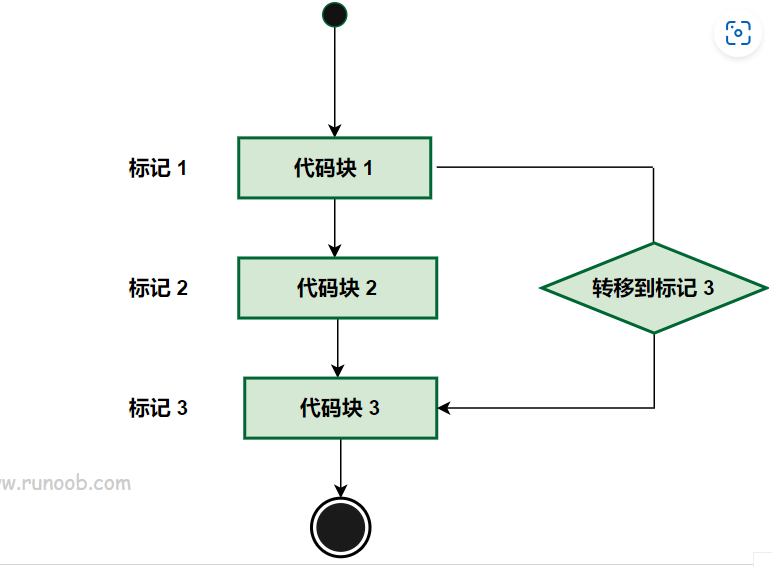
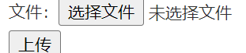

\C++ 简介

C++ 是一种静态类型的、编译式的、通用的、大小写敏感的、不规则的编程语言，支持过程化编程、面向对象编程和泛型编程。

C++ 被认为是一种**中级**语言，它综合了高级语言和低级语言的特点。

C++ 是由 Bjarne Stroustrup 于 1979 年在新泽西州美利山贝尔实验室开始设计开发的。C++ 进一步扩充和完善了 C 语言，最初命名为带类的C，后来在 1983 年更名为 C++。

C++ 是 C 的一个超集，事实上，任何合法的 C 程序都是合法的 C++ 程序。

**注意：**使用静态类型的编程语言是在编译时执行类型检查，而不是在运行时执行类型检查。

## 面向对象程序设计

C++ 完全支持面向对象的程序设计，包括面向对象开发的四大特性：

- **封装（Encapsulation）**：封装是将数据和方法组合在一起，对外部隐藏实现细节，只公开对外提供的接口。这样可以提高安全性、可靠性和灵活性。
- **继承（Inheritance）**：继承是从已有类中派生出新类，新类具有已有类的属性和方法，并且可以扩展或修改这些属性和方法。这样可以提高代码的复用性和可扩展性。
- **多态（Polymorphism）**：多态是指同一种操作作用于不同的对象，可以有不同的解释和实现。它可以通过接口或继承实现，可以提高代码的灵活性和可读性。
- **抽象（Abstraction）**：抽象是从具体的实例中提取共同的特征，形成抽象类或接口，以便于代码的复用和扩展。抽象类和接口可以让程序员专注于高层次的设计和业务逻辑，而不必关注底层的实现细节。

## 标准库

标准的 C++ 由三个重要部分组成：

- 核心语言，提供了所有构件块，包括变量、数据类型和常量，等等。
- C++ 标准库，提供了大量的函数，用于操作文件、字符串等。
- 标准模板库（STL），提供了大量的方法，用于操作数据结构等。

## ANSI 标准

ANSI 标准是为了确保 C++ 的便携性 —— 您所编写的代码在 Mac、UNIX、Windows、Alpha 计算机上都能通过编译。

由于 ANSI 标准已稳定使用了很长的时间，所有主要的 C++ 编译器的制造商都支持 ANSI 标准。

## 学习 C++

学习 C++，关键是要理解概念，而不应过于深究语言的技术细节。

学习程序设计语言的目的是为了成为一个更好的程序员，也就是说，是为了能更有效率地设计和实现新系统，以及维护旧系统。

C++ 支持多种编程风格。您可以使用 Fortran、C、Smalltalk 等任意一种语言的编程风格来编写代码。每种风格都能有效地保证运行时间效率和空间效率。

## C++ 的使用

C++ 语言在许多行业和领域都有广泛应用，包括：

- 游戏开发：C++ 是游戏开发领域中最常用的编程语言之一，因为它具有高效的性能和直接控制硬件的能力。许多主要的游戏引擎，如 Unreal Engine 和 Unity，都使用 C++ 编写。
- 嵌入式系统开发：C++ 可以在嵌入式系统中发挥重要作用，如智能手机、汽车、机器人和家电等领域。由于嵌入式系统通常具有严格的资源限制和实时要求，因此 C++ 的高效性能和内存控制功能非常有用。
- 金融领域：C++ 在金融领域中被广泛应用，如高频交易、算法交易和风险管理等领域。由于这些应用程序需要高效的性能和对硬件的直接控制，C++ 语言是一个合适的选择。
- 图形图像处理：C++ 可以用于开发图形和图像处理应用程序，如计算机视觉、计算机图形学和人工智能领域。由于这些应用程序需要高效的计算能力和对硬件的控制，因此 C++ 是一个很好的选择。
- 科学计算和数值分析：C++ 可以用于开发科学计算和数值分析应用程序，如数值模拟和高性能计算等领域。由于这些应用程序需要高效的计算能力和对硬件的直接控制，C++ 语言是一个很好的选择。

------

## 标准化

| 发布时间 | 通称                    | 备注                       |
| :------- | :---------------------- | :------------------------- |
| 2020     | C++20, C++2a            | ISO/IEC 14882:2020         |
| 2017     | C++17                   | 第五个C++标准              |
| 2017     | coroutines TS           | 协程库扩展                 |
| 2017     | ranges TS               | 提供范围机制               |
| 2017     | library fundamentals TS | 标准库扩展                 |
| 2016     | concurrency TS          | 用于并发计算的扩展         |
| 2015     | concepts TS             | 概念库，用于优化编译期信息 |
| 2015     | TM TS                   | 事务性内存操作             |
| 2015     | parallelism TS          | 用于并行计算的扩展         |
| 2015     | filesystem TS           | 文件系统                   |
| 2014     | C++14                   | 第四个C++标准              |
| 2011     | -                       | 十进制浮点数扩展           |
| 2011     | C++11                   | 第三个C++标准              |
| 2010     | -                       | 数学函数扩展               |
| 2007     | C++TR1                  | C++技术报告：库扩展        |
| 2006     | -                       | C++性能技术报告            |
| 2003     | C++03                   | 第二个C++标准              |
| 1998     | C++98                   | 第一个C++标准              |

# C++ 基本语法

C++ 程序可以定义为对象的集合，这些对象通过调用彼此的方法进行交互。现在让我们简要地看一下什么是类、对象，方法、即时变量。

- **对象 -** 对象具有状态和行为。例如：一只狗的状态 - 颜色、名称、品种，行为 - 摇动、叫唤、吃。对象是类的实例。
- **类 -** 类可以定义为描述对象行为/状态的模板/蓝图。
- **方法 -** 从基本上说，一个方法表示一种行为。一个类可以包含多个方法。可以在方法中写入逻辑、操作数据以及执行所有的动作。
- **即时变量 -** 每个对象都有其独特的即时变量。对象的状态是由这些即时变量的值创建的。

---


## C++ 程序结构

让我们看一段简单的代码，可以输出单词 *Hello World*。

### 实例

```
#include <iostream> 
using namespace std;  

// main() 是程序开始执行的地方  
int main() 
{
cout << "Hello World"; 

// 输出 Hello World   
return 0;
}
```

接下来我们讲解一下上面这段程序：

- C++ 语言定义了一些头文件，这些头文件包含了程序中必需的或有用的信息。上面这段程序中，包含了头文件 **<iostream>**。
- 下一行 **using namespace std;** 告诉编译器使用 std 命名空间。命名空间是 C++ 中一个相对新的概念。
- 下一行 **// main() 是程序开始执行的地方** 是一个单行注释。单行注释以 // 开头，在行末结束。
- 下一行 **int main()** 是主函数，程序从这里开始执行。
- 下一行 **cout << "Hello World";** 会在屏幕上显示消息 "Hello World"。
- 下一行 **return 0;** 终止 main( )函数，并向调用进程返回值 0。

## 编译 & 执行 C++ 程序

接下来让我们看看如何把源代码保存在一个文件中，以及如何编译并运行它。下面是简单的步骤：

- 打开一个文本编辑器，添加上述代码。
- 保存文件为 hello.cpp。
- 打开命令提示符，进入到保存文件所在的目录。
- 键入 'g++ hello.cpp '，输入回车，编译代码。如果代码中没有错误，命令提示符会跳到下一行，并生成 a.out 可执行文件。
- 现在，键入 ' a.out' 来运行程序。
- 您可以看到屏幕上显示 ' Hello World '。

```
$ g++ hello.cpp
$ ./a.out
Hello World
```

请确保您的路径中已包含 g++ 编译器，并确保在包含源文件 hello.cpp 的目录中运行它。

您也可以使用 makefile 来编译 C/C++ 程序。

## C++ 中的分号 & 语句块

在 C++ 中，分号是语句结束符。也就是说，每个语句必须以分号结束。它表明一个逻辑实体的结束。

例如，下面是三个不同的语句：

x = y; y = y+1; add(x, y);

语句块是一组使用大括号括起来的按逻辑连接的语句。例如：

{   cout << "Hello World"; // 输出 Hello World   return 0; }

C++ 不以行末作为结束符的标识，因此，您可以在一行上放置多个语句。例如：

x = y; y = y+1; add(x, y);

等同于

x = y; y = y+1; add(x, y);

## C++ 标识符

C++ 标识符是用来标识变量、函数、类、模块，或任何其他用户自定义项目的名称。一个标识符以字母 A-Z 或 a-z 或下划线 _ 开始，后跟零个或多个字母、下划线和数字（0-9）。

C++ 标识符内不允许出现标点字符，比如 @、& 和 %。C++ 是区分大小写的编程语言。因此，在 C++ 中，**Manpower** 和 **manpower** 是两个不同的标识符。

下面列出几个有效的标识符：

```
mohd       zara    abc   move_name  a_123
myname50   _temp   j     a23b9      retVal
```

## C++ 关键字

下表列出了 C++ 中的保留字。这些保留字不能作为常量名、变量名或其他标识符名称。

| asm          | else      | new              | this     |
| ------------ | --------- | ---------------- | -------- |
| auto         | enum      | operator         | throw    |
| bool         | explicit  | private          | true     |
| break        | export    | protected        | try      |
| case         | extern    | public           | typedef  |
| catch        | false     | register         | typeid   |
| char         | float     | reinterpret_cast | typename |
| class        | for       | return           | union    |
| const        | friend    | short            | unsigned |
| const_cast   | goto      | signed           | using    |
| continue     | if        | sizeof           | virtual  |
| default      | inline    | static           | void     |
| delete       | int       | static_cast      | volatile |
| do           | long      | struct           | wchar_t  |
| double       | mutable   | switch           | while    |
| dynamic_cast | namespace | template         |          |

完整关键字介绍可查阅：[C++ 的关键字（保留字）完整介绍](https://www.runoob.com/w3cnote/cpp-keyword-intro.html)


## 三字符组

三字符组就是用于表示另一个字符的三个字符序列，又称为三字符序列。三字符序列总是以两个问号开头。

三字符序列不太常见，但 C++ 标准允许把某些字符指定为三字符序列。以前为了表示键盘上没有的字符，这是必不可少的一种方法。

三字符序列可以出现在任何地方，包括字符串、字符序列、注释和预处理指令。

下面列出了最常用的三字符序列：

| 三字符组 | 替换 |
| :------- | :--- |
| ??=      | #    |
| ??/      | \    |
| ??'      | ^    |
| ??(      | [    |
| ??)      | ]    |
| ??!      | \|   |
| ??<      | {    |
| ??>      | }    |
| ??-      | ~    |

如果希望在源程序中有两个连续的问号，且不希望被预处理器替换，这种情况出现在字符常量、字符串字面值或者是程序注释中，可选办法是用字符串的自动连接："...?""?..."或者转义序列："...?\?..."。

从Microsoft Visual C++ 2010版开始，该编译器默认不再自动替换三字符组。如果需要使用三字符组替换（如为了兼容古老的软件代码），需要设置编译器命令行选项/Zc:trigraphs

g++仍默认支持三字符组，但会给出编译警告。

## C++ 中的空格

只包含空格的行，被称为空白行，可能带有注释，C++ 编译器会完全忽略它。

在 C++ 中，空格用于描述空白符、制表符、换行符和注释。空格分隔语句的各个部分，让编译器能识别语句中的某个元素（比如 int）在哪里结束，下一个元素在哪里开始。因此，在下面的语句中：

```
int age;
```

在这里，int 和 age 之间必须至少有一个空格字符（通常是一个空白符），这样编译器才能够区分它们。另一方面，在下面的语句中：

```
fruit = apples + oranges;   // 获取水果的总数
```

fruit 和 =，或者 = 和 apples 之间的空格字符不是必需的，但是为了增强可读性，您可以根据需要适当增加一些空格。

---


# C++ 注释

程序的注释是解释性语句，您可以在 C++ 代码中包含注释，这将提高源代码的可读性。所有的编程语言都允许某种形式的注释。

C++ 支持单行注释和多行注释。注释中的所有字符会被 C++ 编译器忽略。

C++ 注释一般有两种：

- **//** - 一般用于单行注释。
- /*** ... \*/** - 一般用于多行注释。

注释以 **//** 开始，直到行末为止。例如：

## 实例

\#include <iostream> using namespace std;  int main() {  // 这是一个注释  cout << "Hello World!";  return 0; }

也可以放在语句后面：

## 实例

\#include <iostream> using namespace std;  int main() {   cout << "Hello World!"; // 输出 Hello World!    return 0; }

当上面的代码被编译时，编译器会忽略 **// 这是一个注释** 和 **// 输出 Hello World!**，最后会产生以下结果：

```
Hello World!
```

C++ 注释以 **/\*** 开始，以 ***/** 终止。例如：

\#include <iostream> using namespace std;  int main() {    /* 这是注释 */     /* C++ 注释也可以     * 跨行     */     cout << "Hello World!";    return 0; }

在 **/\*** 和 ***/** 注释内部，**//** 字符没有特殊的含义。在 **//** 注释内，**/\*** 和 ***/** 字符也没有特殊的含义。因此，您可以在一种注释内嵌套另一种注释。例如：

/* 用于输出 Hello World 的注释  cout << "Hello World"; // 输出 Hello World  */

---


# C++ 数据类型

使用编程语言进行编程时，需要用到各种变量来存储各种信息。变量保留的是它所存储的值的内存位置。这意味着，当您创建一个变量时，就会在内存中保留一些空间。

您可能需要存储各种数据类型（比如字符型、宽字符型、整型、浮点型、双浮点型、布尔型等）的信息，操作系统会根据变量的数据类型，来分配内存和决定在保留内存中存储什么。

## 基本的内置类型

C++ 为程序员提供了种类丰富的内置数据类型和用户自定义的数据类型。下表列出了七种基本的 C++ 数据类型：

| 类型     | 关键字  |
| :------- | :------ |
| 布尔型   | bool    |
| 字符型   | char    |
| 整型     | int     |
| 浮点型   | float   |
| 双浮点型 | double  |
| 无类型   | void    |
| 宽字符型 | wchar_t |

其实 wchar_t 是这样来的：

```
typedef short int wchar_t;
```

所以 wchar_t 实际上的空间是和 short int 一样。

一些基本类型可以使用一个或多个类型修饰符进行修饰：

- signed
- unsigned
- short
- long

下表显示了各种变量类型在内存中存储值时需要占用的内存，以及该类型的变量所能存储的最大值和最小值。

**注意：**不同系统会有所差异，一字节为 8 位。

**注意：**默认情况下，int、short、long都是带符号的，即 signed。

**注意：**long int 8 个字节，int 都是 4 个字节，早期的 C 编译器定义了 long int 占用 4 个字节，int 占用 2 个字节，新版的 C/C++ 标准兼容了早期的这一设定。

| 类型               | 位            | 范围                                                         |
| :----------------- | :------------ | :----------------------------------------------------------- |
| char               | 1 个字节      | -128 到 127 或者 0 到 255                                    |
| unsigned char      | 1 个字节      | 0 到 255                                                     |
| signed char        | 1 个字节      | -128 到 127                                                  |
| int                | 4 个字节      | -2147483648 到 2147483647                                    |
| unsigned int       | 4 个字节      | 0 到 4294967295                                              |
| signed int         | 4 个字节      | -2147483648 到 2147483647                                    |
| short int          | 2 个字节      | -32768 到 32767                                              |
| unsigned short int | 2 个字节      | 0 到 65,535                                                  |
| signed short int   | 2 个字节      | -32768 到 32767                                              |
| long int           | 8 个字节      | -9,223,372,036,854,775,808 到 9,223,372,036,854,775,807      |
| signed long int    | 8 个字节      | -9,223,372,036,854,775,808 到 9,223,372,036,854,775,807      |
| unsigned long int  | 8 个字节      | 0 到 18,446,744,073,709,551,615                              |
| float              | 4 个字节      | 精度型占4个字节（32位）内存空间，+/- 3.4e +/- 38 (~7 个数字) |
| double             | 8 个字节      | 双精度型占8 个字节（64位）内存空间，+/- 1.7e +/- 308 (~15 个数字) |
| long long          | 8 个字节      | 双精度型占8 个字节（64位）内存空间，表示 -9,223,372,036,854,775,807 到 9,223,372,036,854,775,807 的范围 |
| long double        | 16 个字节     | 长双精度型 16 个字节（128位）内存空间，可提供18-19位有效数字。 |
| wchar_t            | 2 或 4 个字节 | 1 个宽字符                                                   |

> 注意，各种类型的存储大小与系统位数有关，但目前通用的以64位系统为主。
>
> 以下列出了32位系统与64位系统的存储大小的差别（windows 相同）：
>
> 

从上表可得知，变量的大小会根据编译器和所使用的电脑而有所不同。

下面实例会输出您电脑上各种数据类型的大小。

### 实例

```c++
#include<iostream>  
#include <limits>
 
using namespace std;  
  
int main()  
{  
    cout << "type: \t\t" << "************size**************"<< endl;  
    cout << "bool: \t\t" << "所占字节数：" << sizeof(bool);  
    cout << "\t最大值：" << (numeric_limits<bool>::max)();  
    cout << "\t\t最小值：" << (numeric_limits<bool>::min)() << endl;  
    cout << "char: \t\t" << "所占字节数：" << sizeof(char);  
    cout << "\t最大值：" << (numeric_limits<char>::max)();  
    cout << "\t\t最小值：" << (numeric_limits<char>::min)() << endl;  
    cout << "signed char: \t" << "所占字节数：" << sizeof(signed char);  
    cout << "\t最大值：" << (numeric_limits<signed char>::max)();  
    cout << "\t\t最小值：" << (numeric_limits<signed char>::min)() << endl;  
    cout << "unsigned char: \t" << "所占字节数：" << sizeof(unsigned char);  
    cout << "\t最大值：" << (numeric_limits<unsigned char>::max)();  
    cout << "\t\t最小值：" << (numeric_limits<unsigned char>::min)() << endl;  
    cout << "wchar_t: \t" << "所占字节数：" << sizeof(wchar_t);  
    cout << "\t最大值：" << (numeric_limits<wchar_t>::max)();  
    cout << "\t\t最小值：" << (numeric_limits<wchar_t>::min)() << endl;  
    cout << "short: \t\t" << "所占字节数：" << sizeof(short);  
    cout << "\t最大值：" << (numeric_limits<short>::max)();  
    cout << "\t\t最小值：" << (numeric_limits<short>::min)() << endl;  
    cout << "int: \t\t" << "所占字节数：" << sizeof(int);  
    cout << "\t最大值：" << (numeric_limits<int>::max)();  
    cout << "\t最小值：" << (numeric_limits<int>::min)() << endl;  
    cout << "unsigned: \t" << "所占字节数：" << sizeof(unsigned);  
    cout << "\t最大值：" << (numeric_limits<unsigned>::max)();  
    cout << "\t最小值：" << (numeric_limits<unsigned>::min)() << endl;  
    cout << "long: \t\t" << "所占字节数：" << sizeof(long);  
    cout << "\t最大值：" << (numeric_limits<long>::max)();  
    cout << "\t最小值：" << (numeric_limits<long>::min)() << endl;  
    cout << "unsigned long: \t" << "所占字节数：" << sizeof(unsigned long);  
    cout << "\t最大值：" << (numeric_limits<unsigned long>::max)();  
    cout << "\t最小值：" << (numeric_limits<unsigned long>::min)() << endl;  
    cout << "double: \t" << "所占字节数：" << sizeof(double);  
    cout << "\t最大值：" << (numeric_limits<double>::max)();  
    cout << "\t最小值：" << (numeric_limits<double>::min)() << endl;  
    cout << "long double: \t" << "所占字节数：" << sizeof(long double);  
    cout << "\t最大值：" << (numeric_limits<long double>::max)();  
    cout << "\t最小值：" << (numeric_limits<long double>::min)() << endl;  
    cout << "float: \t\t" << "所占字节数：" << sizeof(float);  
    cout << "\t最大值：" << (numeric_limits<float>::max)();  
    cout << "\t最小值：" << (numeric_limits<float>::min)() << endl;  
    cout << "size_t: \t" << "所占字节数：" << sizeof(size_t);  
    cout << "\t最大值：" << (numeric_limits<size_t>::max)();  
    cout << "\t最小值：" << (numeric_limits<size_t>::min)() << endl;  
    cout << "string: \t" << "所占字节数：" << sizeof(string) << endl;  
    // << "\t最大值：" << (numeric_limits<string>::max)() << "\t最小值：" << (numeric_limits<string>::min)() << endl;  
    cout << "type: \t\t" << "************size**************"<< endl;  
    return 0;  
}
```

本实例使用了 **endl**，这将在每一行后插入一个换行符，**<<** 运算符用于向屏幕传多个值，**sizeof()** 运算符用来获取各种数据类型的大小。

当上面的代码被编译和执行时，它会产生以下的结果，结果会根据所使用的计算机而有所不同：

```c++
type:         ************size**************
bool:         所占字节数：1    最大值：1        最小值：0
char:         所占字节数：1    最大值：        最小值：?
signed char:     所占字节数：1    最大值：        最小值：?
unsigned char:     所占字节数：1    最大值：?        最小值：
wchar_t:     所占字节数：4    最大值：2147483647        最小值：-2147483648
short:         所占字节数：2    最大值：32767        最小值：-32768
int:         所占字节数：4    最大值：2147483647    最小值：-2147483648
unsigned:     所占字节数：4    最大值：4294967295    最小值：0
long:         所占字节数：8    最大值：9223372036854775807    最小值：-9223372036854775808
unsigned long:     所占字节数：8    最大值：18446744073709551615    最小值：0
double:     所占字节数：8    最大值：1.79769e+308    最小值：2.22507e-308
long double:     所占字节数：16    最大值：1.18973e+4932    最小值：3.3621e-4932
float:         所占字节数：4    最大值：3.40282e+38    最小值：1.17549e-38
size_t:     所占字节数：8    最大值：18446744073709551615    最小值：0
string:     所占字节数：24
type:         ************size**************
```

## typedef 声明

您可以使用 **typedef** 为一个已有的类型取一个新的名字。下面是使用 typedef 定义一个新类型的语法：

```c++
typedef type newname; 
```

例如，下面的语句会告诉编译器，feet 是 int 的另一个名称：

```c++
typedef int feet;
```

现在，下面的声明是完全合法的，它创建了一个整型变量 distance：

```c++
feet distance;
```

## 枚举类型

枚举类型(enumeration)是C++中的一种派生数据类型，它是由用户定义的若干枚举常量的集合。

如果一个变量只有几种可能的值，可以定义为枚举(enumeration)类型。所谓"枚举"是指将变量的值一一列举出来，变量的值只能在列举出来的值的范围内。

创建枚举，需要使用关键字 **enum**。枚举类型的一般形式为：

```c++
enum 枚举名{ 
     标识符[=整型常数], 
     标识符[=整型常数], 
... 
    标识符[=整型常数]
} 枚举变量;
    
```

如果枚举没有初始化, 即省掉"=整型常数"时, 则从第一个标识符开始。

例如，下面的代码定义了一个颜色枚举，变量 c 的类型为 color。最后，c 被赋值为 "blue"。

```c++
enum color { red, green, blue } c;
c = blue;
```

默认情况下，第一个名称的值为 0，第二个名称的值为 1，第三个名称的值为 2，以此类推。但是，您也可以给名称赋予一个特殊的值，只需要添加一个初始值即可。例如，在下面的枚举中，**green** 的值为 5。

```c++
enum color { red, green=5, blue };
```

在这里，**blue** 的值为 6，因为默认情况下，每个名称都会比它前面一个名称大 1，但 red 的值依然为 0。


## 类型转换

类型转换是将一个数据类型的值转换为另一种数据类型的值。

C++ 中有四种类型转换：静态转换、动态转换、常量转换和重新解释转换。

### 静态转换（Static Cast）

静态转换是将一种数据类型的值强制转换为另一种数据类型的值。

静态转换通常用于比较类型相似的对象之间的转换，例如将 int 类型转换为 float 类型。

静态转换不进行任何运行时类型检查，因此可能会导致运行时错误。

#### 实例

int i = 10; float f = static_cast<float>(i); // 静态将int类型转换为float类型

### 动态转换（Dynamic Cast）

动态转换通常用于将一个基类指针或引用转换为派生类指针或引用。动态转换在运行时进行类型检查，如果不能进行转换则返回空指针或引发异常。

#### 实例

class Base {}; class Derived : public Base {}; Base* ptr_base = new Derived; Derived* ptr_derived = dynamic_cast<Derived*>(ptr_base); // 将基类指针转换为派生类指针

### 常量转换（Const Cast）

常量转换用于将 const 类型的对象转换为非 const 类型的对象。

常量转换只能用于转换掉 const 属性，不能改变对象的类型。

#### 实例

const int i = 10; int& r = const_cast<int&>(i); // 常量转换，将const int转换为int

### 重新解释转换（Reinterpret Cast）

重新解释转换将一个数据类型的值重新解释为另一个数据类型的值，通常用于在不同的数据类型之间进行转换。

重新解释转换不进行任何类型检查，因此可能会导致未定义的行为。

#### 实例

int i = 10; float f = reinterpret_cast<float&>(i); // 重新解释将int类型转换为float类型

---


# C++ 变量类型

变量其实只不过是程序可操作的存储区的名称。

在 C++ 中，有多种变量类型可用于存储不同种类的数据。

C++ 中每个变量都有指定的类型，类型决定了变量存储的大小和布局，该范围内的值都可以存储在内存中，运算符可应用于变量上。

变量的名称可以由字母、数字和下划线字符组成。它必须以字母或下划线开头。

大写字母和小写字母是不同的，因为 C++ 是大小写敏感的。

基于前一章讲解的基本类型，有以下几种基本的变量类型，将在下一章中进行讲解：

| 类型    | 描述                                                         |
| :------ | :----------------------------------------------------------- |
| bool    | 布尔类型，存储值 true 或 false，占用 1 个字节。              |
| char    | 字符类型，用于存储 ASCII 字符，通常占用 1 个字节。           |
| int     | 整数类型，通常用于存储普通整数，通常占用 4 个字节。          |
| float   | 单精度浮点值，用于存储单精度浮点数。单精度是这样的格式，1 位符号，8 位指数，23 位小数，通常占用4个字节。 |
| double  | 双精度浮点值，用于存储双精度浮点数。双精度是 1 位符号，11 位指数，52 位小数，通常占用 8 个字节。 |
| void    | 表示类型的缺失。                                             |
| wchar_t | 宽字符类型，用于存储更大范围的字符，通常占用 2 个或 4 个字节。 |

C++ 也允许定义各种其他类型的变量，比如**枚举、指针、数组、引用、数据结构、类**等等，这将会在后续的章节中进行讲解。

1. 整数类型（Integer Types）：
   - `int`：用于表示整数，通常占用4个字节。
   - `short`：用于表示短整数，通常占用2个字节。
   - `long`：用于表示长整数，通常占用4个字节。
   - `long long`：用于表示更长的整数，通常占用8个字节。
2. 浮点类型（Floating-Point Types）：
   - `float`：用于表示单精度浮点数，通常占用4个字节。
   - `double`：用于表示双精度浮点数，通常占用8个字节。
   - `long double`：用于表示更高精度的浮点数，占用字节数可以根据实现而变化。
3. 字符类型（Character Types）：
   - `char`：用于表示字符，通常占用1个字节。
   - `wchar_t`：用于表示宽字符，通常占用2或4个字节。
   - `char16_t`：用于表示16位Unicode字符，占用2个字节。
   - `char32_t`：用于表示32位Unicode字符，占用4个字节。
4. 布尔类型（Boolean Type）：
   - `bool`：用于表示布尔值，只能取`true`或`false`。
5. 枚举类型（Enumeration Types）：
   - `enum`：用于定义一组命名的整数常量。
6. 指针类型（Pointer Types）：
   - `type*`：用于表示指向类型为`type`的对象的指针。
7. 数组类型（Array Types）：
   - `type[]`或`type[size]`：用于表示具有相同类型的元素组成的数组。
8. 结构体类型（Structure Types）：
   - `struct`：用于定义包含多个不同类型成员的结构。
9. 类类型（Class Types）：
   - `class`：用于定义具有属性和方法的自定义类型。
10. 共用体类型（Union Types）：
    - `union`：用于定义一种特殊的数据类型，它可以在相同的内存位置存储不同的数据类型。

> 在 C++ 中，类型的长度（即占用的字节数）取决于编译器和计算机架构，然而，C++ 标准规定了不同整数类型的最小范围，而不是具体的字节数，这是为了确保代码在不同的系统上都能正确运行。
>
> 请注意，以上类型的范围只是 C++ 标准规定的最小要求，实际上，许多系统上这些类型可能占用更多的字节，例如，很多现代计算机上 int 通常占用 4 字节，而 long 可能占用 8 字节。

下面我们将讲解如何定义、声明和使用各种类型的变量。

---

## C++ 中的变量定义

变量定义就是告诉编译器在何处创建变量的存储，以及如何创建变量的存储。


变量定义指定一个数据类型，并包含了该类型的一个或多个变量的列表，如下所示：

```c++
type variable_list;
```

在这里，**type** 必须是一个有效的 C++ 数据类型，可以是 char、wchar_t、int、float、double、bool 或任何用户自定义的对象，**variable_list** 可以由一个或多个标识符名称组成，多个标识符之间用逗号分隔。下面列出几个有效的声明：

```
int    i, j, k; char   c, ch; float  f, salary; double d;
```

行 **int i, j, k;** 声明并定义了变量 i、j 和 k，这指示编译器创建类型为 int 的名为 i、j、k 的变量。

变量可以在声明的时候被初始化（指定一个初始值）。初始化器由一个等号，后跟一个常量表达式组成，如下所示：

type variable_name = value;

下面列举几个实例：

```c++
extern int d = 3, f = 5;    // d 和 f 的声明 
int d = 3, f = 5;           // 定义并初始化 d 和 f
byte z = 22;                // 定义并初始化 z
char x = 'x';               // 变量 x 的值为 'x'
```

不带初始化的定义：带有静态存储持续时间的变量会被隐式初始化为 NULL（所有字节的值都是 0），其他所有变量的初始值是未定义的。

## C++ 中的变量声明

变量声明向编译器保证变量以给定的类型和名称存在，这样编译器在不需要知道变量完整细节的情况下也能继续进一步的编译。变量声明只在编译时有它的意义，在程序连接时编译器需要实际的变量声明。

当您使用多个文件且只在其中一个文件中定义变量时（定义变量的文件在程序连接时是可用的），变量声明就显得非常有用。您可以使用 **extern** 关键字在任何地方声明一个变量。虽然您可以在 C++ 程序中多次声明一个变量，但变量只能在某个文件、函数或代码块中被定义一次。


尝试下面的实例，其中，变量在头部就已经被声明，但它们是在主函数内被定义和初始化的：

### 实例

```c++
#include <iostream>
using namespace std;
 
// 变量声明
extern int a, b;
extern int c;
extern float f;
  
int main ()
{
  // 变量定义
  int a, b;
  int c;
  float f;
 
  // 实际初始化
  a = 10;
  b = 20;
  c = a + b;
 
  cout << c << endl ;
 
  f = 70.0/3.0;
  cout << f << endl ;
 
  return 0;
}
```

当上面的代码被编译和执行时，它会产生下列结果：

```
30
23.3333
```

同样的，在函数声明时，提供一个函数名，而函数的实际定义则可以在任何地方进行。例如：

// 函数声明 int func();  int main() {    // 函数调用    int i = func(); }  // 函数定义 int func() {    return 0; }

## C++ 中的左值（Lvalues）和右值（Rvalues）

C++ 中有两种类型的表达式：

- **左值（lvalue）：**指向内存位置的表达式被称为左值（lvalue）表达式。左值可以出现在赋值号的左边或右边。
- **右值（rvalue）：**术语右值（rvalue）指的是存储在内存中某些地址的数值。右值是不能对其进行赋值的表达式，也就是说，右值可以出现在赋值号的右边，但不能出现在赋值号的左边。

变量是左值，因此可以出现在赋值号的左边。数值型的字面值是右值，因此不能被赋值，不能出现在赋值号的左边。下面是一个有效的语句：

```
int g = 20;
```

但是下面这个就不是一个有效的语句，会生成编译时错误：

```
10 = 20;
```

# C++ 变量作用域

一般来说有三个地方可以定义变量：

- 在函数或一个代码块内部声明的变量，称为**局部变量**。
- 在函数参数的定义中声明的变量，称为**形式参数**。
- 在所有函数外部声明的变量，称为**全局变量**。

作用域是程序的一个区域，变量的作用域可以分为以下几种：

- **局部作用域**：在函数内部声明的变量具有局部作用域，它们只能在函数内部访问。局部变量在函数每次被调用时被创建，在函数执行完后被销毁。
- **全局作用域**：在所有函数和代码块之外声明的变量具有全局作用域，它们可以被程序中的任何函数访问。全局变量在程序开始时被创建，在程序结束时被销毁。
- **块作用域**：在代码块内部声明的变量具有块作用域，它们只能在代码块内部访问。块作用域变量在代码块每次被执行时被创建，在代码块执行完后被销毁。
- **类作用域**：在类内部声明的变量具有类作用域，它们可以被类的所有成员函数访问。类作用域变量的生命周期与类的生命周期相同。

**注意：**如果在内部作用域中声明的变量与外部作用域中的变量同名，则内部作用域中的变量将覆盖外部作用域中的变量。

---

## 局部变量

在函数或一个代码块内部声明的变量，称为局部变量。它们只能被函数内部或者代码块内部的语句使用。下面的实例使用了局部变量：

### 实例

```c++
#include <iostream>
using namespace std;
 
int main ()
{
  // 局部变量声明
  int a, b;
  int c;
 
  // 实际初始化
  a = 10;
  b = 20;
  c = a + b;
 
  cout << c;
 
  return 0;
}
```


## 全局变量

在所有函数外部定义的变量（通常是在程序的头部），称为全局变量。全局变量的值在程序的整个生命周期内都是有效的。

全局变量可以被任何函数访问。也就是说，全局变量一旦声明，在整个程序中都是可用的。下面的实例使用了全局变量和局部变量：

### 实例

```
#include <iostream>
using namespace std;
 
// 全局变量声明
int g;
 
int main ()
{
  // 局部变量声明
  int a, b;
 
  // 实际初始化
  a = 10;
  b = 20;
  g = a + b;
 
  cout << g;
 
  return 0;
}
```

在程序中，局部变量和全局变量的名称可以相同，但是在函数内，局部变量的值会覆盖全局变量的值。下面是一个实例：

### 实例

```c++
#include <iostream>
using namespace std;
 
// 全局变量声明
int g = 20;
 
int main ()
{
  // 局部变量声明
  int g = 10;
 
  cout << g;
 
  return 0;
}
```

当上面的代码被编译和执行时，它会产生下列结果：

```
10
```

## 初始化局部变量和全局变量

当局部变量被定义时，系统不会对其初始化，您必须自行对其初始化。定义全局变量时，系统会自动初始化为下列值：

| 数据类型 | 初始化默认值 |
| :------- | :----------- |
| int      | 0            |
| char     | '\0'         |
| float    | 0            |
| double   | 0            |
| pointer  | NULL         |

正确地初始化变量是一个良好的编程习惯，否则有时候程序可能会产生意想不到的结果。

------

块作用域指的是在代码块内部声明的变量：

### 实例

```c++
#include <iostream>

int main() {
  int a = 10;
  {
    int a = 20; // 块作用域变量
    std::cout << "块变量: " << a << std::endl;
  }
  std::cout << "外部变量: " << a << std::endl;
  return 0;
}
```

以上实例中，内部的代码块中声明了一个名为 a 的变量，它与外部作用域中的变量 a 同名。内部作用域中的变量 a 将覆盖外部作用域中的变量 a，在内部作用域中访问 a 时输出的是20，而在外部作用域中访问 a 时输出的是 10。

当上面的代码被编译和执行时，它会产生下列结果：

```
块变量: 20
外部变量: 10
```

## 类作用域

类作用域指的是在类内部声明的变量：

### 实例

\#include <iostream>

class MyClass {
public:
  static int class_var; // 类作用域变量
};

int MyClass::class_var = 30;

int main() {
  std::cout << "类变量: " << MyClass::class_var << std::endl;
  return 0;
}

以上实例中，MyClass 类中声明了一个名为 class_var 的类作用域变量。可以使用类名和作用域解析运算符 **::** 来访问这个变量。在 main() 函数中访问 class_var 时输出的是 30。

```
类变量: 30
```

# C++ 常量

常量是固定值，在程序执行期间不会改变。这些固定的值，又叫做**字面量**。

常量可以是任何的基本数据类型，可分为整型数字、浮点数字、字符、字符串和布尔值。

常量就像是常规的变量，只不过常量的值在定义后不能进行修改。

## 整数常量

整数常量可以是十进制、八进制或十六进制的常量。前缀指定基数：0x 或 0X 表示十六进制，0 表示八进制，不带前缀则默认表示十进制。

整数常量也可以带一个后缀，后缀是 U 和 L 的组合，U 表示无符号整数（unsigned），L 表示长整数（long）。后缀可以是大写，也可以是小写，U 和 L 的顺序任意。

下面列举几个整数常量的实例：

```
212         // 合法的
215u        // 合法的
0xFeeL      // 合法的
078         // 非法的：8 不是八进制的数字
032UU       // 非法的：不能重复后缀
```

以下是各种类型的整数常量的实例：

```
85         // 十进制
0213       // 八进制 
0x4b       // 十六进制 
30         // 整数 
30u        // 无符号整数 
30l        // 长整数 
30ul       // 无符号长整数
```


## 浮点常量

浮点常量由整数部分、小数点、小数部分和指数部分组成。您可以使用小数形式或者指数形式来表示浮点常量。

当使用小数形式表示时，必须包含整数部分、小数部分，或同时包含两者。当使用指数形式表示时， 必须包含小数点、指数，或同时包含两者。带符号的指数是用 e 或 E 引入的。

下面列举几个浮点常量的实例：

```
3.14159       // 合法的 
314159E-5L    // 合法的 
510E          // 非法的：不完整的指数
210f          // 非法的：没有小数或指数
.e55          // 非法的：缺少整数或分数
```


## 布尔常量

布尔常量共有两个，它们都是标准的 C++ 关键字：

- **true** 值代表真。
- **false** 值代表假。

我们不应把 true 的值看成 1，把 false 的值看成 0。

## 字符常量

字符常量是括在单引号中。如果常量以 L（仅当大写时）开头，则表示它是一个宽字符常量（例如 L'x'），此时它必须存储在 **wchar_t** 类型的变量中。否则，它就是一个窄字符常量（例如 'x'），此时它可以存储在 **char** 类型的简单变量中。

字符常量可以是一个普通的字符（例如 'x'）、一个转义序列（例如 '\t'），或一个通用的字符（例如 '\u02C0'）。

在 C++ 中，有一些特定的字符，当它们前面有反斜杠时，它们就具有特殊的含义，被用来表示如换行符（\n）或制表符（\t）等。下表列出了一些这样的转义序列码：

| 转义序列   | 含义                       |
| :--------- | :------------------------- |
| \\\\       | \ 字符                     |
| \\\'       | ' 字符                     |
| \\\"       | " 字符                     |
| \?         | ? 字符                     |
| \a         | 警报铃声                   |
| \b         | 退格键                     |
| \f         | 换页符                     |
| \n         | 换行符                     |
| \r         | 回车                       |
| \t         | 水平制表符                 |
| \v         | 垂直制表符                 |
| \ooo       | 一到三位的八进制数         |
| \xhh . . . | 一个或多个数字的十六进制数 |

下面的实例显示了一些转义序列字符：

### 实例

```c++
#include <iostream>
using namespace std;
 
int main()
{
   cout << "Hello\tWorld\n\n";
   return 0;
}
```

当上面的代码被编译和执行时，它会产生下列结果：

```
Hello   World
```

## 字符串常量

字符串字面值或常量是括在双引号 **""** 中的。一个字符串包含类似于字符常量的字符：普通的字符、转义序列和通用的字符。

您可以使用 **\\** 做分隔符，把一个很长的字符串常量进行分行。

下面的实例显示了一些字符串常量：

### 实例

```
#include <iostream>
#include <string>
using namespace std;

int main() {
  string greeting = "hello, runoob";
  cout << greeting;
  cout << "**\n**";   // 换行符
  string greeting2 = "hello, \
                     runoob";
  cout << greeting2;
  return 0;
}
```


```c++
hello, runoob
hello, runoob
```

## 定义常量

在 C++ 中，有两种简单的定义常量的方式：

- 使用 **#define** 预处理器。
- 使用 **const** 关键字。

## #define 预处理器

下面是使用 #define 预处理器定义常量的形式：

```c++
#define identifier value
```

具体请看下面的实例：

### 实例

```c++
#include <iostream>
using namespace std;
 
#define LENGTH 10   
#define WIDTH  5
#define NEWLINE '\n'
 
int main()
{
 
   int area;  
   
   area = LENGTH * WIDTH;
   cout << area;
   cout << NEWLINE;
   return 0;
}
```

当上面的代码被编译和执行时，它会产生下列结果：

```
50
```

## const 关键字

您可以使用 **const** 前缀声明指定类型的常量，如下所示：

```
const type variable = value;
```

具体请看下面的实例：

### 实例

```c++
#include <iostream>
using namespace std;
 
int main()
{
   const int  LENGTH = 10;
   const int  WIDTH  = 5;
   const char NEWLINE = '\n';
   int area;  
   
   area = LENGTH * WIDTH;
   cout << area;
   cout << NEWLINE;
   return 0;
}
```

当上面的代码被编译和执行时，它会产生下列结果：

```
50
```

请注意，把常量定义为大写字母形式，是一个很好的编程实践。

# C++ 修饰符类型

C++ 允许在 **char、int 和 double** 数据类型前放置修饰符。

修饰符是用于改变变量类型的行为的关键字，它更能满足各种情境的需求。

下面列出了数据类型修饰符：

- signed：表示变量可以存储负数。对于整型变量来说，signed 可以省略，因为整型变量默认为有符号类型。
- unsigned：表示变量不能存储负数。对于整型变量来说，unsigned 可以将变量范围扩大一倍。
- short：表示变量的范围比 int 更小。short int 可以缩写为 short。
- long：表示变量的范围比 int 更大。long int 可以缩写为 long。
- long long：表示变量的范围比 long 更大。C++11 中新增的数据类型修饰符。
- float：表示单精度浮点数。
- double：表示双精度浮点数。
- bool：表示布尔类型，只有 true 和 false 两个值。
- char：表示字符类型。
- wchar_t：表示宽字符类型，可以存储 Unicode 字符。

修饰符 **signed、unsigned、long 和 short** 可应用于整型，**signed** 和 **unsigned** 可应用于字符型，**long** 可应用于双精度型。

这些修饰符也可以组合使用，修饰符 **signed** 和 **unsigned** 也可以作为 **long** 或 **short** 修饰符的前缀。例如：**unsigned long int**。

C++ 允许使用速记符号来声明**无符号短整数**或**无符号长整数**。您可以不写 int，只写单词 **unsigned、short** 或 **long**，**int** 是隐含的。例如，下面的两个语句都声明了无符号整型变量。

```c++
signed int num1 = -10; // 定义有符号整型变量 num1，初始值为 -10
unsigned int num2 = 20; // 定义无符号整型变量 num2，初始值为 20

short int num1 = 10; // 定义短整型变量 num1，初始值为 10
long int num2 = 100000; // 定义长整型变量 num2，初始值为 100000

long long int num1 = 10000000000; // 定义长长整型变量 num1，初始值为 10000000000

float num1 = 3.14f; // 定义单精度浮点数变量 num1，初始值为 3.14
double num2 = 2.71828; // 定义双精度浮点数变量 num2，初始值为 2.71828

bool flag = true; // 定义布尔类型变量 flag，初始值为 true

char ch1 = 'a'; // 定义字符类型变量 ch1，初始值为 'a'
wchar_t ch2 = L'你'; // 定义宽字符类型变量 ch2，初始值为 '你'
```

为了理解 C++ 解释有符号整数和无符号整数修饰符之间的差别，我们来运行一下下面这个短程序：

### 实例

```c++
#include <iostream>
using namespace std;
 
/* 
 * 这个程序演示了有符号整数和无符号整数之间的差别
*/
int main()
{
   short int i;           // 有符号短整数
   short unsigned int j;  // 无符号短整数
 
   j = 50000;
 
   i = j;
   cout << i << " " << j;
 
   return 0;
}
```

当上面的程序运行时，会输出下列结果：

```
-15536 50000
```

上述结果中，无符号短整数 50,000 的位模式被解释为有符号短整数 -15,536。

## C++ 中的类型限定符

类型限定符提供了变量的额外信息，用于在定义变量或函数时改变它们的默认行为的关键字。

| 限定符   | 含义                                                         |
| :------- | :----------------------------------------------------------- |
| const    | **const** 定义常量，表示该变量的值不能被修改。               |
| volatile | 修饰符 **volatile** 告诉该变量的值可能会被程序以外的因素改变，如硬件或其他线程。 |
| restrict | 由 **restrict** 修饰的指针是唯一一种访问它所指向的对象的方式。只有 C99 增加了新的类型限定符 restrict。 |
| mutable  | 表示类中的成员变量可以在 const 成员函数中被修改。            |
| static   | 用于定义静态变量，表示该变量的作用域仅限于当前文件或当前函数内，不会被其他文件或函数访问。 |
| register | 用于定义寄存器变量，表示该变量被频繁使用，可以存储在CPU的寄存器中，以提高程序的运行效率。 |

### const 实例

```c++
const int NUM = 10; // 定义常量 NUM，其值不可修改
const int* ptr = &NUM; // 定义指向常量的指针，指针所指的值不可修改
int const* ptr2 = &NUM; // 和上面一行等价
```

### volatile 实例

```c++
volatile int num = 20; // 定义变量 num，其值可能会在未知的时间被改变
```

### mutable 实例

```c++
class Example {
public:
    int get_value() const {
        return value_; // const 关键字表示该成员函数不会修改对象中的数据成员
    }
    void set_value(int value) const {
        value_ = value; // mutable 关键字允许在 const 成员函数中修改成员变量
    }
private:
    mutable int value_;
};
```

### static 实例

```c++
void example_function() {
    static int count = 0; // static 关键字使变量 count 存储在程序生命周期内都存在
    count++;
}
```

### register 实例

```c++
void example_function(register int num) {
    // register 关键字建议编译器将变量 num 存储在寄存器中
    // 以提高程序执行速度
    // 但是实际上是否会存储在寄存器中由编译器决定
}
```

# C++ 存储类

存储类定义 C++ 程序中变量/函数的范围（可见性）和生命周期。这些说明符放置在它们所修饰的类型之前。下面列出 C++ 程序中可用的存储类：

- auto
- register
- static
- extern
- mutable
- thread_local (C++11)

从 C++ 17 开始，auto 关键字不再是 C++ 存储类说明符，且 register 关键字被弃用。

## auto 存储类

自 C++ 11 以来，**auto** 关键字用于两种情况：声明变量时根据初始化表达式自动推断该变量的类型、声明函数时函数返回值的占位符。

C++98标准中auto关键字用于自动变量的声明，但由于使用极少且多余，在 C++17 中已删除这一用法。

根据初始化表达式自动推断被声明的变量的类型，如：

```c++
auto f=3.14;      //double
auto s("hello");  //const char*
auto z = new auto(9); // int*
auto x1 = 5, x2 = 5.0, x3='r';//错误，必须是初始化为同一类型
```


## register 存储类

**register** 存储类用于定义存储在寄存器中而不是 RAM 中的局部变量。这意味着变量的最大尺寸等于寄存器的大小（通常是一个词），且**不能对它应用一元的 '&' 运算符**（因为它没有内存位置）。

```
{   register int  miles; }
```

寄存器只用于需要快速访问的变量，比如计数器。还应注意的是，定义 'register' 并不意味着变量将被存储在寄存器中，它意味着变量可能存储在寄存器中，这取决于硬件和实现的限制。

## static 存储类

**static** 存储类指示编译器在程序的生命周期内保持局部变量的存在，而不需要在每次它进入和离开作用域时进行创建和销毁。因此，使用 static 修饰局部变量可以在函数调用之间保持局部变量的值。

static 修饰符也可以应用于全局变量。当 static 修饰全局变量时，会使变量的作用域限制在声明它的文件内。

在 C++ 中，当 static 用在类数据成员上时，会导致仅有一个该成员的副本被类的所有对象共享。

### 实例

```c++
#include <iostream>
 
// 函数声明 
void func(void);
 
static int count = 10; /* 全局变量 */
 
int main()
{
    while(count--)
    {
       func();
    }
    return 0;
}
// 函数定义
void func( void )
{
    static int i = 5; // 局部静态变量
    i++;
    std::cout << "变量 i 为 " << i ;
    std::cout << " , 变量 count 为 " << count << std::endl;
}
```

当上面的代码被编译和执行时，它会产生下列结果：

```
变量 i 为 6 , 变量 count 为 9
变量 i 为 7 , 变量 count 为 8
变量 i 为 8 , 变量 count 为 7
变量 i 为 9 , 变量 count 为 6
变量 i 为 10 , 变量 count 为 5
变量 i 为 11 , 变量 count 为 4
变量 i 为 12 , 变量 count 为 3
变量 i 为 13 , 变量 count 为 2
变量 i 为 14 , 变量 count 为 1
变量 i 为 15 , 变量 count 为 0
```

## extern 存储类

**extern** 存储类用于提供一个全局变量的引用，全局变量对所有的程序文件都是可见的。当您使用 'extern' 时，对于无法初始化的变量，会把变量名指向一个之前定义过的存储位置。

当您有多个文件且定义了一个可以在其他文件中使用的全局变量或函数时，可以在其他文件中使用 *extern* 来得到已定义的变量或函数的引用。可以这么理解，*extern* 是用来在另一个文件中声明一个全局变量或函数。

extern 修饰符通常用于当有两个或多个文件共享相同的全局变量或函数的时候，如下所示：

**第一个文件：main.cpp**

### 实例

```
#include <iostream>

int count ;
extern void write_extern();

int main()
{
   count = 5;
   write_extern();
}
```

**第二个文件：support.cpp**

### 实例

```c++
#include <iostream>
 
extern int count;
 
void write_extern(void)
{
   std::cout << "Count is " << count << std::endl;
}
```

在这里，第二个文件中的 *extern* 关键字用于声明已经在第一个文件 main.cpp 中定义的 count。现在 ，编译这两个文件，如下所示：

```c++
$ g++ main.cpp support.cpp -o write
```

这会产生 **write** 可执行程序，尝试执行 **write**，它会产生下列结果：

```c++
$ ./write
Count is 5
```

## mutable 存储类

**mutable** 说明符仅适用于类的对象，这将在本教程的最后进行讲解。它允许对象的成员替代常量。也就是说，mutable 成员可以通过 const 成员函数修改。

## thread_local 存储类

使用 thread_local 说明符声明的变量仅可在它在其上创建的线程上访问。 变量在创建线程时创建，并在销毁线程时销毁。 每个线程都有其自己的变量副本。

thread_local 说明符可以与 static 或 extern 合并。

可以将 thread_local 仅应用于数据声明和定义，thread_local 不能用于函数声明或定义。

以下演示了可以被声明为 thread_local 的变量：

```
thread_local int x;  // 命名空间下的全局变量
class X
{
    static thread_local std::string s; // 类的static成员变量
};
static thread_local std::string X::s;  // X::s 是需要定义的

void foo()
{
    thread_local std::vector<int> v;  // 本地变量
}
```

# C++ 运算符

运算符是一种告诉编译器执行特定的数学或逻辑操作的符号。C++ 内置了丰富的运算符，并提供了以下类型的运算符：

- 算术运算符
- 关系运算符
- 逻辑运算符
- 位运算符
- 赋值运算符
- 杂项运算符

本章将逐一介绍算术运算符、关系运算符、逻辑运算符、位运算符、赋值运算符和其他运算符。

## 算术运算符

下表显示了 C++ 支持的算术运算符。

假设变量 A 的值为 10，变量 B 的值为 20，则：

| 运算符 | 描述                                                         | 实例             |
| :----- | :----------------------------------------------------------- | :--------------- |
| +      | 把两个操作数相加                                             | A + B 将得到 30  |
| -      | 从第一个操作数中减去第二个操作数                             | A - B 将得到 -10 |
| *      | 把两个操作数相乘                                             | A * B 将得到 200 |
| /      | 分子除以分母                                                 | B / A 将得到 2   |
| %      | 取模运算符，整除后的余数                                     | B % A 将得到 0   |
| ++     | [自增运算符](https://www.runoob.com/cplusplus/cpp-increment-decrement-operators.html)，整数值增加 1 | A++ 将得到 11    |
| --     | [自减运算符](https://www.runoob.com/cplusplus/cpp-increment-decrement-operators.html)，整数值减少 1 | A-- 将得到 9     |


### 实例

```c++
#include <iostream>
using namespace std;
 
int main()
{
   int a = 21;
   int b = 10;
   int c;
 
   c = a + b;
   cout << "Line 1 - c 的值是 " << c << endl ;
   c = a - b;
   cout << "Line 2 - c 的值是 " << c << endl ;
   c = a * b;
   cout << "Line 3 - c 的值是 " << c << endl ;
   c = a / b;
   cout << "Line 4 - c 的值是 " << c << endl ;
   c = a % b;
   cout << "Line 5 - c 的值是 " << c << endl ;
 
   int d = 10;   //  测试自增、自减
   c = d++;
   cout << "Line 6 - c 的值是 " << c << endl ;
 
   d = 10;    // 重新赋值
   c = d--;
   cout << "Line 7 - c 的值是 " << c << endl ;
   return 0;
}
```

当上面的代码被编译和执行时，它会产生以下结果：

```c++
Line 1 - c 的值是 31
Line 2 - c 的值是 11
Line 3 - c 的值是 210
Line 4 - c 的值是 2
Line 5 - c 的值是 1
Line 6 - c 的值是 10
Line 7 - c 的值是 10
```

## 关系运算符

下表显示了 C++ 支持的关系运算符。

假设变量 A 的值为 10，变量 B 的值为 20，则：

| 运算符 | 描述                                                         | 实例              |
| :----- | :----------------------------------------------------------- | :---------------- |
| ==     | 检查两个操作数的值是否相等，如果相等则条件为真。             | (A == B) 不为真。 |
| !=     | 检查两个操作数的值是否相等，如果不相等则条件为真。           | (A != B) 为真。   |
| >      | 检查左操作数的值是否大于右操作数的值，如果是则条件为真。     | (A > B) 不为真。  |
| <      | 检查左操作数的值是否小于右操作数的值，如果是则条件为真。     | (A < B) 为真。    |
| >=     | 检查左操作数的值是否大于或等于右操作数的值，如果是则条件为真。 | (A >= B) 不为真。 |
| <=     | 检查左操作数的值是否小于或等于右操作数的值，如果是则条件为真。 | (A <= B) 为真。   |

### 实例

```c++
#include <iostream>
using namespace std;
 
int main()
{
   int a = 21;
   int b = 10;
   int c ;
 
   if( a == b )
   {
      cout << "Line 1 - a 等于 b" << endl ;
   }
   else
   {
      cout << "Line 1 - a 不等于 b" << endl ;
   }
   if ( a < b )
   {
      cout << "Line 2 - a 小于 b" << endl ;
   }
   else
   {
      cout << "Line 2 - a 不小于 b" << endl ;
   }
   if ( a > b )
   {
      cout << "Line 3 - a 大于 b" << endl ;
   }
   else
   {
      cout << "Line 3 - a 不大于 b" << endl ;
   }
   /* 改变 a 和 b 的值 */
   a = 5;
   b = 20;
   if ( a <= b )
   {
      cout << "Line 4 - a 小于或等于 b" << endl ;
   }
   if ( b >= a )
   {
      cout << "Line 5 - b 大于或等于 a" << endl ;
   }
   return 0;
}
```

当上面的代码被编译和执行时，它会产生以下结果：

```
Line 1 - a 不等于 b
Line 2 - a 不小于 b
Line 3 - a 大于 b
Line 4 - a 小于或等于 b
Line 5 - b 大于或等于 a
```

## 逻辑运算符

下表显示了 C++ 支持的关系逻辑运算符。

假设变量 A 的值为 1，变量 B 的值为 0，则：

| 运算符 | 描述                                                         | 实例                 |
| :----- | :----------------------------------------------------------- | :------------------- |
| &&     | 称为逻辑与运算符。如果两个操作数都 true，则条件为 true。     | (A && B) 为 false。  |
| \|\|   | 称为逻辑或运算符。如果两个操作数中有任意一个 true，则条件为 true。 | (A \|\| B) 为 true。 |
| !      | 称为逻辑非运算符。用来逆转操作数的逻辑状态，如果条件为 true 则逻辑非运算符将使其为 false。 | !(A && B) 为 true。  |


### 实例

```c++
#include <iostream>
using namespace std;
 
int main()
{
   int a = 5;
   int b = 20;
   int c ;
 
   if ( a && b )
   {
      cout << "Line 1 - 条件为真"<< endl ;
   }
   if ( a || b )
   {
      cout << "Line 2 - 条件为真"<< endl ;
   }
   /* 改变 a 和 b 的值 */
   a = 0;
   b = 10;
   if ( a && b )
   {
      cout << "Line 3 - 条件为真"<< endl ;
   }
   else
   {
      cout << "Line 4 - 条件不为真"<< endl ;
   }
   if ( !(a && b) )
   {
      cout << "Line 5 - 条件为真"<< endl ;
   }
   return 0;
}
```

当上面的代码被编译和执行时，它会产生以下结果：

```
Line 1 - 条件为真
Line 2 - 条件为真
Line 4 - 条件不为真
Line 5 - 条件为真
```

## 位运算符

位运算符作用于位，并逐位执行操作。&、 | 和 ^ 的真值表如下所示：

| p    | q    | p & q | p \| q | p ^ q |
| :--- | :--- | :---- | :----- | :---- |
| 0    | 0    | 0     | 0      | 0     |
| 0    | 1    | 0     | 1      | 1     |
| 1    | 1    | 1     | 1      | 0     |
| 1    | 0    | 0     | 1      | 1     |

假设如果 A = 60，且 B = 13，现在以二进制格式表示，它们如下所示：

A = 0011 1100

B = 0000 1101

\-----------------

A&B = 0000 1100

A|B = 0011 1101

A^B = 0011 0001

~A = 1100 0011

下表显示了 C++ 支持的位运算符。假设变量 A 的值为 60，变量 B 的值为 13，则：

| 运算符 | 描述                                                         | 实例                                                         |
| :----- | :----------------------------------------------------------- | :----------------------------------------------------------- |
| &      | 按位与操作，按二进制位进行"与"运算。运算规则：`0&0=0;    0&1=0;     1&0=0;      1&1=1;` | (A & B) 将得到 12，即为 0000 1100                            |
| \|     | 按位或运算符，按二进制位进行"或"运算。运算规则：`0|0=0;    0|1=1;    1|0=1;     1|1=1;` | (A \| B) 将得到 61，即为 0011 1101                           |
| ^      | 异或运算符，按二进制位进行"异或"运算。运算规则：`0^0=0;    0^1=1;    1^0=1;   1^1=0;` | (A ^ B) 将得到 49，即为 0011 0001                            |
| ~      | 取反运算符，按二进制位进行"取反"运算。运算规则：`~1=-2;    ~0=-1;` | (~A ) 将得到 -61，即为 1100 0011，一个有符号二进制数的补码形式。 |
| <<     | 二进制左移运算符。将一个运算对象的各二进制位全部左移若干位（左边的二进制位丢弃，右边补0）。 | A << 2 将得到 240，即为 1111 0000                            |
| >>     | 二进制右移运算符。将一个数的各二进制位全部右移若干位，正数左补0，负数左补1，右边丢弃。 | A >> 2 将得到 15，即为 0000 1111                             |


### 实例

```
#include <iostream>
using namespace std;
 
int main()
{
   unsigned int a = 60;      // 60 = 0011 1100  
   unsigned int b = 13;      // 13 = 0000 1101
   int c = 0;           
 
   c = a & b;             // 12 = 0000 1100
   cout << "Line 1 - c 的值是 " << c << endl ;
 
   c = a | b;             // 61 = 0011 1101
   cout << "Line 2 - c 的值是 " << c << endl ;
 
   c = a ^ b;             // 49 = 0011 0001
   cout << "Line 3 - c 的值是 " << c << endl ;
 
   c = ~a;                // -61 = 1100 0011
   cout << "Line 4 - c 的值是 " << c << endl ;
 
   c = a << 2;            // 240 = 1111 0000
   cout << "Line 5 - c 的值是 " << c << endl ;
 
   c = a >> 2;            // 15 = 0000 1111
   cout << "Line 6 - c 的值是 " << c << endl ;
 
   return 0;
}
```

当上面的代码被编译和执行时，它会产生以下结果：

```
Line 1 - c 的值是 12
Line 2 - c 的值是 61
Line 3 - c 的值是 49
Line 4 - c 的值是 -61
Line 5 - c 的值是 240
Line 6 - c 的值是 15
```

## 赋值运算符

下表列出了 C++ 支持的赋值运算符：

| 运算符 | 描述                                                         | 实例                            |
| :----- | :----------------------------------------------------------- | :------------------------------ |
| =      | 简单的赋值运算符，把右边操作数的值赋给左边操作数             | C = A + B 将把 A + B 的值赋给 C |
| +=     | 加且赋值运算符，把右边操作数加上左边操作数的结果赋值给左边操作数 | C += A 相当于 C = C + A         |
| -=     | 减且赋值运算符，把左边操作数减去右边操作数的结果赋值给左边操作数 | C -= A 相当于 C = C - A         |
| *=     | 乘且赋值运算符，把右边操作数乘以左边操作数的结果赋值给左边操作数 | C *= A 相当于 C = C * A         |
| /=     | 除且赋值运算符，把左边操作数除以右边操作数的结果赋值给左边操作数 | C /= A 相当于 C = C / A         |
| %=     | 求模且赋值运算符，求两个操作数的模赋值给左边操作数           | C %= A 相当于 C = C % A         |
| <<=    | 左移且赋值运算符                                             | C <<= 2 等同于 C = C << 2       |
| >>=    | 右移且赋值运算符                                             | C >>= 2 等同于 C = C >> 2       |
| &=     | 按位与且赋值运算符                                           | C &= 2 等同于 C = C & 2         |
| ^=     | 按位异或且赋值运算符                                         | C ^= 2 等同于 C = C ^ 2         |
| \|=    | 按位或且赋值运算符                                           | C \|= 2 等同于 C = C \| 2       |

### 实例

```
#include <iostream>
using namespace std;
 
int main()
{
   int a = 21;
   int c ;
 
   c =  a;
   cout << "Line 1 - =  运算符实例，c 的值 = : " <<c<< endl ;
 
   c +=  a;
   cout << "Line 2 - += 运算符实例，c 的值 = : " <<c<< endl ;
 
   c -=  a;
   cout << "Line 3 - -= 运算符实例，c 的值 = : " <<c<< endl ;
 
   c *=  a;
   cout << "Line 4 - *= 运算符实例，c 的值 = : " <<c<< endl ;
 
   c /=  a;
   cout << "Line 5 - /= 运算符实例，c 的值 = : " <<c<< endl ;
 
   c  = 200;
   c %=  a;
   cout << "Line 6 - %= 运算符实例，c 的值 = : " <<c<< endl ;
 
   c <<=  2;
   cout << "Line 7 - <<= 运算符实例，c 的值 = : " <<c<< endl ;
 
   c >>=  2;
   cout << "Line 8 - >>= 运算符实例，c 的值 = : " <<c<< endl ;
 
   c &=  2;
   cout << "Line 9 - &= 运算符实例，c 的值 = : " <<c<< endl ;
 
   c ^=  2;
   cout << "Line 10 - ^= 运算符实例，c 的值 = : " <<c<< endl ;
 
   c |=  2;
   cout << "Line 11 - |= 运算符实例，c 的值 = : " <<c<< endl ;
 
   return 0;
}
```

当上面的代码被编译和执行时，它会产生以下结果：

```
Line 1 - =  运算符实例，c 的值 = 21
Line 2 - += 运算符实例，c 的值 = 42
Line 3 - -= 运算符实例，c 的值 = 21
Line 4 - *= 运算符实例，c 的值 = 441
Line 5 - /= 运算符实例，c 的值 = 21
Line 6 - %= 运算符实例，c 的值 = 11
Line 7 - <<= 运算符实例，c 的值 = 44
Line 8 - >>= 运算符实例，c 的值 = 11
Line 9 - &= 运算符实例，c 的值 = 2
Line 10 - ^= 运算符实例，c 的值 = 0
Line 11 - |= 运算符实例，c 的值 = 2
```

## 杂项运算符

下表列出了 C++ 支持的其他一些重要的运算符。

| 运算符               | 描述                                                         |
| :------------------- | :----------------------------------------------------------- |
| sizeof               | [sizeof 运算符](https://www.runoob.com/cplusplus/cpp-sizeof-operator.html)返回变量的大小。例如，sizeof(a) 将返回 4，其中 a 是整数。 |
| Condition ? X : Y    | [条件运算符](https://www.runoob.com/cplusplus/cpp-conditional-operator.html)。如果 Condition 为真 ? 则值为 X : 否则值为 Y。 |
| ,                    | [逗号运算符](https://www.runoob.com/cplusplus/cpp-comma-operator.html)会顺序执行一系列运算。整个逗号表达式的值是以逗号分隔的列表中的最后一个表达式的值。 |
| .（点）和 ->（箭头） | [成员运算符](https://www.runoob.com/cplusplus/cpp-member-operators.html)用于引用类、结构和共用体的成员。 |
| Cast                 | [强制转换运算符](https://www.runoob.com/cplusplus/cpp-casting-operators.html)把一种数据类型转换为另一种数据类型。例如，int(2.2000) 将返回 2。 |
| &                    | [指针运算符 &](https://www.runoob.com/cplusplus/cpp-pointer-operators.html) 返回变量的地址。例如 &a; 将给出变量的实际地址。 |
| *                    | [指针运算符 *](https://www.runoob.com/cplusplus/cpp-pointer-operators.html) 指向一个变量。例如，*var; 将指向变量 var。 |

### sizeof

**sizeof** 是一个关键字，它是一个编译时运算符，用于判断变量或数据类型的字节大小。

sizeof 运算符可用于获取类、结构、共用体和其他用户自定义数据类型的大小。

使用 sizeof 的语法如下：

```
sizeof (data type)
```

其中，data type 是要计算大小的数据类型，包括类、结构、共用体和其他用户自定义数据类型。

请尝试下面的实例，理解 C++ 中 sizeof 的用法。复制并黏贴下面的 C++ 程序到 test.cpp 文件中，编译并运行程序。

```
#include <iostream>
using namespace std;
 
int main()
{
   cout << "Size of char : " << sizeof(char) << endl;
   cout << "Size of int : " << sizeof(int) << endl;
   cout << "Size of short int : " << sizeof(short int) << endl;
   cout << "Size of long int : " << sizeof(long int) << endl;
   cout << "Size of float : " << sizeof(float) << endl;
   cout << "Size of double : " << sizeof(double) << endl;
   cout << "Size of wchar_t : " << sizeof(wchar_t) << endl;
   return 0;
}
```

当上面的代码被编译和执行时，它会产生下列结果，结果会根据使用的机器而不同：

```
Size of char : 1
Size of int : 4
Size of short int : 2
Size of long int : 4
Size of float : 4
Size of double : 8
Size of wchar_t : 4
```

### 三目运算符

```
Exp1 ? Exp2 : Exp3;
```

其中，Exp1、Exp2 和 Exp3 是表达式。请注意冒号的使用和位置。? : 表达式的值取决于 Exp1 的计算结果。如果 Exp1 为真，则计算 Exp2 的值，且 Exp2 的计算结果则为整个 ? : 表达式的值。如果 Exp1 为假，则计算 Exp3 的值，且 Exp3 的计算结果则为整个 ? : 表达式的值。

? 被称为三元运算符，因为它需要三个操作数，可以用来代替如下所示的 if-else 语句：

```
if(condition){
   var = X;
}else{
   var = Y;
}
```

例如，请看下面这段代码：

```
if(y < 10){ 
   var = 30;
}else{
   var = 40;
}
```

上面的代码可以写成以下语句：

```
var = (y < 10) ? 30 : 40;
```

在这里，如果 y 小于 10，则 var 被赋值为 30，如果 y 不小于 10，则 var 被赋值为 40。请看下面的实例：

#### 实例

```c++
#include <iostream>
using namespace std;
 
int main ()
{
   // 局部变量声明
   int x, y = 10;
 
   x = (y < 10) ? 30 : 40;
 
   cout << "value of x: " << x << endl;
 
   return 0;
}
```

当上面的代码被编译和执行时，它会产生下列结果：

```
value of x: 40
```

### 逗号

使用逗号运算符是为了把几个表达式放在一起。

整个逗号表达式的值为系列中最后一个表达式的值。

从本质上讲，逗号的作用是将一系列运算按顺序执行。

```
表达式1, 表达式2
```

求解过程是：先求解表达式 1，再求解表达式 2。整个逗号表达式的值是表达式 2 的值。

最右边的那个表达式的值将作为整个逗号表达式的值，其他表达式的值会被丢弃。

例如：

```
var = (count=19, incr=10, count+1);
```

在这里，首先把 count 赋值为 19，把 incr 赋值为 10，然后把 count 加 1，最后，把最右边表达式 count+1 的计算结果 20 赋给 var。上面表达式中的括号是必需的，因为逗号运算符的优先级低于赋值操作符。

尝试运行下面的实例，理解逗号运算符的用法。

#### 实例

```c++
#include <iostream>
using namespace std;
 
int main()
{
   int i, j;
   
   j = 10;
   i = (j++, j+100, 999+j);
 
   cout << i;
   
   return 0;
}
```

当上面的代码被编译和执行时，它会产生下列结果：

```
1010
```

上面的程序中，j 最初的值为 10，然后自增到 11，这时 j 的值就为 11，然后再计算第二个表达式 j+100，最后 j（j 为 11） 再加上 999，最后 i 为 最后一个表达式的值 999+j，及 999+ 11=1010。

### 强制类型转换

强制转换运算符是一种特殊的运算符，它把一种数据类型转换为另一种数据类型。强制转换运算符是一元运算符，它的优先级与其他一元运算符相同。

大多数的 C++ 编译器都支持大部分通用的强制转换运算符：

```
(type) expression 
```

其中，type 是转换后的数据类型。下面列出了 C++ 支持的其他几种强制转换运算符：

- **const_cast<type> (expr):** const_cast 运算符用于修改类型的 const / volatile 属性。除了 const 或 volatile 属性之外，目标类型必须与源类型相同。这种类型的转换主要是用来操作所传对象的 const 属性，可以加上 const 属性，也可以去掉 const 属性。
- **dynamic_cast<type> (expr):** dynamic_cast 在运行时执行转换，验证转换的有效性。如果转换未执行，则转换失败，表达式 expr 被判定为 null。dynamic_cast 执行动态转换时，type 必须是类的指针、类的引用或者 void*，如果 type 是类指针类型，那么 expr 也必须是一个指针，如果 type 是一个引用，那么 expr 也必须是一个引用。
- **reinterpret_cast<type> (expr):** reinterpret_cast 运算符把某种指针改为其他类型的指针。它可以把一个指针转换为一个整数，也可以把一个整数转换为一个指针。
- **static_cast<type> (expr):** static_cast 运算符执行非动态转换，没有运行时类检查来保证转换的安全性。例如，它可以用来把一个基类指针转换为派生类指针。

上述所有的强制转换运算符在使用类和对象时会用到。现在，请看下面的实例，理解 C++ 中如何使用一个简单的强制转换运算符。复制并黏贴下面的 C++ 程序到 test.cpp 文件中，编译并运行程序。

#### 实例

```c++
#include <iostream>
using namespace std;
 
int main()
{
  double a = 21.09399;
  float b = 10.20;
  int c ;
 
  c = (int) a;
  cout << "Line 1 - Value of (int)a is :" << c << endl ;
  
  c = (int) b;
  cout << "Line 2 - Value of (int)b is  :" << c << endl ;
  
  return 0;
}
```

当上面的代码被编译和执行时，它会产生下列结果：

```
Line 1 - Value of (int)a is :21
Line 2 - Value of (int)b is  :10
```

### 取址、间值运算符

C++ 提供了两种指针运算符，一种是取地址运算符 &，一种是间接寻址运算符 *。

指针是一个包含了另一个变量地址的变量，您可以把一个包含了另一个变量地址的变量说成是"指向"另一个变量。变量可以是任意的数据类型，包括对象、结构或者指针。

## 取地址运算符 &

& 是一元运算符，返回操作数的内存地址。例如，如果 var 是一个整型变量，则 &var 是它的地址。该运算符与其他一元运算符具有相同的优先级，在运算时它是从右向左顺序进行的。

您可以把 & 运算符读作**"取地址运算符"**，这意味着，**&var** 读作"var 的地址"。

## 间接寻址运算符 *

第二个运算符是间接寻址运算符 *，它是 & 运算符的补充。* 是一元运算符，返回操作数所指定地址的变量的值。

请看下面的实例，理解这两种运算符的用法。

## 实例

```c++
#include <iostream>
 
using namespace std;
 
int main ()
{
  int var;
  int *ptr;
  int val;

  var = 3000;

  // 获取 var 的地址
  ptr = &var;

  // 获取 ptr 的值
  val = *ptr;
  cout << "Value of var :" << var << endl;
  cout << "Value of ptr :" << ptr << endl;
  cout << "Value of val :" << val << endl;

  return 0;
}
```

当上面的代码被编译和执行时，它会产生下列结果：

```
Value of var :3000
Value of ptr :0xbff64494
Value of val :3000
```

## C++ 中的运算符优先级

运算符的优先级确定表达式中项的组合。这会影响到一个表达式如何计算。某些运算符比其他运算符有更高的优先级，例如，乘除运算符具有比加减运算符更高的优先级。

例如 x = 7 + 3 * 2，在这里，x 被赋值为 13，而不是 20，因为运算符 * 具有比 + 更高的优先级，所以首先计算乘法 3*2，然后再加上 7。

下表将按运算符优先级从高到低列出各个运算符，具有较高优先级的运算符出现在表格的上面，具有较低优先级的运算符出现在表格的下面。在表达式中，较高优先级的运算符会优先被计算。

| 类别       | 运算符                            | 结合性   |
| :--------- | :-------------------------------- | :------- |
| 后缀       | () [] -> . ++ - -                 | 从左到右 |
| 一元       | + - ! ~ ++ - - (type)* & sizeof   | 从右到左 |
| 乘除       | * / %                             | 从左到右 |
| 加减       | + -                               | 从左到右 |
| 移位       | << >>                             | 从左到右 |
| 关系       | < <= > >=                         | 从左到右 |
| 相等       | == !=                             | 从左到右 |
| 位与 AND   | &                                 | 从左到右 |
| 位异或 XOR | ^                                 | 从左到右 |
| 位或 OR    | \|                                | 从左到右 |
| 逻辑与 AND | &&                                | 从左到右 |
| 逻辑或 OR  | \|\|                              | 从左到右 |
| 条件       | ?:                                | 从右到左 |
| 赋值       | = += -= *= /= %=>>= <<= &= ^= \|= | 从右到左 |
| 逗号       | ,                                 | 从左到右 |


对比有括号和没有括号时的区别，这将产生不同的结果。因为 ()、 /、 * 和 + 有不同的优先级，高优先级的操作符将优先计算。

### 实例

```c++
#include <iostream>
using namespace std;
 
int main()
{
   int a = 20;
   int b = 10;
   int c = 15;
   int d = 5;
   int e;
 
   e = (a + b) * c / d;      // ( 30 * 15 ) / 5
   cout << "(a + b) * c / d 的值是 " << e << endl ;
 
   e = ((a + b) * c) / d;    // (30 * 15 ) / 5
   cout << "((a + b) * c) / d 的值是 " << e << endl ;
 
   e = (a + b) * (c / d);   // (30) * (15/5)
   cout << "(a + b) * (c / d) 的值是 " << e << endl ;
 
   e = a + (b * c) / d;     //  20 + (150/5)
   cout << "a + (b * c) / d 的值是 " << e << endl ;
  
   return 0;
}
```

当上面的代码被编译和执行时，它会产生以下结果：

```c++
(a + b) * c / d 的值是 90
((a + b) * c) / d 的值是 90
(a + b) * (c / d) 的值是 90
a + (b * c) / d 的值是 50
```

# C++ 循环

有的时候，可能需要多次执行同一块代码。一般情况下，语句是顺序执行的：函数中的第一个语句先执行，接着是第二个语句，依此类推。

编程语言提供了允许更为复杂的执行路径的多种控制结构。

循环语句允许我们多次执行一个语句或语句组，下面是大多数编程语言中循环语句的一般形式：


## 循环类型

C++ 编程语言提供了以下几种循环类型。点击链接查看每个类型的细节。

| 循环类型                                                     | 描述                                                         |
| :----------------------------------------------------------- | :----------------------------------------------------------- |
| [while 循环](https://www.runoob.com/cplusplus/cpp-while-loop.html) | 当给定条件为真时，重复语句或语句组。它会在执行循环主体之前测试条件。 |
| [for 循环](https://www.runoob.com/cplusplus/cpp-for-loop.html) | 多次执行一个语句序列，简化管理循环变量的代码。               |
| [do...while 循环](https://www.runoob.com/cplusplus/cpp-do-while-loop.html) | 除了它是在循环主体结尾测试条件外，其他与 while 语句类似。    |
| [嵌套循环](https://www.runoob.com/cplusplus/cpp-nested-loops.html) | 您可以在 while、for 或 do..while 循环内使用一个或多个循环。  |

只要给定的条件为真，**while** 循环语句会重复执行一个目标语句。

### while循环

#### 语法

C++ 中 **while** 循环的语法：

```
while(condition)
{
   statement(s);
}
```

在这里，**statement(s)** 可以是一个单独的语句，也可以是几个语句组成的代码块。**condition** 可以是任意的表达式，当为任意非零值时都为真。当条件为真时执行循环。

当条件为假时，程序流将继续执行紧接着循环的下一条语句。

#### 流程图


在这里，*while* 循环的关键点是循环可能一次都不会执行。当条件被测试且结果为假时，会跳过循环主体，直接执行紧接着 while 循环的下一条语句。

#### 实例

```
#include <iostream>
using namespace std;
 
int main ()
{
  // 局部变量声明
  int a = 10;

  // while 循环执行
  while( a < 20 )
  {
    cout << "a 的值：" << a << endl;
    a++;
  }
 
  return 0;
}
```

当上面的代码被编译和执行时，它会产生下列结果：

```
a 的值： 10
a 的值： 11
a 的值： 12
a 的值： 13
a 的值： 14
a 的值： 15
a 的值： 16
a 的值： 17
a 的值： 18
a 的值： 19
```

**for** 循环允许您编写一个执行特定次数的循环的重复控制结构。

### for循环

#### 语法

C++ 中 **for** 循环的语法：

```
for ( init; condition; increment )
{
   statement(s);
}
```

下面是 for 循环的控制流：

1. **init** 会首先被执行，且只会执行一次。这一步允许您声明并初始化任何循环控制变量。您也可以不在这里写任何语句，只要有一个分号出现即可。
2. 接下来，会判断 **condition**。如果为真，则执行循环主体。如果为假，则不执行循环主体，且控制流会跳转到紧接着 for 循环的下一条语句。
3. 在执行完 for 循环主体后，控制流会跳回上面的 **increment** 语句。该语句允许您更新循环控制变量。该语句可以留空，只要在条件后有一个分号出现即可。
4. 条件再次被判断。如果为真，则执行循环，这个过程会不断重复（循环主体，然后增加步值，再然后重新判断条件）。在条件变为假时，for 循环终止。

#### 流程图


#### 实例

```
#include <iostream>
using namespace std;
 
int main ()
{
   // for 循环执行
   for( int a = 10; a < 20; a = a + 1 )
   {
       cout << "a 的值：" << a << endl;
   }
 
   return 0;
}
```

当上面的代码被编译和执行时，它会产生下列结果：

```
a 的值： 10
a 的值： 11
a 的值： 12
a 的值： 13
a 的值： 14
a 的值： 15
a 的值： 16
a 的值： 17
a 的值： 18
a 的值： 19
```

### 基于范围的for循环(C++11)

for 语句允许简单的范围迭代：

```c++
int my_array[5] = {1, 2, 3, 4, 5};
// 每个数组元素乘于 2
for (int &x : my_array)
{
    x *= 2;
    cout << x << endl;  
}
// auto 类型也是 C++11 新标准中的，用来自动获取变量的类型
for (auto &x : my_array) {
    x *= 2;
    cout << x << endl;  
}
```

上面for述句的第一部分定义被用来做范围迭代的变量，就像被声明在一般for循环的变量一样，其作用域仅只于循环的范围。而在":"之后的第二区块，代表将被迭代的范围。

### 实例

```
#include<iostream>  
#include<string>  
#include<cctype>  
using namespace std;  

int main()  
{  
    string str("some string");  
    // range for 语句  
    for(auto &c : str)  
    {  
        c = toupper(c);  
    }  
    cout << str << endl;  
    return 0;  
}
```

上面的程序使用Range for语句遍历一个字符串，并将所有字符全部变为大写，然后输出结果为：

```
SOME STRING
```

### do while循环

不像 **for** 和 **while** 循环，它们是在循环头部测试循环条件。**do...while** 循环是在循环的尾部检查它的条件。

**do...while** 循环与 while 循环类似，但是 do...while 循环会确保至少执行一次循环。

#### 语法

C++ 中 **do...while** 循环的语法：

```
do
{
   statement(s);

}while( condition );
```

请注意，条件表达式出现在循环的尾部，所以循环中的 statement(s) 会在条件被测试之前至少执行一次。

如果条件为真，控制流会跳转回上面的 do，然后重新执行循环中的 statement(s)。这个过程会不断重复，直到给定条件变为假为止。

#### 流程图


#### 实例

```c++
#include <iostream>
using namespace std;
 
int main ()
{
  // 局部变量声明
  int a = 10;

  // do 循环执行
  do
  {
    cout << "a 的值：" << a << endl;
    a = a + 1;
  }while( a < 20 );
 
  return 0;
}
```

当上面的代码被编译和执行时，它会产生下列结果：

```
a 的值： 10
a 的值： 11
a 的值： 12
a 的值： 13
a 的值： 14
a 的值： 15
a 的值： 16
a 的值： 17
a 的值： 18
a 的值： 19
```

### 嵌套循环

一个循环内可以嵌套另一个循环。C++ 允许至少 256 个嵌套层次。

#### 语法

C++ 中 **嵌套 for 循环** 语句的语法：

for ( init; condition; increment ) {   for ( init; condition; increment )   {      statement(s);   }   statement(s); // 可以放置更多的语句 }

C++ 中 **嵌套 while 循环** 语句的语法：

while(condition) {   while(condition)   {      statement(s);   }   statement(s); // 可以放置更多的语句 }

C++ 中 **嵌套 do...while 循环** 语句的语法：

do {   statement(s); // 可以放置更多的语句   do   {      statement(s);   }while( condition );  }while( condition );

关于嵌套循环有一点值得注意，您可以在任何类型的循环内嵌套其他任何类型的循环。比如，一个 for 循环可以嵌套在一个 while 循环内，反之亦然。


#### 实例

```c++
#include <iostream>
using namespace std;
 
int main ()
{
    int i, j;
    for(i=2; i<100; i++) {
        for(j=2; j <= (i/j); j++) {
            if(!(i%j)) {
                break; // 如果找到，则不是质数
            }
        }
        if(j > (i/j)) {
            cout << i << " 是质数\n";
        }
    }
    return 0;
}
```

当上面的代码被编译和执行时，它会产生下列结果：

```
2 是质数
3 是质数
5 是质数
7 是质数
11 是质数
13 是质数
17 是质数
19 是质数
23 是质数
29 是质数
31 是质数
37 是质数
41 是质数
43 是质数
47 是质数
53 是质数
59 是质数
61 是质数
67 是质数
71 是质数
73 是质数
79 是质数
83 是质数
89 是质数
97 是质数
```

## 循环控制语句

循环控制语句更改执行的正常序列。当执行离开一个范围时，所有在该范围中创建的自动对象都会被销毁。

C++ 提供了下列的控制语句。点击链接查看每个语句的细节。

| 控制语句                                                     | 描述                                                         |
| :----------------------------------------------------------- | :----------------------------------------------------------- |
| [break 语句](https://www.runoob.com/cplusplus/cpp-break-statement.html) | 终止 **loop** 或 **switch** 语句，程序流将继续执行紧接着 loop 或 switch 的下一条语句。 |
| [continue 语句](https://www.runoob.com/cplusplus/cpp-continue-statement.html) | 引起循环跳过主体的剩余部分，立即重新开始测试条件。           |
| [goto 语句](https://www.runoob.com/cplusplus/cpp-goto-statement.html) | 将控制转移到被标记的语句。但是不建议在程序中使用 goto 语句。 |

### break

C++ 中 **break** 语句有以下两种用法：

1. 当 **break** 语句出现在一个循环内时，循环会立即终止，且程序流将继续执行紧接着循环的下一条语句。
2. 它可用于终止 **switch** 语句中的一个 case。

如果您使用的是嵌套循环（即一个循环内嵌套另一个循环），break 语句会停止执行最内层的循环，然后开始执行该块之后的下一行代码。

#### 语法

C++ 中 **break** 语句的语法：

```
break;
```


#### 流程图


#### 实例

\

```c++
#include <iostream>
using namespace std;

int main ()
{
  // 局部变量声明
  int a = 10;

  // do 循环执行
  do
  {
    cout << "a 的值：" << a << endl;
    a = a + 1;
    if( a > 15)
    {
     // 终止循环
     break;
    }
  }while( a < 20 );
 
  return 0;
}
```

当上面的代码被编译和执行时，它会产生下列结果：

```
a 的值： 10
a 的值： 11
a 的值： 12
a 的值： 13
a 的值： 14
a 的值： 15
```

### continue

C++ 中的 **continue** 语句有点像 **break** 语句。但它不是强迫终止，continue 会跳过当前循环中的代码，强迫开始下一次循环。

对于 **for** 循环，**continue** 语句会导致执行条件测试和循环增量部分。对于 **while** 和 **do...while** 循环，**continue** 语句会导致程序控制回到条件测试上。

#### 语法

C++ 中 **continue** 语句的语法：

```
continue;
```


#### 流程图


#### 实例

```c++
#include <iostream>
using namespace std;

int main ()
{
  // 局部变量声明
  int a = 10;

  // do 循环执行
  do
  {
    if( a == 15)
    {
     // 跳过迭代
     a = a + 1;
     continue;
    }
    cout << "a 的值：" << a << endl;
    a = a + 1;
  }while( a < 20 );
 
  return 0;
}
```

当上面的代码被编译和执行时，它会产生下列结果：

```
a 的值： 10
a 的值： 11
a 的值： 12
a 的值： 13
a 的值： 14
a 的值： 16
a 的值： 17
a 的值： 18
a 的值： 19
```

### goto语句

**goto** 语句允许把控制无条件转移到同一函数内的被标记的语句。

**注意：**在任何编程语言中，都不建议使用 goto 语句。因为它使得程序的控制流难以跟踪，使程序难以理解和难以修改。任何使用 goto 语句的程序可以改写成不需要使用 goto 语句的写法。

#### 语法

C++ 中 **goto** 语句的语法：

```
goto label;
..
.
label: statement;
```

在这里，**label** 是识别被标记语句的标识符，可以是任何除 C++ 关键字以外的纯文本。标记语句可以是任何语句，放置在标识符和冒号（:）后边。


#### 流程图




#### 实例

```
#include <iostream>
using namespace std;
 
int main ()
{
  // 局部变量声明
  int a = 10;

  // do 循环执行
  LOOP:do
  {
    if( a == 15)
    {
     // 跳过迭代
     a = a + 1;
     goto LOOP;
    }
    cout << "a 的值：" << a << endl;
    a = a + 1;
  }while( a < 20 );
 
  return 0;
}
```

当上面的代码被编译和执行时，它会产生下列结果：

```
a 的值： 10
a 的值： 11
a 的值： 12
a 的值： 13
a 的值： 14
a 的值： 16
a 的值： 17
a 的值： 18
a 的值： 19
```

goto 语句一个很好的作用是退出深嵌套例程。例如，请看下面的代码片段：

```
for(...) {
   for(...) {
      while(...) {
         if(...) goto stop;
         .
         .
         .
      }
   }
}
stop:
cout << "Error in program.\n";
```

消除 **goto** 会导致一些额外的测试被执行。一个简单的 **break** 语句在这里不会起到作用，因为它只会使程序退出最内层循环。

## 无限循环

如果条件永远不为假，则循环将变成无限循环。**for** 循环在传统意义上可用于实现无限循环。由于构成循环的三个表达式中任何一个都不是必需的，您可以将某些条件表达式留空来构成一个无限循环。

### 实例

```
#include <iostream>
using namespace std;
 
int main ()
{
 
   for( ; ; )
   {
      printf("This loop will run forever.\n");
   }
 
   return 0;
}
```

当条件表达式不存在时，它被假设为真。您也可以设置一个初始值和增量表达式，但是一般情况下，C++ 程序员偏向于使用 for(;;) 结构来表示一个无限循环。

**注意：**您可以按 Ctrl + C 键终止一个无限循环。

# C++ 判断

判断结构要求程序员指定一个或多个要评估或测试的条件，以及条件为真时要执行的语句（必需的）和条件为假时要执行的语句（可选的）。

下面是大多数编程语言中典型的判断结构的一般形式：


## 判断语句

C++ 编程语言提供了以下类型的判断语句。点击链接查看每个语句的细节。

| 语句                                                         | 描述                                                         |
| :----------------------------------------------------------- | :----------------------------------------------------------- |
| [if 语句](https://www.runoob.com/cplusplus/cpp-if.html)      | 一个 **if 语句** 由一个布尔表达式后跟一个或多个语句组成。    |
| [if...else 语句](https://www.runoob.com/cplusplus/cpp-if-else.html) | 一个 **if 语句** 后可跟一个可选的 **else 语句**，else 语句在布尔表达式为假时执行。 |
| [嵌套 if 语句](https://www.runoob.com/cplusplus/cpp-nested-if.html) | 您可以在一个 **if** 或 **else if** 语句内使用另一个 **if** 或 **else if** 语句。 |
| [switch 语句](https://www.runoob.com/cplusplus/cpp-switch.html) | 一个 **switch** 语句允许测试一个变量等于多个值时的情况。     |
| [嵌套 switch 语句](https://www.runoob.com/cplusplus/cpp-nested-switch.html) | 您可以在一个 **switch** 语句内使用另一个 **switch** 语句。   |

### if

一个 **if 语句** 由一个布尔表达式后跟一个或多个语句组成。

#### 语法

C++ 中 **if** 语句的语法：

```
if(boolean_expression)
{
   // 如果布尔表达式为真将执行的语句
}
```

如果布尔表达式为 **true**，则 if 语句内的代码块将被执行。如果布尔表达式为 **false**，则 if 语句结束后的第一组代码（闭括号后）将被执行。

C 语言把任何**非零**和**非空**的值假定为 **true**，把**零**或 **null** 假定为 **false**。

#### 流程图


#### 实例

```c++
#include <iostream>
using namespace std;
 
int main ()
{
   // 局部变量声明
   int a = 10;
 
   // 使用 if 语句检查布尔条件
   if( a < 20 )
   {
       // 如果条件为真，则输出下面的语句
       cout << "a 小于 20" << endl;
   }
   cout << "a 的值是 " << a << endl;
 
   return 0;
}
```

当上面的代码被编译和执行时，它会产生下列结果：

```
a 小于 20
a 的值是 10
```

### else if

一个 **if 语句** 后可跟一个可选的 **else 语句**，else 语句在布尔表达式为假时执行。

#### 语法

C++ 中 **if...else** 语句的语法：

```
if(boolean_expression)
{
   // 如果布尔表达式为真将执行的语句
}
else
{
   // 如果布尔表达式为假将执行的语句
}
```

如果布尔表达式为 **true**，则执行 **if** 块内的代码。如果布尔表达式为 **false**，则执行 **else** 块内的代码。


#### 流程图


#### 实例

```c++
#include <iostream>
using namespace std;
 
int main ()
{
   // 局部变量声明
   int a = 100;
 
   // 检查布尔条件
   if( a < 20 )
   {
       // 如果条件为真，则输出下面的语句
       cout << "a 小于 20" << endl;
   }
   else
   {
       // 如果条件为假，则输出下面的语句
       cout << "a 大于 20" << endl;
   }
   cout << "a 的值是 " << a << endl;
 
   return 0;
}
```

当上面的代码被编译和执行时，它会产生下列结果：

```
a 大于 20
a 的值是 100
```

### if...else 语句

一个 **if** 语句后可跟一个可选的 **else if...else** 语句，这可用于测试多种条件。

当使用 if...else if...else 语句时，以下几点需要注意：

- 一个 if 后可跟零个或一个 else，else 必须在所有 else if 之后。
- 一个 if 后可跟零个或多个 else if，else if 必须在 else 之前。
- 一旦某个 else if 匹配成功，其他的 else if 或 else 将不会被测试。

#### 语法

C++ 中的 **if...else if...else** 语句的语法：

```c++
if(boolean_expression 1)
{
   // 当布尔表达式 1 为真时执行
}
else if( boolean_expression 2)
{
   // 当布尔表达式 2 为真时执行
}
else if( boolean_expression 3)
{
   // 当布尔表达式 3 为真时执行
}
else 
{
   // 当上面条件都不为真时执行
}
```

#### 实例

```c++
#include <iostream>
using namespace std;
 
int main ()
{
   // 局部变量声明
   int a = 100;
 
   // 检查布尔条件
   if( a == 10 )
   {
       // 如果 if 条件为真，则输出下面的语句
       cout << "a 的值是 10" << endl;
   }
   else if( a == 20 )
   {
       // 如果 else if 条件为真，则输出下面的语句
       cout << "a 的值是 20" << endl;
   }
   else if( a == 30 )
   {
       // 如果 else if 条件为真，则输出下面的语句
       cout << "a 的值是 30" << endl;
   }
   else
   {
       // 如果上面条件都不为真，则输出下面的语句
       cout << "没有匹配的值" << endl;
   }
   cout << "a 的准确值是 " << a << endl;
 
   return 0;
}
```

当上面的代码被编译和执行时，它会产生下列结果：

```
没有匹配的值
a 的准确值是 100
```

### 嵌套if

在 C++ 中，**嵌套** if-else 语句是合法的，这意味着您可以在一个 **if** 或 **else if** 语句内使用另一个 **if** 或 **else if** 语句。

嵌套 if 语句是一种 if 语句的变体，其中一个 if 语句可以在另一个 if 语句中嵌套。

嵌套 if 语句可以帮助您更精确地测试多个条件。

#### 语法

C++ 中 **嵌套 if** 语句的语法：

```
if( boolean_expression 1)
{
   // 当布尔表达式 1 为 true 时执行
   if(boolean_expression 2)
   {
      // 当布尔表达式 2 为 ture 时执行
   }
}
```

您可以嵌套 **else if...else**，方式与嵌套 *if* 语句相似。

```
if (condition1) {
   // 如果 condition1 为 true，则执行此处的代码块
   if (condition2) {
      // 如果 condition2 也为 true，则执行此处的代码块
   }
   else {
      // 如果 condition2 为 false，则执行此处的代码块
   }
}
else {
   // 如果 condition1 为 false，则执行此处的代码块
}
```


#### 实例

```c++
#include <iostream>
using namespace std;

int main() {
  int x = 10;

  if (x < 20) {
    cout << "x 小于 20" << endl;

    if (x < 15) {
      cout << "x 小于 15" << endl;
    }
  }

  return 0;
}
```

在上面的示例中，首先检查 x 是否小于 20。 如果条件成立，if 语句中的第一条消息将被输出。 然后，程序将检查 x 是否小于 15。 如果这个条件也成立，那么 if 语句中的第二个消息将被输出。

当上面的代码被编译和执行时，它会产生下列结果：

```
x 小于 20
x 小于 15
```

另一个嵌套 if 实例：

#### 实例 2

```c++
\#include <iostream>
using namespace std;
 
int main ()
{
  // 局部变量声明
  int a = 100;
  int b = 200;
 
  // 检查布尔条件
  if( a == 100 )
  {
    // 如果条件为真，则检查下面的条件
    if( b == 200 )
    {
     // 如果条件为真，则输出下面的语句
     cout << "a 的值是 100，且 b 的值是 200" << endl;
    }
  }
  cout << "a 的准确值是 " << a << endl;
  cout << "b 的准确值是 " << b << endl;
 
  return 0;
}
```

当上面的代码被编译和执行时，它会产生下列结果：

```
a 的值是 100，且 b 的值是 200
a 的准确值是 100
b 的准确值是 200
```

以下实例演示了嵌套 if-else 语句的使用：

#### 实例 3

```c++
#include <iostream>
using namespace std;

int main() {
  int x = 15;

  if (x < 20) {
    cout << "x 小于 20" << endl;

    if (x < 15) {
      cout << "x 小于 15" << endl;
    } else {
      cout << "x 大于等于 15" << endl;
    }
  } else {
    cout << "x 大于等于 20" << endl;
  }

  return 0;
}
```

以上实例中，首先检查 x 是否小于 20，如果条件成立，if 语句中的第一条消息将被输出。

然后，程序将检查 x 是否小于 15，如果这个条件也成立，那么 if 语句中的第二个消息将被输出。如果第二个条件不成立，则 else 语句中的消息将被输出。

如果 x 大于或等于 20，则 if 语句的第一个条件不成立，并且 else 语句中的消息将被输出。

当上面的代码被编译和执行时，它会产生下列结果：

```c++
x 小于 20
x 大于等于 15
```

### switch语句

一个 **switch** 语句允许测试一个变量等于多个值时的情况。每个值称为一个 case，且被测试的变量会对每个 **switch case** 进行检查。

#### 语法

C++ 中 **switch** 语句的语法：

```c++
switch(expression){
    case constant-expression  :
       statement(s);
       break; // 可选的
    case constant-expression  :
       statement(s);
       break; // 可选的
  
    // 您可以有任意数量的 case 语句
    default : // 可选的
       statement(s);
}
```

**switch** 语句必须遵循下面的规则：

- **switch** 语句中的 **expression** 必须是一个整型或枚举类型，或者是一个 class 类型，其中 class 有一个单一的转换函数将其转换为整型或枚举类型。
- 在一个 switch 中可以有任意数量的 case 语句。每个 case 后跟一个要比较的值和一个冒号。
- case 的 **constant-expression** 必须与 switch 中的变量具有相同的数据类型，且必须是一个常量或字面量。
- **当被测试的变量等于 case 中的常量时，case 后跟的语句将被执行，直到遇到 break 语句为止。**
- 当遇到 **break** 语句时，switch 终止，控制流将跳转到 switch 语句后的下一行。
- 不是每一个 case 都需要包含 **break**。如果 case 语句不包含 **break**，控制流将会 *继续* 后续的 case，直到遇到 break 为止。
- 一个 **switch** 语句可以有一个可选的 **default** case，出现在 switch 的结尾。default case 可用于在上面所有 case 都不为真时执行一个任务。default case 中的 **break** 语句不是必需的。

#### 流程图


#### 实例

```
#include <iostream>
using namespace std;
 
int main ()
{
   // 局部变量声明
   char grade = 'D';
 
   switch(grade)
   {
   case 'A' :
      cout << "很棒！" << endl; 
      break;
   case 'B' :
   case 'C' :
      cout << "做得好" << endl;
      break;
   case 'D' :
      cout << "您通过了" << endl;
      break;
   case 'F' :
      cout << "最好再试一下" << endl;
      break;
   default :
      cout << "无效的成绩" << endl;
   }
   cout << "您的成绩是 " << grade << endl;
 
   return 0;
}
```

当上面的代码被编译和执行时，它会产生下列结果：

```
您通过了
您的成绩是 D
```

## ? : 运算符

我们已经在前面的章节中讲解了 [**条件运算符 ? :**](https://www.runoob.com/cplusplus/cpp-conditional-operator.html)，可以用来替代 **if...else** 语句。它的一般形式如下：

```
Exp1 ? Exp2 : Exp3;
```

其中，Exp1、Exp2 和 Exp3 是表达式。请注意，冒号的使用和位置。

? 表达式的值是由 Exp1 决定的。如果 Exp1 为真，则计算 Exp2 的值，结果即为整个 ? 表达式的值。如果 Exp1 为假，则计算 Exp3 的值，结果即为整个 ? 表达式的值。

# C++ 函数

函数是一组一起执行一个任务的语句。每个 C++ 程序都至少有一个函数，即主函数 **main()** ，所有简单的程序都可以定义其他额外的函数。

您可以把代码划分到不同的函数中。如何划分代码到不同的函数中是由您来决定的，但在逻辑上，划分通常是根据每个函数执行一个特定的任务来进行的。

函数**声明**告诉编译器函数的名称、返回类型和参数。函数**定义**提供了函数的实际主体。

C++ 标准库提供了大量的程序可以调用的内置函数。例如，函数 **strcat()** 用来连接两个字符串，函数 **memcpy()** 用来复制内存到另一个位置。

函数还有很多叫法，比如方法、子例程或程序，等等。

## 定义函数

C++ 中的函数定义的一般形式如下：

return_type function_name( parameter list ) {   body of the function }

在 C++ 中，函数由一个函数头和一个函数主体组成。下面列出一个函数的所有组成部分：

- **返回类型：**一个函数可以返回一个值。**return_type** 是函数返回的值的数据类型。有些函数执行所需的操作而不返回值，在这种情况下，return_type 是关键字 **void**。
- **函数名称：**这是函数的实际名称。函数名和参数列表一起构成了函数签名。
- **参数：**参数就像是占位符。当函数被调用时，您向参数传递一个值，这个值被称为实际参数。参数列表包括函数参数的类型、顺序、数量。参数是可选的，也就是说，函数可能不包含参数。
- **函数主体：**函数主体包含一组定义函数执行任务的语句。

### 实例

以下是 **max()** 函数的源代码。该函数有两个参数 num1 和 num2，会返回这两个数中较大的那个数：

```c++
// 函数返回两个数中较大的那个数
 
int max(int num1, int num2) 
{
   // 局部变量声明
   int result;
 
   if (num1 > num2)
      result = num1;
   else
      result = num2;
 
   return result; 
}
```


## 函数声明

函数**声明**会告诉编译器函数名称及如何调用函数。函数的实际主体可以单独定义。

函数声明包括以下几个部分：

```c++
return_type function_name( parameter list );
```

针对上面定义的函数 max()，以下是函数声明：

```
int max(int num1, int num2);
```

在函数声明中，参数的名称并不重要，只有参数的类型是必需的，因此下面也是有效的声明：

```
int max(int, int);
```

当您在一个源文件中定义函数且在另一个文件中调用函数时，函数声明是必需的。在这种情况下，您应该在调用函数的文件顶部声明函数。

## 调用函数

创建 C++ 函数时，会定义函数做什么，然后通过调用函数来完成已定义的任务。

当程序调用函数时，程序控制权会转移给被调用的函数。被调用的函数执行已定义的任务，当函数的返回语句被执行时，或到达函数的结束括号时，会把程序控制权交还给主程序。

调用函数时，传递所需参数，如果函数返回一个值，则可以存储返回值。例如：

## 实例

```c++
#include <iostream>
using namespace std;
 
// 函数声明
int max(int num1, int num2);
 
int main ()
{
   // 局部变量声明
   int a = 100;
   int b = 200;
   int ret;
 
   // 调用函数来获取最大值
   ret = max(a, b);
 
   cout << "Max value is : " << ret << endl;
 
   return 0;
}
 
// 函数返回两个数中较大的那个数
int max(int num1, int num2) 
{
   // 局部变量声明
   int result;
 
   if (num1 > num2)
      result = num1;
   else
      result = num2;
 
   return result; 
}
```

把 max() 函数和 main() 函数放一块，编译源代码。当运行最后的可执行文件时，会产生下列结果：

```
Max value is : 200
```

## 函数参数

如果函数要使用参数，则必须声明接受参数值的变量。这些变量称为函数的**形式参数**。

形式参数就像函数内的其他局部变量，在进入函数时被创建，退出函数时被销毁。

当调用函数时，有三种向函数传递参数的方式：

| 调用类型                                                     | 描述                                                         |
| :----------------------------------------------------------- | :----------------------------------------------------------- |
| [传值调用](https://www.runoob.com/cplusplus/cpp-function-call-by-value.html) | 该方法把参数的实际值赋值给函数的形式参数。在这种情况下，修改函数内的形式参数对实际参数没有影响。 |
| [指针调用](https://www.runoob.com/cplusplus/cpp-function-call-by-pointer.html) | 该方法把参数的地址赋值给形式参数。在函数内，该地址用于访问调用中要用到的实际参数。这意味着，修改形式参数会影响实际参数。 |
| [引用调用](https://www.runoob.com/cplusplus/cpp-function-call-by-reference.html) | 该方法把参数的引用赋值给形式参数。在函数内，该引用用于访问调用中要用到的实际参数。这意味着，修改形式参数会影响实际参数。 |

默认情况下，C++ 使用**传值调用**来传递参数。一般来说，这意味着函数内的代码不能改变用于调用函数的参数。之前提到的实例，调用 max() 函数时，使用了相同的方法。

### 传值调用

向函数传递参数的**传值调用**方法，把参数的实际值复制给函数的形式参数。在这种情况下，修改函数内的形式参数不会影响实际参数。

默认情况下，C++ 使用*传值调用*方法来传递参数。一般来说，这意味着函数内的代码不会改变用于调用函数的实际参数。函数 **swap()** 定义如下：

```
// 函数定义
void swap(int x, int y)
{
   int temp;

   temp = x; /* 保存 x 的值 */
   x = y;    /* 把 y 赋值给 x */
   y = temp; /* 把 x 赋值给 y */

   return;
}
```

现在，让我们通过传递实际参数来调用函数 **swap()**：

#### 实例

```c++
#include <iostream>
using namespace std;
 
// 函数声明
void swap(int x, int y);
 
int main ()
{
   // 局部变量声明
   int a = 100;
   int b = 200;
 
   cout << "交换前，a 的值：" << a << endl;
   cout << "交换前，b 的值：" << b << endl;
 
   // 调用函数来交换值
   swap(a, b);
 
   cout << "交换后，a 的值：" << a << endl;
   cout << "交换后，b 的值：" << b << endl;
 
   return 0;
}
```

当上面的代码被编译和执行时，它会产生下列结果：

```
交换前，a 的值： 100
交换前，b 的值： 200
交换后，a 的值： 100
交换后，b 的值： 200
```

### 指针调用

向函数传递参数的**指针调用**方法，把参数的地址复制给形式参数。在函数内，该地址用于访问调用中要用到的实际参数。这意味着，修改形式参数会影响实际参数。

按指针传递值，参数指针被传递给函数，就像传递其他值给函数一样。因此相应地，在下面的函数 **swap()** 中，您需要声明函数参数为指针类型，该函数用于交换参数所指向的两个整数变量的值。

```
// 函数定义
void swap(int *x, int *y)
{
   int temp;
   temp = *x;    /* 保存地址 x 的值 */
   *x = *y;        /* 把 y 赋值给 x */
   *y = temp;    /* 把 x 赋值给 y */
  
   return;
}
```

如需了解 C++ 中指针的更多细节，请访问 [C++ 指针](https://www.runoob.com/cplusplus/cpp-pointers.html) 章节。

现在，让我们通过指针传值来调用函数 **swap()**：

```
#include <iostream>
using namespace std;

// 函数声明
void swap(int *x, int *y);

int main ()
{
   // 局部变量声明
   int a = 100;
   int b = 200;
 
   cout << "交换前，a 的值：" << a << endl;
   cout << "交换前，b 的值：" << b << endl;

   /* 调用函数来交换值
    * &a 表示指向 a 的指针，即变量 a 的地址 
    * &b 表示指向 b 的指针，即变量 b 的地址 
    */
   swap(&a, &b);

   cout << "交换后，a 的值：" << a << endl;
   cout << "交换后，b 的值：" << b << endl;
 
   return 0;
}
```

当上面的代码被编译和执行时，它会产生下列结果：

```
交换前，a 的值： 100
交换前，b 的值： 200
交换后，a 的值： 200
交换后，b 的值： 100
```

### 引用调用

向函数传递参数的**引用调用**方法，把引用的地址复制给形式参数。在函数内，该引用用于访问调用中要用到的实际参数。这意味着，修改形式参数会影响实际参数。

按引用传递值，参数引用被传递给函数，就像传递其他值给函数一样。因此相应地，在下面的函数 **swap()** 中，您需要声明函数参数为引用类型，该函数用于交换参数所指向的两个整数变量的值。

```
// 函数定义
void swap(int &x, int &y)
{
   int temp;
   temp = x; /* 保存地址 x 的值 */
   x = y;    /* 把 y 赋值给 x */
   y = temp; /* 把 x 赋值给 y  */
  
   return;
}
```

现在，让我们通过引用传值来调用函数 **swap()**：

#### 实例

```c++
#include <iostream>
using namespace std;
 
// 函数声明
void swap(int &x, int &y);
 
int main ()
{
   // 局部变量声明
   int a = 100;
   int b = 200;
 
   cout << "交换前，a 的值：" << a << endl;
   cout << "交换前，b 的值：" << b << endl;
 
   /* 调用函数来交换值 */
   swap(a, b);
 
   cout << "交换后，a 的值：" << a << endl;
   cout << "交换后，b 的值：" << b << endl;
 
   return 0;
}
 
// 函数定义
void swap(int &x, int &y)
{
   int temp;
   temp = x; /* 保存地址 x 的值 */
   x = y;    /* 把 y 赋值给 x */
   y = temp; /* 把 x 赋值给 y  */
  
   return;
}
```

当上面的代码被编译和执行时，它会产生下列结果：

```
交换前，a 的值： 100
交换前，b 的值： 200
交换后，a 的值： 200
交换后，b 的值： 100
```

## 参数的默认值

当您定义一个函数，您可以为参数列表中后边的每一个参数指定默认值。当调用函数时，如果实际参数的值留空，则使用这个默认值。

这是通过在函数定义中使用赋值运算符来为参数赋值的。调用函数时，如果未传递参数的值，则会使用默认值，如果指定了值，则会忽略默认值，使用传递的值。请看下面的实例：

### 实例

```c++
#include <iostream>
using namespace std;
 
int sum(int a, int b=20)
{
  int result;
 
  result = a + b;
  
  return (result);
}
 
int main ()
{
   // 局部变量声明
   int a = 100;
   int b = 200;
   int result;
 
   // 调用函数来添加值
   result = sum(a, b);
   cout << "Total value is :" << result << endl;
 
   // 再次调用函数
   result = sum(a);
   cout << "Total value is :" << result << endl;
 
   return 0;
}
```

当上面的代码被编译和执行时，它会产生下列结果：

```
Total value is :300
Total value is :120
```

------

## Lambda 函数与表达式

C++11 提供了对匿名函数的支持,称为 Lambda 函数(也叫 Lambda 表达式)。

Lambda 表达式把函数看作对象。Lambda 表达式可以像对象一样使用，比如可以将它们赋给变量和作为参数传递，还可以像函数一样对其求值。

Lambda 表达式本质上与函数声明非常类似。Lambda 表达式具体形式如下:

```
[capture](parameters)->return-type{body}
```

例如：

```
[](int x, int y){ return x < y ; }
```

如果没有返回值可以表示为：

```
[capture](parameters){body}
```

例如：

```
[]{ ++global_x; } 
```

在一个更为复杂的例子中，返回类型可以被明确的指定如下：

```
[](int x, int y) -> int { int z = x + y; return z + x; }
```

本例中，一个临时的参数 z 被创建用来存储中间结果。如同一般的函数，z 的值不会保留到下一次该不具名函数再次被调用时。

如果 lambda 函数没有传回值（例如 void），其返回类型可被完全忽略。

在Lambda表达式内可以访问当前作用域的变量，这是Lambda表达式的闭包（Closure）行为。 与JavaScript闭包不同，C++变量传递有传值和传引用的区别。可以通过前面的[]来指定：

```c++
[]      // 沒有定义任何变量。使用未定义变量会引发错误。
[x, &y] // x以传值方式传入（默认），y以引用方式传入。
[&]     // 任何被使用到的外部变量都隐式地以引用方式加以引用。
[=]     // 任何被使用到的外部变量都隐式地以传值方式加以引用。
[&, x]  // x显式地以传值方式加以引用。其余变量以引用方式加以引用。
[=, &z] // z显式地以引用方式加以引用。其余变量以传值方式加以引用。
```

另外有一点需要注意。对于[=]或[&]的形式，lambda 表达式可以直接使用 this 指针。但是，对于[]的形式，如果要使用 this 指针，必须显式传入：

```c++
[this]() { this->someFunc(); }();
```

# C++ 数字

通常，当我们需要用到数字时，我们会使用原始的数据类型，如 int、short、long、float 和 double 等等。这些用于数字的数据类型，其可能的值和数值范围，我们已经在 C++ 数据类型一章中讨论过。

## C++ 定义数字

我们已经在之前章节的各种实例中定义过数字。下面是一个 C++ 中定义各种类型数字的综合实例：

### 实例

```c++
#include <iostream>
using namespace std;
 
int main ()
{
   // 数字定义
   short  s;
   int    i;
   long   l;
   float  f;
   double d;
   
   // 数字赋值
   s = 10;      
   i = 1000;    
   l = 1000000; 
   f = 230.47;  
   d = 30949.374;
   
   // 数字输出
   cout << "short  s :" << s << endl;
   cout << "int    i :" << i << endl;
   cout << "long   l :" << l << endl;
   cout << "float  f :" << f << endl;
   cout << "double d :" << d << endl;
 
   return 0;
}
```

当上面的代码被编译和执行时，它会产生下列结果：

```
short  s :10
int    i :1000
long   l :1000000
float  f :230.47
double d :30949.4
```

## C++ 数学运算

在 C++ 中，除了可以创建各种函数，还包含了各种有用的函数供您使用。这些函数写在标准 C 和 C++ 库中，叫做**内置**函数。您可以在程序中引用这些函数。

C++ 内置了丰富的数学函数，可对各种数字进行运算。下表列出了 C++ 中一些有用的内置的数学函数。

为了利用这些函数，您需要引用数学头文件 **<cmath>**。

| 序号 | 函数 & 描述                                                  |
| :--- | :----------------------------------------------------------- |
| 1    | **double cos(double);** 该函数返回弧度角（double 型）的余弦。 |
| 2    | **double sin(double);** 该函数返回弧度角（double 型）的正弦。 |
| 3    | **double tan(double);** 该函数返回弧度角（double 型）的正切。 |
| 4    | **double log(double);** 该函数返回参数的自然对数。           |
| 5    | **double pow(double, double);** 假设第一个参数为 x，第二个参数为 y，则该函数返回 x 的 y 次方。 |
| 6    | **double hypot(double, double);** 该函数返回两个参数的平方总和的平方根，也就是说，参数为一个直角三角形的两个直角边，函数会返回斜边的长度。 |
| 7    | **double sqrt(double);** 该函数返回参数的平方根。            |
| 8    | **int abs(int);** 该函数返回整数的绝对值。                   |
| 9    | **double fabs(double);** 该函数返回任意一个浮点数的绝对值。  |
| 10   | **double floor(double);** 该函数返回一个小于或等于传入参数的最大整数。 |

下面是一个关于数学运算的简单实例：

### 实例

```c
#include <iostream>
#include <cmath>
using namespace std;
 
int main ()
{
   // 数字定义
   short  s = 10;
   int    i = -1000;
   long   l = 100000;
   float  f = 230.47;
   double d = 200.374;
 
   // 数学运算
   cout << "sin(d) :" << sin(d) << endl;
   cout << "abs(i)  :" << abs(i) << endl;
   cout << "floor(d) :" << floor(d) << endl;
   cout << "sqrt(f) :" << sqrt(f) << endl;
   cout << "pow( d, 2) :" << pow(d, 2) << endl;
 
   return 0;
}
```

当上面的代码被编译和执行时，它会产生下列结果：

```
sin(d) :-0.634939
abs(i)  :1000
floor(d) :200
sqrt(f) :15.1812
pow( d, 2 ) :40149.7
```

## C++ 随机数

在许多情况下，需要生成随机数。关于随机数生成器，有两个相关的函数。一个是 **rand()**，该函数只返回一个伪随机数。生成随机数之前必须先调用 **srand()** 函数。

下面是一个关于生成随机数的简单实例。实例中使用了 **time()** 函数来获取系统时间的秒数，通过调用 rand() 函数来生成随机数：

### 实例

```c++
#include <iostream>
#include <ctime>
#include <cstdlib>
 
using namespace std;
 
int main ()
{
   int i,j;
 
   // 设置种子
   srand( (unsigned)time( NULL ) );
 
   /* 生成 10 个随机数 */
   for( i = 0; i < 10; i++ )
   {
      // 生成实际的随机数
      j= rand();
      cout <<"随机数： " << j << endl;
   }
 
   return 0;
}
```

当上面的代码被编译和执行时，它会产生下列结果：

```
随机数： 1748144778
随机数： 630873888
随机数： 2134540646
随机数： 219404170
随机数： 902129458
随机数： 920445370
随机数： 1319072661
随机数： 257938873
随机数： 1256201101
随机数： 580322989
```

C++ 在 C 语言的基础上增加了面向对象编程，C++ 支持面向对象程序设计。类是 C++ 的核心特性，通常被称为用户定义的类型。

类用于指定对象的形式，是一种用户自定义的数据类型，它是一种封装了数据和函数的组合。类中的数据称为成员变量，函数称为成员函数。类可以被看作是一种模板，可以用来创建具有相同属性和行为的多个对象。

# C++ 数组

C++ 支持**数组**数据结构，它可以存储一个固定大小的相同类型元素的顺序集合。数组是用来存储一系列数据，但它往往被认为是一系列相同类型的变量。

数组的声明并不是声明一个个单独的变量，比如 number0、number1、...、number99，而是声明一个数组变量，比如 numbers，然后使用 numbers[0]、numbers[1]、...、numbers[99] 来代表一个个单独的变量。数组中的特定元素可以通过索引访问。

所有的数组都是由连续的内存位置组成。最低的地址对应第一个元素，最高的地址对应最后一个元素。

## 声明数组

在 C++ 中要声明一个数组，需要指定元素的类型和元素的数量，如下所示：

```
type arrayName [ arraySize ];
```

这叫做一维数组。**arraySize** 必须是一个大于零的整数常量，**type** 可以是任意有效的 C++ 数据类型。例如，要声明一个类型为 double 的包含 10 个元素的数组 **balance**，声明语句如下：

```
double balance[10];
```

现在 *balance* 是一个可用的数组，可以容纳 10 个类型为 double 的数字。

## 初始化数组

在 C++ 中，您可以逐个初始化数组，也可以使用一个初始化语句，如下所示：

```
double balance[5] = {1000.0, 2.0, 3.4, 7.0, 50.0};
```

大括号 { } 之间的值的数目不能大于我们在数组声明时在方括号 [ ] 中指定的元素数目。

如果您省略掉了数组的大小，数组的大小则为初始化时元素的个数。因此，如果：

```
double balance[] = {1000.0, 2.0, 3.4, 7.0, 50.0};
```

您将创建一个数组，它与前一个实例中所创建的数组是完全相同的。下面是一个为数组中某个元素赋值的实例：

```
balance[4] = 50.0;
```

上述的语句把数组中第五个元素的值赋为 50.0。所有的数组都是以 0 作为它们第一个元素的索引，也被称为基索引，数组的最后一个索引是数组的总大小减去 1。以下是上面所讨论的数组的的图形表示：


## 访问数组元素

数组元素可以通过数组名称加索引进行访问。元素的索引是放在方括号内，跟在数组名称的后边。例如：

```
double salary = balance[9];
```

上面的语句将把数组中第 10 个元素的值赋给 salary 变量。下面的实例使用了上述的三个概念，即，声明数组、数组赋值、访问数组：

#### 实例

```c++
#include <iostream>
using namespace std;
 
#include <iomanip>
using std::setw;
 
int main ()
{
   int n[ 10 ]; // n 是一个包含 10 个整数的数组
 
   // 初始化数组元素          
   for ( int i = 0; i < 10; i++ )
   {
      n[ i ] = i + 100; // 设置元素 i 为 i + 100
   }
   cout << "Element" << setw( 13 ) << "Value" << endl;
 
   // 输出数组中每个元素的值                     
   for ( int j = 0; j < 10; j++ )
   {
      cout << setw( 7 )<< j << setw( 13 ) << n[ j ] << endl;
   }
 
   return 0;
}
```

上面的程序使用了 **[setw() 函数](https://www.runoob.com/w3cnote/cpp-func-setw.html)** 来格式化输出。当上面的代码被编译和执行时，它会产生下列结果：

```
Element        Value
      0          100
      1          101
      2          102
      3          103
      4          104
      5          105
      6          106
      7          107
      8          108
      9          109
```

C++ setw() 函数用于设置字段的宽度，语法格式如下：

```
setw(n)
```

##### setw( )

n 表示宽度，用数字表示。

setw() 函数只对紧接着的输出产生作用。

**当后面紧跟着的输出字段长度小于 n 的时候，在该字段前面用空格补齐，当输出字段长度大于 n 时，全部整体输出。**


以下实例演示了 setw() 函数的使用：

###### 实例

```
#include <iostream>
#include <iomanip>

using namespace std;

int main()
{
  // 开头设置宽度为 4，后面的 runoob 字符长度大于 4，所以不起作用
  cout << setw(4) << "runoob" << endl;
  // 中间位置设置宽度为 4，后面的 runoob 字符长度大于 4，所以不起作用
  cout << "runoob" << setw(4) << "runoob" << endl;
  // 开头设置间距为 14，后面 runoob 字符数为6，前面补充 8 个空格
  cout << setw(14) << "runoob" << endl;
  // 中间位置设置间距为 14 ，后面 runoob 字符数为6，前面补充 8 个空格
  cout << "runoob" << setw(14) << "runoob" << endl;
  return 0;
}
```

以上代码输出结果为：

```
runoob
runoobrunoob
        runoob
runoob        runoob
```

setw() 默认填充的内容为空格，可以 **setfill()** 配合使用设置其他字符填充。

###### 实例

```
#include <iostream>
#include <iomanip>

using namespace std;

int main()
{
  cout << setfill('*') << setw(14) << "runoob" << endl;
  return 0;
}
```

以上代码输出结果为：

```
********runoob
```

## C++ 中数组详解

在 C++ 中，数组是非常重要的，我们需要了解更多有关数组的细节。下面列出了 C++ 程序员必须清楚的一些与数组相关的重要概念：

| 概念                                                         | 描述                                                         |
| :----------------------------------------------------------- | :----------------------------------------------------------- |
| [多维数组](https://www.runoob.com/cplusplus/cpp-multi-dimensional-arrays.html) | C++ 支持多维数组。多维数组最简单的形式是二维数组。           |
| [指向数组的指针](https://www.runoob.com/cplusplus/cpp-pointer-to-an-array.html) | 您可以通过指定不带索引的数组名称来生成一个指向数组中第一个元素的指针。 |
| [传递数组给函数](https://www.runoob.com/cplusplus/cpp-passing-arrays-to-functions.html) | 您可以通过指定不带索引的数组名称来给函数传递一个指向数组的指针。 |
| [从函数返回数组](https://www.runoob.com/cplusplus/cpp-return-arrays-from-function.html) | C++ 允许从函数返回数组。                                     |

### 多维数组

C++ 支持多维数组。多维数组声明的一般形式如下：

```
type name[size1][size2]...[sizeN];
```

例如，下面的声明创建了一个三维 5 . 10 . 4 整型数组：

```
int threedim[5][10][4];
```

#### 二维数组

多维数组最简单的形式是二维数组。一个二维数组，在本质上，是一个一维数组的列表。声明一个 x 行 y 列的二维整型数组，形式如下：

```
type arrayName [ x ][ y ];
```

其中，**type** 可以是任意有效的 C++ 数据类型，**arrayName** 是一个有效的 C++ 标识符。

一个二维数组可以被认为是一个带有 x 行和 y 列的表格。下面是一个二维数组，包含 3 行和 4 列：


因此，数组中的每个元素是使用形式为 a[ i , j ] 的元素名称来标识的，其中 a 是数组名称，i 和 j 是唯一标识 a 中每个元素的下标。

##### 初始化二维数组

多维数组可以通过在括号内为每行指定值来进行初始化。下面是一个带有 3 行 4 列的数组。

```
int a[3][4] = {  
 {0, 1, 2, 3} ,   /*  初始化索引号为 0 的行 */
 {4, 5, 6, 7} ,   /*  初始化索引号为 1 的行 */
 {8, 9, 10, 11}   /*  初始化索引号为 2 的行 */
};
```

内部嵌套的括号是可选的，下面的初始化与上面是等同的：

```
int a[3][4] = {0,1,2,3,4,5,6,7,8,9,10,11};
```

##### 访问二维数组元素

二维数组中的元素是通过使用下标（即数组的行索引和列索引）来访问的。例如：

```
int val = a[2][3];
```

上面的语句将获取数组中第 3 行第 4 个元素。您可以通过上面的示意图来进行验证。让我们来看看下面的程序，我们将使用嵌套循环来处理二维数组：

##### 实例

```c++
#include <iostream>
using namespace std;
 
int main ()
{
   // 一个带有 5 行 2 列的数组
   int a[5][2] = { {0,0}, {1,2}, {2,4}, {3,6},{4,8}};
 
   // 输出数组中每个元素的值                      
   for ( int i = 0; i < 5; i++ )
      for ( int j = 0; j < 2; j++ )
      {
         cout << "a[" << i << "][" << j << "]: ";
         cout << a[i][j]<< endl;
      }
 
   return 0;
}
```

当上面的代码被编译和执行时，它会产生下列结果：

```
a[0][0]: 0
a[0][1]: 0
a[1][0]: 1
a[1][1]: 2
a[2][0]: 2
a[2][1]: 4
a[3][0]: 3
a[3][1]: 6
a[4][0]: 4
a[4][1]: 8
```

如上所述，您可以创建任意维度的数组，但是一般情况下，我们创建的数组是一维数组和二维数组。

### 指向数组的指针

数组名是指向数组中第一个元素的常量指针。因此，在下面的声明中：

```
double runoobAarray[50];
```

**runoobAarray** 是一个指向 &runoobAarray[0] 的指针，即数组 runoobAarray 的第一个元素的地址。因此，下面的程序片段把 **p** 赋值为 **runoobAarray** 的第一个元素的地址：

```
double *p;
double runoobAarray[10];

p = runoobAarray;
```

使用数组名作为常量指针是合法的，反之亦然。因此，*(runoobAarray + 4) 是一种访问 runoobAarray[4] 数据的合法方式。

一旦您把第一个元素的地址存储在 p 中，您就可以使用 *p、*(p+1)、*(p+2) 等来访问数组元素。下面的实例演示了上面讨论到的这些概念：

#### 实例

```c++
#include <iostream>
using namespace std;
 
int main ()
{
   // 带有 5 个元素的双精度浮点型数组
   double runoobAarray[5] = {1000.0, 2.0, 3.4, 17.0, 50.0};
   double *p;
 
   p = runoobAarray;
 
   // 输出数组中每个元素的值
   cout << "使用指针的数组值 " << endl; 
   for ( int i = 0; i < 5; i++ )
   {
       cout << "*(p + " << i << ") : ";
       cout << *(p + i) << endl;
   }
 
   cout << "使用 runoobAarray 作为地址的数组值 " << endl;
   for ( int i = 0; i < 5; i++ )
   {
       cout << "*(runoobAarray + " << i << ") : ";
       cout << *(runoobAarray + i) << endl;
   }
 
   return 0;
}
```

当上面的代码被编译和执行时，它会产生下列结果：

```
使用指针的数组值 
*(p + 0) : 1000
*(p + 1) : 2
*(p + 2) : 3.4
*(p + 3) : 17
*(p + 4) : 50
使用 runoobAarray 作为地址的数组值 
*(runoobAarray + 0) : 1000
*(runoobAarray + 1) : 2
*(runoobAarray + 2) : 3.4
*(runoobAarray + 3) : 17
*(runoobAarray + 4) : 50
```

在上面的实例中，p 是一个指向 double 型的指针，这意味着它可以存储一个 double 类型的变量。一旦我们有了 p 中的地址，***p** 将给出存储在 p 中相应地址的值，正如上面实例中所演示的。

### 传递数组给函数

C++ 中您可以通过指定不带索引的数组名来传递一个指向数组的指针。

C++ 传数组给一个函数，数组类型自动转换为指针类型，因而传的实际是地址。

如果您想要在函数中传递一个一维数组作为参数，您必须以下面三种方式来声明函数形式参数，这三种声明方式的结果是一样的，因为每种方式都会告诉编译器将要接收一个整型指针。同样地，您也可以传递一个多维数组作为形式参数。

#### 方式 1

形式参数是一个指针：

```
void myFunction(int *param)
{
.
.
.
}
```

#### 方式 2

形式参数是一个已定义大小的数组：

```
void myFunction(int param[10])
{
.
.
.
}
```

#### 方式 3

形式参数是一个未定义大小的数组：

```
void myFunction(int param[])
{
.
.
.
}
```

#### 实例

现在，让我们来看下面这个函数，它把数组作为参数，同时还传递了另一个参数，根据所传的参数，会返回数组中各元素的平均值：

```c++
double getAverage(int arr[], int size)
{
  int    i, sum = 0;       
  double avg;          
 
  for (i = 0; i < size; ++i)
  {
    sum += arr[i];
   }
 
  avg = double(sum) / size;
 
  return avg;
}
```

现在，让我们调用上面的函数，如下所示：

#### 实例

```c++
#include <iostream>
using namespace std;
 
// 函数声明
double getAverage(int arr[], int size);
 
int main ()
{
   // 带有 5 个元素的整型数组
   int balance[5] = {1000, 2, 3, 17, 50};
   double avg;
 
   // 传递一个指向数组的指针作为参数
   avg = getAverage( balance, 5 ) ;
 
   // 输出返回值
   cout << "平均值是：" << avg << endl; 
    
   return 0;
}
```

当上面的代码被编译和执行时，它会产生下列结果：

```
平均值是： 214.4
```

您可以看到，就函数而言，数组的长度是无关紧要的，因为 C++ 不会对形式参数执行边界检查。

### 从函数返回数组

C++ 不允许返回一个完整的数组作为函数的参数。但是，您可以通过指定不带索引的数组名来返回一个指向数组的指针。

如果您想要从函数返回一个一维数组，您必须声明一个返回指针的函数，如下：

```
int * myFunction() {    //. . . }
```

如下实例：

#### 实例

```
int* myFunction()
{
  int myArray[3] = {1, 2, 3};
  return myArray;
}
```

**注意：**你不能简单地返回指向局部数组的指针，因为当函数结束时，局部数组将被销毁，指向它的指针将变得无效。

C++ 不支持**在函数外返回局部变量的地址**，除非定义局部变量为 **static 变量。**

为了避免以上情况，你可以使用静态数组或者动态分配数组。

使用静态数组需要在函数内部创建一个静态数组，并将其地址返回，例如：

```
int* myFunction()
{
  static int myArray[3] = {1, 2, 3};
  return myArray;
}
```

现在，让我们来看下面的函数，它会生成 10 个随机数，并使用数组来返回它们，具体如下：

#### 实例

```c++
#include <iostream>
#include <cstdlib>
#include <ctime>
 
using namespace std;
 
// 要生成和返回随机数的函数
int * getRandom( )
{
  static int  r[10];
 
  // 设置种子
  srand( (unsigned)time( NULL ) );
  for (int i = 0; i < 10; ++i)
  {
    r[i] = rand();
    cout << r[i] << endl;
  }
 
  return r;
}
 
// 要调用上面定义函数的主函数
int main ()
{
   // 一个指向整数的指针
   int *p;
 
   p = getRandom();
   for ( int i = 0; i < 10; i++ )
   {
       cout << "*(p + " << i << ") : ";
       cout << *(p + i) << endl;
   }
 
   return 0;
}
```

当上面的代码被编译和执行时，它会产生下列结果：

```
624723190
1468735695
807113585
976495677
613357504
1377296355
1530315259
1778906708
1820354158
667126415
*(p + 0) : 624723190
*(p + 1) : 1468735695
*(p + 2) : 807113585
*(p + 3) : 976495677
*(p + 4) : 613357504
*(p + 5) : 1377296355
*(p + 6) : 1530315259
*(p + 7) : 1778906708
*(p + 8) : 1820354158
*(p + 9) : 667126415
```

使用动态分配数组需要在函数内部使用 new 运算符来分配一个数组，并在函数结束时使用 delete 运算符释放该数组，例如：

#### 实例

```c++
int* myFunction()
{
  int* myArray = new int[3];
  myArray[0] = 1;
  myArray[1] = 2;
  myArray[2] = 3;
  return myArray;
}

int main()
{
  int* result = myFunction();
  // 使用 result
  delete[] result;
  return 0;
}
```

以下是一个简单的应用实例，演示了如何从函数中返回数组：

#### 实例

```c++
#include <iostream>
using namespace std;

int* createArray(int size) 
{
  int* arr = new int[size];
  for (int i = 0; i < size; i++) 
  {
    arr[i] = i + 1;
  }
  return arr;
}

int main() {
  int* myArray = createArray(5);
  for (int i = 0; i < 5; i++) {
    cout << myArray[i] << " ";
  }
  cout << endl;
  delete[] myArray; // 释放内存
  return 0;
}
```

在上面的例子中，我们声明了一个名为 createArray 的函数，它接受一个整数参数 size，并返回一个由整数填充的整数数组。我们使用 new 运算符在堆上动态分配了一个数组，并在函数内部填充了数组。最后，函数返回了指向数组的指针。

在 main 函数中，我们调用了 createArray 函数，并将返回的数组指针存储在 myArray 中。然后我们遍历了数组并打印了每个元素的值。最后，我们使用 delete[] 运算符释放了 myArray 所占用的内存，以避免内存泄漏。

当上面的代码被编译和执行时，它会产生下列结果：

```
1 2 3 4 5 
```

**注意：**当使用动态分配数组时，调用函数的代码负责释放返回的数组。这是因为在函数内部分配的数组在函数结束时不会自动释放。

# C++ 字符串

C++ 提供了以下两种类型的字符串表示形式：

- C 风格字符串
- C++ 引入的 string 类类型

## C 风格字符串

C 风格的字符串起源于 C 语言，并在 C++ 中继续得到支持。字符串实际上是使用 **null** 字符 **\0** 终止的一维字符数组。因此，一个以 null 结尾的字符串，包含了组成字符串的字符。

下面的声明和初始化创建了一个 **RUNOOB** 字符串。由于在数组的末尾存储了空字符，所以字符数组的大小比单词 **RUNOOB** 的字符数多一个。

```
char site[7] = {'R', 'U', 'N', 'O', 'O', 'B', '\0'};
```

依据数组初始化规则，您可以把上面的语句写成以下语句：

```
char site[] = "RUNOOB";
```

以下是 C/C++ 中定义的字符串的内存表示：


其实，您不需要把 **null** 字符放在字符串常量的末尾。C++ 编译器会在初始化数组时，自动把 **\0** 放在字符串的末尾。让我们尝试输出上面的字符串：

## 实例

```c++
#include <iostream>
 
using namespace std;
 
int main ()
{
   char site[7] = {'R', 'U', 'N', 'O', 'O', 'B', '\0'};
 
   cout << "菜鸟教程: ";
   cout << site << endl;
 
   return 0;
}
```

当上面的代码被编译和执行时，它会产生下列结果：

```
菜鸟教程: RUNOOB
```

C++ 中有大量的函数用来操作以 null 结尾的字符串:

| 序号 | 函数 & 目的                                                  |
| :--- | :----------------------------------------------------------- |
| 1    | **strcpy(s1, s2);** 复制字符串 s2 到字符串 s1。              |
| 2    | **strcat(s1, s2);** 连接字符串 s2 到字符串 s1 的末尾。连接字符串也可以用 **+** 号，例如: `string str1 = "runoob"; string str2 = "google"; string str = str1 + str2;` |
| 3    | **strlen(s1);** 返回字符串 s1 的长度。                       |
| 4    | **strcmp(s1, s2);** 如果 s1 和 s2 是相同的，则返回 0；如果 s1<s2 则返回值小于 0；如果 s1>s2 则返回值大于 0。 |
| 5    | **strchr(s1, ch);** 返回一个指针，指向字符串 s1 中字符 ch 的第一次出现的位置。 |
| 6    | **strstr(s1, s2);** 返回一个指针，指向字符串 s1 中字符串 s2 的第一次出现的位置。 |

下面的实例使用了上述的一些函数：

## 实例

```c++
#include <iostream>
#include <cstring>
 
using namespace std;
 
int main ()
{
   char str1[13] = "runoob";
   char str2[13] = "google";
   char str3[13];
   int  len ;
 
   // 复制 str1 到 str3
   strcpy( str3, str1);
   cout << "strcpy( str3, str1) : " << str3 << endl;
 
   // 连接 str1 和 str2
   strcat( str1, str2);
   cout << "strcat( str1, str2): " << str1 << endl;
 
   // 连接后，str1 的总长度
   len = strlen(str1);
   cout << "strlen(str1) : " << len << endl;
 
   return 0;
}
```

当上面的代码被编译和执行时，它会产生下列结果：

```
strcpy( str3, str1) : runoob
strcat( str1, str2): runoobgoogle
strlen(str1) : 12
```

## C++ 中的 String 类

C++ 标准库提供了 **string** 类类型，支持上述所有的操作，另外还增加了其他更多的功能。我们将学习 C++ 标准库中的这个类，现在让我们先来看看下面这个实例：

现在您可能还无法透彻地理解这个实例，因为到目前为止我们还没有讨论类和对象。所以现在您可以只是粗略地看下这个实例，等理解了面向对象的概念之后再回头来理解这个实例。

## 实例

```c++
#include <iostream>
#include <string>
 
using namespace std;
 
int main ()
{
   string str1 = "runoob";
   string str2 = "google";
   string str3;
   int  len ;
 
   // 复制 str1 到 str3
   str3 = str1;
   cout << "str3 : " << str3 << endl;
 
   // 连接 str1 和 str2
   str3 = str1 + str2;
   cout << "str1 + str2 : " << str3 << endl;
 
   // 连接后，str3 的总长度
   len = str3.size();
   cout << "str3.size() :  " << len << endl;
 
   return 0;
}
```

当上面的代码被编译和执行时，它会产生下列结果：

```
str3 : runoob
str1 + str2 : runoobgoogle
str3.size() :  12
```

# C++ 指针

学习 C++ 的指针既简单又有趣。通过指针，可以简化一些 C++ 编程任务的执行，还有一些任务，如动态内存分配，没有指针是无法执行的。所以，想要成为一名优秀的 C++ 程序员，学习指针是很有必要的。

正如您所知道的，每一个变量都有一个内存位置，每一个内存位置都定义了可使用连字号（&）运算符访问的地址，它表示了在内存中的一个地址。请看下面的实例，它将输出定义的变量地址：

## 实例

```c++
#include <iostream>
 
using namespace std;
 
int main ()
{
   int  var1;
   char var2[10];
 
   cout << "var1 变量的地址： ";
   cout << &var1 << endl;
 
   cout << "var2 变量的地址： ";
   cout << &var2 << endl;
 
   return 0;
}
```

当上面的代码被编译和执行时，它会产生下列结果：

```
var1 变量的地址： 0xbfebd5c0
var2 变量的地址： 0xbfebd5b6
```

通过上面的实例，我们了解了什么是内存地址以及如何访问它。接下来让我们看看什么是指针。

## 什么是指针？

**指针**是一个变量，其值为另一个变量的地址，即，内存位置的直接地址。就像其他变量或常量一样，您必须在使用指针存储其他变量地址之前，对其进行声明。指针变量声明的一般形式为：

```
type *var-name;
```

在这里，**type** 是指针的基类型，它必须是一个有效的 C++ 数据类型，**var-name** 是指针变量的名称。用来声明指针的星号 * 与乘法中使用的星号是相同的。但是，在这个语句中，星号是用来指定一个变量是指针。以下是有效的指针声明：

```
int    *ip;    /* 一个整型的指针 */
double *dp;    /* 一个 double 型的指针 */
float  *fp;    /* 一个浮点型的指针 */
char   *ch;    /* 一个字符型的指针 */
```

所有指针的值的实际数据类型，不管是整型、浮点型、字符型，还是其他的数据类型，都是一样的，都是一个代表内存地址的长的十六进制数。不同数据类型的指针之间唯一的不同是，指针所指向的变量或常量的数据类型不同。

## C++ 中使用指针

使用指针时会频繁进行以下几个操作：定义一个指针变量、把变量地址赋值给指针、访问指针变量中可用地址的值。这些是通过使用一元运算符 ***** 来返回位于操作数所指定地址的变量的值。下面的实例涉及到了这些操作：

### 实例

```c++
#include <iostream>
 
using namespace std;
 
int main ()
{
   int  var = 20;   // 实际变量的声明
   int  *ip;        // 指针变量的声明
 
   ip = &var;       // 在指针变量中存储 var 的地址
 
   cout << "Value of var variable: ";
   cout << var << endl;
 
   // 输出在指针变量中存储的地址
   cout << "Address stored in ip variable: ";
   cout << ip << endl;
 
   // 访问指针中地址的值
   cout << "Value of *ip variable: ";
   cout << *ip << endl;
 
   return 0;
}
```

当上面的代码被编译和执行时，它会产生下列结果：

```
Value of var variable: 20
Address stored in ip variable: 0xbfc601ac
Value of *ip variable: 20
```

## C++ 指针详解

在 C++ 中，有很多指针相关的概念，这些概念都很简单，但是都很重要。下面列出了 C++ 程序员必须清楚的一些与指针相关的重要概念：

| 概念                                                         | 描述                                                         |
| :----------------------------------------------------------- | :----------------------------------------------------------- |
| [C++ Null 指针](https://www.runoob.com/cplusplus/cpp-null-pointers.html) | C++ 支持空指针。NULL 指针是一个定义在标准库中的值为零的常量。 |
| [C++ 指针的算术运算](https://www.runoob.com/cplusplus/cpp-pointer-arithmetic.html) | 可以对指针进行四种算术运算：++、--、+、-                     |
| [C++ 指针 vs 数组](https://www.runoob.com/cplusplus/cpp-pointers-vs-arrays.html) | 指针和数组之间有着密切的关系。                               |
| [C++ 指针数组](https://www.runoob.com/cplusplus/cpp-array-of-pointers.html) | 可以定义用来存储指针的数组。                                 |
| [C++ 指向指针的指针](https://www.runoob.com/cplusplus/cpp-pointer-to-pointer.html) | C++ 允许指向指针的指针。                                     |
| [C++ 传递指针给函数](https://www.runoob.com/cplusplus/cpp-passing-pointers-to-functions.html) | 通过引用或地址传递参数，使传递的参数在调用函数中被改变。     |
| [C++ 从函数返回指针](https://www.runoob.com/cplusplus/cpp-return-pointer-from-functions.html) | C++ 允许函数返回指针到局部变量、静态变量和动态内存分配。     |

### NULL空指针

在变量声明的时候，如果没有确切的地址可以赋值，为指针变量赋一个 NULL 值是一个良好的编程习惯。赋为 NULL 值的指针被称为**空**指针。

NULL 指针是一个定义在标准库中的值为零的常量。请看下面的程序：

#### 实例

```c++
#include <iostream>

using namespace std;

int main ()
{
  int *ptr = NULL;

  cout << "ptr 的值是 " << ptr ;
 
  return 0;
}
```

当上面的代码被编译和执行时，它会产生下列结果：

```
ptr 的值是 0
```

在大多数的操作系统上，程序不允许访问地址为 0 的内存，因为该内存是操作系统保留的。然而，内存地址 0 有特别重要的意义，它表明该指针不指向一个可访问的内存位置。但按照惯例，如果指针包含空值（零值），则假定它不指向任何东西。

如需检查一个空指针，您可以使用 if 语句，如下所示：

```
if(ptr)     /* 如果 ptr 非空，则完成 */
if(!ptr)    /* 如果 ptr 为空，则完成 */
```

因此，如果所有未使用的指针都被赋予空值，同时避免使用空指针，就可以防止误用一个未初始化的指针。很多时候，未初始化的变量存有一些垃圾值，导致程序难以调试。

### 指针运算

指针是一个用数值表示的地址。因此，您可以对指针执行算术运算。可以对指针进行四种算术运算：++、--、+、-。

假设 **ptr** 是一个指向地址 1000 的整型指针，是一个 32 位的整数，让我们对该指针执行下列的算术运算：

```
ptr++
```

执行 ptr++ 后，指针 ptr 会向前移动 4 个字节，指向下一个整型元素的地址。这是由于指针算术运算会根据指针的类型和大小来决定移动的距离。在这种情况下，由于是一个 32 位整数指针，每个整数占据 4 个字节，因此 ptr++ 会将指针 ptr 向前移动 4 个字节，指向下一个整型元素的地址。

如果 **ptr** 指向一个地址为 1000 的字符，执行 ptr++ 指针 ptr 的值会增加，指向下一个字符元素的地址，由于 ptr 是一个字符指针，每个字符占据 1 个字节，因此 ptr++ 会将 ptr 的值增加 1，执行后 ptr 指向地址 1001。

**指针算术运算的详细解析：**

- 加法运算：可以对指针进行加法运算。当一个指针p加上一个整数n时，结果是指针p向前移动n个元素的大小。例如，如果p是一个int类型的指针，每个int占4个字节，那么p + 1将指向p所指向的下一个int元素。
- 减法运算：可以对指针进行减法运算。当一个指针p减去一个整数n时，结果是指针p向后移动n个元素的大小。例如，如果p是一个int类型的指针，每个int占4个字节，那么p - 1将指向p所指向的前一个int元素。
- 指针与指针之间的减法运算：可以计算两个指针之间的距离。当从一个指针p减去另一个指针q时，结果是两个指针之间的元素个数。例如，如果p和q是两个int类型的指针，每个int占4个字节，那么p - q将得到两个指针之间的元素个数。
- 指针与整数之间的比较运算：可以将指针与整数进行比较运算。可以使用关系运算符（如<、>、<=、>=）对指针和整数进行比较。这种比较通常用于判断指针是否指向某个有效的内存位置。

#### 递增一个指针

我们喜欢在程序中使用指针代替数组，因为变量指针可以递增，而数组不能递增，因为数组是一个常量指针。下面的程序递增变量指针，以便顺序访问数组中的每一个元素：

##### 实例

```c++
#include <iostream>
 
using namespace std;
const int MAX = 3;
 
int main ()
{
   int  var[MAX] = {10, 100, 200};
   int  *ptr;
 
   // 指针中的数组地址
   ptr = var;
   for (int i = 0; i < MAX; i++)
   {
      cout << "Address of var[" << i << "] = ";
      cout << ptr << endl;
 
      cout << "Value of var[" << i << "] = ";
      cout << *ptr << endl;
 
      // 移动到下一个位置
      ptr++;
   }
   return 0;
}
```

当上面的代码被编译和执行时，它会产生下列结果：

```
Address of var[0] = 0xbfa088b0
Value of var[0] = 10
Address of var[1] = 0xbfa088b4
Value of var[1] = 100
Address of var[2] = 0xbfa088b8
Value of var[2] = 200
```

#### 递减一个指针

同样地，对指针进行递减运算，即把值减去其数据类型的字节数，如下所示：

##### 实例

```c++
#include <iostream>
 
using namespace std;
const int MAX = 3;
 
int main ()
{
   int  var[MAX] = {10, 100, 200};
   int  *ptr;
 
   // 指针中最后一个元素的地址
   ptr = &var[MAX-1];
   for (int i = MAX; i > 0; i--)
   {
      cout << "Address of var[" << i << "] = ";
      cout << ptr << endl;
 
      cout << "Value of var[" << i << "] = ";
      cout << *ptr << endl;
 
      // 移动到下一个位置
      ptr--;
   }
   return 0;
}
```

当上面的代码被编译和执行时，它会产生下列结果：

```
Address of var[3] = 0xbfdb70f8
Value of var[3] = 200
Address of var[2] = 0xbfdb70f4
Value of var[2] = 100
Address of var[1] = 0xbfdb70f0
Value of var[1] = 10
```

#### 指针的比较

指针可以用关系运算符进行比较，如 ==、< 和 >。如果 p1 和 p2 指向两个相关的变量，比如同一个数组中的不同元素，则可对 p1 和 p2 进行大小比较。

下面的程序修改了上面的实例，只要变量指针所指向的地址小于或等于数组的最后一个元素的地址 &var[MAX - 1]，则把变量指针进行递增：

##### 实例

```c++
#include <iostream>
 
using namespace std;
const int MAX = 3;
 
int main ()
{
   int  var[MAX] = {10, 100, 200};
   int  *ptr;
 
   // 指针中第一个元素的地址
   ptr = var;
   int i = 0;
   while ( ptr <= &var[MAX - 1] )
   {
      cout << "Address of var[" << i << "] = ";
      cout << ptr << endl;
 
      cout << "Value of var[" << i << "] = ";
      cout << *ptr << endl;
 
      // 指向上一个位置
      ptr++;
      i++;
   }
   return 0;
}
```

当上面的代码被编译和执行时，它会产生下列结果：

```
Address of var[0] = 0xbfce42d0
Value of var[0] = 10
Address of var[1] = 0xbfce42d4
Value of var[1] = 100
Address of var[2] = 0xbfce42d8
Value of var[2] = 200
```

### 指针与数组

```c++
#include <iostream>
 
using namespace std;
const int MAX = 3;
 
int main ()
{
   int  var[MAX] = {10, 100, 200};
   int  *ptr;
 
   // 指针中的数组地址
   ptr = var;
   for (int i = 0; i < MAX; i++)
   {
      cout << "var[" << i << "]的内存地址为 ";
      cout << ptr << endl;
 
      cout << "var[" << i << "] 的值为 ";
      cout << *ptr << endl;
 
      // 移动到下一个位置
      ptr++;
   }
   return 0;
}
```

当上面的代码被编译和执行时，它会产生下列结果：

```
var[0]的内存地址为 0x7fff59707adc
var[0] 的值为 10
var[1]的内存地址为 0x7fff59707ae0
var[1] 的值为 100
var[2]的内存地址为 0x7fff59707ae4
var[2] 的值为 200
```

然而，指针和数组并不是完全互换的。例如，请看下面的程序：

#### 实例

```c++
#include <iostream>
 
using namespace std;
const int MAX = 3;
 
int main ()
{
   int  var[MAX] = {10, 100, 200};
 
   for (int i = 0; i < MAX; i++)
   {
      *var = i;    // 这是正确的语法
      var++;       // 这是不正确的
   }
   return 0;
}
```

把指针运算符 * 应用到 var 上是完全可以的，但修改 var 的值是非法的。这是因为 var 是一个指向数组开头的常量，不能作为左值。

由于一个数组名对应一个指针常量，只要不改变数组的值，仍然可以用指针形式的表达式。例如，下面是一个有效的语句，把 var[2] 赋值为 500：

```
*(var + 2) = 500;
```

上面的语句是有效的，且能成功编译，因为 var 未改变。

### 指针数组

```c++
#include <iostream>
 
using namespace std;
const int MAX = 3;
 
int main ()
{
   int  var[MAX] = {10, 100, 200};
 
   for (int i = 0; i < MAX; i++)
   {
      cout << "Value of var[" << i << "] = ";
      cout << var[i] << endl;
   }
   return 0;
}
```

当上面的代码被编译和执行时，它会产生下列结果：

```
Value of var[0] = 10
Value of var[1] = 100
Value of var[2] = 200
```

可能有一种情况，我们想要让数组存储指向 int 或 char 或其他数据类型的指针。下面是一个指向整数的指针数组的声明：

```
int *ptr[MAX];
```

在这里，把 **ptr** 声明为一个数组，由 MAX 个整数指针组成。因此，ptr 中的每个元素，都是一个指向 int 值的指针。下面的实例用到了三个整数，它们将存储在一个指针数组中，如下所示：

#### 实例

```c++
#include <iostream>
 
using namespace std;
const int MAX = 3;
 
int main ()
{
   int  var[MAX] = {10, 100, 200};
   int *ptr[MAX];
 
   for (int i = 0; i < MAX; i++)
   {
      ptr[i] = &var[i]; // 赋值为整数的地址
   }
   for (int i = 0; i < MAX; i++)
   {
      cout << "Value of var[" << i << "] = ";
      cout << *ptr[i] << endl;
   }
   return 0;
}
```

当上面的代码被编译和执行时，它会产生下列结果：

```
Value of var[0] = 10
Value of var[1] = 100
Value of var[2] = 200
```

您也可以用一个指向字符的指针数组来存储一个字符串列表，如下：

#### 实例

```c++
#include <iostream>
 
using namespace std;
const int MAX = 4;
 
int main ()
{
 const char *names[MAX] = {
                   "Zara Ali",
                   "Hina Ali",
                   "Nuha Ali",
                   "Sara Ali",
   };
 
   for (int i = 0; i < MAX; i++)
   {
      cout << "Value of names[" << i << "] = ";
      cout << names[i] << endl;
   }
   return 0;
}
```

当上面的代码被编译和执行时，它会产生下列结果：

```
Value of names[0] = Zara Ali
Value of names[1] = Hina Ali
Value of names[2] = Nuha Ali
Value of names[3] = Sara Ali
```

### 指向指针的指针（多级间接寻址）

指向指针的指针是一种多级间接寻址的形式，或者说是一个指针链。

指针的指针就是将指针的地址存放在另一个指针里面。

通常，一个指针包含一个变量的地址。当我们定义一个指向指针的指针时，第一个指针包含了第二个指针的地址，第二个指针指向包含实际值的位置。


一个指向指针的指针变量必须如下声明，即在变量名前放置两个星号。例如，下面声明了一个指向 int 类型指针的指针：

```
int **var;
```

当一个目标值被一个指针间接指向到另一个指针时，访问这个值需要使用两个星号运算符，如下面实例所示：

#### 实例

```c++
#include <iostream>
 
using namespace std;
 
int main ()
{
    int  var;
    int  *ptr;
    int  **pptr;
 
    var = 3000;
 
    // 获取 var 的地址
    ptr = &var;
 
    // 使用运算符 & 获取 ptr 的地址
    pptr = &ptr;
 
    // 使用 pptr 获取值
    cout << "var 值为 :" << var << endl;
    cout << "*ptr 值为:" << *ptr << endl;
    cout << "**pptr 值为:" << **pptr << endl;
 
    return 0;
}
```

当上面的代码被编译和执行时，它会产生下列结果：

```
var 值为 :3000
*ptr 值为:3000
**pptr 值为:3000
```

### 传入指针给函数

C++ 允许您传递指针给函数，只需要简单地声明函数参数为指针类型即可。

下面的实例中，我们传递一个无符号的 long 型指针给函数，并在函数内改变这个值：

#### 实例

```c++
#include <iostream>
#include <ctime>
 
using namespace std;
 
// 在写函数时应习惯性的先声明函数，然后在定义函数
void getSeconds(unsigned long *par);
 
int main ()
{
   unsigned long sec;
 
 
   getSeconds( &sec );
 
   // 输出实际值
   cout << "Number of seconds :" << sec << endl;
 
   return 0;
}
 
void getSeconds(unsigned long *par)
{
   // 获取当前的秒数
   *par = time( NULL );
   return;
}
```

当上面的代码被编译和执行时，它会产生下列结果：

```
Number of seconds :1294450468
```

能接受指针作为参数的函数，也能接受数组作为参数，如下所示：

#### 实例

```c++
#include <iostream>
using namespace std;
 
// 函数声明
double getAverage(int *arr, int size);
 
int main ()
{
   // 带有 5 个元素的整型数组
   int balance[5] = {1000, 2, 3, 17, 50};
   double avg;
 
   // 传递一个指向数组的指针作为参数
   avg = getAverage( balance, 5 ) ;
 
   // 输出返回值
   cout << "Average value is: " << avg << endl; 
    
   return 0;
}
 
double getAverage(int *arr, int size)
{
  int    i, sum = 0;       
  double avg;          
 
  for (i = 0; i < size; ++i)
  {
    sum += arr[i];
   }
 
  avg = double(sum) / size;
 
  return avg;
}
```

当上面的代码被编译和执行时，它会产生下列结果：

```
Average value is: 214.4
```

### 从函数返回指针

在上一章中，我们已经了解了 C++ 中如何从函数返回数组，类似地，C++ 允许您从函数返回指针。为了做到这点，您必须声明一个返回指针的函数，如下所示：

```
int * myFunction()
{
.
.
.
}
```

**另外，C++ 不支持在函数外返回局部变量的地址，除非定义局部变量为 static变量。**

现在，让我们来看下面的函数，它会生成 10 个随机数，并使用表示指针的数组名（即第一个数组元素的地址）来返回它们，具体如下：

## 实例

```c++
#include <iostream>
#include <ctime>
#include <cstdlib>
 
using namespace std;
 
// 要生成和返回随机数的函数
int * getRandom( )
{
 static int r[10];
 
 // 设置种子
 srand( (unsigned)time( NULL ) );
 for (int i = 0; i < 10; ++i)
 {
  r[i] = rand();
  cout << r[i] << endl;
 }
 
 return r;
}
 
// 要调用上面定义函数的主函数
int main ()
{
  // 一个指向整数的指针
  int *p;
 
  p = getRandom();
  for ( int i = 0; i < 10; i++ )
  {
    cout << "*(p + " << i << ") : ";
    cout << *(p + i) << endl;
  }
 
  return 0;
}
```

当上面的代码被编译和执行时，它会产生下列结果：

```
624723190
1468735695
807113585
976495677
613357504
1377296355
1530315259
1778906708
1820354158
667126415
*(p + 0) : 624723190
*(p + 1) : 1468735695
*(p + 2) : 807113585
*(p + 3) : 976495677
*(p + 4) : 613357504
*(p + 5) : 1377296355
*(p + 6) : 1530315259
*(p + 7) : 1778906708
*(p + 8) : 1820354158
*(p + 9) : 667126415
```

# C++ 引用

引用变量是一个别名，也就是说，它是某个已存在变量的另一个名字。一旦把引用初始化为某个变量，就可以使用该引用名称或变量名称来指向变量。

## C++ 引用 vs 指针

引用很容易与指针混淆，它们之间有三个主要的不同：

- 不存在空引用。引用必须连接到一块合法的内存。
- 一旦引用被初始化为一个对象，就不能被指向到另一个对象。指针可以在任何时候指向到另一个对象。
- 引用必须在创建时被初始化。指针可以在任何时间被初始化。

## C++ 中创建引用

试想变量名称是变量附属在内存位置中的标签，您可以把引用当成是变量附属在内存位置中的第二个标签。因此，您可以通过原始变量名称或引用来访问变量的内容。例如：

```
int i = 17;
```

我们可以为 i 声明引用变量，如下所示：

```
int&  r = i;
double& s = d;
```

在这些声明中，& 读作**引用**。因此，第一个声明可以读作 "r 是一个初始化为 i 的整型引用"，第二个声明可以读作 "s 是一个初始化为 d 的 double 型引用"。下面的实例使用了 int 和 double 引用：

### 实例

```c++
#include <iostream>
 
using namespace std;
 
int main ()
{
   // 声明简单的变量
   int    i;
   double d;
 
   // 声明引用变量
   int&    r = i;
   double& s = d;
   
   i = 5;
   cout << "Value of i : " << i << endl;
   cout << "Value of i reference : " << r  << endl;
 
   d = 11.7;
   cout << "Value of d : " << d << endl;
   cout << "Value of d reference : " << s  << endl;
   
   return 0;
}
```

当上面的代码被编译和执行时，它会产生下列结果：

```
Value of i : 5
Value of i reference : 5
Value of d : 11.7
Value of d reference : 11.7
```

引用通常用于函数参数列表和函数返回值。下面列出了 C++ 程序员必须清楚的两个与 C++ 引用相关的重要概念：

| 概念                                                         | 描述                                                     |
| :----------------------------------------------------------- | :------------------------------------------------------- |
| [把引用作为参数](https://www.runoob.com/cplusplus/passing-parameters-by-references.html) | C++ 支持把引用作为参数传给函数，这比传一般的参数更安全。 |
| [把引用作为返回值](https://www.runoob.com/cplusplus/returning-values-by-reference.html) | 可以从 C++ 函数中返回引用，就像返回其他数据类型一样。    |

我们已经讨论了如何使用指针来实现引用调用函数。下面的实例使用了引用来实现引用调用函数。

### 把引用作为参数

### 实例

```c++
#include <iostream>
using namespace std;
 
// 函数声明
void swap(int& x, int& y);
 
int main ()
{
   // 局部变量声明
   int a = 100;
   int b = 200;
 
   cout << "交换前，a 的值：" << a << endl;
   cout << "交换前，b 的值：" << b << endl;
 
   /* 调用函数来交换值 */
   swap(a, b);
 
   cout << "交换后，a 的值：" << a << endl;
   cout << "交换后，b 的值：" << b << endl;
 
   return 0;
}
 
// 函数定义
void swap(int& x, int& y)
{
   int temp;
   temp = x; /* 保存地址 x 的值 */
   x = y;    /* 把 y 赋值给 x */
   y = temp; /* 把 x 赋值给 y  */
  
   return;
}
```

当上面的代码被编译和执行时，它会产生下列结果：

```
交换前，a 的值： 100
交换前，b 的值： 200
交换后，a 的值： 200
交换后，b 的值： 100
```

### 函数返回一个引用

通过使用引用来替代指针，会使 C++ 程序更容易阅读和维护。C++ 函数可以返回一个引用，方式与返回一个指针类似。

当函数返回一个引用时，则返回一个指向返回值的隐式指针。这样，函数就可以放在赋值语句的左边。例如，请看下面这个简单的程序：

### 实例

```c++
#include <iostream>
 
using namespace std;
 
double vals[] = {10.1, 12.6, 33.1, 24.1, 50.0};
 
double& setValues(int i) {  
   double& ref = vals[i];    
   return ref;   // 返回第 i 个元素的引用，ref 是一个引用变量，ref 引用 vals[i]
 
 
}
 
// 要调用上面定义函数的主函数
int main ()
{
 
   cout << "改变前的值" << endl;
   for ( int i = 0; i < 5; i++ )
   {
       cout << "vals[" << i << "] = ";
       cout << vals[i] << endl;
   }
 
   setValues(1) = 20.23; // 改变第 2 个元素
   setValues(3) = 70.8;  // 改变第 4 个元素
 
   cout << "改变后的值" << endl;
   for ( int i = 0; i < 5; i++ )
   {
       cout << "vals[" << i << "] = ";
       cout << vals[i] << endl;
   }
   return 0;
}
```

当上面的代码被编译和执行时，它会产生下列结果：

```
改变前的值
vals[0] = 10.1
vals[1] = 12.6
vals[2] = 33.1
vals[3] = 24.1
vals[4] = 50
改变后的值
vals[0] = 10.1
vals[1] = 20.23
vals[2] = 33.1
vals[3] = 70.8
vals[4] = 50
```

当返回一个引用时，要注意被引用的对象不能超出作用域。所以返回一个对局部变量的引用是不合法的，但是，可以返回一个对静态变量的引用。

```c++
int& func() {
   int q;
   //! return q; // 在编译时发生错误
   static int x;
   return x;     // 安全，x 在函数作用域外依然是有效的
}
```

# C++ 日期 & 时间

C++ 标准库没有提供所谓的日期类型。C++ 继承了 C 语言用于日期和时间操作的结构和函数。为了使用日期和时间相关的函数和结构，需要在 C++ 程序中引用 <ctime> 头文件。

有四个与时间相关的类型：**clock_t、time_t、size_t** 和 **tm**。类型 clock_t、size_t 和 time_t 能够把系统时间和日期表示为某种整数。

结构类型 **tm** 把日期和时间以 C 结构的形式保存，tm 结构的定义如下：

```c++
struct tm {
  int tm_sec;   // 秒，正常范围从 0 到 59，但允许至 61
  int tm_min;   // 分，范围从 0 到 59
  int tm_hour;  // 小时，范围从 0 到 23
  int tm_mday;  // 一月中的第几天，范围从 1 到 31
  int tm_mon;   // 月，范围从 0 到 11
  int tm_year;  // 自 1900 年起的年数
  int tm_wday;  // 一周中的第几天，范围从 0 到 6，从星期日算起
  int tm_yday;  // 一年中的第几天，范围从 0 到 365，从 1 月 1 日算起
  int tm_isdst; // 夏令时
};
```

下面是 C/C++ 中关于日期和时间的重要函数。所有这些函数都是 C/C++ 标准库的组成部分，您可以在 C++ 标准库中查看一下各个函数的细节。

| 序号 | 函数 & 描述                                                  |
| :--- | :----------------------------------------------------------- |
| 1    | [**time_t time(time_t \*time);**](https://www.runoob.com/cplusplus/c-function-time.html)                                                                               该函数返回系统的当前日历时间，自 1970 年 1 月 1 日以来经过的秒数。如果系统没有时间，则返回 -1。 |
| 2    | [**char \*ctime(const time_t \*time);**](https://www.runoob.com/cplusplus/c-function-ctime.html)                                                                   该返回一个表示当地时间的字符串指针，字符串形式 *day month year hours:minutes:seconds year\n\0*。 |
| 3    | [**struct tm \*localtime(const time_t \*time);**](https://www.runoob.com/cplusplus/c-function-localtime.html)                                                  该函数返回一个指向表示本地时间的 **tm** 结构的指针。 |
| 4    | [**clock_t clock(void);**](https://www.runoob.com/cplusplus/c-function-clock.html)                                                                                                 该函数返回程序执行起（一般为程序的开头），处理器时钟所使用的时间。如果时间不可用，则返回 -1。 |
| 5    | [**char \* asctime ( const struct tm \* time );**](https://www.runoob.com/cplusplus/c-function-asctime.html)                                                   该函数返回一个指向字符串的指针，字符串包含了 time 所指向结构中存储的信息，返回形式为：day month date hours:minutes:seconds year\n\0。 |
| 6    | [**struct tm \*gmtime(const time_t \*time);**](https://www.runoob.com/cplusplus/c-function-gmtime.html)                                                     该函数返回一个指向 time 的指针，time 为 tm 结构，用协调世界时（UTC）也被称为格林尼治标准时间（GMT）表示。 |
| 7    | [**time_t mktime(struct tm \*time);**](https://www.runoob.com/cplusplus/c-function-mktime.html)                                                                   该函数返回日历时间，相当于 time 所指向结构中存储的时间。 |
| 8    | [**double difftime ( time_t time2, time_t time1 );**](https://www.runoob.com/cplusplus/c-function-difftime.html)                                         该函数返回 time1 和 time2 之间相差的秒数。 |
| 9    | [**size_t strftime();**](https://www.runoob.com/cplusplus/c-function-strftime.html)                                                                                                  该函数可用于格式化日期和时间为指定的格式。 |

## 当前日期和时间

下面的实例获取当前系统的日期和时间，包括本地时间和协调世界时（UTC）。

## 实例

```c++
#include <iostream>
#include <ctime>
 
using namespace std;
 
int main( )
{
   // 基于当前系统的当前日期/时间
   time_t now = time(0);
   
   // 把 now 转换为字符串形式
   char* dt = ctime(&now);
 
   cout << "本地日期和时间：" << dt << endl;
 
   // 把 now 转换为 tm 结构
   tm *gmtm = gmtime(&now);
   dt = asctime(gmtm);
   cout << "UTC 日期和时间："<< dt << endl;
}
```

当上面的代码被编译和执行时，它会产生下列结果：

```
本地日期和时间：Sat Jan  8 20:07:41 2011
UTC 日期和时间：Sun Jan  9 03:07:41 2011
```

## 使用结构 tm 格式化时间

**tm** 结构在 C/C++ 中处理日期和时间相关的操作时，显得尤为重要。tm 结构以 C 结构的形式保存日期和时间。大多数与时间相关的函数都使用了 tm 结构。下面的实例使用了 tm 结构和各种与日期和时间相关的函数。

在练习使用结构之前，需要对 C 结构有基本的了解，并懂得如何使用箭头 -> 运算符来访问结构成员。

## 实例

```c++
#include <iostream>
#include <ctime>
 
using namespace std;
 
int main( )
{
   // 基于当前系统的当前日期/时间
   time_t now = time(0);
 
   cout << "1970 到目前经过秒数:" << now << endl;
 
   tm *ltm = localtime(&now);
 
   // 输出 tm 结构的各个组成部分
   cout << "年: "<< 1900 + ltm->tm_year << endl;
   cout << "月: "<< 1 + ltm->tm_mon<< endl;
   cout << "日: "<<  ltm->tm_mday << endl;
   cout << "时间: "<< ltm->tm_hour << ":";
   cout << ltm->tm_min << ":";
   cout << ltm->tm_sec << endl;
}
```

当上面的代码被编译和执行时，它会产生下列结果：

```
1970 到目前时间:1503564157
年: 2017
月: 8
日: 24
时间: 16:42:37
```

# C++ 基本的输入输出

C++ 标准库提供了一组丰富的输入/输出功能，我们将在后续的章节进行介绍。本章将讨论 C++ 编程中最基本和最常见的 I/O 操作。

C++ 的 I/O 发生在流中，流是字节序列。如果字节流是从设备（如键盘、磁盘驱动器、网络连接等）流向内存，这叫做**输入操作**。如果字节流是从内存流向设备（如显示屏、打印机、磁盘驱动器、网络连接等），这叫做**输出操作**。

## I/O 库头文件

下列的头文件在 C++ 编程中很重要。

| 头文件     | 函数和描述                                                   |
| :--------- | :----------------------------------------------------------- |
| <iostream> | 该文件定义了 **cin、cout、cerr** 和 **clog** 对象，分别对应于标准输入流、标准输出流、非缓冲标准错误流和缓冲标准错误流。 |
| <iomanip>  | 该文件通过所谓的参数化的流操纵器（比如 **setw** 和 **setprecision**），来声明对执行标准化 I/O 有用的服务。 |
| <fstream>  | 该文件为用户控制的文件处理声明服务。我们将在文件和流的相关章节讨论它的细节。 |

## 标准输出流（cout）

预定义的对象 **cout** 是 **iostream** 类的一个实例。cout 对象"连接"到标准输出设备，通常是显示屏。**cout** 是与流插入运算符 << 结合使用的，如下所示：

## 实例

\#include <iostream>  using namespace std;  int main( ) {   char str[] = "Hello C++";    cout << "Value of str is : " << str << endl; }

当上面的代码被编译和执行时，它会产生下列结果：

```
Value of str is : Hello C++
```

C++ 编译器根据要输出变量的数据类型，选择合适的流插入运算符来显示值。<< 运算符被重载来输出内置类型（整型、浮点型、double 型、字符串和指针）的数据项。

流插入运算符 << 在一个语句中可以多次使用，如上面实例中所示，**endl** 用于在行末添加一个换行符。

## 标准输入流（cin）

预定义的对象 **cin** 是 **iostream** 类的一个实例。cin 对象附属到标准输入设备，通常是键盘。**cin** 是与流提取运算符 >> 结合使用的，如下所示：

## 实例

```c++
#include <iostream>
 
using namespace std;
 
int main( )
{
   char str[] = "Hello C++";
 
   cout << "Value of str is : " << str << endl;
}
```

当上面的代码被编译和执行时，它会提示用户输入名称。当用户输入一个值，并按回车键，就会看到下列结果：

```
请输入您的名称： cplusplus
您的名称是： cplusplus
```

C++ 编译器根据要输入值的数据类型，选择合适的流提取运算符来提取值，并把它存储在给定的变量中。

流提取运算符 >> 在一个语句中可以多次使用，如果要求输入多个数据，可以使用如下语句：

```
cin >> name >> age;
```

这相当于下面两个语句：

```
cin >> name;
cin >> age;
```

## 标准错误流（cerr）

预定义的对象 **cerr** 是 **iostream** 类的一个实例。cerr 对象附属到标准输出设备，通常也是显示屏，但是 **cerr** 对象是非缓冲的，且每个流插入到 cerr 都会立即输出。

**cerr** 也是与流插入运算符 << 结合使用的，如下所示：

## 实例

```c++
#include <iostream>
 
using namespace std;
 
int main( )
{
   char str[] = "Unable to read....";
 
   cerr << "Error message : " << str << endl;
}
```

当上面的代码被编译和执行时，它会产生下列结果：

```
Error message : Unable to read....
```

## 标准日志流（clog）

预定义的对象 **clog** 是 **iostream** 类的一个实例。clog 对象附属到标准输出设备，通常也是显示屏，但是 **clog** 对象是缓冲的。这意味着每个流插入到 clog 都会先存储在缓冲区，直到缓冲填满或者缓冲区刷新时才会输出。

**clog** 也是与流插入运算符 << 结合使用的，如下所示：

## 实例

```c++
#include <iostream>
 
using namespace std;
 
int main( )
{
   char str[] = "Unable to read....";
 
   clog << "Error message : " << str << endl;
}
```

当上面的代码被编译和执行时，它会产生下列结果：

```
Error message : Unable to read....
```

通过这些小实例，我们无法区分 cout、cerr 和 clog 的差异，但在编写和执行大型程序时，它们之间的差异就变得非常明显。所以良好的编程实践告诉我们，使用 cerr 流来显示错误消息，而其他的日志消息则使用 clog 流来输出。

# C++ 结构体

C/C++ 数组允许定义可存储相同类型数据项的变量，但是**结构**是 C++ 中另一种用户自定义的可用的数据类型，它允许您存储不同类型的数据项。

结构用于表示一条记录，假设您想要跟踪图书馆中书本的动态，您可能需要跟踪每本书的下列属性：

- Title ：标题
- Author ：作者
- Subject ：类目
- Book ID ：书的 ID

## 定义结构

为了定义结构，您必须使用 **struct** 语句。struct 语句定义了一个包含多个成员的新的数据类型，struct 语句的格式如下：

```c++
struct type_name {
member_type1 member_name1;
member_type2 member_name2;
member_type3 member_name3;
.
.
} object_names;
```

**type_name** 是结构体类型的名称，**member_type1 member_name1** 是标准的变量定义，比如 **int i;** 或者 **float f;** 或者其他有效的变量定义。在结构定义的末尾，最后一个分号之前，您可以指定一个或多个结构变量，这是可选的。下面是声明一个结构体类型 **Books**，变量为 **book**：

```c++
struct Books
{
   char  title[50];
   char  author[50];
   char  subject[100];
   int   book_id;
} book;
```


## 访问结构成员

为了访问结构的成员，我们使用**成员访问运算符（.）**。成员访问运算符是结构变量名称和我们要访问的结构成员之间的一个句号。

下面的实例演示了结构的用法：

## 实例

```c++
#include <iostream>
#include <cstring>
 
using namespace std;
 
// 声明一个结构体类型 Books 
struct Books
{
   char  title[50];
   char  author[50];
   char  subject[100];
   int   book_id;
};
 
int main( )
{
   Books Book1;        // 定义结构体类型 Books 的变量 Book1
   Books Book2;        // 定义结构体类型 Books 的变量 Book2
 
   // Book1 详述
   strcpy( Book1.title, "C++ 教程");
   strcpy( Book1.author, "Runoob"); 
   strcpy( Book1.subject, "编程语言");
   Book1.book_id = 12345;
 
   // Book2 详述
   strcpy( Book2.title, "CSS 教程");
   strcpy( Book2.author, "Runoob");
   strcpy( Book2.subject, "前端技术");
   Book2.book_id = 12346;
 
   // 输出 Book1 信息
   cout << "第一本书标题 : " << Book1.title <<endl;
   cout << "第一本书作者 : " << Book1.author <<endl;
   cout << "第一本书类目 : " << Book1.subject <<endl;
   cout << "第一本书 ID : " << Book1.book_id <<endl;
 
   // 输出 Book2 信息
   cout << "第二本书标题 : " << Book2.title <<endl;
   cout << "第二本书作者 : " << Book2.author <<endl;
   cout << "第二本书类目 : " << Book2.subject <<endl;
   cout << "第二本书 ID : " << Book2.book_id <<endl;
 
   return 0;
}
```

实例中定义了结构体类型 Books 及其两个变量 Book1 和 Book2。当上面的代码被编译和执行时，它会产生下列结果：

```
第一本书标题 : C++ 教程
第一本书作者 : Runoob
第一本书类目 : 编程语言
第一本书 ID : 12345
第二本书标题 : CSS 教程
第二本书作者 : Runoob
第二本书类目 : 前端技术
第二本书 ID : 12346
```

## 结构作为函数参数

您可以把结构作为函数参数，传参方式与其他类型的变量或指针类似。您可以使用上面实例中的方式来访问结构变量：

## 实例

```c++
#include <iostream>
#include <cstring>
 
using namespace std;
void printBook( struct Books book );
 
// 声明一个结构体类型 Books 
struct Books
{
   char  title[50];
   char  author[50];
   char  subject[100];
   int   book_id;
};
 
int main( )
{
   Books Book1;        // 定义结构体类型 Books 的变量 Book1
   Books Book2;        // 定义结构体类型 Books 的变量 Book2
 
    // Book1 详述
   strcpy( Book1.title, "C++ 教程");
   strcpy( Book1.author, "Runoob"); 
   strcpy( Book1.subject, "编程语言");
   Book1.book_id = 12345;
 
   // Book2 详述
   strcpy( Book2.title, "CSS 教程");
   strcpy( Book2.author, "Runoob");
   strcpy( Book2.subject, "前端技术");
   Book2.book_id = 12346;
 
   // 输出 Book1 信息
   printBook( Book1 );
 
   // 输出 Book2 信息
   printBook( Book2 );
 
   return 0;
}
void printBook( struct Books book )
{
   cout << "书标题 : " << book.title <<endl;
   cout << "书作者 : " << book.author <<endl;
   cout << "书类目 : " << book.subject <<endl;
   cout << "书 ID : " << book.book_id <<endl;
}
```

当上面的代码被编译和执行时，它会产生下列结果：

```
书标题 : C++ 教程
书作者 : Runoob
书类目 : 编程语言
书 ID : 12345
书标题 : CSS 教程
书作者 : Runoob
书类目 : 前端技术
书 ID : 12346
```

## 指向结构的指针

您可以定义指向结构的指针，方式与定义指向其他类型变量的指针相似，如下所示：

```
struct Books *struct_pointer;
```

现在，您可以在上述定义的指针变量中存储结构变量的地址。为了查找结构变量的地址，请把 & 运算符放在结构名称的前面，如下所示：

```
struct_pointer = &Book1;
```

为了使用指向该结构的指针访问结构的成员，您必须使用 -> 运算符，如下所示：

```
struct_pointer->title;
```

让我们使用结构指针来重写上面的实例，这将有助于您理解结构指针的概念：

## 实例

```c++
#include <iostream>
#include <cstring>
 
using namespace std;
void printBook( struct Books *book );
 
struct Books
{
   char  title[50];
   char  author[50];
   char  subject[100];
   int   book_id;
};
 
int main( )
{
   Books Book1;        // 定义结构体类型 Books 的变量 Book1
   Books Book2;        // 定义结构体类型 Books 的变量 Book2
 
    // Book1 详述
   strcpy( Book1.title, "C++ 教程");
   strcpy( Book1.author, "Runoob"); 
   strcpy( Book1.subject, "编程语言");
   Book1.book_id = 12345;
 
   // Book2 详述
   strcpy( Book2.title, "CSS 教程");
   strcpy( Book2.author, "Runoob");
   strcpy( Book2.subject, "前端技术");
   Book2.book_id = 12346;
 
   // 通过传 Book1 的地址来输出 Book1 信息
   printBook( &Book1 );
 
   // 通过传 Book2 的地址来输出 Book2 信息
   printBook( &Book2 );
 
   return 0;
}
// 该函数以结构指针作为参数
void printBook( struct Books *book )
{
   cout << "书标题  : " << book->title <<endl;
   cout << "书作者 : " << book->author <<endl;
   cout << "书类目 : " << book->subject <<endl;
   cout << "书 ID : " << book->book_id <<endl;
}
```

当上面的代码被编译和执行时，它会产生下列结果：

```
书标题  : C++ 教程
书作者 : Runoob
书类目 : 编程语言
书 ID : 12345
书标题  : CSS 教程
书作者 : Runoob
书类目 : 前端技术
书 ID : 12346
```

## typedef 关键字

下面是一种更简单的定义结构的方式，您可以为创建的类型取一个"别名"。例如：

```
typedef struct Books
{
   char  title[50];
   char  author[50];
   char  subject[100];
   int   book_id;
}Books;
```

现在，您可以直接使用 *Books* 来定义 *Books* 类型的变量，而不需要使用 struct 关键字。下面是实例：

```
Books Book1, Book2;
```

您可以使用 **typedef** 关键字来定义非结构类型，如下所示：

```
typedef long int *pint32;
 
pint32 x, y, z;
```

x, y 和 z 都是指向长整型 long int 的指针。


# C++ 类 & 对象

C++ 在 C 语言的基础上增加了面向对象编程，C++ 支持面向对象程序设计。类是 C++ 的核心特性，通常被称为用户定义的类型。

类用于指定对象的形式，是一种用户自定义的数据类型，它是一种封装了数据和函数的组合。类中的数据称为成员变量，函数称为成员函数。类可以被看作是一种模板，可以用来创建具有相同属性和行为的多个对象。

## C++ 类定义

定义一个类需要使用关键字 **class**，然后指定类的名称，并类的主体是包含在一对花括号中，主体包含类的成员变量和成员函数。

定义一个类，本质上是定义一个数据类型的蓝图，它定义了类的对象包括了什么，以及可以在这个对象上执行哪些操作。


以下实例我们使用关键字 **class** 定义 Box 数据类型，包含了三个成员变量 length、breadth 和 height：

```c++
class Box
{
   public:
      double length;   // 盒子的长度
      double breadth;  // 盒子的宽度
      double height;   // 盒子的高度
};
```

关键字 **public** 确定了类成员的访问属性。在类对象作用域内，公共成员在类的c外部是可访问的。您也可以指定类的成员为 **private** 或 **protected**，这个我们稍后会进行讲解。

## 定义 C++ 对象

类提供了对象的蓝图，所以基本上，对象是根据类来创建的。声明类的对象，就像声明基本类型的变量一样。下面的语句声明了类 Box 的两个对象：

Box Box1;          // 声明 Box1，类型为 Box Box Box2;          // 声明 Box2，类型为 Box

对象 Box1 和 Box2 都有它们各自的数据成员。

## 访问数据成员

类的对象的公共数据成员可以使用直接成员访问运算符 **.** 来访问。


为了更好地理解这些概念，让我们尝试一下下面的实例：

## 实例

```c++
#include <iostream>
 
using namespace std;
 
class Box
{
   public:
      double length;   // 长度
      double breadth;  // 宽度
      double height;   // 高度
      // 成员函数声明
      double get(void);
      void set( double len, double bre, double hei );
};
// 成员函数定义
double Box::get(void)
{
    return length * breadth * height;
}
 
void Box::set( double len, double bre, double hei)
{
    length = len;
    breadth = bre;
    height = hei;
}
int main( )
{
   Box Box1;        // 声明 Box1，类型为 Box
   Box Box2;        // 声明 Box2，类型为 Box
   Box Box3;        // 声明 Box3，类型为 Box
   double volume = 0.0;     // 用于存储体积
 
   // box 1 详述
   Box1.height = 5.0; 
   Box1.length = 6.0; 
   Box1.breadth = 7.0;
 
   // box 2 详述
   Box2.height = 10.0;
   Box2.length = 12.0;
   Box2.breadth = 13.0;
 
   // box 1 的体积
   volume = Box1.height * Box1.length * Box1.breadth;
   cout << "Box1 的体积：" << volume <<endl;
 
   // box 2 的体积
   volume = Box2.height * Box2.length * Box2.breadth;
   cout << "Box2 的体积：" << volume <<endl;
 
 
   // box 3 详述
   Box3.set(16.0, 8.0, 12.0); 
   volume = Box3.get(); 
   cout << "Box3 的体积：" << volume <<endl;
   return 0;
}
```

当上面的代码被编译和执行时，它会产生下列结果：

```
Box1 的体积：210
Box2 的体积：1560
Box3 的体积：1536
```

需要注意的是，私有的成员和受保护的成员不能使用直接成员访问运算符 (.) 来直接访问。我们将在后续的教程中学习如何访问私有成员和受保护的成员。

# 类 & 对象详解

到目前为止，我们已经对 C++ 的类和对象有了基本的了解。下面的列表中还列出了其他一些 C++ 类和对象相关的概念，可以点击相应的链接进行学习。

| 概念                                                         | 描述                                                         |
| :----------------------------------------------------------- | :----------------------------------------------------------- |
| [类成员函数](https://www.runoob.com/cplusplus/cpp-class-member-functions.html) | 类的成员函数是指那些把定义和原型写在类定义内部的函数，就像类定义中的其他变量一样。 |
| [类访问修饰符](https://www.runoob.com/cplusplus/cpp-class-access-modifiers.html) | 类成员可以被定义为 public、private 或 protected。默认情况下是定义为 private。 |
| [构造函数 & 析构函数](https://www.runoob.com/cplusplus/cpp-constructor-destructor.html) | 类的构造函数是一种特殊的函数，在创建一个新的对象时调用。类的析构函数也是一种特殊的函数，在删除所创建的对象时调用。 |
| [C++ 拷贝构造函数](https://www.runoob.com/cplusplus/cpp-copy-constructor.html) | 拷贝构造函数，是一种特殊的构造函数，它在创建对象时，是使用同一类中之前创建的对象来初始化新创建的对象。 |
| [C++ 友元函数](https://www.runoob.com/cplusplus/cpp-friend-functions.html) | **友元函数**可以访问类的 private 和 protected 成员。         |
| [C++ 内联函数](https://www.runoob.com/cplusplus/cpp-inline-functions.html) | 通过内联函数，编译器试图在调用函数的地方扩展函数体中的代码。 |
| [C++ 中的 this 指针](https://www.runoob.com/cplusplus/cpp-this-pointer.html) | 每个对象都有一个特殊的指针 **this**，它指向对象本身。        |
| [C++ 中指向类的指针](https://www.runoob.com/cplusplus/cpp-pointer-to-class.html) | 指向类的指针方式如同指向结构的指针。实际上，类可以看成是一个带有函数的结构。 |
| [C++ 类的静态成员](https://www.runoob.com/cplusplus/cpp-static-members.html) | 类的数据成员和函数成员都可以被声明为静态的。                 |

## 类成员函数

类的成员函数是指那些把定义和原型写在类定义内部的函数，就像类定义中的其他变量一样。类成员函数是类的一个成员，它可以操作类的任意对象，可以访问对象中的所有成员。

让我们看看之前定义的类 Box，现在我们要使用成员函数来访问类的成员，而不是直接访问这些类的成员：

```c
class Box
{
   public:
      double length;         // 长度
      double breadth;        // 宽度
      double height;         // 高度
      double getVolume(void);// 返回体积
};
```

成员函数可以定义在类定义内部，或者单独使用**范围解析运算符 ::** 来定义。在类定义中定义的成员函数把函数声明为**内联**的，即便没有使用 inline 标识符。所以您可以按照如下方式定义 **getVolume()** 函数：

```
class Box
{
   public:
      double length;      // 长度
      double breadth;     // 宽度
      double height;      // 高度
   
      double getVolume(void)
      {
         return length * breadth * height;
      }
};
```

您也可以在类的外部使用**范围解析运算符 ::** 定义该函数，如下所示：

```
double Box::getVolume(void) {    return length * breadth * height; }
```

在这里，需要强调一点，在 :: 运算符之前必须使用类名。调用成员函数是在对象上使用点运算符（**.**），这样它就能操作与该对象相关的数据，如下所示：

```
Box myBox;          // 创建一个对象  
myBox.getVolume();  // 调用该对象的成员函数
```

让我们使用上面提到的概念来设置和获取类中不同的成员的值：

### 实例

```c++
#include <iostream>
 
using namespace std;
 
class Box
{
   public:
      double length;         // 长度
      double breadth;        // 宽度
      double height;         // 高度
 
      // 成员函数声明
      double getVolume(void);
      void setLength( double len );
      void setBreadth( double bre );
      void setHeight( double hei );
};
 
// 成员函数定义
double Box::getVolume(void)
{
    return length * breadth * height;
}
 
void Box::setLength( double len )
{
    length = len;
}
 
void Box::setBreadth( double bre )
{
    breadth = bre;
}
 
void Box::setHeight( double hei )
{
    height = hei;
}
 
// 程序的主函数
int main( )
{
   Box Box1;                // 声明 Box1，类型为 Box
   Box Box2;                // 声明 Box2，类型为 Box
   double volume = 0.0;     // 用于存储体积
 
   // box 1 详述
   Box1.setLength(6.0); 
   Box1.setBreadth(7.0); 
   Box1.setHeight(5.0);
 
   // box 2 详述
   Box2.setLength(12.0); 
   Box2.setBreadth(13.0); 
   Box2.setHeight(10.0);
 
   // box 1 的体积
   volume = Box1.getVolume();
   cout << "Box1 的体积：" << volume <<endl;
 
   // box 2 的体积
   volume = Box2.getVolume();
   cout << "Box2 的体积：" << volume <<endl;
   return 0;
}
```

当上面的代码被编译和执行时，它会产生下列结果：

```
Box1 的体积： 210
Box2 的体积： 1560
```

## 类访问修饰符

数据封装是面向对象编程的一个重要特点，它防止函数直接访问类类型的内部成员。类成员的访问限制是通过在类主体内部对各个区域标记 **public、private、protected** 来指定的。关键字 **public、private、protected** 称为访问修饰符。

一个类可以有多个 public、protected 或 private 标记区域。每个标记区域在下一个标记区域开始之前或者在遇到类主体结束右括号之前都是有效的。成员和类的默认访问修饰符是 private。

```
class Base 
{    
public:   // 公有成员    
protected:   // 受保护成员    
private:   // 私有成员  
};
```


#### 公有（public）成员

**公有**成员在程序中类的外部是可访问的。您可以不使用任何成员函数来设置和获取公有变量的值，如下所示：

##### 实例

```c++
#include <iostream>
 
using namespace std;
 
class Line
{
   public:
      double length;
      void setLength( double len );
      double getLength( void );
};
 
// 成员函数定义
double Line::getLength(void)
{
    return length ;
}
 
void Line::setLength( double len )
{
    length = len;
}
 
// 程序的主函数
int main( )
{
   Line line;
 
   // 设置长度
   line.setLength(6.0); 
   cout << "Length of line : " << line.getLength() <<endl;
 
   // 不使用成员函数设置长度
   line.length = 10.0; // OK: 因为 length 是公有的
   cout << "Length of line : " << line.length <<endl;
   return 0;
}
```

当上面的代码被编译和执行时，它会产生下列结果：

```
Length of line : 6
Length of line : 10
```

#### 私有（private）成员

**私有**成员变量或函数在类的外部是不可访问的，甚至是不可查看的。只有类和友元函数可以访问私有成员。

默认情况下，类的所有成员都是私有的。例如在下面的类中，**width** 是一个私有成员，这意味着，如果您没有使用任何访问修饰符，类的成员将被假定为私有成员：

##### 实例

```
class Box
{
   double width;
   public:
      double length;
      void setWidth( double wid );
      double getWidth( void );
};
```

实际操作中，我们一般会在私有区域定义数据，在公有区域定义相关的函数，以便在类的外部也可以调用这些函数，如下所示：

##### 实例

```c++
#include <iostream>
 
using namespace std;
 
class Box
{
   public:
      double length;
      void setWidth( double wid );
      double getWidth( void );
 
   private:
      double width;
};
 
// 成员函数定义
double Box::getWidth(void)
{
    return width ;
}
 
void Box::setWidth( double wid )
{
    width = wid;
}
 
// 程序的主函数
int main( )
{
   Box box;
 
   // 不使用成员函数设置长度
   box.length = 10.0; // OK: 因为 length 是公有的
   cout << "Length of box : " << box.length <<endl;
 
   // 不使用成员函数设置宽度
   // box.width = 10.0; // Error: 因为 width 是私有的
   box.setWidth(10.0);  // 使用成员函数设置宽度
   cout << "Width of box : " << box.getWidth() <<endl;
 
   return 0;
}
```

当上面的代码被编译和执行时，它会产生下列结果：

```
Length of box : 10
Width of box : 10
```

#### protected（受保护）成员

**protected（受保护）**成员变量或函数与私有成员十分相似，但有一点不同，protected（受保护）成员在派生类（即子类）中是可访问的。

在下一个章节中，您将学习到派生类和继承的知识。现在您可以看到下面的实例中，我们从父类 **Box** 派生了一个子类 **smallBox**。

下面的实例与前面的实例类似，在这里 **width** 成员可被派生类 smallBox 的任何成员函数访问。

##### 实例

```c++
#include <iostream>
using namespace std;
 
class Box
{
   protected:
      double width;
};
 
class SmallBox:Box // SmallBox 是派生类
{
   public:
      void setSmallWidth( double wid );
      double getSmallWidth( void );
};
 
// 子类的成员函数
double SmallBox::getSmallWidth(void)
{
    return width ;
}
 
void SmallBox::setSmallWidth( double wid )
{
    width = wid;
}
 
// 程序的主函数
int main( )
{
   SmallBox box;
 
   // 使用成员函数设置宽度
   box.setSmallWidth(5.0);
   cout << "Width of box : "<< box.getSmallWidth() << endl;
 
   return 0;
}
```

当上面的代码被编译和执行时，它会产生下列结果：

```
Width of box : 5
```

------

#### 继承中的特点

有public, protected, private三种继承方式，它们相应地改变了基类成员的访问属性。

- 1.**public 继承：**基类 public 成员，protected 成员，private 成员的访问属性在派生类中分别变成：public, protected, private
- 2.**protected 继承：**基类 public 成员，protected 成员，private 成员的访问属性在派生类中分别变成：protected, protected, private
- 3.**private 继承：**基类 public 成员，protected 成员，private 成员的访问属性在派生类中分别变成：private, private, private

但无论哪种继承方式，下面两点都没有改变：

- 1.private 成员只能被本类成员（类内）和友元访问，不能被派生类访问；
- 2.protected 成员可以被派生类访问。

##### public 继承

###### 实例

```c++
#include<iostream>
#include<assert.h>
using namespace std;
 
class A{
public:
  int a;
  A(){
    a1 = 1;
    a2 = 2;
    a3 = 3;
    a = 4;
  }
  void fun(){
    cout << a << endl;    //正确
    cout << a1 << endl;   //正确
    cout << a2 << endl;   //正确
    cout << a3 << endl;   //正确
  }
public:
  int a1;
protected:
  int a2;
private:
  int a3;
};
class B : public A{
public:
  int a;
  B(int i){
    A();
    a = i;
  }
  void fun(){
    cout << a << endl;       //正确，public成员
    cout << a1 << endl;       //正确，基类的public成员，在派生类中仍是public成员。
    cout << a2 << endl;       //正确，基类的protected成员，在派生类中仍是protected可以被派生类访问。
    cout << a3 << endl;       //错误，基类的private成员不能被派生类访问。
  }
};
int main(){
  B b(10);
  cout << b.a << endl;
  cout << b.a1 << endl;   //正确
  cout << b.a2 << endl;   //错误，类外不能访问protected成员
  cout << b.a3 << endl;   //错误，类外不能访问private成员
  system("pause");
  return 0;
}
```


##### protected 继承

###### 实例

```c++
#include<iostream>
#include<assert.h>
using namespace std;
class A{
public:
  int a;
  A(){
    a1 = 1;
    a2 = 2;
    a3 = 3;
    a = 4;
  }
  void fun(){
    cout << a << endl;    //正确
    cout << a1 << endl;   //正确
    cout << a2 << endl;   //正确
    cout << a3 << endl;   //正确
  }
public:
  int a1;
protected:
  int a2;
private:
  int a3;
};
class B : protected A{
public:
  int a;
  B(int i){
    A();
    a = i;
  }
  void fun(){
    cout << a << endl;       //正确，public成员。
    cout << a1 << endl;       //正确，基类的public成员，在派生类中变成了protected，可以被派生类访问。
    cout << a2 << endl;       //正确，基类的protected成员，在派生类中还是protected，可以被派生类访问。
    cout << a3 << endl;       //错误，基类的private成员不能被派生类访问。
  }
};
int main(){
  B b(10);
  cout << b.a << endl;       //正确。public成员
  cout << b.a1 << endl;      //错误，protected成员不能在类外访问。
  cout << b.a2 << endl;      //错误，protected成员不能在类外访问。
  cout << b.a3 << endl;      //错误，private成员不能在类外访问。
  system("pause");
  return 0;
}
```


##### private 继承

###### 实例

```c++
#include<iostream>
#include<assert.h>
using namespace std;
class A{
public:
  int a;
  A(){
    a1 = 1;
    a2 = 2;
    a3 = 3;
    a = 4;
  }
  void fun(){
    cout << a << endl;    //正确
    cout << a1 << endl;   //正确
    cout << a2 << endl;   //正确
    cout << a3 << endl;   //正确
  }
public:
  int a1;
protected:
  int a2;
private:
  int a3;
};
class B : private A{
public:
  int a;
  B(int i){
    A();
    a = i;
  }
  void fun(){
    cout << a << endl;       //正确，public成员。
    cout << a1 << endl;       //正确，基类public成员,在派生类中变成了private,可以被派生类访问。
    cout << a2 << endl;       //正确，基类的protected成员，在派生类中变成了private,可以被派生类访问。
    cout << a3 << endl;       //错误，基类的private成员不能被派生类访问。
  }
};
int main(){
  B b(10);
  cout << b.a << endl;       //正确。public成员
  cout << b.a1 << endl;      //错误，private成员不能在类外访问。
  cout << b.a2 << endl;      //错误, private成员不能在类外访问。
  cout << b.a3 << endl;      //错误，private成员不能在类外访问。
  system("pause");
  return 0;
}
```

## 构造函数

类的**构造函数**是类的一种特殊的成员函数，它会在每次创建类的新对象时执行。

构造函数的名称与类的名称是完全相同的，并且不会返回任何类型，也不会返回 void。构造函数可用于为某些成员变量设置初始值。

下面的实例有助于更好地理解构造函数的概念：

#### 实例

```c++
#include <iostream>
 
using namespace std;
 
class Line
{
   public:
      void setLength( double len );
      double getLength( void );
      Line();  // 这是构造函数
 
   private:
      double length;
};
 
// 成员函数定义，包括构造函数
Line::Line(void)
{
    cout << "Object is being created" << endl;
}
 
void Line::setLength( double len )
{
    length = len;
}
 
double Line::getLength( void )
{
    return length;
}
// 程序的主函数
int main( )
{
   Line line;
 
   // 设置长度
   line.setLength(6.0); 
   cout << "Length of line : " << line.getLength() <<endl;
 
   return 0;
}
```

当上面的代码被编译和执行时，它会产生下列结果：

```
Object is being created
Length of line : 6
```

#### 带参数的构造函数

默认的构造函数没有任何参数，但如果需要，构造函数也可以带有参数。这样在创建对象时就会给对象赋初始值，如下面的例子所示：

#### 实例

```c++
#include <iostream>
 
using namespace std;
 
class Line
{
   public:
      void setLength( double len );
      double getLength( void );
      Line(double len);  // 这是构造函数
 
   private:
      double length;
};
 
// 成员函数定义，包括构造函数
Line::Line( double len)
{
    cout << "Object is being created, length = " << len << endl;
    length = len;
}
 
void Line::setLength( double len )
{
    length = len;
}
 
double Line::getLength( void )
{
    return length;
}
// 程序的主函数
int main( )
{
   Line line(10.0);
 
   // 获取默认设置的长度
   cout << "Length of line : " << line.getLength() <<endl;
   // 再次设置长度
   line.setLength(6.0); 
   cout << "Length of line : " << line.getLength() <<endl;
 
   return 0;
}
```

当上面的代码被编译和执行时，它会产生下列结果：

```
Object is being created, length = 10
Length of line : 10
Length of line : 6
```

#### 使用初始化列表来初始化字段

使用初始化列表来初始化字段：

```
Line::Line( double len): length(len)
{
    cout << "Object is being created, length = " << len << endl;
}
```

上面的语法等同于如下语法：

```
Line::Line( double len)
{
    length = len;
    cout << "Object is being created, length = " << len << endl;
}
```

假设有一个类 C，具有多个字段 X、Y、Z 等需要进行初始化，同理地，您可以使用上面的语法，只需要在不同的字段使用逗号进行分隔，如下所示：

```
C::C( double a, double b, double c): X(a), Y(b), Z(c) 
{
.... 
}；
```


## 类的析构函数

类的**析构函数**是类的一种特殊的成员函数，它会在每次删除所创建的对象时执行。

析构函数的名称与类的名称是完全相同的，只是在前面加了个波浪号（~）作为前缀，它不会返回任何值，也不能带有任何参数。析构函数有助于在跳出程序（比如关闭文件、释放内存等）前释放资源。

下面的实例有助于更好地理解析构函数的概念：

#### 实例

```c++
#include <iostream>
 
using namespace std;
 
class Line
{
   public:
      void setLength( double len );
      double getLength( void );
      Line();   // 这是构造函数声明
      ~Line();  // 这是析构函数声明
 
   private:
      double length;
};
 
// 成员函数定义，包括构造函数
Line::Line(void)
{
    cout << "Object is being created" << endl;
}
Line::~Line(void)
{
    cout << "Object is being deleted" << endl;
}
 
void Line::setLength( double len )
{
    length = len;
}
 
double Line::getLength( void )
{
    return length;
}
// 程序的主函数
int main( )
{
   Line line;
 
   // 设置长度
   line.setLength(6.0); 
   cout << "Length of line : " << line.getLength() <<endl;
 
   return 0;
}
```

当上面的代码被编译和执行时，它会产生下列结果：

```
Object is being created
Length of line : 6
Object is being deleted
```

## 拷贝构造函数

**拷贝构造函数**是一种特殊的构造函数，它在创建对象时，是使用同一类中之前创建的对象来初始化新创建的对象。拷贝构造函数通常用于：

- 通过使用另一个同类型的对象来初始化新创建的对象。
- 复制对象把它作为参数传递给函数。
- 复制对象，并从函数返回这个对象。

如果在类中没有定义拷贝构造函数，编译器会自行定义一个。如果类带有指针变量，并有动态内存分配，则它必须有一个拷贝构造函数。拷贝构造函数的最常见形式如下：

```
classname (const classname &obj) {   // 构造函数的主体 }
```

在这里，**obj** 是一个对象引用，该对象是用于初始化另一个对象的。

### 实例

```c++
#include <iostream>
 
using namespace std;
 
class Line
{
   public:
      int getLength( void );
      Line( int len );             // 简单的构造函数
      Line( const Line &obj);      // 拷贝构造函数
      ~Line();                     // 析构函数
 
   private:
      int *ptr;
};
 
// 成员函数定义，包括构造函数
Line::Line(int len)
{
    cout << "调用构造函数" << endl;
    // 为指针分配内存
    ptr = new int;
    *ptr = len;
}
 
Line::Line(const Line &obj)
{
    cout << "调用拷贝构造函数并为指针 ptr 分配内存" << endl;
    ptr = new int;
    *ptr = *obj.ptr; // 拷贝值
}
 
Line::~Line(void)
{
    cout << "释放内存" << endl;
    delete ptr;
}
int Line::getLength( void )
{
    return *ptr;
}
 
void display(Line obj)
{
   cout << "line 大小 : " << obj.getLength() <<endl;
}
 
// 程序的主函数
int main( )
{
   Line line(10);
 
   display(line);
 
   return 0;
}
```

当上面的代码被编译和执行时，它会产生下列结果：

```
调用构造函数
调用拷贝构造函数并为指针 ptr 分配内存
line 大小 : 10
释放内存
释放内存
```

下面的实例对上面的实例稍作修改，通过使用已有的同类型的对象来初始化新创建的对象：

### 实例

```c++
#include <iostream>
 
using namespace std;
 
class Line
{
   public:
      int getLength( void );
      Line( int len );             // 简单的构造函数
      Line( const Line &obj);      // 拷贝构造函数
      ~Line();                     // 析构函数
 
   private:
      int *ptr;
};
 
// 成员函数定义，包括构造函数
Line::Line(int len)
{
    cout << "调用构造函数" << endl;
    // 为指针分配内存
    ptr = new int;
    *ptr = len;
}
 
Line::Line(const Line &obj)
{
    cout << "调用拷贝构造函数并为指针 ptr 分配内存" << endl;
    ptr = new int;
    *ptr = *obj.ptr; // 拷贝值
}
 
Line::~Line(void)
{
    cout << "释放内存" << endl;
    delete ptr;
}
int Line::getLength( void )
{
    return *ptr;
}
 
void display(Line obj)
{
   cout << "line 大小 : " << obj.getLength() <<endl;
}
 
// 程序的主函数
int main( )
{
   Line line1(10);
 
   Line line2 = line1; // 这里也调用了拷贝构造函数
 
   display(line1);
   display(line2);
 
   return 0;
}
```

当上面的代码被编译和执行时，它会产生下列结果：

```
调用构造函数
调用拷贝构造函数并为指针 ptr 分配内存
调用拷贝构造函数并为指针 ptr 分配内存
line 大小 : 10
释放内存
调用拷贝构造函数并为指针 ptr 分配内存
line 大小 : 10
释放内存
释放内存
释放内存
```

## 友元函数

类的友元函数是定义在类外部，但有权访问类的所有私有（private）成员和保护（protected）成员。尽管友元函数的原型有在类的定义中出现过，但是友元函数并不是成员函数。

友元可以是一个函数，该函数被称为友元函数；友元也可以是一个类，该类被称为友元类，在这种情况下，整个类及其所有成员都是友元。

如果要声明函数为一个类的友元，需要在类定义中该函数原型前使用关键字 **friend**，如下所示：

```
class Box
{
   double width;
public:
   double length;
   friend void printWidth( Box box );
   void setWidth( double wid );
};
```

声明类 ClassTwo 的所有成员函数作为类 ClassOne 的友元，需要在类 ClassOne 的定义中放置如下声明：

```
friend class ClassTwo;
```

请看下面的程序：

### 实例

```c++
#include <iostream>
 
using namespace std;
 
class Box
{
   double width;
public:
   friend void printWidth( Box box );
   void setWidth( double wid );
};
 
// 成员函数定义
void Box::setWidth( double wid )
{
    width = wid;
}
 
// 请注意：printWidth() 不是任何类的成员函数
void printWidth( Box box )
{
   /* 因为 printWidth() 是 Box 的友元，它可以直接访问该类的任何成员 */
   cout << "Width of box : " << box.width <<endl;
}
 
// 程序的主函数
int main( )
{
   Box box;
 
   // 使用成员函数设置宽度
   box.setWidth(10.0);
   
   // 使用友元函数输出宽度
   printWidth( box );
 
   return 0;
}
```

当上面的代码被编译和执行时，它会产生下列结果：

```
Width of box : 10
```

## 内联函数

C++ **内联函数**是通常与类一起使用。如果一个函数是内联的，那么在编译时，编译器会把该函数的代码副本放置在每个调用该函数的地方。

对内联函数进行任何修改，都需要重新编译函数的所有客户端，因为编译器需要重新更换一次所有的代码，否则将会继续使用旧的函数。

如果想把一个函数定义为内联函数，则需要在函数名前面放置关键字 **inline**，在调用函数之前需要对函数进行定义。如果已定义的函数多于一行，编译器会忽略 inline 限定符。

在类定义中的定义的函数都是内联函数，即使没有使用 **inline** 说明符。

下面是一个实例，使用内联函数来返回两个数中的最大值：

```
#include <iostream>
 
using namespace std;

inline int Max(int x, int y)
{
   return (x > y)? x : y;
}

// 程序的主函数
int main( )
{

   cout << "Max (20,10): " << Max(20,10) << endl;
   cout << "Max (0,200): " << Max(0,200) << endl;
   cout << "Max (100,1010): " << Max(100,1010) << endl;
   return 0;
}
```

当上面的代码被编译和执行时，它会产生下列结果：

```
Max (20,10): 20
Max (0,200): 200
Max (100,1010): 1010
```

## this指针

在 C++ 中，**this** 指针是一个特殊的指针，它指向当前对象的实例。

在 C++ 中，每一个对象都能通过 **this** 指针来访问自己的地址。

**this**是一个隐藏的指针，可以在类的成员函数中使用，它可以用来指向调用对象。

当一个对象的成员函数被调用时，编译器会隐式地传递该对象的地址作为 this 指针。

友元函数没有 **this** 指针，因为友元不是类的成员，只有成员函数才有 **this** 指针。

下面的实例有助于更好地理解 this 指针的概念：

### 实例

```c++
#include <iostream>
 
class MyClass {
private:
    int value;
 
public:
    void setValue(int value) {
        this->value = value;
    }
 
    void printValue() {
        std::cout << "Value: " << this->value << std::endl;
    }
};
 
int main() {
    MyClass obj;
    obj.setValue(42);
    obj.printValue();
 
    return 0;
}
```

以上代码执行输出结果为：

```
Value: 42
```

**实例解析：**

- 以上实例中，我们定义了一个名为 MyClass 的类，它有一个私有成员变量 value。
- 类中的 setValue() 函数用于设置 value的 值，而 printValue() 函数用于打印 value 的值。
- 在 setValue() 函数中，我们使用 this 指针来引用当前对象的成员变量 value，并将传入的值赋给它，这样可以明确地告诉编译器我们想要访问当前对象的成员变量，而不是函数参数或局部变量。
- 在 printValue() 函数中，我们同样使用 this 指针来引用当前对象的成员变量 value，并将其打印出来。
- 在 main() 函数中，我们创建了一个 MyClass 的对象 obj，然后使用 setValue() 函数设置 value 的值为 42，并通过 printValue() 函数打印出来。
- 通过使用 this 指针，我们可以在成员函数中访问当前对象的成员变量，即使它们与函数参数或局部变量同名，这样可以避免命名冲突，并确保我们访问的是正确的变量。

以下实例用于比较长方体的体积：

### 实例

```c#
#include <iostream>
 
using namespace std;
 
class Box
{
   public:
      // 构造函数定义
      Box(double l=2.0, double b=2.0, double h=2.0)
      {
         cout <<"调用构造函数。" << endl;
         length = l;
         breadth = b;
         height = h;
      }
      double Volume()
      {
         return length * breadth * height;
      }
      int compare(Box box)
      {
         return this->Volume() > box.Volume();
      }
   private:
      double length;     // 宽度
      double breadth;    // 长度
      double height;     // 高度
};
 
int main(void)
{
   Box Box1(3.3, 1.2, 1.5);    // 声明 box1
   Box Box2(8.5, 6.0, 2.0);    // 声明 box2
 
   if(Box1.compare(Box2))
   {
      cout << "Box2 的体积比 Box1 小" <<endl;
   }
   else
   {
      cout << "Box2 的体积大于或等于 Box1" <<endl;
   }
   return 0;
}
```

当上面的代码被编译和执行时，它会产生下列结果：

```
调用构造函数。
调用构造函数。
Box2 的体积大于或等于 Box1
```

## 指向类的指针

一个指向 C++ 类的指针与指向结构的指针类似，访问指向类的指针的成员，需要使用成员访问运算符 **->**，就像访问指向结构的指针一样。与所有的指针一样，您必须在使用指针之前，对指针进行初始化。

在 C++ 中，指向类的指针指向一个类的对象，与普通的指针相似，指向类的指针可以用于访问对象的成员变量和成员函数。

**声明和初始化指向类的指针**

### 实例

```c++
#include <iostream>

class MyClass {
public:
  int data;

  void display() {
    std::cout << "Data: " << data << std::endl;
  }
};

int main() {
  // 创建类对象
  MyClass obj;
  obj.data = 42;

  // 声明和初始化指向类的指针
  MyClass *ptr = &obj;

  // 通过指针访问成员变量
  std::cout << "Data via pointer: " << ptr->data << std::endl;

  // 通过指针调用成员函数
  ptr->display();

  return 0;
}
```

当上面的代码被编译和执行时，它会产生下列结果：

```
Data via pointer: 42
Data: 42
```

**动态分配内存**

指向类的指针还可以用于动态分配内存，创建类的对象：

### 实例

```c++
#include <iostream>

class MyClass {
public:
  int data;

  void display() {
    std::cout << "Data: " << data << std::endl;
  }
};

int main() {
  // 动态分配内存创建类对象
  MyClass *ptr = new MyClass;
  ptr->data = 42;

  // 通过指针调用成员函数
  ptr->display();

  // 释放动态分配的内存
  delete ptr;

  return 0;
}
```

当上面的代码被编译和执行时，它会产生下列结果：

```
Data: 42
```

**指向类的指针作为函数参数**

指向类的指针可以作为函数参数传递：

### 实例

```c++
#include <iostream>

class MyClass {
public:
  int data;

  void display() {
    std::cout << "Data: " << data << std::endl;
  }
};

// 函数接受指向类的指针作为参数
void processObject(MyClass *ptr) {
  ptr->display();
}

int main() {
  MyClass obj;
  obj.data = 42;

  // 将指向类的指针传递给函数
  processObject(&obj);

  return 0;
}
```


### 实例

下面的实例有助于更好地理解指向类的指针的概念：

### 实例

```c++
#include <iostream>
 
using namespace std;

class Box
{
  public:
   // 构造函数定义
   Box(double l=2.0, double b=2.0, double h=2.0)
   {
     cout <<"Constructor called." << endl;
     length = l;
     breadth = b;
     height = h;
   }
   double Volume()
   {
     return length * breadth * height;
   }
  private:
   double length;   // Length of a box
   double breadth;   // Breadth of a box
   double height;   // Height of a box
};

int main(void)
{
  Box Box1(3.3, 1.2, 1.5);   // Declare box1
  Box Box2(8.5, 6.0, 2.0);   // Declare box2
  Box *ptrBox;         // Declare pointer to a class.

  // 保存第一个对象的地址
  ptrBox = &Box1;

  // 现在尝试使用成员访问运算符来访问成员
  cout << "Volume of Box1: " << ptrBox->Volume() << endl;

  // 保存第二个对象的地址
  ptrBox = &Box2;

  // 现在尝试使用成员访问运算符来访问成员
  cout << "Volume of Box2: " << ptrBox->Volume() << endl;
 
  return 0;
}
```

当上面的代码被编译和执行时，它会产生下列结果：

```
Constructor called.
Constructor called.
Volume of Box1: 5.94
Volume of Box2: 102
```


## 静态成员

我们可以使用 **static** 关键字来把类成员定义为静态的。当我们声明类的成员为静态时，这意味着无论创建多少个类的对象，静态成员都只有一个副本。


静态成员在类的所有对象中是共享的。如果不存在其他的初始化语句，在创建第一个对象时，所有的静态数据都会被初始化为零。我们不能把静态成员的初始化放置在类的定义中，但是可以在类的外部通过使用范围解析运算符 **::** 来重新声明静态变量从而对它进行初始化，如下面的实例所示。

下面的实例有助于更好地理解静态成员数据的概念：

### 实例

```c++
#include <iostream>
 
using namespace std;
 
class Box
{
   public:
      static int objectCount;
      // 构造函数定义
      Box(double l=2.0, double b=2.0, double h=2.0)
      {
         cout <<"Constructor called." << endl;
         length = l;
         breadth = b;
         height = h;
         // 每次创建对象时增加 1
         objectCount++;
      }
      double Volume()
      {
         return length * breadth * height;
      }
   private:
      double length;     // 长度
      double breadth;    // 宽度
      double height;     // 高度
};
 
// 初始化类 Box 的静态成员
int Box::objectCount = 0;
 
int main(void)
{
   Box Box1(3.3, 1.2, 1.5);    // 声明 box1
   Box Box2(8.5, 6.0, 2.0);    // 声明 box2
 
   // 输出对象的总数
   cout << "Total objects: " << Box::objectCount << endl;
 
   return 0;
}
```

当上面的代码被编译和执行时，它会产生下列结果：

```
Constructor called.
Constructor called.
Total objects: 2
```

### 静态成员函数

如果把函数成员声明为静态的，就可以把函数与类的任何特定对象独立开来。静态成员函数即使在类对象不存在的情况下也能被调用，**静态函数**只要使用类名加范围解析运算符 **::** 就可以访问。

静态成员函数只能访问静态成员数据、其他静态成员函数和类外部的其他函数。

静态成员函数有一个类范围，他们不能访问类的 this 指针。您可以使用静态成员函数来判断类的某些对象是否已被创建。

> **静态成员函数与普通成员函数的区别：**
>
> - 静态成员函数没有 this 指针，只能访问静态成员（包括静态成员变量和静态成员函数）。
> - 普通成员函数有 this 指针，可以访问类中的任意成员；而静态成员函数没有 this 指针。

下面的实例有助于更好地理解静态成员函数的概念：

### 实例

```c++
#include <iostream>
 
using namespace std;
 
class Box
{
   public:
      static int objectCount;
      // 构造函数定义
      Box(double l=2.0, double b=2.0, double h=2.0)
      {
         cout <<"Constructor called." << endl;
         length = l;
         breadth = b;
         height = h;
         // 每次创建对象时增加 1
         objectCount++;
      }
      double Volume()
      {
         return length * breadth * height;
      }
      static int getCount()
      {
         return objectCount;
      }
   private:
      double length;     // 长度
      double breadth;    // 宽度
      double height;     // 高度
};
 
// 初始化类 Box 的静态成员
int Box::objectCount = 0;
 
int main(void)
{
  
   // 在创建对象之前输出对象的总数
   cout << "Inital Stage Count: " << Box::getCount() << endl;
 
   Box Box1(3.3, 1.2, 1.5);    // 声明 box1
   Box Box2(8.5, 6.0, 2.0);    // 声明 box2
 
   // 在创建对象之后输出对象的总数
   cout << "Final Stage Count: " << Box::getCount() << endl;
 
   return 0;
}
```

当上面的代码被编译和执行时，它会产生下列结果：

```
Inital Stage Count: 0
Constructor called.
Constructor called.
Final Stage Count: 2
```

# C++ 继承

面向对象程序设计中最重要的一个概念是继承。继承允许我们依据另一个类来定义一个类，这使得创建和维护一个应用程序变得更容易。这样做，也达到了重用代码功能和提高执行效率的效果。

当创建一个类时，您不需要重新编写新的数据成员和成员函数，只需指定新建的类继承了一个已有的类的成员即可。这个已有的类称为**基类**，新建的类称为**派生类**。

继承代表了 **is a** 关系。例如，哺乳动物是动物，狗是哺乳动物，因此，狗是动物，等等。


代码如下：

// 基类

```
class Animal {
  // eat() 函数
  // sleep() 函数
};


//派生类
class Dog : public Animal {
  // bark() 函数
};
```


## 基类 & 派生类

一个类可以派生自多个类，这意味着，它可以从多个基类继承数据和函数。定义一个派生类，我们使用一个类派生列表来指定基类。类派生列表以一个或多个基类命名，形式如下：

```
class derived-class: access-specifier base-class
```

其中，访问修饰符 access-specifier 是 **public、protected** 或 **private** 其中的一个，base-class 是之前定义过的某个类的名称。如果未使用访问修饰符 access-specifier，则默认为 private。

假设有一个基类 **Shape**，**Rectangle** 是它的派生类，如下所示：

## 实例

```c++
#include <iostream>
 
using namespace std;
 
// 基类
class Shape 
{
   public:
      void setWidth(int w)
      {
         width = w;
      }
      void setHeight(int h)
      {
         height = h;
      }
   protected:
      int width;
      int height;
};
 
// 派生类
class Rectangle: public Shape
{
   public:
      int getArea()
      { 
         return (width * height); 
      }
};
 
int main(void)
{
   Rectangle Rect;
 
   Rect.setWidth(5);
   Rect.setHeight(7);
 
   // 输出对象的面积
   cout << "Total area: " << Rect.getArea() << endl;
 
   return 0;
}
```

当上面的代码被编译和执行时，它会产生下列结果：

```
Total area: 35
```

## 访问控制和继承

派生类可以访问基类中所有的非私有成员。因此基类成员如果不想被派生类的成员函数访问，则应在基类中声明为 private。

我们可以根据访问权限总结出不同的访问类型，如下所示：

| 访问     | public | protected | private |
| :------- | :----- | :-------- | :------ |
| 同一个类 | yes    | yes       | yes     |
| 派生类   | yes    | yes       | no      |
| 外部的类 | yes    | no        | no      |

一个派生类继承了所有的基类方法，但下列情况除外：

- 基类的构造函数、析构函数和拷贝构造函数。
- 基类的重载运算符。
- 基类的友元函数。

## 继承类型

当一个类派生自基类，该基类可以被继承为 **public、protected** 或 **private** 几种类型。继承类型是通过上面讲解的访问修饰符 access-specifier 来指定的。

我们几乎不使用 **protected** 或 **private** 继承，通常使用 **public** 继承。当使用不同类型的继承时，遵循以下几个规则：

- **公有继承（public）：**当一个类派生自**公有**基类时，基类的**公有**成员也是派生类的**公有**成员，基类的**保护**成员也是派生类的**保护**成员，基类的**私有**成员不能直接被派生类访问，但是可以通过调用基类的**公有**和**保护**成员来访问。
- **保护继承（protected）：** 当一个类派生自**保护**基类时，基类的**公有**和**保护**成员将成为派生类的**保护**成员。
- **私有继承（private）：**当一个类派生自**私有**基类时，基类的**公有**和**保护**成员将成为派生类的**私有**成员。

## 多继承

多继承即一个子类可以有多个父类，它继承了多个父类的特性。

C++ 类可以从多个类继承成员，语法如下：

```
class <派生类名>:<继承方式1><基类名1>,<继承方式2><基类名2>,…
{
<派生类类体>
};
```

其中，访问修饰符继承方式是 **public、protected** 或 **private** 其中的一个，用来修饰每个基类，各个基类之间用逗号分隔，如上所示。现在让我们一起看看下面的实例：

## 实例

```c++
#include <iostream>
 
using namespace std;
 
// 基类 Shape
class Shape 
{
   public:
      void setWidth(int w)
      {
         width = w;
      }
      void setHeight(int h)
      {
         height = h;
      }
   protected:
      int width;
      int height;
};
 
// 基类 PaintCost
class PaintCost 
{
   public:
      int getCost(int area)
      {
         return area * 70;
      }
};
 
// 派生类
class Rectangle: public Shape, public PaintCost
{
   public:
      int getArea()
      { 
         return (width * height); 
      }
};
 
int main(void)
{
   Rectangle Rect;
   int area;
 
   Rect.setWidth(5);
   Rect.setHeight(7);
 
   area = Rect.getArea();
   
   // 输出对象的面积
   cout << "Total area: " << Rect.getArea() << endl;
 
   // 输出总花费
   cout << "Total paint cost: $" << Rect.getCost(area) << endl;
 
   return 0;
}
```

当上面的代码被编译和执行时，它会产生下列结果：

```
Total area: 35
Total paint cost: $2450
```

# C++ 重载运算符和重载函数

C++ 允许在同一作用域中的某个**函数**和**运算符**指定多个定义，分别称为**函数重载**和**运算符重载**。

重载声明是指一个与之前已经在该作用域内声明过的函数或方法具有相同名称的声明，但是它们的参数列表和定义（实现）不相同。

当您调用一个**重载函数**或**重载运算符**时，编译器通过把您所使用的参数类型与定义中的参数类型进行比较，决定选用最合适的定义。选择最合适的重载函数或重载运算符的过程，称为**重载决策**。

## C++ 中的函数重载

在同一个作用域内，可以声明几个功能类似的同名函数，但是这些同名函数的形式参数（指参数的个数、类型或者顺序）必须不同。您不能仅通过返回类型的不同来重载函数。

下面的实例中，同名函数 **print()** 被用于输出不同的数据类型：

## 实例

\#include <iostream> using namespace std;  class printData {   public:      void print(int i) {        cout << "整数为: " << i << endl;      }       void print(double  f) {        cout << "浮点数为: " << f << endl;      }       void print(char c[]) {        cout << "字符串为: " << c << endl;      } };  int main(void) {   printData pd;    // 输出整数   pd.print(5);   // 输出浮点数   pd.print(500.263);   // 输出字符串   char c[] = "Hello C++";   pd.print(c);    return 0; }

当上面的代码被编译和执行时，它会产生下列结果：

```
整数为: 5
浮点数为: 500.263
字符串为: Hello C++
```

## C++ 中的运算符重载

您可以重定义或重载大部分 C++ 内置的运算符。这样，您就能使用自定义类型的运算符。

重载的运算符是带有特殊名称的函数，函数名是由关键字 operator 和其后要重载的运算符符号构成的。与其他函数一样，重载运算符有一个返回类型和一个参数列表。

```
Box operator+(const Box&);
```

声明加法运算符用于把两个 Box 对象相加，返回最终的 Box 对象。大多数的重载运算符可被定义为普通的非成员函数或者被定义为类成员函数。如果我们定义上面的函数为类的非成员函数，那么我们需要为每次操作传递两个参数，如下所示：

```
Box operator+(const Box&, const Box&);
```

下面的实例使用成员函数演示了运算符重载的概念。在这里，对象作为参数进行传递，对象的属性使用 **this** 运算符进行访问，如下所示：

## 实例

\#include <iostream> using namespace std;  class Box {   public:       double getVolume(void)      {         return length * breadth * height;      }      void setLength( double len )      {          length = len;      }       void setBreadth( double bre )      {          breadth = bre;      }       void setHeight( double hei )      {          height = hei;      }      // 重载 + 运算符，用于把两个 Box 对象相加      Box operator+(const Box& b)      {         Box box;         box.length = this->length + b.length;         box.breadth = this->breadth + b.breadth;         box.height = this->height + b.height;         return box;      }   private:      double length;      // 长度      double breadth;     // 宽度      double height;      // 高度 }; // 程序的主函数 int main( ) {   Box Box1;                // 声明 Box1，类型为 Box   Box Box2;                // 声明 Box2，类型为 Box   Box Box3;                // 声明 Box3，类型为 Box   double volume = 0.0;     // 把体积存储在该变量中    // Box1 详述   Box1.setLength(6.0);    Box1.setBreadth(7.0);    Box1.setHeight(5.0);    // Box2 详述   Box2.setLength(12.0);    Box2.setBreadth(13.0);    Box2.setHeight(10.0);    // Box1 的体积   volume = Box1.getVolume();   cout << "Volume of Box1 : " << volume <<endl;    // Box2 的体积   volume = Box2.getVolume();   cout << "Volume of Box2 : " << volume <<endl;    // 把两个对象相加，得到 Box3   Box3 = Box1 + Box2;    // Box3 的体积   volume = Box3.getVolume();   cout << "Volume of Box3 : " << volume <<endl;    return 0; }

当上面的代码被编译和执行时，它会产生下列结果：

```
Volume of Box1 : 210
Volume of Box2 : 1560
Volume of Box3 : 5400
```

## 可重载运算符/不可重载运算符

下面是可重载的运算符列表：

| 双目算术运算符 | + (加)，-(减)，*(乘)，/(除)，% (取模)                        |
| -------------- | ------------------------------------------------------------ |
| 关系运算符     | ==(等于)，!= (不等于)，< (小于)，> (大于)，<=(小于等于)，>=(大于等于) |
| 逻辑运算符     | \|\|(逻辑或)，&&(逻辑与)，!(逻辑非)                          |
| 单目运算符     | + (正)，-(负)，*(指针)，&(取地址)                            |
| 自增自减运算符 | ++(自增)，--(自减)                                           |
| 位运算符       | \| (按位或)，& (按位与)，~(按位取反)，^(按位异或),，<< (左移)，>>(右移) |
| 赋值运算符     | =, +=, -=, *=, /= , % = , &=, \|=, ^=, <<=, >>=              |
| 空间申请与释放 | new, delete, new[ ] , delete[]                               |
| 其他运算符     | **()**(函数调用)，**->**(成员访问)，**,**(逗号)，**[]**(下标) |

下面是不可重载的运算符列表：

- **.**：成员访问运算符
- **.\***, **->\***：成员指针访问运算符
- **::**：域运算符
- **sizeof**：长度运算符
- **?:**：条件运算符
- **#**： 预处理符号

## 运算符重载实例

下面提供了各种运算符重载的实例，帮助您更好地理解重载的概念。

| 序号 | 运算符和实例                                                 |
| :--- | :----------------------------------------------------------- |
| 1    | [一元运算符重载](https://www.runoob.com/cplusplus/unary-operators-overloading.html) |
| 2    | [二元运算符重载](https://www.runoob.com/cplusplus/binary-operators-overloading.html) |
| 3    | [关系运算符重载](https://www.runoob.com/cplusplus/relational-operators-overloading.html) |
| 4    | [输入/输出运算符重载](https://www.runoob.com/cplusplus/input-output-operators-overloading.html) |
| 5    | [++ 和 -- 运算符重载](https://www.runoob.com/cplusplus/increment-decrement-operators-overloading.html) |
| 6    | [赋值运算符重载](https://www.runoob.com/cplusplus/assignment-operators-overloading.html) |
| 7    | [函数调用运算符 () 重载](https://www.runoob.com/cplusplus/function-call-operator-overloading.html) |
| 8    | [下标运算符[]重载](https://www.runoob.com/cplusplus/subscripting-operator-overloading.html) |
| 9    | [类成员访问运算符 -> 重载](https://www.runoob.com/cplusplus/class-member-access-operator-overloading.html) |

# C++ 多态

**多态**按字面的意思就是多种形态。当类之间存在层次结构，并且类之间是通过继承关联时，就会用到多态。

C++ 多态意味着调用成员函数时，会根据调用函数的对象的类型来执行不同的函数。

下面的实例中，基类 Shape 被派生为两个类，如下所示：

## 实例

```c++
#include <iostream> 
using namespace std;
 
class Shape {
   protected:
      int width, height;
   public:
      Shape( int a=0, int b=0)
      {
         width = a;
         height = b;
      }
      int area()
      {
         cout << "Parent class area :" <<endl;
         return 0;
      }
};
class Rectangle: public Shape{
   public:
      Rectangle( int a=0, int b=0):Shape(a, b) { }
      int area ()
      { 
         cout << "Rectangle class area :" << endl;
         return (width * height); 
      }
};
class Triangle: public Shape{
   public:
      Triangle( int a=0, int b=0):Shape(a, b) { }
      int area ()
      { 
         cout << "Triangle class area :" <<endl;
         return (width * height / 2); 
      }
};
// 程序的主函数
int main( )
{
   Shape *shape;
   Rectangle rec(10,7);
   Triangle  tri(10,5);
 
   // 存储矩形的地址
   shape = &rec;
   // 调用矩形的求面积函数 area
   shape->area();
 
   // 存储三角形的地址
   shape = &tri;
   // 调用三角形的求面积函数 area
   shape->area();
   
   return 0;
}
```

当上面的代码被编译和执行时，它会产生下列结果：

```
Parent class area :
Parent class area :
```

导致错误输出的原因是，调用函数 area() 被编译器设置为基类中的版本，这就是所谓的**静态多态**，或**静态链接** - 函数调用在程序执行前就准备好了。有时候这也被称为**早绑定**，因为 area() 函数在程序编译期间就已经设置好了。

但现在，让我们对程序稍作修改，在 Shape 类中，area() 的声明前放置关键字 **virtual**，如下所示：

```c++
class Shape {
   protected:
      int width, height;
   public:
      Shape( int a=0, int b=0)
      {
         width = a;
         height = b;
      }
      virtual int area()
      {
         cout << "Parent class area :" <<endl;
         return 0;
      }
};
```

修改后，当编译和执行前面的实例代码时，它会产生以下结果：

```
Rectangle class area :
Triangle class area :
```

此时，编译器看的是指针的内容，而不是它的类型。因此，由于 tri 和 rec 类的对象的地址存储在 *shape 中，所以会调用各自的 area() 函数。

正如您所看到的，每个子类都有一个函数 area() 的独立实现。这就是**多态**的一般使用方式。有了多态，您可以有多个不同的类，都带有同一个名称但具有不同实现的函数，函数的参数甚至可以是相同的。

## 虚函数

**虚函数** 是在基类中使用关键字 **virtual** 声明的函数。在派生类中重新定义基类中定义的虚函数时，会告诉编译器不要静态链接到该函数。

我们想要的是在程序中任意点可以根据所调用的对象类型来选择调用的函数，这种操作被称为**动态链接**，或**后期绑定**。

虚函数的调用关键在于用基类指针指向派生类的地址，再将该基类指针传入函数

```
#include <iostream>
using namespace std;

class Weapon {
   public:
   virtual void features() { cout << "装载武器特性。\n"; }
};

class Bomb : public Weapon {
   public:
   void features() {
      this->Weapon::features();
      cout << "装载刀的特性。\n";
   }
};

class Gun : public Weapon {
   public:
   void features() {
      this->Weapon::features();
      cout << "加载枪的特性。\n";
   }
};

class Loader {
   public:
   void loadFeatures(Weapon *weapon) {
      weapon->features();
   }
};

int main() {
   Loader *l = new Loader;
   Weapon *w;
   Bomb b;
   Gun g;

   w = &b;
   l->loadFeatures(w);

   w = &g;
   l->loadFeatures(w);

   return 0;
}
```

## 纯虚函数

您可能想要在基类中定义虚函数，以便在派生类中重新定义该函数更好地适用于对象，但是您在基类中又不能对虚函数给出有意义的实现，这个时候就会用到纯虚函数。

我们可以把基类中的虚函数 area() 改写如下：

```c++
class Shape {
   protected:
      int width, height;
   public:
      Shape( int a=0, int b=0)
      {
         width = a;
         height = b;
      }
      // pure virtual function
      virtual int area() = 0;
};
```

告诉编译器，函数没有主体，上面的虚函数是**纯虚函数**。

# 数据抽象

数据抽象是指，只向外界提供关键信息，并隐藏其后台的实现细节，即只表现必要的信息而不呈现细节。

数据抽象是一种依赖于接口和实现分离的编程（设计）技术。

让我们举一个现实生活中的真实例子，比如一台电视机，您可以打开和关闭、切换频道、调整音量、添加外部组件（如喇叭、录像机、DVD 播放器），但是您不知道它的内部实现细节，也就是说，您并不知道它是如何通过缆线接收信号，如何转换信号，并最终显示在屏幕上。

因此，我们可以说电视把它的内部实现和外部接口分离开了，您无需知道它的内部实现原理，直接通过它的外部接口（比如电源按钮、遥控器、声量控制器）就可以操控电视。

现在，让我们言归正传，就 C++ 编程而言，C++ 类为**数据抽象**提供了可能。它们向外界提供了大量用于操作对象数据的公共方法，也就是说，外界实际上并不清楚类的内部实现。

例如，您的程序可以调用 **sort()** 函数，而不需要知道函数中排序数据所用到的算法。实际上，函数排序的底层实现会因库的版本不同而有所差异，只要接口不变，函数调用就可以照常工作。

在 C++ 中，我们使用**类**来定义我们自己的抽象数据类型（ADT）。您可以使用类 **iostream** 的 **cout** 对象来输出数据到标准输出，如下所示：

## 实例

```
#include <iostream> 
using namespace std;  
int main( ) 
{   
cout << "Hello C++" <<endl;   
return 0; 
}
```

在这里，您不需要理解 **cout** 是如何在用户的屏幕上显示文本。您只需要知道公共接口即可，cout 的底层实现可以自由改变。

## 访问标签强制抽象

在 C++ 中，我们使用访问标签来定义类的抽象接口。一个类可以包含零个或多个访问标签：

- 使用公共标签定义的成员都可以访问该程序的所有部分。一个类型的数据抽象视图是由它的公共成员来定义的。
- 使用私有标签定义的成员无法访问到使用类的代码。私有部分对使用类型的代码隐藏了实现细节。

访问标签出现的频率没有限制。每个访问标签指定了紧随其后的成员定义的访问级别。指定的访问级别会一直有效，直到遇到下一个访问标签或者遇到类主体的关闭右括号为止。

## 数据抽象的好处

数据抽象有两个重要的优势：

- 类的内部受到保护，不会因无意的用户级错误导致对象状态受损。
- 类实现可能随着时间的推移而发生变化，以便应对不断变化的需求，或者应对那些要求不改变用户级代码的错误报告。

如果只在类的私有部分定义数据成员，编写该类的作者就可以随意更改数据。如果实现发生改变，则只需要检查类的代码，看看这个改变会导致哪些影响。如果数据是公有的，则任何直接访问旧表示形式的数据成员的函数都可能受到影响。

## 数据抽象的实例

C++ 程序中，任何带有公有和私有成员的类都可以作为数据抽象的实例。请看下面的实例：

## 实例

```c++
#include <iostream>
using namespace std;
 
class Adder{
   public:
      // 构造函数
      Adder(int i = 0)
      {
        total = i;
      }
      // 对外的接口
      void addNum(int number)
      {
          total += number;
      }
      // 对外的接口
      int getTotal()
      {
          return total;
      };
   private:
      // 对外隐藏的数据
      int total;
};
int main( )
{
   Adder a;
   
   a.addNum(10);
   a.addNum(20);
   a.addNum(30);
 
   cout << "Total " << a.getTotal() <<endl;
   return 0;
}
```

当上面的代码被编译和执行时，它会产生下列结果：

```
Total 60
```

上面的类把数字相加，并返回总和。公有成员 **addNum** 和 **getTotal** 是对外的接口，用户需要知道它们以便使用类。私有成员 **total** 是用户不需要了解的，但又是类能正常工作所必需的。

## 设计策略

抽象把代码分离为接口和实现。所以在设计组件时，必须保持接口独立于实现，这样，如果改变底层实现，接口也将保持不变。

在这种情况下，不管任何程序使用接口，接口都不会受到影响，只需要将最新的实现重新编译即可。

# 数据封装

所有的 C++ 程序都有以下两个基本要素：

- **程序语句（代码）：**这是程序中执行动作的部分，它们被称为函数。
- **程序数据：**数据是程序的信息，会受到程序函数的影响。

封装是面向对象编程中的把数据和操作数据的函数绑定在一起的一个概念，这样能避免受到外界的干扰和误用，从而确保了安全。数据封装引申出了另一个重要的 OOP 概念，即**数据隐藏**。

**数据封装**是一种把数据和操作数据的函数捆绑在一起的机制，**数据抽象**是一种仅向用户暴露接口而把具体的实现细节隐藏起来的机制。

C++ 通过创建**类**来支持封装和数据隐藏（public、protected、private）。我们已经知道，类包含私有成员（private）、保护成员（protected）和公有成员（public）成员。默认情况下，在类中定义的所有项目都是私有的。例如：

```c++
class Box
{
   public:
      double getVolume(void)
      {
         return length * breadth * height;
      }
   private:
      double length;      // 长度
      double breadth;     // 宽度
      double height;      // 高度
};
```

变量 length、breadth 和 height 都是私有的（private）。这意味着它们只能被 Box 类中的其他成员访问，而不能被程序中其他部分访问。这是实现封装的一种方式。

为了使类中的成员变成公有的（即，程序中的其他部分也能访问），必须在这些成员前使用 **public** 关键字进行声明。所有定义在 public 标识符后边的变量或函数可以被程序中所有其他的函数访问。

把一个类定义为另一个类的友元类，会暴露实现细节，从而降低了封装性。理想的做法是尽可能地对外隐藏每个类的实现细节。

## 数据封装的实例

C++ 程序中，任何带有公有和私有成员的类都可以作为数据封装和数据抽象的实例。请看下面的实例：

## 实例

```c++
#include <iostream>
using namespace std;
 
class Adder{
   public:
      // 构造函数
      Adder(int i = 0)
      {
        total = i;
      }
      // 对外的接口
      void addNum(int number)
      {
          total += number;
      }
      // 对外的接口
      int getTotal()
      {
          return total;
      };
   private:
      // 对外隐藏的数据
      int total;
};
int main( )
{
   Adder a;
   
   a.addNum(10);
   a.addNum(20);
   a.addNum(30);
 
   cout << "Total " << a.getTotal() <<endl;
   return 0;
}
```

当上面的代码被编译和执行时，它会产生下列结果：

```
Total 60
```

上面的类把数字相加，并返回总和。公有成员 **addNum** 和 **getTotal** 是对外的接口，用户需要知道它们以便使用类。私有成员 **total** 是对外隐藏的，用户不需要了解它，但它又是类能正常工作所必需的。

## 设计策略

通常情况下，我们都会设置类成员状态为私有（private），除非我们真的需要将其暴露，这样才能保证良好的**封装性**。

这通常应用于数据成员，但它同样适用于所有成员，包括虚函数。

# C++ 接口（抽象类）

接口描述了类的行为和功能，而不需要完成类的特定实现。

C++ 接口是使用**抽象类**来实现的，抽象类与数据抽象互不混淆，数据抽象是一个把实现细节与相关的数据分离开的概念。

如果类中至少有一个函数被声明为纯虚函数，则这个类就是抽象类。纯虚函数是通过在声明中使用 "= 0" 来指定的，如下所示：

```c++
class Box
{
   public:
      // 纯虚函数
      virtual double getVolume() = 0;
   private:
      double length;      // 长度
      double breadth;     // 宽度
      double height;      // 高度
};
```

设计**抽象类**（通常称为 ABC）的目的，是为了给其他类提供一个可以继承的适当的基类。抽象类不能被用于实例化对象，它只能作为**接口**使用。如果试图实例化一个抽象类的对象，会导致编译错误。

因此，如果一个 ABC 的子类需要被实例化，则必须实现每个纯虚函数，这也意味着 C++ 支持使用 ABC 声明接口。如果没有在派生类中重写纯虚函数，就尝试实例化该类的对象，会导致编译错误。

可用于实例化对象的类被称为**具体类**。

## 抽象类的实例

请看下面的实例，基类 Shape 提供了一个接口 **getArea()**，在两个派生类 Rectangle 和 Triangle 中分别实现了 **getArea()**：

## 实例

```c++
#include <iostream>
 
using namespace std;
 
// 基类
class Shape 
{
public:
   // 提供接口框架的纯虚函数
   virtual int getArea() = 0;
   void setWidth(int w)
   {
      width = w;
   }
   void setHeight(int h)
   {
      height = h;
   }
protected:
   int width;
   int height;
};
 
// 派生类
class Rectangle: public Shape
{
public:
   int getArea()
   { 
      return (width * height); 
   }
};
class Triangle: public Shape
{
public:
   int getArea()
   { 
      return (width * height)/2; 
   }
};
 
int main(void)
{
   Rectangle Rect;
   Triangle  Tri;
 
   Rect.setWidth(5);
   Rect.setHeight(7);
   // 输出对象的面积
   cout << "Total Rectangle area: " << Rect.getArea() << endl;
 
   Tri.setWidth(5);
   Tri.setHeight(7);
   // 输出对象的面积
   cout << "Total Triangle area: " << Tri.getArea() << endl; 
 
   return 0;
}
```

当上面的代码被编译和执行时，它会产生下列结果：

```
Total Rectangle area: 35
Total Triangle area: 17
```

从上面的实例中，我们可以看到一个抽象类是如何定义一个接口 getArea()，两个派生类是如何通过不同的计算面积的算法来实现这个相同的函数。

## 设计策略

面向对象的系统可能会使用一个抽象基类为所有的外部应用程序提供一个适当的、通用的、标准化的接口。然后，派生类通过继承抽象基类，就把所有类似的操作都继承下来。

外部应用程序提供的功能（即公有函数）在抽象基类中是以纯虚函数的形式存在的。这些纯虚函数在相应的派生类中被实现。

这个架构也使得新的应用程序可以很容易地被添加到系统中，即使是在系统被定义之后依然可以如此。

# C++ 文件和流

到目前为止，我们已经使用了 **iostream** 标准库，它提供了 **cin** 和 **cout** 方法分别用于从标准输入读取流和向标准输出写入流。

本教程介绍如何从文件读取流和向文件写入流。这就需要用到 C++ 中另一个标准库 **fstream**，它定义了三个新的数据类型：

| 数据类型 | 描述                                                         |
| :------- | :----------------------------------------------------------- |
| ofstream | 该数据类型表示输出文件流，用于创建文件并向文件写入信息。     |
| ifstream | 该数据类型表示输入文件流，用于从文件读取信息。               |
| fstream  | 该数据类型通常表示文件流，且同时具有 ofstream 和 ifstream 两种功能，这意味着它可以创建文件，向文件写入信息，从文件读取信息。 |

要在 C++ 中进行文件处理，必须在 C++ 源代码文件中包含头文件 <iostream> 和 <fstream>。

## 打开文件

在从文件读取信息或者向文件写入信息之前，必须先打开文件。**ofstream** 和 **fstream** 对象都可以用来打开文件进行写操作，如果只需要打开文件进行读操作，则使用 **ifstream** 对象。

下面是 open() 函数的标准语法，open() 函数是 fstream、ifstream 和 ofstream 对象的一个成员。

```
void open(const char *filename, ios::openmode mode);
```

在这里，**open()** 成员函数的第一参数指定要打开的文件的名称和位置，第二个参数定义文件被打开的模式。

| 模式标志   | 描述                                                         |
| :--------- | :----------------------------------------------------------- |
| ios::app   | 追加模式。所有写入都追加到文件末尾。                         |
| ios::ate   | 文件打开后定位到文件末尾。                                   |
| ios::in    | 打开文件用于读取。                                           |
| ios::out   | 打开文件用于写入。                                           |
| ios::trunc | 如果该文件已经存在，其内容将在打开文件之前被截断，即把文件长度设为 0。 |

您可以把以上两种或两种以上的模式结合使用。例如，如果您想要以写入模式打开文件，并希望截断文件，以防文件已存在，那么您可以使用下面的语法：

```
ofstream outfile;
outfile.open("file.dat", ios::out | ios::trunc );
```

类似地，您如果想要打开一个文件用于读写，可以使用下面的语法：

```
ifstream  afile;
afile.open("file.dat", ios::out | ios::in );
```

## 关闭文件

当 C++ 程序终止时，它会自动关闭刷新所有流，释放所有分配的内存，并关闭所有打开的文件。但程序员应该养成一个好习惯，在程序终止前关闭所有打开的文件。

下面是 close() 函数的标准语法，close() 函数是 fstream、ifstream 和 ofstream 对象的一个成员。

```
void close();
```

## 写入文件

在 C++ 编程中，我们使用流插入运算符（ << ）向文件写入信息，就像使用该运算符输出信息到屏幕上一样。唯一不同的是，在这里您使用的是 **ofstream** 或 **fstream** 对象，而不是 **cout** 对象。

## 读取文件

在 C++ 编程中，我们使用流提取运算符（ >> ）从文件读取信息，就像使用该运算符从键盘输入信息一样。唯一不同的是，在这里您使用的是 **ifstream** 或 **fstream** 对象，而不是 **cin** 对象。

## 读取 & 写入实例

下面的 C++ 程序以读写模式打开一个文件。在向文件 afile.dat 写入用户输入的信息之后，程序从文件读取信息，并将其输出到屏幕上：

## 实例

```c++
#include <fstream>
#include <iostream>
using namespace std;
 
int main ()
{
    
   char data[100];
 
   // 以写模式打开文件
   ofstream outfile;
   outfile.open("afile.dat");
 
   cout << "Writing to the file" << endl;
   cout << "Enter your name: "; 
   cin.getline(data, 100);
 
   // 向文件写入用户输入的数据
   outfile << data << endl;
 
   cout << "Enter your age: "; 
   cin >> data;
   cin.ignore();
   
   // 再次向文件写入用户输入的数据
   outfile << data << endl;
 
   // 关闭打开的文件
   outfile.close();
 
   // 以读模式打开文件
   ifstream infile; 
   infile.open("afile.dat"); 
 
   cout << "Reading from the file" << endl; 
   infile >> data; 
 
   // 在屏幕上写入数据
   cout << data << endl;
   
   // 再次从文件读取数据，并显示它
   infile >> data; 
   cout << data << endl; 
 
   // 关闭打开的文件
   infile.close();
 
   return 0;
}
```

当上面的代码被编译和执行时，它会产生下列输入和输出：

```
$./a.out
Writing to the file
Enter your name: Zara
Enter your age: 9
Reading from the file
Zara
9
```

上面的实例中使用了 cin 对象的附加函数，比如 getline()函数从外部读取一行，ignore() 函数会忽略掉之前读语句留下的多余字符。

## 文件位置指针

**istream** 和 **ostream** 都提供了用于重新定位文件位置指针的成员函数。这些成员函数包括关于 istream 的 **seekg**（"seek get"）和关于 ostream 的 **seekp**（"seek put"）。

seekg 和 seekp 的参数通常是一个长整型。第二个参数可以用于指定查找方向。查找方向可以是 **ios::beg**（默认的，从流的开头开始定位），也可以是 **ios::cur**（从流的当前位置开始定位），也可以是 **ios::end**（从流的末尾开始定位）。

文件位置指针是一个整数值，指定了从文件的起始位置到指针所在位置的字节数。下面是关于定位 "get" 文件位置指针的实例：

```c++
// 定位到 fileObject 的第 n 个字节（假设是 ios::beg）
fileObject.seekg( n );
 
// 把文件的读指针从 fileObject 当前位置向后移 n 个字节
fileObject.seekg( n, ios::cur );
 
// 把文件的读指针从 fileObject 末尾往回移 n 个字节
fileObject.seekg( n, ios::end );
 
// 定位到 fileObject 的末尾
fileObject.seekg( 0, ios::end );
```

# C++ 异常处理

异常是程序在执行期间产生的问题。C++ 异常是指在程序运行时发生的特殊情况，比如尝试除以零的操作。

异常提供了一种转移程序控制权的方式。C++ 异常处理涉及到三个关键字：**try、catch、throw**。

- **throw:** 当问题出现时，程序会抛出一个异常。这是通过使用 **throw** 关键字来完成的。
- **catch:** 在您想要处理问题的地方，通过异常处理程序捕获异常。**catch** 关键字用于捕获异常。
- **try:** **try** 块中的代码标识将被激活的特定异常。它后面通常跟着一个或多个 catch 块。

如果有一个块抛出一个异常，捕获异常的方法会使用 **try** 和 **catch** 关键字。try 块中放置可能抛出异常的代码，try 块中的代码被称为保护代码。使用 try/catch 语句的语法如下所示：

```c++
try
{
   // 保护代码
}catch( ExceptionName e1 )
{
   // catch 块
}catch( ExceptionName e2 )
{
   // catch 块
}catch( ExceptionName eN )
{
   // catch 块
}
```

如果 **try** 块在不同的情境下会抛出不同的异常，这个时候可以尝试罗列多个 **catch** 语句，用于捕获不同类型的异常。

## 抛出异常

您可以使用 **throw** 语句在代码块中的任何地方抛出异常。throw 语句的操作数可以是任意的表达式，表达式的结果的类型决定了抛出的异常的类型。

以下是尝试除以零时抛出异常的实例：

```c++
double division(int a, int b)
{
   if( b == 0 )
   {
      throw "Division by zero condition!";
   }
   return (a/b);
}
```


## 捕获异常

**catch** 块跟在 **try** 块后面，用于捕获异常。您可以指定想要捕捉的异常类型，这是由 catch 关键字后的括号内的异常声明决定的。

```c++
try
{
   // 保护代码
}catch( ExceptionName e )
{
  // 处理 ExceptionName 异常的代码
}
```

上面的代码会捕获一个类型为 **ExceptionName** 的异常。如果您想让 catch 块能够处理 try 块抛出的任何类型的异常，则必须在异常声明的括号内使用省略号 ...，如下所示：

```c++
try
{
   // 保护代码
}catch(...)
{
  // 能处理任何异常的代码
}
```

下面是一个实例，抛出一个除以零的异常，并在 catch 块中捕获该异常。

## 实例

```c++
#include <iostream>
using namespace std;
 
double division(int a, int b)
{
   if( b == 0 )
   {
      throw "Division by zero condition!";
   }
   return (a/b);
}
 
int main ()
{
   int x = 50;
   int y = 0;
   double z = 0;
 
   try {
     z = division(x, y);
     cout << z << endl;
   }catch (const char* msg) {
     cerr << msg << endl;
   }
 
   return 0;
}
```

由于我们抛出了一个类型为 **const char\*** 的异常，因此，当捕获该异常时，我们必须在 catch 块中使用 const char*。当上面的代码被编译和执行时，它会产生下列结果：

```
Division by zero condition!
```

## C++ 标准的异常

C++ 提供了一系列标准的异常，定义在 **<exception>** 中，我们可以在程序中使用这些标准的异常。它们是以父子类层次结构组织起来的，如下所示：


下表是对上面层次结构中出现的每个异常的说明：

| 异常                   | 描述                                                         |
| :--------------------- | :----------------------------------------------------------- |
| **std::exception**     | 该异常是所有标准 C++ 异常的父类。                            |
| std::bad_alloc         | 该异常可以通过 **new** 抛出。                                |
| std::bad_cast          | 该异常可以通过 **dynamic_cast** 抛出。                       |
| std::bad_typeid        | 该异常可以通过 **typeid** 抛出。                             |
| std::bad_exception     | 这在处理 C++ 程序中无法预期的异常时非常有用。                |
| **std::logic_error**   | 理论上可以通过读取代码来检测到的异常。                       |
| std::domain_error      | 当使用了一个无效的数学域时，会抛出该异常。                   |
| std::invalid_argument  | 当使用了无效的参数时，会抛出该异常。                         |
| std::length_error      | 当创建了太长的 std::string 时，会抛出该异常。                |
| std::out_of_range      | 该异常可以通过方法抛出，例如 std::vector 和 std::bitset<>::operator[]()。 |
| **std::runtime_error** | 理论上不可以通过读取代码来检测到的异常。                     |
| std::overflow_error    | 当发生数学上溢时，会抛出该异常。                             |
| std::range_error       | 当尝试存储超出范围的值时，会抛出该异常。                     |
| std::underflow_error   | 当发生数学下溢时，会抛出该异常。                             |

## 定义新的异常

您可以通过继承和重载 **exception** 类来定义新的异常。下面的实例演示了如何使用 std::exception 类来实现自己的异常：

## 实例

```c++
#include <iostream>
#include <exception>
using namespace std;
 
struct MyException : public exception
{
  const char * what () const throw ()
  {
    return "C++ Exception";
  }
};
 
int main()
{
  try
  {
    throw MyException();
  }
  catch(MyException& e)
  {
    std::cout << "MyException caught" << std::endl;
    std::cout << e.what() << std::endl;
  }
  catch(std::exception& e)
  {
    //其他的错误
  }
}
```

这将产生以下结果：

```
MyException caught
C++ Exception
```

在这里，**what()** 是异常类提供的一个公共方法，它已被所有子异常类重载。这将返回异常产生的原因。

# C++ 动态内存

了解动态内存在 C++ 中是如何工作的是成为一名合格的 C++ 程序员必不可少的。C++ 程序中的内存分为两个部分：

- **栈：**在函数内部声明的所有变量都将占用栈内存。
- **堆：**这是程序中未使用的内存，在程序运行时可用于动态分配内存。

很多时候，您无法提前预知需要多少内存来存储某个定义变量中的特定信息，所需内存的大小需要在运行时才能确定。

在 C++ 中，您可以使用特殊的运算符为给定类型的变量在运行时分配堆内的内存，这会返回所分配的空间地址。这种运算符即 **new** 运算符。

如果您不再需要动态分配的内存空间，可以使用 **delete** 运算符，删除之前由 new 运算符分配的内存。

## new 和 delete 运算符

下面是使用 new 运算符来为任意的数据类型动态分配内存的通用语法：

```
new data-type;
```

在这里，**data-type** 可以是包括数组在内的任意内置的数据类型，也可以是包括类或结构在内的用户自定义的任何数据类型。让我们先来看下内置的数据类型。例如，我们可以定义一个指向 double 类型的指针，然后请求内存，该内存在执行时被分配。我们可以按照下面的语句使用 **new** 运算符来完成这点：

```c++
double* pvalue  = NULL; // 初始化为 null 的指针
pvalue  = new double;   // 为变量请求内存
```

如果自由存储区已被用完，可能无法成功分配内存。所以建议检查 new 运算符是否返回 NULL 指针，并采取以下适当的操作：

```c++
double* pvalue  = NULL;
if( !(pvalue  = new double ))
{
   cout << "Error: out of memory." <<endl;
   exit(1);
 
}
```

**malloc()** 函数在 C 语言中就出现了，在 C++ 中仍然存在，但建议尽量不要使用 malloc() 函数。new 与 malloc() 函数相比，其主要的优点是，new 不只是分配了内存，它还创建了对象。

在任何时候，当您觉得某个已经动态分配内存的变量不再需要使用时，您可以使用 delete 操作符释放它所占用的内存，如下所示：

```
delete pvalue;        // 释放 pvalue 所指向的内存
```

下面的实例中使用了上面的概念，演示了如何使用 new 和 delete 运算符：

## 实例

```c++
#include <iostream>
using namespace std;
 
int main ()
{
   double* pvalue  = NULL; // 初始化为 null 的指针
   pvalue  = new double;   // 为变量请求内存
 
   *pvalue = 29494.99;     // 在分配的地址存储值
   cout << "Value of pvalue : " << *pvalue << endl;
 
   delete pvalue;         // 释放内存
 
   return 0;
}
```

当上面的代码被编译和执行时，它会产生下列结果：

```
Value of pvalue : 29495
```

## 数组的动态内存分配

假设我们要为一个字符数组（一个有 20 个字符的字符串）分配内存，我们可以使用上面实例中的语法来为数组动态地分配内存，如下所示：

```
char* pvalue  = NULL;   // 初始化为 null 的指针
pvalue  = new char[20]; // 为变量请求内存
```

要删除我们刚才创建的数组，语句如下：

```
delete [] pvalue;        // 删除 pvalue 所指向的数组
```

下面是 new 操作符的通用语法，可以为多维数组分配内存，如下所示：

## 一维数组

```c++
// 动态分配,数组长度为 m
int *array=new int [m];
 
//释放内存
delete [] array;
```


## 二维数组

```c++
int **array;
// 假定数组第一维长度为 m， 第二维长度为 n
// 动态分配空间
array = new int *[m];
for( int i=0; i<m; i++ )
{
    array[i] = new int [n];
}
//释放
for( int i=0; i<m; i++ )
{
    delete [] array[i];
}
delete [] array;
```

二维数组实例测试：

## 实例

```c++
#include <iostream>
using namespace std;
 
int main()
{
    int **p;   
    int i,j;   //p[4][8] 
    //开始分配4行8列的二维数据   
    p = new int *[4];
    for(i=0;i<4;i++){
        p[i]=new int [8];
    }
 
    for(i=0; i<4; i++){
        for(j=0; j<8; j++){
            p[i][j] = j*i;
        }
    }   
    //打印数据   
    for(i=0; i<4; i++){
        for(j=0; j<8; j++)     
        {   
            if(j==0) cout<<endl;   
            cout<<p[i][j]<<"\t";   
        }
    }   
    //开始释放申请的堆   
    for(i=0; i<4; i++){
        delete [] p[i];   
    }
    delete [] p;   
    return 0;
}
```


## 三维数组

```c++
int ***array;
// 假定数组第一维为 m， 第二维为 n， 第三维为h
// 动态分配空间
array = new int **[m];
for( int i=0; i<m; i++ )
{
    array[i] = new int *[n];
    for( int j=0; j<n; j++ )
    {
        array[i][j] = new int [h];
    }
}
//释放
for( int i=0; i<m; i++ )
{
    for( int j=0; j<n; j++ )
    {
        delete[] array[i][j];
    }
    delete[] array[i];
}
delete[] array;
```

三维数组测试实例：

## 实例

```c++
#include <iostream>
using namespace std;
 
int main()
{   
    int i,j,k;   // p[2][3][4]
    
    int ***p;
    p = new int **[2]; 
    for(i=0; i<2; i++) 
    { 
        p[i]=new int *[3]; 
        for(j=0; j<3; j++) 
            p[i][j]=new int[4]; 
    }
    
    //输出 p[i][j][k] 三维数据
    for(i=0; i<2; i++)   
    {
        for(j=0; j<3; j++)   
        { 
            for(k=0;k<4;k++)
            { 
                p[i][j][k]=i+j+k;
                cout<<p[i][j][k]<<" ";
            }
            cout<<endl;
        }
        cout<<endl;
    }
    
    // 释放内存
    for(i=0; i<2; i++) 
    {
        for(j=0; j<3; j++) 
        {   
            delete [] p[i][j];   
        }   
    }       
    for(i=0; i<2; i++)   
    {       
        delete [] p[i];   
    }   
    delete [] p;  
    return 0;
}
```


------

## 对象的动态内存分配

对象与简单的数据类型没有什么不同。例如，请看下面的代码，我们将使用一个对象数组来理清这一概念：

## 实例

```c++
#include <iostream>
using namespace std;
 
class Box
{
   public:
      Box() { 
         cout << "调用构造函数！" <<endl; 
      }
      ~Box() { 
         cout << "调用析构函数！" <<endl; 
      }
};
 
int main( )
{
   Box* myBoxArray = new Box[4];
 
   delete [] myBoxArray; // 删除数组
   return 0;
}
```

如果要为一个包含四个 Box 对象的数组分配内存，构造函数将被调用 4 次，同样地，当删除这些对象时，析构函数也将被调用相同的次数（4次）。

当上面的代码被编译和执行时，它会产生下列结果：

```
调用构造函数！
调用构造函数！
调用构造函数！
调用构造函数！
调用析构函数！
调用析构函数！
调用析构函数！
调用析构函数！
```

# C++ 命名空间

假设这样一种情况，当一个班上有两个名叫 Zara 的学生时，为了明确区分它们，我们在使用名字之外，不得不使用一些额外的信息，比如他们的家庭住址，或者他们父母的名字等等。

同样的情况也出现在 C++ 应用程序中。例如，您可能会写一个名为 xyz() 的函数，在另一个可用的库中也存在一个相同的函数 xyz()。这样，编译器就无法判断您所使用的是哪一个 xyz() 函数。

因此，引入了**命名空间**这个概念，专门用于解决上面的问题，它可作为附加信息来区分不同库中相同名称的函数、类、变量等。使用了命名空间即定义了上下文。本质上，命名空间就是定义了一个范围。

我们举一个计算机系统中的例子，一个文件夹(目录)中可以包含多个文件夹，每个文件夹中不能有相同的文件名，但不同文件夹中的文件可以重名。


## 定义命名空间

命名空间的定义使用关键字 **namespace**，后跟命名空间的名称，如下所示：

```c++
namespace namespace_name {
   // 代码声明
}
```

为了调用带有命名空间的函数或变量，需要在前面加上命名空间的名称，如下所示：

```c++
name::code;  // code 可以是变量或函数
```

让我们来看看命名空间如何为变量或函数等实体定义范围：

## 实例

```c++
#include <iostream>
using namespace std;
 
// 第一个命名空间
namespace first_space{
   void func(){
      cout << "Inside first_space" << endl;
   }
}
// 第二个命名空间
namespace second_space{
   void func(){
      cout << "Inside second_space" << endl;
   }
}
int main ()
{
 
   // 调用第一个命名空间中的函数
   first_space::func();
   
   // 调用第二个命名空间中的函数
   second_space::func(); 
 
   return 0;
}
```

当上面的代码被编译和执行时，它会产生下列结果：

```
Inside first_space
Inside second_space
```

## using 指令

您可以使用 **using namespace** 指令，这样在使用命名空间时就可以不用在前面加上命名空间的名称。这个指令会告诉编译器，后续的代码将使用指定的命名空间中的名称。

## 实例

```c++
#include <iostream>
using namespace std;
 
// 第一个命名空间
namespace first_space{
   void func(){
      cout << "Inside first_space" << endl;
   }
}
// 第二个命名空间
namespace second_space{
   void func(){
      cout << "Inside second_space" << endl;
   }
}
using namespace first_space;
int main ()
{
 
   // 调用第一个命名空间中的函数
   func();
   
   return 0;
}
```

当上面的代码被编译和执行时，它会产生下列结果：

```
Inside first_space
```

using 指令也可以用来指定命名空间中的特定项目。例如，如果您只打算使用 std 命名空间中的 cout 部分，您可以使用如下的语句：

```
using std::cout;
```

随后的代码中，在使用 cout 时就可以不用加上命名空间名称作为前缀，但是 **std** 命名空间中的其他项目仍然需要加上命名空间名称作为前缀，如下所示：

## 实例

```c++
#include <iostream>
using std::cout;
 
int main ()
{
 
   cout << "std::endl is used with std!" << std::endl;
   
   return 0;
}
```

当上面的代码被编译和执行时，它会产生下列结果：

```
std::endl is used with std!
```

**using** 指令引入的名称遵循正常的范围规则。名称从使用 **using** 指令开始是可见的，直到该范围结束。此时，在范围以外定义的同名实体是隐藏的。

## 不连续的命名空间

命名空间可以定义在几个不同的部分中，因此命名空间是由几个单独定义的部分组成的。一个命名空间的各个组成部分可以分散在多个文件中。

所以，如果命名空间中的某个组成部分需要请求定义在另一个文件中的名称，则仍然需要声明该名称。下面的命名空间定义可以是定义一个新的命名空间，也可以是为已有的命名空间增加新的元素：

```c++
namespace namespace_name {
   // 代码声明
}
```


## 嵌套的命名空间

命名空间可以嵌套，您可以在一个命名空间中定义另一个命名空间，如下所示：

```c++
namespace namespace_name1 {
   // 代码声明
   namespace namespace_name2 {
      // 代码声明
   }
}
```

您可以通过使用 **::** 运算符来访问嵌套的命名空间中的成员：

```c++
// 访问 namespace_name2 中的成员
using namespace namespace_name1::namespace_name2;
 
// 访问 namespace_name1 中的成员
using namespace namespace_name1;
```

在上面的语句中，如果使用的是 namespace_name1，那么在该范围内 namespace_name2 中的元素也是可用的，如下所示：

## 实例

```c++
#include <iostream>
using namespace std;
 
// 第一个命名空间
namespace first_space{
   void func(){
      cout << "Inside first_space" << endl;
   }
   // 第二个命名空间
   namespace second_space{
      void func(){
         cout << "Inside second_space" << endl;
      }
   }
}
using namespace first_space::second_space;
int main ()
{
 
   // 调用第二个命名空间中的函数
   func();
   
   return 0;
}
```

当上面的代码被编译和执行时，它会产生下列结果：

```
Inside second_space
```

# C++ 模板

模板是泛型编程的基础，泛型编程即以一种独立于任何特定类型的方式编写代码。

模板是创建泛型类或函数的蓝图或公式。库容器，比如迭代器和算法，都是泛型编程的例子，它们都使用了模板的概念。

每个容器都有一个单一的定义，比如 **向量**，我们可以定义许多不同类型的向量，比如 **vector <int>** 或 **vector <string>**。

您可以使用模板来定义函数和类，接下来让我们一起来看看如何使用。

## 函数模板

### 如何声明函数模板？

函数模板以关键字template开头，其后是<>内的模板参数，然后是函数声明。

```
template <class T>
T someFunction(T arg)
{
   ... .. ...
}
```

在上面的代码中，T是一个模板参数，它接受不同的数据类型（如int，float等），而**class**是关键字。

在上面的示例中，您还可以使用关键字typename代替class。

当将数据类型的参数传递给someFunction()时，编译器会为给定数据类型生成someFunction()的新版本。

下面是函数模板的实例，返回两个数中的最大值：

### 实例1:返回最大值

```c++
#include <iostream>
#include <string>
 
using namespace std;
 
template <typename T>
inline T const& Max (T const& a, T const& b) 
{ 
    return a < b ? b:a; 
} 
int main ()
{
 
    int i = 39;
    int j = 20;
    cout << "Max(i, j): " << Max(i, j) << endl; 
 
    double f1 = 13.5; 
    double f2 = 20.7; 
    cout << "Max(f1, f2): " << Max(f1, f2) << endl; 
 
    string s1 = "Hello"; 
    string s2 = "World"; 
    cout << "Max(s1, s2): " << Max(s1, s2) << endl; 
 
    return 0;
}
```

当上面的代码被编译和执行时，它会产生下列结果：

```
Max(i, j): 39
Max(f1, f2): 20.7
Max(s1, s2): World
```

### 示例2：查找最大数量

**程序使用函数模板显示两个数字中最大的一个。**

```
//如果将两个字符传递给函数模板，则显示ASCII值较大的字符。

#include <iostream>
using namespace std;

// template function
template <class T>
T Large(T n1, T n2)
{
	return (n1 > n2) ? n1 : n2;
}

int main()
{
	int i1, i2;
	float f1, f2;
	char c1, c2;

	cout << "输入两个整数:\n";
	cin >> i1 >> i2;
	cout << Large(i1, i2) <<" 更大。" << endl;

	cout << "\n输入两个浮点数:\n";
	cin >> f1 >> f2;
	cout << Large(f1, f2) <<" 更大。" << endl;

	cout << "\n输入两个字符:\n";
	cin >> c1 >> c2;
	cout << Large(c1, c2) << " 具有较大的ASCII值。";

	return 0;
}
```

**输出结果**

```
输入两个整数:
5
10
10 is larger.

输入两个浮点数:
12.4
10.2
12.4 is larger.

输入两个字符:
z
Z
z 具有较大的ASCII值。
```

在上面的程序中，定义了一个函数模板Large()，它接受数据类型为T的两个参数n1和n2。T表示这个参数可以是任何数据类型。

Large()函数使用简单的[条件操作](https://www.cainiaojc.com/cpp/cpp-if-else.html)返回两个参数中最大的一个。

在main()函数内部，声明了三种不同数据类型的变量：int，float和char。 然后将变量作为普通函数传递给Large()函数模板。

在运行时，将整数传递给模板函数时，编译器知道必须生成一个Large()函数来接受int参数，并且也是这样做的。

同样，当传递浮点数据和char数据时，它知道自变量数据类型并相应地生成Large()函数。

这样，仅使用一个函数模板即可替换三个相同的常规函数，并使您的代码更少也更容易维护。

### 示例2：使用函数模板交换数据

**程序使用函数模板交换数据。**

示例

```
#include <iostream>
using namespace std;

template <typename T>
void Swap(T &n1, T &n2)
{
	T temp;
	temp = n1;
	n1 = n2;
	n2 = temp;
}

int main()
{
	int i1 = 1, i2 = 2;
	float f1 = 1.1, f2 = 2.2;
	char c1 = 'a', c2 = 'b';

	cout << "在将数据传递给函数模板之前。\n";
	cout << "i1 = " << i1 << "\ni2 = " << i2;
	cout << "\nf1 = " << f1 << "\nf2 = " << f2;
	cout << "\nc1 = " << c1 << "\nc2 = " << c2;

	Swap(i1, i2);
	Swap(f1, f2);
	Swap(c1, c2);

        cout << "\n\n将数据传递给函数模板后。\n";
	cout << "i1 = " << i1 << "\ni2 = " << i2;
	cout << "\nf1 = " << f1 << "\nf2 = " << f2;
	cout << "\nc1 = " << c1 << "\nc2 = " << c2;

	return 0;
}
```

**输出结果**

```
在将数据传递给函数模板之前。
i1 = 1
i2 = 2
f1 = 1.1
f2 = 2.2
c1 = a
c2 = b

将数据传递给函数模板后。
i1 = 2
i2 = 1
f1 = 2.2
f2 = 1.1
c1 = b
c2 = a
```

在此程序中，不是通过传递值来调用函数，而是[通过引用](https://www.cainiaojc.com/cpp/cpp-pointers-function.html)进行调用。

Swap()函数模板接受两个参数，并通过引用交换它们。

## 类模板

正如我们定义函数模板一样，我们也可以定义类模板。

有时，您需要一个适用于所有类的类实现，只是所使用的数据类型不同。

通常，您需要为每种数据类型创建一个不同的类，或者在一个类中创建不同的成员变量和函数。

这将会增加很类似的代码，并且将难以维护。

但是，类模板使对所有数据类型重复使用相同的代码变得更容易。泛型类声明的一般形式如下所示：

```
template <class T>
class className
{
   ... .. ...
public:
   T var;
   T someOperation(T arg);
   ... .. ...
};
```

在这里，**type** 是占位符类型名称，可以在类被实例化的时候进行指定。您可以使用一个逗号分隔的列表来定义多个泛型数据类型。

### 如何创建类模板对象？

要创建类模板对象，需要在创建时在< >中定义数据类型。

```
className<dataType> classObject;
```

例如：

```
className<int> classObject;
className<float> classObject;
className<string> classObject;
```

下面的实例定义了类 Stack<>，并实现了泛型方法来对元素进行入栈出栈操作：

### 实例

```c++
#include <iostream>
#include <vector>
#include <cstdlib>
#include <string>
#include <stdexcept>
 
using namespace std;
 
template <class T>
class Stack { 
  private: 
    vector<T> elems;     // 元素 
 
  public: 
    void push(T const&);  // 入栈
    void pop();               // 出栈
    T top() const;            // 返回栈顶元素
    bool empty() const{       // 如果为空则返回真。
        return elems.empty(); 
    } 
}; 
 
template <class T>
void Stack<T>::push (T const& elem) 
{ 
    // 追加传入元素的副本
    elems.push_back(elem);    
} 
 
template <class T>
void Stack<T>::pop () 
{ 
    if (elems.empty()) { 
        throw out_of_range("Stack<>::pop(): empty stack"); 
    }
    // 删除最后一个元素
    elems.pop_back();         
} 
 
template <class T>
T Stack<T>::top () const 
{ 
    if (elems.empty()) { 
        throw out_of_range("Stack<>::top(): empty stack"); 
    }
    // 返回最后一个元素的副本 
    return elems.back();      
} 
 
int main() 
{ 
    try { 
        Stack<int>         intStack;  // int 类型的栈 
        Stack<string> stringStack;    // string 类型的栈 
 
        // 操作 int 类型的栈 
        intStack.push(7); 
        cout << intStack.top() <<endl; 
 
        // 操作 string 类型的栈 
        stringStack.push("hello"); 
        cout << stringStack.top() << std::endl; 
        stringStack.pop(); 
        stringStack.pop(); 
    } 
    catch (exception const& ex) { 
        cerr << "Exception: " << ex.what() <<endl; 
        return -1;
    } 
}
```

当上面的代码被编译和执行时，它会产生下列结果：

```
7
hello
Exception: Stack<>::pop(): empty stack
```

### 示例：使用类模板的简单计算器

程序使用类模板对两个数字进行加，减，乘和除运算

示例

```
#include <iostream>
using namespace std;

template <class T>
class Calculator
{
private:
	T num1, num2;
	
public:
	Calculator(T n1, T n2)
	{
		num1 = n1;
		num2 = n2;
	}
	
	void displayResult()
	{
		cout << "Numbers are: " << num1 << " and " << num2 << "." << endl;
		cout << "Addition is: " << add() << endl;
		cout << "Subtraction is: " << subtract() << endl;
		cout << "Product is: " << multiply() << endl;
		cout << "Division is: " << divide() << endl;
	}
	
	T add() { return num1 + num2; }
	
	T subtract() { return num1 - num2; }
	
	T multiply() { return num1 * num2; }
	
	T divide() { return num1 / num2; }
};

int main()
{
	Calculator<int> intCalc(2, 1);
	Calculator<float> floatCalc(2.4, 1.2);
	
	cout << "Int results:" << endl;
	intCalc.displayResult();
	
	cout << endl << "Float results:" << endl;
	floatCalc.displayResult();
	
	return 0;
}
```

**输出结果**

```
Int results:
Numbers are: 2 and 1.
Addition is: 3
Subtraction is: 1
Product is: 2
Division is: 2

Float results:
Numbers are: 2.4 and 1.2.
Addition is: 3.6
Subtraction is: 1.2
Product is: 2.88
Division is: 2
```

在上面的程序中，声明了一个类模板Calculator。

该类包含两个类型为T的私有成员：num1和num2，以及用于初始化成员的构造函数。

它还包含公共成员函数，用于计算数字的加，减，乘和除，以返回用户定义的数据类型的值。 同样，函数displayResult()将最终结果输出显示到屏幕上。

在main()函数中，分别为数据类型创建了两个不同的Calculator对象intCalc和floatCalc：int和float。 使用构造函数初始化值。

注意，我们在创建对象时使用<int>和<float>。这些告诉编译器用于类创建的数据类型。

这将为int和float分别创建一个类定义，然后相应地使用它们。

然后，displayResult()两个对象都被调用，

然后，调用这两个对象的displayResult()，它执行计算器操作并显示输出。

# C++ 预处理器

预处理器是一些指令，指示编译器在实际编译之前所需完成的预处理。

所有的预处理器指令都是以井号（#）开头，只有空格字符可以出现在预处理指令之前。预处理指令不是 C++ 语句，所以它们不会以分号（;）结尾。

我们已经看到，之前所有的实例中都有 **#include** 指令。这个宏用于把头文件包含到源文件中。

C++ 还支持很多预处理指令，比如 #include、#define、#if、#else、#line 等，让我们一起看看这些重要指令。

## #define 预处理

\#define 预处理指令用于创建符号常量。该符号常量通常称为**宏**，指令的一般形式是：

```
#define macro-name replacement-text 
```

当这一行代码出现在一个文件中时，在该文件中后续出现的所有宏都将会在程序编译之前被替换为 replacement-text。例如：

```c++
#include <iostream>
using namespace std;
 
#define PI 3.14159
 
int main ()
{
 
    cout << "Value of PI :" << PI << endl; 
 
    return 0;
}
```

现在，让我们测试这段代码，看看预处理的结果。假设源代码文件已经存在，接下来使用 -E 选项进行编译，并把结果重定向到 test.p。现在，如果您查看 test.p 文件，将会看到它已经包含大量的信息，而且在文件底部的值被改为如下：

```c++
$ gcc -E test.cpp > test.p

...
int main ()
{
 
    cout << "Value of PI :" << 3.14159 << endl; 

    return 0;
}
```

## 参数宏

您可以使用 #define 来定义一个带有参数的宏，如下所示：

```c++
#include <iostream>
using namespace std;
 
#define MIN(a,b) (a<b ? a : b)
 
int main ()
{
   int i, j;
   i = 100;
   j = 30;
   cout <<"较小的值为：" << MIN(i, j) << endl;
 
    return 0;
}
```

当上面的代码被编译和执行时，它会产生下列结果：

```
较小的值为：30
```

## 条件编译

有几个指令可以用来有选择地对部分程序源代码进行编译。这个过程被称为条件编译。

条件预处理器的结构与 if 选择结构很像。请看下面这段预处理器的代码：

```
#ifdef NULL
   #define NULL 0
#endif
```

您可以只在调试时进行编译，调试开关可以使用一个宏来实现，如下所示：

```
#ifdef DEBUG
   cerr <<"Variable x = " << x << endl;
#endif
```

如果在指令 #ifdef DEBUG 之前已经定义了符号常量 DEBUG，则会对程序中的 **cerr** 语句进行编译。您可以使用 #if 0 语句注释掉程序的一部分，如下所示：

```
#if 0
   不进行编译的代码
#endif
```

让我们尝试下面的实例：

## 实例

```
#include <iostream>
using namespace std;
#define DEBUG
 
#define MIN(a,b) (((a)<(b)) ? a : b)
 
int main ()
{
   int i, j;
   i = 100;
   j = 30;
#ifdef DEBUG
   cerr <<"Trace: Inside main function" << endl;
#endif
 
#if 0
   /* 这是注释部分 */
   cout << MKSTR(HELLO C++) << endl;
#endif
 
   cout <<"The minimum is " << MIN(i, j) << endl;
 
#ifdef DEBUG
   cerr <<"Trace: Coming out of main function" << endl;
#endif
    return 0;
}
```

当上面的代码被编译和执行时，它会产生下列结果：

```
Trace: Inside main function
The minimum is 30
Trace: Coming out of main function
```

## # 和 ## 运算符

\# 和 ## 预处理运算符在 C++ 和 ANSI/ISO C 中都是可用的。# 运算符会把 replacement-text 令牌转换为用引号引起来的字符串。

请看下面的宏定义：

## 实例

```c++
#include <iostream>
using namespace std;
 
#define MKSTR( x ) #x
 
int main ()
{
    cout << MKSTR(HELLO C++) << endl;
 
    return 0;
}
```

当上面的代码被编译和执行时，它会产生下列结果：

```
HELLO C++
```

让我们来看看它是如何工作的。不难理解，C++ 预处理器把下面这行：

```
cout << MKSTR(HELLO C++) << endl;
```

转换成了：

```
cout << "HELLO C++" << endl;
```

\## 运算符用于连接两个令牌。下面是一个实例：

```
#define CONCAT( x, y )  x ## y
```

当 CONCAT 出现在程序中时，它的参数会被连接起来，并用来取代宏。例如，程序中 CONCAT(HELLO, C++) 会被替换为 "HELLO C++"，如下面实例所示。

## 实例

```c
#include <iostream>
using namespace std;
 
#define concat(a, b) a ## b
int main()
{
   int xy = 100;
   
   cout << concat(x, y);
   return 0;
}
```

当上面的代码被编译和执行时，它会产生下列结果：

```
100
```

让我们来看看它是如何工作的。不难理解，C++ 预处理器把下面这行：

```
cout << concat(x, y);
```

转换成了：

```
cout << xy;
```

## C++ 中的预定义宏

C++ 提供了下表所示的一些预定义宏：

| 宏       | 描述                                                         |
| :------- | :----------------------------------------------------------- |
| __LINE__ | 这会在程序编译时包含当前行号。                               |
| __FILE__ | 这会在程序编译时包含当前文件名。                             |
| __DATE__ | 这会包含一个形式为 month/day/year 的字符串，它表示把源文件转换为目标代码的日期。 |
| __TIME__ | 这会包含一个形式为 hour:minute:second 的字符串，它表示程序被编译的时间。 |

让我们看看上述这些宏的实例：

## 实例

```c++
#include <iostream>
using namespace std;
 
int main ()
{
    cout << "Value of __LINE__ : " << __LINE__ << endl;
    cout << "Value of __FILE__ : " << __FILE__ << endl;
    cout << "Value of __DATE__ : " << __DATE__ << endl;
    cout << "Value of __TIME__ : " << __TIME__ << endl;
 
    return 0;
}
```

当上面的代码被编译和执行时，它会产生下列结果：

```
Value of __LINE__ : 6
Value of __FILE__ : test.cpp
Value of __DATE__ : Feb 28 2011
Value of __TIME__ : 18:52:48
```

# C++ 信号处理

信号是由操作系统传给进程的中断，会提早终止一个程序。在 UNIX、LINUX、Mac OS X 或 Windows 系统上，可以通过按 Ctrl+C 产生中断。

有些信号不能被程序捕获，但是下表所列信号可以在程序中捕获，并可以基于信号采取适当的动作。这些信号是定义在 C++ 头文件 <csignal> 中。

| 信号    | 描述                                         |
| :------ | :------------------------------------------- |
| SIGABRT | 程序的异常终止，如调用 **abort**。           |
| SIGFPE  | 错误的算术运算，比如除以零或导致溢出的操作。 |
| SIGILL  | 检测非法指令。                               |
| SIGINT  | 程序终止(interrupt)信号。                    |
| SIGSEGV | 非法访问内存。                               |
| SIGTERM | 发送到程序的终止请求。                       |

## signal() 函数

C++ 信号处理库提供了 **signal** 函数，用来捕获突发事件。以下是 signal() 函数的语法：

```
void (*signal (int sig, void (*func)(int)))(int); 
```

这个看起来有点费劲，以下语法格式更容易理解：

```
signal(registered signal, signal handler)
```

这个函数接收两个参数：第一个参数是要设置的信号的标识符，第二个参数是指向信号处理函数的指针。函数返回值是一个指向先前信号处理函数的指针。如果先前没有设置信号处理函数，则返回值为 SIG_DFL。如果先前设置的信号处理函数为 SIG_IGN，则返回值为 SIG_IGN。

让我们编写一个简单的 C++ 程序，使用 signal() 函数捕获 SIGINT 信号。不管您想在程序中捕获什么信号，您都必须使用 **signal** 函数来注册信号，并将其与信号处理程序相关联。看看下面的实例：

## 实例

```c++
#include <iostream>
#include <csignal>
#include <unistd.h>
 
using namespace std;
 
void signalHandler( int signum )
{
    cout << "Interrupt signal (" << signum << ") received.\n";
 
    // 清理并关闭
    // 终止程序  
 
   exit(signum);  
 
}
 
int main ()
{
    // 注册信号 SIGINT 和信号处理程序
    signal(SIGINT, signalHandler);  
 
    while(1){
       cout << "Going to sleep...." << endl;
       sleep(1);
    }
 
    return 0;
}
```

当上面的代码被编译和执行时，它会产生下列结果：

```
Going to sleep....
Going to sleep....
Going to sleep....
```

现在，按 Ctrl+C 来中断程序，您会看到程序捕获信号，程序打印如下内容并退出：

```
Going to sleep....
Going to sleep....
Going to sleep....
Interrupt signal (2) received.
```

## raise() 函数

您可以使用函数 **raise()** 生成信号，该函数带有一个整数信号编号作为参数，语法如下：

```
int raise (signal sig);
```

在这里，**sig** 是要发送的信号的编号，这些信号包括：SIGINT、SIGABRT、SIGFPE、SIGILL、SIGSEGV、SIGTERM、SIGHUP。以下是我们使用 raise() 函数内部生成信号的实例：

## 实例

```c++
#include <iostream>
#include <csignal>
#include <unistd.h>
 
using namespace std;
 
void signalHandler( int signum )
{
    cout << "Interrupt signal (" << signum << ") received.\n";
 
    // 清理并关闭
    // 终止程序 
 
   exit(signum);  
 
}
 
int main ()
{
    int i = 0;
    // 注册信号 SIGINT 和信号处理程序
    signal(SIGINT, signalHandler);  
 
    while(++i){
       cout << "Going to sleep...." << endl;
       if( i == 3 ){
          raise( SIGINT);
       }
       sleep(1);
    }
 
    return 0;
}
```

当上面的代码被编译和执行时，它会产生下列结果，并会自动退出：

```
Going to sleep....
Going to sleep....
Going to sleep....
Interrupt signal (2) received.
```

# C++ 多线程

多线程是多任务处理的一种特殊形式，多任务处理允许让电脑同时运行两个或两个以上的程序。一般情况下，两种类型的多任务处理：**基于进程和基于线程**。

- 基于进程的多任务处理是程序的并发执行。
- 基于线程的多任务处理是同一程序的片段的并发执行。

多线程程序包含可以同时运行的两个或多个部分。这样的程序中的每个部分称为一个线程，每个线程定义了一个单独的执行路径。

本教程假设您使用的是 Linux 操作系统，我们要使用 POSIX 编写多线程 C++ 程序。POSIX Threads 或 Pthreads 提供的 API 可在多种类 Unix POSIX 系统上可用，比如 FreeBSD、NetBSD、GNU/Linux、Mac OS X 和 Solaris。

## 创建线程

下面的程序，我们可以用它来创建一个 POSIX 线程：

```
#include <pthread.h>
pthread_create (thread, attr, start_routine, arg) 
```

在这里，**pthread_create** 创建一个新的线程，并让它可执行。下面是关于参数的说明：

| 参数          | 描述                                                         |
| :------------ | :----------------------------------------------------------- |
| thread        | 指向线程标识符指针。                                         |
| attr          | 一个不透明的属性对象，可以被用来设置线程属性。您可以指定线程属性对象，也可以使用默认值 NULL。 |
| start_routine | 线程运行函数起始地址，一旦线程被创建就会执行。               |
| arg           | 运行函数的参数。它必须通过把引用作为指针强制转换为 void 类型进行传递。如果没有传递参数，则使用 NULL。 |

创建线程成功时，函数返回 0，若返回值不为 0 则说明创建线程失败。

## 终止线程

使用下面的程序，我们可以用它来终止一个 POSIX 线程：

```
#include <pthread.h>
pthread_exit (status) 
```

在这里，**pthread_exit** 用于显式地退出一个线程。通常情况下，pthread_exit() 函数是在线程完成工作后无需继续存在时被调用。

如果 main() 是在它所创建的线程之前结束，并通过 pthread_exit() 退出，那么其他线程将继续执行。否则，它们将在 main() 结束时自动被终止。

## 实例

以下简单的实例代码使用 pthread_create() 函数创建了 5 个线程，每个线程输出"Hello Runoob！":

## 实例

```c++
#include <iostream>
// 必须的头文件
#include <pthread.h>
 
using namespace std;
 
#define NUM_THREADS 5
 
// 线程的运行函数
void* say_hello(void* args)
{
    cout << "Hello Runoob！" << endl;
    return 0;
}
 
int main()
{
    // 定义线程的 id 变量，多个变量使用数组
    pthread_t tids[NUM_THREADS];
    for(int i = 0; i < NUM_THREADS; ++i)
    {
        //参数依次是：创建的线程id，线程参数，调用的函数，传入的函数参数
        int ret = pthread_create(&tids[i], NULL, say_hello, NULL);
        if (ret != 0)
        {
           cout << "pthread_create error: error_code=" << ret << endl;
        }
    }
    //等各个线程退出后，进程才结束，否则进程强制结束了，线程可能还没反应过来；
    pthread_exit(NULL);
}
```

使用 -lpthread 库编译下面的程序：

```
$ g++ test.cpp -lpthread -o test.o
```

现在，执行程序，将产生下列结果：

```
$ ./test.o
Hello Runoob！
Hello Runoob！
Hello Runoob！
Hello Runoob！
Hello Runoob！
```

以下简单的实例代码使用 pthread_create() 函数创建了 5 个线程，并接收传入的参数。每个线程打印一个 "Hello Runoob!" 消息，并输出接收的参数，然后调用 pthread_exit() 终止线程。

## 实例

```c++
//文件名：test.cpp
 
#include <iostream>
#include <cstdlib>
#include <pthread.h>
 
using namespace std;
 
#define NUM_THREADS     5
 
void *PrintHello(void *threadid)
{  
   // 对传入的参数进行强制类型转换，由无类型指针变为整形数指针，然后再读取
   int tid = *((int*)threadid);
   cout << "Hello Runoob! 线程 ID, " << tid << endl;
   pthread_exit(NULL);
}
 
int main ()
{
   pthread_t threads[NUM_THREADS];
   int indexes[NUM_THREADS];// 用数组来保存i的值
   int rc;
   int i;
   for( i=0; i < NUM_THREADS; i++ ){      
      cout << "main() : 创建线程, " << i << endl;
      indexes[i] = i; //先保存i的值
      // 传入的时候必须强制转换为void* 类型，即无类型指针        
      rc = pthread_create(&threads[i], NULL, 
                          PrintHello, (void *)&(indexes[i]));
      if (rc){
         cout << "Error:无法创建线程," << rc << endl;
         exit(-1);
      }
   }
   pthread_exit(NULL);
}
```

现在编译并执行程序，将产生下列结果：

```
$ g++ test.cpp -lpthread -o test.o
$ ./test.o
main() : 创建线程, 0
main() : 创建线程, 1
Hello Runoob! 线程 ID, 0
main() : 创建线程, Hello Runoob! 线程 ID, 21

main() : 创建线程, 3
Hello Runoob! 线程 ID, 2
main() : 创建线程, 4
Hello Runoob! 线程 ID, 3
Hello Runoob! 线程 ID, 4
```

## 向线程传递参数

这个实例演示了如何通过结构传递多个参数。您可以在线程回调中传递任意的数据类型，因为它指向 void，如下面的实例所示：

## 实例

```c++
#include <iostream>
#include <cstdlib>
#include <pthread.h>
 
using namespace std;
 
#define NUM_THREADS     5
 
struct thread_data{
   int  thread_id;
   char *message;
};
 
void *PrintHello(void *threadarg)
{
   struct thread_data *my_data;
 
   my_data = (struct thread_data *) threadarg;
 
   cout << "Thread ID : " << my_data->thread_id ;
   cout << " Message : " << my_data->message << endl;
 
   pthread_exit(NULL);
}
 
int main ()
{
   pthread_t threads[NUM_THREADS];
   struct thread_data td[NUM_THREADS];
   int rc;
   int i;
 
   for( i=0; i < NUM_THREADS; i++ ){
      cout <<"main() : creating thread, " << i << endl;
      td[i].thread_id = i;
      td[i].message = (char*)"This is message";
      rc = pthread_create(&threads[i], NULL,
                          PrintHello, (void *)&td[i]);
      if (rc){
         cout << "Error:unable to create thread," << rc << endl;
         exit(-1);
      }
   }
   pthread_exit(NULL);
}
```

当上面的代码被编译和执行时，它会产生下列结果：

```
$ g++ -Wno-write-strings test.cpp -lpthread -o test.o
$ ./test.o
main() : creating thread, 0
main() : creating thread, 1
Thread ID : 0 Message : This is message
main() : creating thread, Thread ID : 21
 Message : This is message
main() : creating thread, 3
Thread ID : 2 Message : This is message
main() : creating thread, 4
Thread ID : 3 Message : This is message
Thread ID : 4 Message : This is message
```

## 连接和分离线程

我们可以使用以下两个函数来连接或分离线程：

```
pthread_join (threadid, status) 
pthread_detach (threadid) 
```

pthread_join() 子程序阻碍调用程序，直到指定的 threadid 线程终止为止。当创建一个线程时，它的某个属性会定义它是否是可连接的（joinable）或可分离的（detached）。只有创建时定义为可连接的线程才可以被连接。如果线程创建时被定义为可分离的，则它永远也不能被连接。

这个实例演示了如何使用 pthread_join() 函数来等待线程的完成。

## 实例

```c++
#include <iostream>
#include <cstdlib>
#include <pthread.h>
#include <unistd.h>
 
using namespace std;
 
#define NUM_THREADS     5
 
void *wait(void *t)
{
   int i;
   long tid;
 
   tid = (long)t;
 
   sleep(1);
   cout << "Sleeping in thread " << endl;
   cout << "Thread with id : " << tid << "  ...exiting " << endl;
   pthread_exit(NULL);
}
 
int main ()
{
   int rc;
   int i;
   pthread_t threads[NUM_THREADS];
   pthread_attr_t attr;
   void *status;
 
   // 初始化并设置线程为可连接的（joinable）
   pthread_attr_init(&attr);
   pthread_attr_setdetachstate(&attr, PTHREAD_CREATE_JOINABLE);
 
   for( i=0; i < NUM_THREADS; i++ ){
      cout << "main() : creating thread, " << i << endl;
      rc = pthread_create(&threads[i], NULL, wait, (void *)&i );
      if (rc){
         cout << "Error:unable to create thread," << rc << endl;
         exit(-1);
      }
   }
 
   // 删除属性，并等待其他线程
   pthread_attr_destroy(&attr);
   for( i=0; i < NUM_THREADS; i++ ){
      rc = pthread_join(threads[i], &status);
      if (rc){
         cout << "Error:unable to join," << rc << endl;
         exit(-1);
      }
      cout << "Main: completed thread id :" << i ;
      cout << "  exiting with status :" << status << endl;
   }
 
   cout << "Main: program exiting." << endl;
   pthread_exit(NULL);
}
```

当上面的代码被编译和执行时，它会产生下列结果：

```
main() : creating thread, 0
main() : creating thread, 1
main() : creating thread, 2
main() : creating thread, 3
main() : creating thread, 4
Sleeping in thread 
Thread with id : 4  ...exiting 
Sleeping in thread 
Thread with id : 3  ...exiting 
Sleeping in thread 
Thread with id : 2  ...exiting 
Sleeping in thread 
Thread with id : 1  ...exiting 
Sleeping in thread 
Thread with id : 0  ...exiting 
Main: completed thread id :0  exiting with status :0
Main: completed thread id :1  exiting with status :0
Main: completed thread id :2  exiting with status :0
Main: completed thread id :3  exiting with status :0
Main: completed thread id :4  exiting with status :0
Main: program exiting.
```

------

## std::thread

C++ 11 之后添加了新的标准线程库 **std::thread**，**std::thread** **在 <thread>** 头文件中声明，因此使用 **std::thread** 时需要包含 **在 <thread>** 头文件。

之前一些编译器使用 C++ 11 的编译参数是 **-std=c++11**:

```
g++ -std=c++11 test.cpp 
```

**std::thread** 默认构造函数，创建一个空的 **std::thread** 执行对象。

```
#include<thread>
std::thread thread_object(callable)
```

一个可调用对象可以是以下三个中的任何一个：

- 函数指针
- 函数对象
- lambda 表达式

定义 callable 后，将其传递给 **std::thread** 构造函数 **thread_object**。

## 实例

```c++
// 演示多线程的CPP程序
// 使用三个不同的可调用对象
\#include <iostream>
\#include <thread>
using namespace std;
 
// 一个虚拟函数
void foo(int Z)
{
  for (int i = 0; i < Z; i++) {
    cout << "线程使用函数指针作为可调用参数**\n**";
  }
}
 
// 可调用对象
class thread_obj {
public:
  void operator()(int x)
  {
    for (int i = 0; i < x; i++)
      cout << "线程使用函数对象作为可调用参数**\n**";
  }
};
 
int main()
{
  cout << "线程 1 、2 、3 "
     "独立运行" << endl;
 
  // 函数指针
  thread th1(foo, 3);
 
  // 函数对象
  thread th2(thread_obj(), 3);
 
  // 定义 Lambda 表达式
  auto f = [](int x) {
    for (int i = 0; i < x; i++)
      cout << "线程使用 lambda 表达式作为可调用参数**\n**";
  };
 
  // 线程通过使用 lambda 表达式作为可调用的参数
  thread th3(f, 3);
 
  // 等待线程完成
  // 等待线程 t1 完成
  th1.join();
 
  // 等待线程 t2 完成
  th2.join();
 
  // 等待线程 t3 完成
  th3.join();
 
  return 0;
}
```

使用 C++ 11 的编译参数 **-std=c++11**:

```
g++ -std=c++11 test.cpp 
```

当上面的代码被编译和执行时，它会产生下列结果：

```
线程 1 、2 、3 独立运行
线程使用函数指针作为可调用参数
线程使用函数指针作为可调用参数
线程使用函数指针作为可调用参数
线程使用函数对象作为可调用参数
线程使用函数对象作为可调用参数
线程使用函数对象作为可调用参数
线程使用 lambda 表达式作为可调用参数
线程使用 lambda 表达式作为可调用参数
线程使用 lambda 表达式作为可调用参数
```

> 更多实例参考：
>
> C++ 多线程: [http://www.runoob.com/w3cnote/cpp-multithread-demo.html](https://www.runoob.com/w3cnote/cpp-multithread-demo.html)
>
> **C++ std::thread**: https://www.runoob.com/w3cnote/cpp-std-thread.html

# C++ Web 编程

## 什么是 CGI？

- 公共网关接口（CGI），是一套标准，定义了信息是如何在 Web 服务器和客户端脚本之间进行交换的。
- CGI 规范目前是由 NCSA 维护的，NCSA 定义 CGI 如下：
- 公共网关接口（CGI），是一种用于外部网关程序与信息服务器（如 HTTP 服务器）对接的接口标准。
- 目前的版本是 CGI/1.1，CGI/1.2 版本正在推进中。

## Web 浏览

为了更好地了解 CGI 的概念，让我们点击一个超链接，浏览一个特定的网页或 URL，看看会发生什么。

- 您的浏览器联系上 HTTP Web 服务器，并请求 URL，即文件名。
- Web 服务器将解析 URL，并查找文件名。如果找到请求的文件，Web 服务器会把文件发送回浏览器，否则发送一条错误消息，表明您请求了一个错误的文件。
- Web 浏览器从 Web 服务器获取响应，并根据接收到的响应来显示文件或错误消息。

然而，以这种方式搭建起来的 HTTP 服务器，不管何时请求目录中的某个文件，HTTP 服务器发送回来的不是该文件，而是以程序形式执行，并把执行产生的输出发送回浏览器显示出来。

公共网关接口（CGI），是使得应用程序（称为 CGI 程序或 CGI 脚本）能够与 Web 服务器以及客户端进行交互的标准协议。这些 CGI 程序可以用 Python、PERL、Shell、C 或 C++ 等进行编写。

## CGI 架构图

下图演示了 CGI 的架构：


## Web 服务器配置

在您进行 CGI 编程之前，请确保您的 Web 服务器支持 CGI，并已配置成可以处理 CGI 程序。所有由 HTTP 服务器执行的 CGI 程序，都必须在预配置的目录中。该目录称为 CGI 目录，按照惯例命名为 /var/www/cgi-bin。虽然 CGI 文件是 C++ 可执行文件，但是按照惯例它的扩展名是 **.cgi**。

默认情况下，Apache Web 服务器会配置在 /var/www/cgi-bin 中运行 CGI 程序。如果您想指定其他目录来运行 CGI 脚本，您可以在 httpd.conf 文件中修改以下部分：

```
<Directory "/var/www/cgi-bin">
   AllowOverride None
   Options ExecCGI
   Order allow,deny
   Allow from all
</Directory>
 
<Directory "/var/www/cgi-bin">
Options All
</Directory>
```

在这里，我们假设已经配置好 Web 服务器并能成功运行，你可以运行任意的 CGI 程序，比如 Perl 或 Shell 等。

## 第一个 CGI 程序

请看下面的 C++ 程序：

## 实例

```c++
#include <iostream>
using namespace std;
 
int main ()
{
    
   cout << "Content-type:text/html\r\n\r\n";
   cout << "<html>\n";
   cout << "<head>\n";
   cout << "<title>Hello World - 第一个 CGI 程序</title>\n";
   cout << "</head>\n";
   cout << "<body>\n";
   cout << "<h2>Hello World! 这是我的第一个 CGI 程序</h2>\n";
   cout << "</body>\n";
   cout << "</html>\n";
   
   return 0;
}
```

编译上面的代码，把可执行文件命名为 cplusplus.cgi，并把这个文件保存在 /var/www/cgi-bin 目录中。在运行 CGI 程序之前，请使用 **chmod 755 cplusplus.cgi** UNIX 命令来修改文件模式，确保文件可执行。访问可执行文件，您会看到下面的输出：

## Hello World! 这是我的第一个 CGI 程序

上面的 C++ 程序是一个简单的程序，把它的输出写在 STDOUT 文件上，即显示在屏幕上。在这里，值得注意一点，第一行输出 **Content-type:text/html\r\n\r\n**。这一行发送回浏览器，并指定要显示在浏览器窗口上的内容类型。您必须理解 CGI 的基本概念，这样才能进一步使用 Python 编写更多复杂的 CGI 程序。C++ CGI 程序可以与任何其他外部的系统（如 RDBMS）进行交互。

## HTTP 头信息

行 **Content-type:text/html\r\n\r\n** 是 HTTP 头信息的组成部分，它被发送到浏览器，以便更好地理解页面内容。HTTP 头信息的形式如下：

```
HTTP 字段名称: 字段内容
 
例如
Content-type: text/html\r\n\r\n
```

还有一些其他的重要的 HTTP 头信息，这些在您的 CGI 编程中都会经常被用到。

| 头信息              | 描述                                                         |
| :------------------ | :----------------------------------------------------------- |
| Content-type:       | MIME 字符串，定义返回的文件格式。例如 Content-type:text/html。 |
| Expires: Date       | 信息变成无效的日期。浏览器使用它来判断一个页面何时需要刷新。一个有效的日期字符串的格式应为 01 Jan 1998 12:00:00 GMT。 |
| Location: URL       | 这个 URL 是指应该返回的 URL，而不是请求的 URL。你可以使用它来重定向一个请求到任意的文件。 |
| Last-modified: Date | 资源的最后修改日期。                                         |
| Content-length: N   | 要返回的数据的长度，以字节为单位。浏览器使用这个值来表示一个文件的预计下载时间。 |
| Set-Cookie: String  | 通过 *string* 设置 cookie。                                  |

## CGI 环境变量

所有的 CGI 程序都可以访问下列的环境变量。这些变量在编写 CGI 程序时扮演了非常重要的角色。

| 变量名          | 描述                                                         |
| :-------------- | :----------------------------------------------------------- |
| CONTENT_TYPE    | 内容的数据类型。当客户端向服务器发送附加内容时使用。例如，文件上传等功能。 |
| CONTENT_LENGTH  | 查询的信息长度。只对 POST 请求可用。                         |
| HTTP_COOKIE     | 以键 & 值对的形式返回设置的 cookies。                        |
| HTTP_USER_AGENT | 用户代理请求标头字段，递交用户发起请求的有关信息，包含了浏览器的名称、版本和其他平台性的附加信息。 |
| PATH_INFO       | CGI 脚本的路径。                                             |
| QUERY_STRING    | 通过 GET 方法发送请求时的 URL 编码信息，包含 URL 中问号后面的参数。 |
| REMOTE_ADDR     | 发出请求的远程主机的 IP 地址。这在日志记录和认证时是非常有用的。 |
| REMOTE_HOST     | 发出请求的主机的完全限定名称。如果此信息不可用，则可以用 REMOTE_ADDR 来获取 IP 地址。 |
| REQUEST_METHOD  | 用于发出请求的方法。最常见的方法是 GET 和 POST。             |
| SCRIPT_FILENAME | CGI 脚本的完整路径。                                         |
| SCRIPT_NAME     | CGI 脚本的名称。                                             |
| SERVER_NAME     | 服务器的主机名或 IP 地址。                                   |
| SERVER_SOFTWARE | 服务器上运行的软件的名称和版本。                             |

下面的 CGI 程序列出了所有的 CGI 变量。

## 实例

```c++
#include <iostream>
#include <stdlib.h>
#include <string>
using namespace std;
 
const string ENV[ 24 ] = {                 
        "COMSPEC", "DOCUMENT_ROOT", "GATEWAY_INTERFACE",   
        "HTTP_ACCEPT", "HTTP_ACCEPT_ENCODING",             
        "HTTP_ACCEPT_LANGUAGE", "HTTP_CONNECTION",         
        "HTTP_HOST", "HTTP_USER_AGENT", "PATH",            
        "QUERY_STRING", "REMOTE_ADDR", "REMOTE_PORT",      
        "REQUEST_METHOD", "REQUEST_URI", "SCRIPT_FILENAME",
        "SCRIPT_NAME", "SERVER_ADDR", "SERVER_ADMIN",      
        "SERVER_NAME","SERVER_PORT","SERVER_PROTOCOL",     
        "SERVER_SIGNATURE","SERVER_SOFTWARE" };   
 
int main ()
{
    
   cout << "Content-type:text/html\r\n\r\n";
   cout << "<html>\n";
   cout << "<head>\n";
   cout << "<title>CGI 环境变量</title>\n";
   cout << "</head>\n";
   cout << "<body>\n";
   cout << "<table border = \"0\" cellspacing = \"2\">";
 
   for ( int i = 0; i < 24; i++ )
   {
       cout << "<tr><td>" << ENV[ i ] << "</td><td>";
       // 尝试检索环境变量的值
       char *value = getenv( ENV[ i ].c_str() );  
       if ( value != 0 ){
         cout << value;                                 
       }else{
         cout << "环境变量不存在。";
       }
       cout << "</td></tr>\n";
   }
   cout << "</table><\n";
   cout << "</body>\n";
   cout << "</html>\n";
   
   return 0;
}
```


## C++ CGI 库

在真实的实例中，您需要通过 CGI 程序执行许多操作。这里有一个专为 C++ 程序而编写的 CGI 库，我们可以从 [ftp://ftp.gnu.org/gnu/cgicc/](ftp://ftp.gnu.org/gnu/cgicc/) 上下载这个 CGI 库，并按照下面的步骤安装库：


```
$ tar xzf cgicc-X.X.X.tar.gz 
$ cd cgicc-X.X.X/ 
$ ./configure --prefix=/usr 
$ make
$ make install
```

> **注意：**libcgicc.so 和 libcgicc.a 库会被安装到/usr/lib目录下，需执行拷贝命令：
>
> ```
> $ sudo cp /usr/lib/libcgicc.* /usr/lib64/
> ```
>
> 才能使 CGI 程序自动找到 libcgicc.so 动态链接库。

您可以点击 [C++ CGI Lib Documentation](http://www.gnu.org/software/cgicc/doc/index.html)，查看相关的库文档。

## GET 和 POST 方法

您可能有遇到过这样的情况，当您需要从浏览器传递一些信息到 Web 服务器，最后再传到 CGI 程序。通常浏览器会使用两种方法把这个信息传到 Web 服务器，分别是 GET 和 POST 方法。

## 使用 GET 方法传递信息

GET 方法发送已编码的用户信息追加到页面请求中。页面和已编码信息通过 ? 字符分隔开，如下所示：

```
http://www.test.com/cgi-bin/cpp.cgi?key1=value1&key2=value2
```

GET 方法是默认的从浏览器向 Web 服务器传信息的方法，它会在浏览器的地址栏中生成一串很长的字符串。当您向服务器传密码或其他一些敏感信息时，不要使用 GET 方法。GET 方法有大小限制，在一个请求字符串中最多可以传 1024 个字符。

当使用 GET 方法时，是使用 QUERY_STRING http 头来传递信息，在 CGI 程序中可使用 QUERY_STRING 环境变量来访问。

您可以通过在 URL 后跟上简单连接的键值对，也可以通过使用 HTML <FORM> 标签的 GET 方法来传信息。

## 简单的 URL 实例：Get 方法

下面是一个简单的 URL，使用 GET 方法传递两个值给 cpp_get.cgi 程序。

/cgi-bin/cpp_get.cgi?first_name=ZARA&last_name=ALI

下面的实例生成 **cpp_get.cgi** CGI 程序，用于处理 Web 浏览器给出的输入。通过使用 C++ CGI 库，可以很容易地访问传递的信息：

## 实例

```c++
#include <iostream>
#include <vector>  
#include <string>  
#include <stdio.h>  
#include <stdlib.h> 
 
#include <cgicc/CgiDefs.h> 
#include <cgicc/Cgicc.h> 
#include <cgicc/HTTPHTMLHeader.h> 
#include <cgicc/HTMLClasses.h>  
 
using namespace std;
using namespace cgicc;
 
int main ()
{
   Cgicc formData;
   
   cout << "Content-type:text/html\r\n\r\n";
   cout << "<html>\n";
   cout << "<head>\n";
   cout << "<title>使用 GET 和 POST 方法</title>\n";
   cout << "</head>\n";
   cout << "<body>\n";
 
   form_iterator fi = formData.getElement("first_name");  
   if( !fi->isEmpty() && fi != (*formData).end()) {  
      cout << "名：" << **fi << endl;  
   }else{
      cout << "No text entered for first name" << endl;  
   }
   cout << "<br/>\n";
   fi = formData.getElement("last_name");  
   if( !fi->isEmpty() &&fi != (*formData).end()) {  
      cout << "姓：" << **fi << endl;  
   }else{
      cout << "No text entered for last name" << endl;  
   }
   cout << "<br/>\n";
 
   cout << "</body>\n";
   cout << "</html>\n";
   
   return 0;
}
```

现在，编译上面的程序，如下所示：

```
$g++ -o cpp_get.cgi cpp_get.cpp -lcgicc
```

生成 cpp_get.cgi，并把它放在 CGI 目录中，并尝试使用下面的链接进行访问：

/cgi-bin/cpp_get.cgi?first_name=ZARA&last_name=ALI

这会产生以下结果：

```
名：ZARA 
姓：ALI 
```

## 简单的表单实例：GET 方法

下面是一个简单的实例，使用 HTML 表单和提交按钮传递两个值。我们将使用相同的 CGI 脚本 cpp_get.cgi 来处理输入。

```c++
<form action="/cgi-bin/cpp_get.cgi" method="get">
名：<input type="text" name="first_name">  <br />
 
姓：<input type="text" name="last_name" />
<input type="submit" value="提交" />
</form>
```

下面是上述表单的实际输出，请输入名和姓，然后点击提交按钮查看结果。

## 使用 POST 方法传递信息

一个更可靠的向 CGI 程序传递信息的方法是 POST 方法。这种方法打包信息的方式与 GET 方法相同，不同的是，它不是把信息以文本字符串形式放在 URL 中的 ? 之后进行传递，而是把它以单独的消息形式进行传递。该消息是以标准输入的形式传给 CGI 脚本的。

我们同样使用 cpp_get.cgi 程序来处理 POST 方法。让我们以同样的例子，通过使用 HTML 表单和提交按钮来传递两个值，只不过这次我们使用的不是 GET 方法，而是 POST 方法，如下所示：

```c++
<form action="/cgi-bin/cpp_get.cgi" method="post">
名：<input type="text" name="first_name"><br />
姓：<input type="text" name="last_name" />
 
<input type="submit" value="提交" />
</form>
```


## 向 CGI 程序传递复选框数据

当需要选择多个选项时，我们使用复选框。

下面的 HTML 代码实例是一个带有两个复选框的表单：

```c++
<form action="/cgi-bin/cpp_checkbox.cgi" 
         method="POST" 
         target="_blank">
<input type="checkbox" name="maths" value="on" /> 数学
<input type="checkbox" name="physics" value="on" /> 物理
<input type="submit" value="选择学科" />
</form>
```

下面的 C++ 程序会生成 cpp_checkbox.cgi 脚本，用于处理 Web 浏览器通过复选框给出的输入。

## 实例

```c++
#include <iostream>
#include <vector>  
#include <string>  
#include <stdio.h>  
#include <stdlib.h> 
 
#include <cgicc/CgiDefs.h> 
#include <cgicc/Cgicc.h> 
#include <cgicc/HTTPHTMLHeader.h> 
#include <cgicc/HTMLClasses.h> 
 
using namespace std;
using namespace cgicc;
 
int main ()
{
   Cgicc formData;
   bool maths_flag, physics_flag;
 
   cout << "Content-type:text/html\r\n\r\n";
   cout << "<html>\n";
   cout << "<head>\n";
   cout << "<title>向 CGI 程序传递复选框数据</title>\n";
   cout << "</head>\n";
   cout << "<body>\n";
 
   maths_flag = formData.queryCheckbox("maths");
   if( maths_flag ) {  
      cout << "Maths Flag: ON " << endl;  
   }else{
      cout << "Maths Flag: OFF " << endl;  
   }
   cout << "<br/>\n";
 
   physics_flag = formData.queryCheckbox("physics");
   if( physics_flag ) {  
      cout << "Physics Flag: ON " << endl;  
   }else{
      cout << "Physics Flag: OFF " << endl;  
   }
   cout << "<br/>\n";
   cout << "</body>\n";
   cout << "</html>\n";
   
   return 0;
}
```


## 向 CGI 程序传递单选按钮数据

当只需要选择一个选项时，我们使用单选按钮。

下面的 HTML 代码实例是一个带有两个单选按钮的表单：

```c++
<form action="/cgi-bin/cpp_radiobutton.cgi" 
         method="post" 
         target="_blank">
<input type="radio" name="subject" value="maths" 
                                    checked="checked"/> 数学 
<input type="radio" name="subject" value="physics" /> 物理
<input type="submit" value="选择学科" />
</form>
```

下面的 C++ 程序会生成 cpp_radiobutton.cgi 脚本，用于处理 Web 浏览器通过单选按钮给出的输入。

## 实例

```c++
#include <iostream>
#include <vector>  
#include <string>  
#include <stdio.h>  
#include <stdlib.h> 
 
#include <cgicc/CgiDefs.h> 
#include <cgicc/Cgicc.h> 
#include <cgicc/HTTPHTMLHeader.h> 
#include <cgicc/HTMLClasses.h> 
 
using namespace std;
using namespace cgicc;
 
int main ()
{
   Cgicc formData;
  
   cout << "Content-type:text/html\r\n\r\n";
   cout << "<html>\n";
   cout << "<head>\n";
   cout << "<title>向 CGI 程序传递单选按钮数据</title>\n";
   cout << "</head>\n";
   cout << "<body>\n";
 
   form_iterator fi = formData.getElement("subject");  
   if( !fi->isEmpty() && fi != (*formData).end()) {  
      cout << "Radio box selected: " << **fi << endl;  
   }
  
   cout << "<br/>\n";
   cout << "</body>\n";
   cout << "</html>\n";
   
   return 0;
}
```


## 向 CGI 程序传递文本区域数据

当需要向 CGI 程序传递多行文本时，我们使用 TEXTAREA 元素。

下面的 HTML 代码实例是一个带有 TEXTAREA 框的表单：

```
<form action="/cgi-bin/cpp_textarea.cgi" 
         method="post" 
         target="_blank">
<textarea name="textcontent" cols="40" rows="4">
请在这里输入文本...
</textarea>
<input type="submit" value="提交" />
</form>
```


## 实例

```c++
#include <iostream>
#include <vector>  
#include <string>  
#include <stdio.h>  
#include <stdlib.h> 
 
#include <cgicc/CgiDefs.h> 
#include <cgicc/Cgicc.h> 
#include <cgicc/HTTPHTMLHeader.h> 
#include <cgicc/HTMLClasses.h> 
 
using namespace std;
using namespace cgicc;
 
int main ()
{
   Cgicc formData;
  
   cout << "Content-type:text/html\r\n\r\n";
   cout << "<html>\n";
   cout << "<head>\n";
   cout << "<title>向 CGI 程序传递文本区域数据</title>\n";
   cout << "</head>\n";
   cout << "<body>\n";
 
   form_iterator fi = formData.getElement("textcontent");  
   if( !fi->isEmpty() && fi != (*formData).end()) {  
      cout << "Text Content: " << **fi << endl;  
   }else{
      cout << "No text entered" << endl;  
   }
  
   cout << "<br/>\n";
   cout << "</body>\n";
   cout << "</html>\n";
   
   return 0;
}
```


## 向 CGI 程序传递下拉框数据

当有多个选项可用，但只能选择一个或两个选项时，我们使用下拉框。

下面的 HTML 代码实例是一个带有下拉框的表单：

```c++
<form action="/cgi-bin/cpp_dropdown.cgi" 
                       method="post" target="_blank">
<select name="dropdown">
<option value="Maths" selected>数学</option>
<option value="Physics">物理</option>
</select>
<input type="submit" value="提交"/>
</form>
```

下面的 C++ 程序会生成 cpp_dropdown.cgi 脚本，用于处理 Web 浏览器通过下拉框给出的输入。

## 实例

```c++
#include <iostream>
#include <vector>  
#include <string>  
#include <stdio.h>  
#include <stdlib.h> 
 
#include <cgicc/CgiDefs.h> 
#include <cgicc/Cgicc.h> 
#include <cgicc/HTTPHTMLHeader.h> 
#include <cgicc/HTMLClasses.h> 
 
using namespace std;
using namespace cgicc;
 
int main ()
{
   Cgicc formData;
  
   cout << "Content-type:text/html\r\n\r\n";
   cout << "<html>\n";
   cout << "<head>\n";
   cout << "<title>向 CGI 程序传递下拉框数据</title>\n";
   cout << "</head>\n";
   cout << "<body>\n";
 
   form_iterator fi = formData.getElement("dropdown");  
   if( !fi->isEmpty() && fi != (*formData).end()) {  
      cout << "Value Selected: " << **fi << endl;  
   }
  
   cout << "<br/>\n";
   cout << "</body>\n";
   cout << "</html>\n";
   
   return 0;
}
```


## 在 CGI 中使用 Cookies

HTTP 协议是一种无状态的协议。但对于一个商业网站，它需要在不同页面间保持会话信息。例如，一个用户在完成多个页面的步骤之后结束注册。但是，如何在所有网页中保持用户的会话信息。

在许多情况下，使用 cookies 是记忆和跟踪有关用户喜好、购买、佣金以及其他为追求更好的游客体验或网站统计所需信息的最有效的方法。

### 它是如何工作的

服务器以 cookie 的形式向访客的浏览器发送一些数据。如果浏览器接受了 cookie，则 cookie 会以纯文本记录的形式存储在访客的硬盘上。现在，当访客访问网站上的另一个页面时，会检索 cookie。一旦找到 cookie，服务器就知道存储了什么。

cookie 是一种纯文本的数据记录，带有 5 个可变长度的字段：

- **Expires :** cookie 的过期日期。如果此字段留空，cookie 会在访客退出浏览器时过期。
- **Domain :** 网站的域名。
- **Path :** 设置 cookie 的目录或网页的路径。如果您想从任意的目录或网页检索 cookie，此字段可以留空。
- **Secure :** 如果此字段包含单词 "secure"，那么 cookie 只能通过安全服务器进行检索。如果此字段留空，则不存在该限制。
- **Name=Value :** cookie 以键值对的形式被设置和获取。

### 设置 Cookies

向浏览器发送 cookies 是非常简单的。这些 cookies 会在 Content-type 字段之前，与 HTTP 头一起被发送。假设您想设置 UserID 和 Password 为 cookies，设置 cookies 的步骤如下所示：

## 实例

```c++
#include <iostream>
using namespace std;
 
int main ()
{
 
   cout << "Set-Cookie:UserID=XYZ;\r\n";
   cout << "Set-Cookie:Password=XYZ123;\r\n";
   cout << "Set-Cookie:Domain=www.w3cschool.cc;\r\n";
   cout << "Set-Cookie:Path=/perl;\n";
   cout << "Content-type:text/html\r\n\r\n";
 
   cout << "<html>\n";
   cout << "<head>\n";
   cout << "<title>CGI 中的 Cookies</title>\n";
   cout << "</head>\n";
   cout << "<body>\n";
 
   cout << "设置 cookies" << endl;  
  
   cout << "<br/>\n";
   cout << "</body>\n";
   cout << "</html>\n";
   
   return 0;
}
```

从这个实例中，我们了解了如何设置 cookies。我们使用 **Set-Cookie** HTTP 头来设置 cookies。

在这里，有一些设置 cookies 的属性是可选的，比如 Expires、Domain 和 Path。值得注意的是，cookies 是在发送行 **"Content-type:text/html\r\n\r\n** 之前被设置的。

编译上面的程序，生成 setcookies.cgi，并尝试使用下面的链接设置 cookies。它会在您的计算机上设置四个 cookies：

/cgi-bin/setcookies.cgi

### 获取 Cookies

检索所有设置的 cookies 是非常简单的。cookies 被存储在 CGI 环境变量 HTTP_COOKIE 中，且它们的形式如下：

```
key1=value1;key2=value2;key3=value3....
```

下面的实例演示了如何获取 cookies。

## 实例

```c++
#include <iostream>
#include <vector>  
#include <string>  
#include <stdio.h>  
#include <stdlib.h> 
 
#include <cgicc/CgiDefs.h> 
#include <cgicc/Cgicc.h> 
#include <cgicc/HTTPHTMLHeader.h> 
#include <cgicc/HTMLClasses.h>
 
using namespace std;
using namespace cgicc;
 
int main ()
{
   Cgicc cgi;
   const_cookie_iterator cci;
 
   cout << "Content-type:text/html\r\n\r\n";
   cout << "<html>\n";
   cout << "<head>\n";
   cout << "<title>CGI 中的 Cookies</title>\n";
   cout << "</head>\n";
   cout << "<body>\n";
   cout << "<table border = \"0\" cellspacing = \"2\">";
   
   // 获取环境变量
   const CgiEnvironment& env = cgi.getEnvironment();
 
   for( cci = env.getCookieList().begin();
        cci != env.getCookieList().end(); 
        ++cci )
   {
      cout << "<tr><td>" << cci->getName() << "</td><td>";
      cout << cci->getValue();                                 
      cout << "</td></tr>\n";
   }
   cout << "</table><\n";
  
   cout << "<br/>\n";
   cout << "</body>\n";
   cout << "</html>\n";
   
   return 0;
}
```

现在，编译上面的程序，生成 getcookies.cgi，并尝试使用下面的链接获取您的计算机上所有可用的 cookies：

/cgi-bin/getcookies.cgi

这会产生一个列表，显示了上一节中设置的四个 cookies 以及您的计算机上所有其他的 cookies：

```
UserID XYZ 
Password XYZ123 
Domain www.w3cschool.cc 
Path /perl 
```

## 文件上传实例

为了上传一个文件，HTML 表单必须把 enctype 属性设置为 **multipart/form-data**。带有文件类型的 input 标签会创建一个 "Browse" 按钮。

```c++
<html>
<body>
   <form enctype="multipart/form-data" 
            action="/cgi-bin/cpp_uploadfile.cgi" 
            method="post">
   <p>文件：<input type="file" name="userfile" /></p>
   <p><input type="submit" value="上传" /></p>
   </form>
</body>
</html>
```

这段代码的结果是下面的表单：



**注意：**上面的实例已经故意禁用了保存上传的文件在我们的服务器上。您可以在自己的服务器上尝试上面的代码。

下面是用于处理文件上传的脚本 **cpp_uploadfile.cpp**：

## 实例

```c++
#include <iostream>
#include <vector>  
#include <string>  
#include <stdio.h>  
#include <stdlib.h> 
 
#include <cgicc/CgiDefs.h> 
#include <cgicc/Cgicc.h> 
#include <cgicc/HTTPHTMLHeader.h> 
#include <cgicc/HTMLClasses.h>
 
using namespace std;
using namespace cgicc;
 
int main ()
{
   Cgicc cgi;
 
   cout << "Content-type:text/html\r\n\r\n";
   cout << "<html>\n";
   cout << "<head>\n";
   cout << "<title>CGI 中的文件上传</title>\n";
   cout << "</head>\n";
   cout << "<body>\n";
 
   // 获取要被上传的文件列表
   const_file_iterator file = cgi.getFile("userfile");
   if(file != cgi.getFiles().end()) {
      // 在 cout 中发送数据类型
      cout << HTTPContentHeader(file->getDataType());
      // 在 cout 中写入内容
      file->writeToStream(cout);
   }
   cout << "<文件上传成功>\n";
   cout << "</body>\n";
   cout << "</html>\n";
   
   return 0;
}
```

上面的实例是在 **cout** 流中写入内容，但您可以打开文件流，并把上传的文件内容保存在目标位置的某个文件中。

# C++ STL 教程

在前面的章节中，我们已经学习了 C++ 模板的概念。C++ STL（标准模板库）是一套功能强大的 C++ 模板类，提供了通用的模板类和函数，这些模板类和函数可以实现多种流行和常用的算法和数据结构，如向量、链表、队列、栈。

C++ 标准模板库的核心包括以下三个组件：

| 组件                | 描述                                                         |
| :------------------ | :----------------------------------------------------------- |
| 容器（Containers）  | 容器是用来管理某一类对象的集合。C++ 提供了各种不同类型的容器，比如 deque、list、vector、map 等。 |
| 算法（Algorithms）  | 算法作用于容器。它们提供了执行各种操作的方式，包括对容器内容执行初始化、排序、搜索和转换等操作。 |
| 迭代器（iterators） | 迭代器用于遍历对象集合的元素。这些集合可能是容器，也可能是容器的子集。 |

这三个组件都带有丰富的预定义函数，帮助我们通过简单的方式处理复杂的任务。

下面的程序演示了向量容器（一个 C++ 标准的模板），它与数组十分相似，唯一不同的是，向量在需要扩展大小的时候，会自动处理它自己的存储需求：

## 实例

```c++
#include <iostream>
#include <vector>
using namespace std;
 
int main()
{
   // 创建一个向量存储 int
   vector<int> vec; 
   int i;
 
   // 显示 vec 的原始大小
   cout << "vector size = " << vec.size() << endl;
 
   // 推入 5 个值到向量中
   for(i = 0; i < 5; i++){
      vec.push_back(i);
   }
 
   // 显示 vec 扩展后的大小
   cout << "extended vector size = " << vec.size() << endl;
 
   // 访问向量中的 5 个值
   for(i = 0; i < 5; i++){
      cout << "value of vec [" << i << "] = " << vec[i] << endl;
   }
 
   // 使用迭代器 iterator 访问值
   vector<int>::iterator v = vec.begin();
   while( v != vec.end()) {
      cout << "value of v = " << *v << endl;
      v++;
   }
 
   return 0;
}
```

当上面的代码被编译和执行时，它会产生下列结果：

```
vector size = 0
extended vector size = 5
value of vec [0] = 0
value of vec [1] = 1
value of vec [2] = 2
value of vec [3] = 3
value of vec [4] = 4
value of v = 0
value of v = 1
value of v = 2
value of v = 3
value of v = 4
```

关于上面实例中所使用的各种函数，有几点要注意：

- push_back( ) 成员函数在向量的末尾插入值，如果有必要会扩展向量的大小。
- size( ) 函数显示向量的大小。
- begin( ) 函数返回一个指向向量开头的迭代器。
- end( ) 函数返回一个指向向量末尾的迭代器。

## Vector

vector是C++标准模板库中的部分内容，它是一个多功能的，能够操作多种数据结构和算法的模板类和函数库。vector之所以被认为是一个容器，是因为它能够像容器一样存放各种类型的对象，简单地说，vector是一个能够存放任意类型的动态数组，能够增加和压缩数据。

向量可将元素存储在连续的内存位置中，并在运行时根据需要分配内存。

### 向量（Vector）和数组（array）之间的区别

数组遵循静态方法，这意味着在运行时不能更改其大小，而vector实现动态数组意味着在添加元素时会自动调整其大小。

### 语法

创建向量 'v1'。语法为：

```
vector<object_type> v1;
```

为了可以使用vector，必须在你的头文件中包含下面的代码： 　

```
#include <vector>
```


### 实例

让我们看一个简单的实例。

示例

```
#include<iostream>
#include<vector>
using namespace std;
int main()
{
    vector<string> v1;
    v1.push_back("nhooo");
    v1.push_back(".com");
    for(vector<string>::iterator itr=v1.begin();itr!=v1.end();++itr){
        cout<<*itr;
    }
    return 0; 
}
```

**输出：**

```
(cainiaojc.com)
```

在此示例中，Vector类用于显示字符串。

### C ++向量函数

| 函数                                                         | 描述                                                    |
| :----------------------------------------------------------- | :------------------------------------------------------ |
| [at(idx)](https://www.cainiaojc.com/cpp/cpp-vector-at-function.html) | 传回索引idx所指的数据，如果idx越界，抛出out_of_range。  |
| [back()](https://www.cainiaojc.com/cpp/cpp-vector-back-function.html) | 返回最后一个原始，不检查这个数据是否存在。              |
| [front()](https://www.cainiaojc.com/cpp/cpp-vector-front-function.html) | 返回第一个元素。                                        |
| [swap()](https://www.cainiaojc.com/cpp/cpp-vector-swap-function.html) | 交换两个Vector。                                        |
| [push_back()](https://www.cainiaojc.com/cpp/cpp-vector-push-back-function.html) | 在Vector最后添加一个元素。                              |
| [pop_back()](https://www.cainiaojc.com/cpp/cpp-vector-pop-back-function.html) | 它从向量中删除最后一个元素。                            |
| [empty()](https://www.cainiaojc.com/cpp/cpp-vector-empty-function.html) | 判断Vector是否为空（返回true时为空）                    |
| [insert()](https://www.cainiaojc.com/cpp/cpp-vector-insert-function.html) | 它将在指定位置插入新元素。                              |
| [erase()](https://www.cainiaojc.com/cpp/cpp-vector-erase-function.html) | 删除指定的元素。                                        |
| [resize()](https://www.cainiaojc.com/cpp/cpp-vector-resize-function.html) | 它修改向量的大小。                                      |
| [clear()](https://www.cainiaojc.com/cpp/cpp-vector-clear-function.html) | 它从向量中删除所有元素。                                |
| [size()](https://www.cainiaojc.com/cpp/cpp-vector-size-function.html) | 返回Vector元素数量的大小。                              |
| [capacity()](https://www.cainiaojc.com/cpp/cpp-vector-capacity-function.html) | 返回vector所能容纳的元素数量(在不重新分配内存的情况下） |
| [assign()](https://www.cainiaojc.com/cpp/cpp-vector-assign-function.html) | 它将新值分配给向量。                                    |
| [operator=()](https://www.cainiaojc.com/cpp/cpp-vector-operator-equal-function.html) | 它将新值分配给向量容器。                                |
| [operator[]()](https://www.cainiaojc.com/cpp/cpp-vector-operator-select-function.html) | 它访问指定的元素。                                      |
| [end()](https://www.cainiaojc.com/cpp/cpp-vector-end-function.html) | 返回最末元素的迭代器(实指向最末元素的下一个位置)        |
| [emplace()](https://www.cainiaojc.com/cpp/cpp-vector-emplace-function.html) | 它将在位置pos之前插入一个新元素。                       |
| [emplace_back()](https://www.cainiaojc.com/cpp/cpp-vector-emplace-back-function.html) | 它在末尾插入一个新元素。                                |
| [rend()](https://www.cainiaojc.com/cpp/cpp-vector-rend-function.html) | 它指向向量的第一个元素之前的元素。                      |
| [rbegin()](https://www.cainiaojc.com/cpp/cpp-vector-rbegin-function.html) | 它指向向量的最后一个元素。                              |
| [begin()](https://www.cainiaojc.com/cpp/cpp-vector-begin-function.html) | 返回第一个元素的迭代器。                                |
| [max_size()](https://www.cainiaojc.com/cpp/cpp-vector-max-size-function.html) | 返回Vector所能容纳元素的最大数量（上限）。              |
| [cend()](https://www.cainiaojc.com/cpp/cpp-vector-cend-function.html) | 它指向量中的last-last-element。                         |
| [cbegin()](https://www.cainiaojc.com/404.html)               | 它指向量的第一个元素。                                  |
| [crbegin()](https://www.cainiaojc.com/cpp/cpp-vector-crbegin-function.html) | 它指的是向量的最后一个字符。                            |
| [crend()](https://www.cainiaojc.com/cpp/cpp-vector-crend-function.html) | 它指的是向量的第一个元素之前的元素。                    |
| [data()](https://www.cainiaojc.com/cpp/cpp-vector-data-function.html) | 它将向量的数据写入数组。                                |
| [shrink_to_fit()](https://www.cainiaojc.com/cpp/cpp-vector-shrink-to-fit-function.html) | 它减少了容量并使它等于向量的大小。                      |

#### at()

##### 语法

创建向量v，k是索引位置。语法为：

```
vector<object_type>  v;
v.at(k) ;
```

##### 参数

**k**：k定义要由at()函数返回的元素的索引位置。

##### 返回值

它返回指定位置的元素。

##### 示例

让我们看一个简单的实例。

示例

```
#include<iostream>
#include<vector>
using namespace std;
int main()
{
vector<int> v1{1,2,3,4};
for(int i=0;i<v1.size();i++)
cout<<v1.at(i);
return 0; 
}
```

**输出：**

```
1234
```

在此示例中，at()函数访问vector的元素。

#### back()

函数返回当前*vector*最后一个元素的引用。

##### 语法

向量v。语法为：

```
v.back();
```

##### 参数

该函数不包含任何参数。

##### 返回值

此函数返回向量的最后一个元素

##### 在线示例

让我们看一个简单的实例。

示例

```
#include<iostream>
#include<vector>
using namespace std;
int main()
{
    vector<string>  fruit{"mango","apple","banana"};
    cout<<fruit.back();
    return 0; 
}
```

**输出：**

```
banana
```

在此示例中，back()函数显示名为“ fruit”的向量vector的最后一个元素。

#### front()

它返回了向量（vector）的第一个元素。

##### 语法

创建一个向量（vector），语法为：

```
v.front();
```

##### 参数

该函数不包含任何参数。

##### 返回值

此函数返回向量（vector）的第一个元素。

##### 实例

让我们看一个简单的实例,使用方法front()方法,返回vector的第一个值。

示例

```
#include<iostream>
#include<vector>
using namespace std;
int main()
{
vector<string>  language{"java","C","C++"};
cout<<language.front();
return 0; 
}
```

**输出：**

```
java
```

在此示例中，front()函数显示language对象的第一个元素。

#### swap()

此函数用于交换两个向量（vector）中指定的元素。

##### 语法

两个向量（vector）v1和v2。语法为：

```
v1.swap(v2);
```

##### 参数

**v2**：v2是一个向量（vector），其值将与另一个向量（vector）进行交换。

##### 返回值

它不返回任何值。

##### 实例1

让我们看一个简单的实例。

示例

```c++
#include<iostream>
#include<vector>
using namespace std;
int main()
{
vector<int>  v1={1,2,3,4,5};
vector<int>  v2={6,7,8,9,10};
cout<<"在交换之前，v1的元素是 :";
for (int i=0;i<v1.size();i++)
cout<<v1[i]<<" ";
cout<<'\n';
cout<<"在交换之前，v2的元素是 :";
for(int i=0;i<v2.size();i++)
cout<<v2[i]<<" ";
cout<<'\n';
v1.swap(v2);
cout<<"交换后，v1的元素为  :";
for(int i=0;i<v1.size();i++)
cout<<v1[i]<<" ";
cout<<'\n';
cout<<"交换后，v2的元素为:";
for(int i=0;i<v2.size();i++)
cout<<v2[i]<<" ";
return 0;
}
```

**输出：**

```
在交换之前，v1的元素是 :1 2 3 4 5 
在交换之前，v2的元素是 :6 7 8 9 10 
交换后，v1的元素为  :6 7 8 9 10 
交换后，v2的元素为 :1 2 3 4 5
```

在此示例中，swap()函数将向量（vector）v1的元素与向量（vector）v2交换。

#### insert()

用于在指定位置插入新元素。

##### 语法

向量（vector）。insert()语法为：

```
insert(iterator,val);
insert(iterator,n,val);
insert(iterator,InputIterator first,InputIterator last);
```

##### 参数

- **iterator**：迭代器定义位置，将在其中插入新元素。
- **val**：val是指定要插入的值。
- **n**：该值出现的次数。
- **（first，last）**：它定义了要插入的元素范围。

##### 返回值

它返回指向新插入元素的迭代器。

##### 实例1

insert()函数将字符串插入到vector中。

示例

```
#include<iostream>
#include<vector>
using namespace std;
int main()
{
vector<string> v{"java"};
stringstr="programs";
v.insert(v.begin()+1,str);
for(int i=0;i<v.size();i++)
cout<<v[i]<<" ";
return 0;
}
```

**输出：**

```
java programs
```

在此示例中，使用insert()函数将字符串“ programs”插入向量（vector）“ v”中。

##### 实例2

让我们看一个简单的实例。

示例

```
#include<iostream>
#include<vector>
using namespace std;
int main()
{
vector<string>  v{"C" ,"Tutorials"};
v.insert(v.begin()+1,2,"C");
for(int i=0;i<v.size();i++)
cout<<v[i]<<" ";
return 0;
}
```

**输出：**

```
C CC Tutorials
```

##### 实例3(迭代器)

让我们看一个简单的实例。

示例

```
#include<iostream>
#include<vector>
using namespace std;
int main()
{
	vector<int> v{1,2,3,4,5};
	vector<int> v1{6,7,8,9,10};
	v.insert(v.end(),v1.begin(),v1.begin()+5);
	for(int i=0;i<v.size();i++)
	cout<<v[i]<<" ";
	return 0;
}
```

**输出：**

```
1 2 3 4 5 6 7 8 9 10
```

#### erase()

删除迭代器中的指定元素

使用delete()函数删除第三个元素

##### 语法

向量（vector）v。语法为：

```
v.erase(pos);位置
v.erase(start_iterator,end_iterator);范围
```

##### 参数

**pos**：它定义要从向量（vector）中删除的元素的位置。

**（start_iterator，end_iterator）**：它定义要从向量（vector）中删除的元素的范围。

##### 返回值

它不返回任何值。

##### 实例1

删除指定位置的元素。

示例

```
#include<iostream>
#include<vector>
using namespace std;
int main()
{
	vector<char> v{'C','+','#'};
	v.erase(v.begin()+1);
	for(int i=0;i<v.size();i++)
	cout<<v[i];
	return 0;
}
```

**输出：**

```
C#
```

##### 实例2

删除指定范围的元素

示例

```
#include <iostream>
#include <vector>
#include <string>
using namespace std;
int main()
{
    vector<string> fruit{ "芒果", "苹果", "草莓", "猕猴桃", "香蕉" };
    cout << "水果的名字是 :";
    for (int i = 0; i < fruit.size(); i++){
        cout << fruit[i] << " ";
    }
    cout << '\n';
    fruit.erase(fruit.begin() + 1, fruit.begin() + 3);
    cout << "删除芒果之后到猕猴桃之间的元素," << '\n';
    for (int i = 0; i < fruit.size(); i++){
        cout << fruit[i] << " ";
    }
    return 0;
}
```

**输出：**

```
水果的名字是 :芒果 苹果 草莓 猕猴桃 香蕉

删除芒果之后到猕猴桃之间的元素后:

芒果 猕猴桃 香蕉
```

#### assign()赋值

要为其分配值的向量（vector）v。语法为：

```
v.assign(first,last);
v.assign(n,val);
```

##### 参数

**（first，last）**：它定义了范围。将区间（first,last）的元素赋值到当前的vector容器中。

**n**：出现值的次数。

**val**：它定义要分配的值。

##### 返回值

它不返回任何值。

##### 实例1

让我们看一个简单的实例。

示例

```
#include<iostream>
#include<vector>
using namespace std;
int main()
{
	vector<int> v{1,2,3,4,5};
	vector<int> v1;
	v1.assign(v.begin()+1,v.end()-1);
	for(int i=0;i<v1.size();i++)
	std::cout<<v1[i] <<std::endl;
	return 0;
}
```

**输出：**

```
2
3
4
```

在该示例中，使用assign()函数将包含整数值的向量（vector）v分配给向量（vector）v1。

##### 实例2

让我们看另一个简单的实例。

示例

```
#include<iostream>
#include<vector>
using namespace std;
int main()
{
vector<char> v;
v.assign(5,'C');
for(int i=0;i<v.size();i++)
std::cout<< v[i] << " ";
return 0;
}
```

**输出：**

```
C CCCC
```

在此示例中，使用assign()函数为v分配了五次“ C”值。

##### 实例3

让我们看一个简单的实例。

示例

```
#include<iostream>
#include<vector>
using namespace std;
int main()
{
vector<char> v{'C','+','+'};
vector<char> v1;
v1.assign(v.begin(),v.end());
for(int i=0;i<v.size();i++)
std::cout<< v[i];
return 0;
}
```

**输出：**

```
C++
```

在该示例中，使用assign()函数将包含字符值的向量（vector）v分配给向量（vector）v1，覆盖旧值

#### operator=()

此函数将新值分配给向量（vector）容器，并替换旧值。

##### 语法

两个向量（vector）“ v”和“ v1”。语法为：

```
v.operator=(v1);
```

在此，将向量v1的值分配给向量v2。

##### 参数

**v1**：v1是向量（vector）对象。

##### 返回值

它返回* this。

##### 实例1

让我们看一个简单的实例。

示例

```
#include<iostream>
#include<vector>
using namespace std;
int main()
{
vector<char> v{'C','#'};
vector<char> v1;
v1.operator=(v);
for(int i=0;i<v.size();i++)
std::cout<< v[i];
return 0;
}
```

**输出：**

```
C#
```

在此示例中，使用operator =()函数将v vector的值分配给向量v1。

##### 实例2

让我们看另一个简单的实例。

示例

```
#include<iostream>
#include<vector>
using namespace std;
int main()
{
vector<string> v{"java"};
vector<string> v1{".NET"};
cout<<"初始时，v1的值为 :";
for(int i=0;i<v1.size();i++)
std::cout<<v1[i];

cout<<'\n';
cout<<"现在，向量v1的值是 :";
v1.operator=(v);
for(int i=0;i<v1.size();i++)
std::cout<<v1[i];
return 0;
}
```

**输出：**

```
java
```

在本示例中，使用operator=()函数替换原来的内容，并将v向量的值赋给向量v1。

#### operator[] ()

#### begin()

##### begin() vs front()

begin()函数用于返回指向向量（vector）第一个元素的迭代器，而front()函数用于返回对向量（vector）容器中相同元素的引用。

##### 语法

向量（vector）“ v”，语法为：

```
iterator it =v.begin();
```

##### 参数

它不包含任何参数。

##### 返回值

它返回一个指向向量（vector）的第一个元素的迭代器。

##### 实例1

让我们看一个简单的实例。

示例

```
#include <iostream>
#include<vector>
using namespace std;
int main()
{
vector<char> v{'a','e','i','o','u'};
vector<char>::iterator itr;
itr=v.begin();
cout<<*itr;
return 0;
}
```

**输出：**

```
a
```

在此示例中，创建了迭代器“ itr”的对象以访问begin()函数，并且“ itr”是包含字符值的向量（vector）类型。

##### 实例2

让我们看另一个简单的实例。

示例

```
#include <iostream>
#include<vector>
using namespace std;
int main()
{
vector<int> v{1,2,3,4,5};
vector<int>::iterator itr;
itr=v.begin()+2;
cout<<*itr;
return 0;
}
```

**输出：**

```
3
```

在此示例中，begin()函数递增2以访问向量（vector）的第三个元素。

#### end()

返回一个当前vector容器中末尾元素的迭代器。

##### 语法

向量（vector）v。语法为：

```
iterator it=v.end()
```

##### 参数

它不包含任何参数。

##### 返回值

它在最后一个元素的迭代器。

##### 实例1

让我们看一个简单的实例。

示例

```
#include<iostream>
#include<vector>
using namespace std;
int main()
{
vector<int> v{10,20,20,40};
vector<int>::iterator it;
for(it=v.begin();it!=v.end();it++)
cout<<*it<<" ";
return 0;
}
```

**输出：**

```
10 20 20 40
```

在此示例中，已使用begin()和end()函数对向量（vector）的元素进行了迭代。

##### 实例2

让我们看另一个简单的实例。

示例

```
#include<iostream>
#include<vector>
using namespace std;
int main()
{
vector<string> v{"Welcome","to","nhooo"};
vector<string>::iterator it;
for(it=v.begin();it!=v.end();it++)
cout<<*it<<" ";
return 0;
}
```

**输出：**

```
Welcome to nhooo
```

在此示例中，已使用begin()和end()函数迭代了向量（vector）的字符串

#### emplace()

向量（vector）“ v”。语法为：

```
Iterator it=v.emplace(pos,args);
```

##### 参数

**pos**：它定义了要插入新元素的位置。

**args**：传递了用于构造新元素的参数。

##### 返回值

它将迭代器返回到新插入的元素。

##### 实例1

让我们看一个简单的实例。

示例

```
#include <iostream>
#include<vector>
using namespace std;
int main()
{
vector<int> v{1,2,3,4,5};
cout<<"向量v的元素是 :";
for(int i=0;i<v.size();i++)
cout<<v[i]<<" ";
cout<<'\n';
cout<<"添加两个元素之后，元素是 :";
vector<int>::iterator it=v.emplace(v.begin()+2,8);
v.emplace(it,9);
for(int i=0;i<v.size();i++)
cout<<v[i]<<" ";
return 0;
}
```

**输出：**

```
向量v的元素是 :1 2 3 4 5
添加两个元素之后，元素是 :1 2 9 8 3 4 5
```

在此示例中，使用emplace()函数增加了向量容器的大小。

##### 实例2

让我们看一个简单的另一个实例。

示例

```
#include <iostream>
#include<vector>
using namespace std;
int main()
{
vector<string> v{"mango","apple","banana"};
v.emplace(v.begin()+2,"strawberry");
for(int i=0;i<v.size();i++)
std::cout<< v[i] << " ";
return 0;
}
```

**输出：**

```
Mango apple strawberry banana
```

在此示例中，通过使用emplace()函数将新字符串添加到向量（vector）中来增加向量（vector）容器的大小。

#### emplace_back

此函数用于在向量（vector）的末尾插入新元素，并增加向量（vector）容器的大小。

##### 语法

向量（vector）“ v”。语法为：

```
v.emplace_back(args);
```

##### 参数

**args**：传递了用于构造新元素的参数。

##### 返回值

它不返回任何值。

##### 实例1

让我们看一个简单的实例。

示例

```
#include <iostream>
#include<vector>
using namespace std;
int main()
{
    vector<char> v{'C','+'};
    v.emplace_back('+');
    for(int i=0;i<v.size();i++){
        cout<<v[i];
    }
    return 0;
}
```

**输出：**

```
C++
```

在此示例中，通过使用emplace_back()函数在向量（vector）的末尾添加新的字符值来增加向量（vector）'v'的大小。

##### emplace()与insert()

insert()函数用于将对象复制到向量（vector）中，而emplace()函数仅用于在向量（vector）内部构造对象，从而避免了不必要的操作。

简单的理解，就是 emplace() 在插入元素时，是在容器的指定位置直接构造元素，而不是先单独生成，再将其复制（或移动）到容器中。因此，在实际使用中，推荐大家优先使用 emplace()。

##### 实例2

让我们看另一个简单的实例。

示例

```
#include <iostream>
#include<vector>
using namespace std;
int main()
{
    vector<int> v{1,2,3,4,5};
    v.emplace_back(6);
    for(int i=0;i<v.size();i++){
        cout<<v[i]<<" ";
    }
    return 0;
}
```

**输出：**

```
1 2 3 4 5 6
```

在此示例中，emplace_back()函数用于在向量（vector）的末尾（即最后一个元素之后）添加新的整数值。

#### rend()

rend()函数表示“ reverse end”，用于返回Vector起始的逆迭代器。

##### 语法

向量（vector）“ v”。语法为：

```
reverse_iterator ritr=v.rend();
```

##### 参数

它不包含任何参数。

##### 返回值

返回指向当前vector起始位置的逆迭代器。

##### 实例1

让我们看一个简单的实例。

示例

```c++
#include<iostream>
#include <vector>
using namespace std;

int main()
{
vectorv{1,2,3,4,5};
vector::reverse_iterator ritr;
for(ritr=v.rbegin();ritr!=v.rend();ritr++)//此处同理介绍了rbegin()
std::cout<< *ritr<<" ";
return 0;
}
```

**输出：**

```
5 4 3 2 1
```

在此示例中，将使用rend()函数获取向量（vector）中包含的反向整数值。

##### 实例2

让我们看一个简单的实例。

示例

```
#include <iostream>
#include<vector>
using namespace std;
int main()
{
vector<string> v{"Computer science","electronics","electrical","mechanical"};
vector<string>::reverse_iterator ritr;
vector<string>::iterator itr;
std::cout<<"字符串是 :";
for(itr=v.begin();itr!=v.end();itr++)
cout<<*itr<<", ";
cout<<'\n';
cout<<"反转后的字符串是 :";
for(ritr=v.rbegin();ritr!=v.rend();ritr++)
cout<<*ritr<<", ";
return 0;
}
```

**输出：**

```
字符串是 :Computer science, electronics, mechanical
反转后的字符串是 :mechanical, electrical, electronics, Computer science
```

在此示例中，将使用rend()函数获取向量（vector）中包含的反向字符串值。

#### max_size()

返回该类型vector所能容纳的最大元素个数

#### cend()、cbegin()

返回常量迭代器，不可修改，也即加了const

#### crbegin()、crend()

常量逆序迭代器，不可修改对应值

#### data()

在c++11中，vector 增加了data()的用法，它返回内置vecotr所指的数组内存的第一个元素的指针。

##### 语法

向量（vector）“ v”和指针“ p”。语法为：

```
data_type *p=v.data();
```

##### 参数

它不包含任何参数。

##### 返回值

它返回一个指向数组的指针，此处也可复习多维数组的创建。

##### 实例1

让我们看一个简单的实例。

示例

```
#include <iostream>  
#include<vector>  
using namespace std;  
int main()  
{  
vector<int> v{10,20,30,40,50};  
int *k=v.data();  
for(int i=0;i<v.size();i++)  
cout<<*k++<<" ";  
return 0;  
}
```

输出结果：

```
10 20 30 40 50
```

##### 实例2

让我们看一个简单的实例。

示例

```
#include <iostream>
#include<vector>
using namespace std;
int main()
{
vector<string> v{"C","C++","Java",".Net"};
string *k=v.data();
for(int i=0;i<v.size();i++)
cout<<*k++<<" ";
return 0;
}
```

输出结果：

```
C C++ Java .Net
```

在本示例中，k是指向向量v的元素的字符串类型的指针。

#### shrink_to_fit()

不含参数，设置vector大小为所含元素大小

## Deque

双端队列表示双端队列。它概括了队列数据结构，即可以从前端或后端的两端进行插入和删除。


### 创建双端队列对象的语法：

示例

```
deque<object_type> deque_name;
```

### C ++双端队列函数

| 方法                                                         | 描述                                   |
| :----------------------------------------------------------- | :------------------------------------- |
| [assign()](https://www.cainiaojc.com/cpp/cpp-deque-assign-function.html) | 它分配新内容并替换旧内容。             |
| [emplace()](https://www.cainiaojc.com/cpp/cpp-deque-emplace-function.html) | 它将在指定位置添加一个新元素。         |
| [emplace_back()](https://www.cainiaojc.com/cpp/cpp-deque-emplace_back-function.html) | 它在末尾添加一个新元素。               |
| [emplace_front()](https://www.cainiaojc.com/cpp/cpp-deque-emplace_front-function.html) | 它在双端队列的开头添加一个新元素。     |
| [insert()](https://www.cainiaojc.com/cpp/cpp-deque-insert-function.html) | 它在指定位置之前添加一个新元素。       |
| [push_back()](https://www.cainiaojc.com/cpp/cpp-deque-push_back-function.html) | 它在容器的末尾添加一个新元素。         |
| [push_front()](https://www.cainiaojc.com/cpp/cpp-deque-push_front-function.html) | 它在容器的开头添加一个新元素。         |
| [pop_back()](https://www.cainiaojc.com/cpp/cpp-deque-pop_back-function.html) | 它从双端队列中删除最后一个元素。       |
| [pop_front()](https://www.cainiaojc.com/cpp/cpp-deque-pop_front-function.html) | 它从双端队列中删除第一个元素。         |
| [swap()](https://www.cainiaojc.com/cpp/cpp-deque-swap-function.html) | 它交换两个双端队列的内容。             |
| [clear()](https://www.cainiaojc.com/cpp/cpp-deque-clear-function.html) | 它将删除双端队列的所有内容。           |
| [empty()](https://www.cainiaojc.com/cpp/cpp-deque-empty-function.html) | 它检查容器是否为空。                   |
| [erase()](https://www.cainiaojc.com/cpp/cpp-deque-erase-function.html) | 它删除元素。                           |
| [max_size()](https://www.cainiaojc.com/cpp/cpp-deque-max_size-function.html) | 它确定双端队列的最大大小。             |
| [resize()](https://www.cainiaojc.com/cpp/cpp-deque-resize-function.html) | 它改变了双端队列的大小。               |
| [shrink_to_fit()](https://www.cainiaojc.com/cpp/cpp-deque-shrink_to_fit-function.html) | 它减少了内存以适合双端队列的大小。     |
| [size()](https://www.cainiaojc.com/cpp/cpp-deque-size-function.html) | 它返回元素数。                         |
| [at()](https://www.cainiaojc.com/cpp/cpp-deque-at-function.html) | 它访问位置pos处的元素。                |
| [operator[]()](https://www.cainiaojc.com/cpp/cpp-deque-operator-select-function.html) | 它访问位置pos处的元素。                |
| [operator=()](https://www.cainiaojc.com/cpp/cpp-deque-operator-equal-function.html) | 它将新的内容分配给容器。               |
| [back()](https://www.cainiaojc.com/cpp/cpp-deque-back-function.html) | 它访问最后一个元素。                   |
| [begin()](https://www.cainiaojc.com/cpp/cpp-deque-begin-function.html) | 它将迭代器返回到双端队列的开头。       |
| [cbegin()](https://www.cainiaojc.com/cpp/cpp-deque-cbegin-function.html) | 它向双端队列的开头返回一个常量迭代器。 |
| [end()](https://www.cainiaojc.com/cpp/cpp-deque-end-function.html) | 它将迭代器返回到末尾。                 |
| [cend()](https://www.cainiaojc.com/cpp/cpp-deque-cend-function.html) | 它将常量迭代器返回到末尾。             |
| [rbegin()](https://www.cainiaojc.com/cpp/cpp-deque-rbegin-function.html) | 它将反向迭代器返回到开头。             |
| [crbegin()](https://www.cainiaojc.com/cpp/cpp-deque-crbegin-function.html) | 它将常量反向迭代器返回到开头。         |
| [rend()](https://www.cainiaojc.com/cpp/cpp-deque-rend-function.html) | 它将反向迭代器返回到末尾。             |
| [crend()](https://www.cainiaojc.com/cpp/cpp-deque-crend-function.html) | 它将常量反向迭代器返回到末尾。         |
| front()                                                      | 它访问最后一个元素。                   |

## List

- List是连续的容器，而vector是非连续的容器，即list将元素存储在连续的存储器中，而vector存储在不连续的存储器中。
- 向量（vector）中间的插入和删除是非常昂贵的，因为它需要大量的时间来移动所有的元素。链表克服了这个问题，它是使用list容器实现的。
- List支持双向，并为插入和删除操作提供了一种有效的方法。
- 在列表中遍历速度很慢，因为列表元素是按顺序访问的，而vector支持随机访问。

### 列表模板

示例

```
#include<iostream>
#include<list>
using namespace std;
int main()
{
   list<int> l;
}
```

它创建一个空的整数类型值列表。

**列表也可以使用参数初始化。**

示例

```
#include<iostream>
#include<list>
using namespace std;
int main()
{
   list<int> l{1,2,3,4};
}
```

**列表可以通过两种方式初始化。**

示例

```
list<int>  new_list{1,2,3,4};
or
list<int> new_list = {1,2,3,4};
```

### C ++列表函数

以下是列表的成员函数：

| 方法                                                         | 描述                                       |
| :----------------------------------------------------------- | :----------------------------------------- |
| [insert()](https://www.cainiaojc.com/cpp/cpp-list-insert-function.html) | 它将新元素插入到迭代器指向的位置之前。     |
| [push_back()](https://www.cainiaojc.com/cpp/cpp-list-push_back-function.html) | 它在容器的末尾添加了一个新元素。           |
| [push_front()](https://www.cainiaojc.com/cpp/cpp-list-push_front-function.html) | 它在前面增加了一个新元素。                 |
| [pop_back()](https://www.cainiaojc.com/cpp/cpp-list-pop_back-function.html) | 删除最后一个元素。                         |
| [pop_front()](https://www.cainiaojc.com/cpp/cpp-list-pop_front-function.html) | 删除第一个元素。                           |
| [empty()](https://www.cainiaojc.com/cpp/cpp-list-empty-function.html) | 它检查列表是否为空。                       |
| [size()](https://www.cainiaojc.com/cpp/cpp-list-size-function.html) | 它查找列表中存在的元素数。                 |
| [max_size()](https://www.cainiaojc.com/cpp/cpp-list-max_size-function.html) | 它找到列表的最大大小。                     |
| [front()](https://www.cainiaojc.com/cpp/cpp-list-front-function.html) | 它返回列表的第一个元素。                   |
| [back()](https://www.cainiaojc.com/cpp/cpp-list-back-function.html) | 它返回列表的最后一个元素。                 |
| [swap()](https://www.cainiaojc.com/cpp/cpp-list-swap-function.html) | 当两个列表的类型相同时，它将交换两个列表。 |
| [reverse()](https://www.cainiaojc.com/cpp/cpp-list-reverse-function.html) | 它反转了列表的元素。                       |
| [sort()](https://www.cainiaojc.com/cpp/cpp-list-sort-function.html) | 它以递增的顺序对列表中的元素进行排序。     |
| [merge()](https://www.cainiaojc.com/cpp/cpp-list-merge-function.html) | 它合并两个排序的列表。                     |
| [splice()](https://www.cainiaojc.com/cpp/cpp-list-splice-function.html) | 它将新列表插入到调用列表中。               |
| [unique()](https://www.cainiaojc.com/cpp/cpp-list-unique-function.html) | 它从列表中删除所有重复的元素。             |
| [resize()](https://www.cainiaojc.com/cpp/cpp-list-resize-function.html) | 它更改列表容器的大小。                     |
| [assign()](https://www.cainiaojc.com/cpp/cpp-list-assign-function.html) | 它将一个新元素分配给列表容器。             |
| [emplace()](https://www.cainiaojc.com/cpp/cpp-list-emplace-function.html) | 它将在指定位置插入一个新元素。             |
| [emplace_back()](https://www.cainiaojc.com/cpp/cpp-list-emplace_back-function.html) | 它将在容器的末尾插入一个新元素。           |
| [emplace_front()](https://www.cainiaojc.com/cpp/cpp-list-emplace_front-function.html) | 它将在列表的开头插入一个新元素。           |

# C++ 标准库

C++ 标准库可以分为两部分：

- **标准函数库：** 这个库是由通用的、独立的、不属于任何类的函数组成的。函数库继承自 C 语言。
- **面向对象类库：** 这个库是类及其相关函数的集合。

C++ 标准库包含了所有的 C 标准库，为了支持类型安全，做了一定的添加和修改。

## 标准函数库

标准函数库分为以下几类：

### **输入/输出 I/O**

### **字符串和字符处理**

### **数学**

| [abs()](https://www.cainiaojc.com/cpp/cpp-library-function-cmath-abs.html) | 返回参数的绝对值                        |
| ------------------------------------------------------------ | --------------------------------------- |
| [acos()](https://www.cainiaojc.com/cpp/cpp-library-function-cmath-acos.html) | 返回反余弦数字                          |
| [acosh()](https://www.cainiaojc.com/cpp/cpp-library-function-cmath-acosh.html) | 返回数字的双曲余弦值                    |
| [asin()](https://www.cainiaojc.com/cpp/cpp-library-function-cmath-asin.html) | 返回反正弦值                            |
| [asinh()](https://www.cainiaojc.com/cpp/cpp-library-function-cmath-asinh.html) | 返回数字的双曲正弦值                    |
| [atan()](https://www.cainiaojc.com/cpp/cpp-library-function-cmath-atan.html) | 返回反正切数字                          |
| [atan2()](https://www.cainiaojc.com/cpp/cpp-library-function-cmath-atan2.html) | 返回坐标的反正切                        |
| [atanh()](https://www.cainiaojc.com/cpp/cpp-library-function-cmath-atanh.html) | 返回数字的弧双曲正切                    |
| [cbrt()](https://www.cainiaojc.com/cpp/cpp-library-function-cmath-cbrt.html) | 计算数字的立方根                        |
| [ceil()](https://www.cainiaojc.com/cpp/cpp-library-function-cmath-ceil.html) | 返回数字的上限值                        |
| [copysign(x,y)](https://www.cainiaojc.com/cpp/cpp-library-function-cmath-copysign.html) | 它以y的符号返回x的大小。                |
| [cos()](https://www.cainiaojc.com/cpp/cpp-library-function-cmath-cos.html) | 返回参数的余弦                          |
| [cosh()](https://www.cainiaojc.com/cpp/cpp-library-function-cmath-cosh.html) | 返回某个角度的双曲余弦值                |
| [exp()](https://www.cainiaojc.com/cpp/cpp-library-function-cmath-exp.html) | 它计算升为幂x的指数e。                  |
| [exp2()](https://www.cainiaojc.com/cpp/cpp-library-function-cmath-exp2.html) | 它计算x的以2为底的指数。                |
| [expm1()](https://www.cainiaojc.com/cpp/cpp-library-function-cmath-expm1.html) | 它计算出幂乘以x减一的指数。             |
| [fabs()](https://www.cainiaojc.com/cpp/cpp-library-function-cmath-fabs.html) | 返回参数的绝对值                        |
| [fdim(x,y)](https://www.cainiaojc.com/cpp/cpp-library-function-cmath-fdim.html) | 返回x和y之间的正差。                    |
| [floor()](https://www.cainiaojc.com/cpp/cpp-library-function-cmath-floor.html) | 返回十进制数字的下限值                  |
| [fma(x,y,z)](https://www.cainiaojc.com/cpp/cpp-library-function-cmath-fma.html) | 它计算表达式x * y + z。                 |
| [fmax()](https://www.cainiaojc.com/cpp/cpp-library-function-cmath-fmax.html) | 返回传递的两个参数中最大的              |
| [fmin()](https://www.cainiaojc.com/cpp/cpp-library-function-cmath-fmin.html) | 返回两个给定参数中的最小值              |
| [fmod()](https://www.cainiaojc.com/cpp/cpp-library-function-cmath-fmod.html) | 计算除法浮点数的余数                    |
| [frexp()](https://www.cainiaojc.com/cpp/cpp-library-function-cmath-frexp.html) | 返回一个浮点数的尾数和指数。            |
| [hypot()](https://www.cainiaojc.com/cpp/cpp-library-function-cmath-hypot.html) | 返回参数平方和的平方根                  |
| [ilogb()](https://www.cainiaojc.com/cpp/cpp-library-function-cmath-ilogb.html) | 返回\| x \|的对数的整数部分             |
| [ldexp()](https://www.cainiaojc.com/cpp/cpp-library-function-cmath-ldexp.html) | 将x和2的乘积返回到幂e                   |
| [llrint()](https://www.cainiaojc.com/cpp/cpp-library-function-cmath-llrint.html) | 使用当前舍入模式舍入参数                |
| [llround()](https://www.cainiaojc.com/cpp/cpp-library-function-cmath-llround.html) | 将参数四舍五入到最接近的long long int值 |
| [log()](https://www.cainiaojc.com/cpp/cpp-library-function-cmath-log.html) | 返回数字的自然对数                      |
| [log10()](https://www.cainiaojc.com/cpp/cpp-library-function-cmath-log10.html) | 返回数字的以10为底的对数                |
| [log1p()](https://www.cainiaojc.com/cpp/cpp-library-function-cmath-log1p.html) | 返回x + 1的自然对数。                   |
| [log2(x)](https://www.cainiaojc.com/cpp/cpp-library-function-cmath-log2.html) | 它计算x的以2为底的对数。                |
| [logb(x)](https://www.cainiaojc.com/cpp/cpp-library-function-cmath-logb.html) | 返回\| x \|的对数                       |
| [lrint()](https://www.cainiaojc.com/cpp/cpp-library-function-cmath-lrint.html) | 使用当前舍入模式舍入参数                |
| [lround()](https://www.cainiaojc.com/cpp/cpp-library-function-cmath-lround.html) | 返回最接近参数的long int值              |
| [modf()](https://www.cainiaojc.com/cpp/cpp-library-function-cmath-modf.html) | 将数字分解为整数和小数部分              |
| [nan()](https://www.cainiaojc.com/cpp/cpp-library-function-cmath-nan.html) | 返回NaN值                               |
| [nearbyint](https://www.cainiaojc.com/cpp/cpp-library-function-cmath-nearbyint.html)() | 将参数舍入为使用当前舍入模式            |
| [nextafter()](https://www.cainiaojc.com/cpp/cpp-library-function-cmath-nextafter.html) | 它表示x在y方向上的下一个可表示值。      |
| [nexttoward()](https://www.cainiaojc.com/cpp/cpp-library-function-cmath-nexttoward.html) | 它表示x在y方向上的下一个可表示值。      |
| [pow()](https://www.cainiaojc.com/cpp/cpp-library-function-cmath-pow.html) | 计算幂                                  |
| [restder(x,y)](https://www.cainiaojc.com/cpp/cpp-library-function-cmath-remainder.html) | 返回x / y的余数                         |
| [remquo(x,y)](https://www.cainiaojc.com/cpp/cpp-library-function-cmath-remquo.html) | 计算机余数并存储x / y的商               |
| [rint()](https://www.cainiaojc.com/cpp/cpp-library-function-cmath-rint.html) | 使用当前舍入模式舍入参数                |
| [round()](https://www.cainiaojc.com/cpp/cpp-library-function-cmath-round.html) | 返回最接近参数的整数值                  |
| [scalbln(x,n)](https://www.cainiaojc.com/cpp/cpp-library-function-cmath-scalbln.html) | 计算x和FLT_RADX乘以n的乘积。            |
| [scalbn(x,n)](https://www.cainiaojc.com/cpp/cpp-library-function-cmath-scalbn.html) | 计算x和FLT_RADX乘以n的乘积。            |
| [sin()](https://www.cainiaojc.com/cpp/cpp-library-function-cmath-sin.html) | 返回参数的正弦                          |
| [sinh()](https://www.cainiaojc.com/cpp/cpp-library-function-cmath-sinh.html) | 返回某个角度的双曲正弦                  |
| [sqrt()](https://www.cainiaojc.com/cpp/cpp-library-function-cmath-sqrt.html) | 计算数字的平方根                        |
| [tan()](https://www.cainiaojc.com/cpp/cpp-library-function-cmath-tan.html) | 返回参数的切线                          |
| [tanh()](https://www.cainiaojc.com/cpp/cpp-library-function-cmath-tanh.html) | 返回角度的双曲正切                      |
| [trunc()](https://www.cainiaojc.com/cpp/cpp-library-function-cmath-trunc.html) | 截断数字的符号部分                      |

### **时间、日期和本地化**

### **动态分配**

### **其他**

### **宽字符函数**

## 面向对象类库

标准的 C++ 面向对象类库定义了大量支持一些常见操作的类，比如输入/输出 I/O、字符串处理、数值处理。面向对象类库包含以下内容：

- 标准的 C++ I/O 类
- String 类
- 数值类
- STL 容器类
- STL 算法
- STL 函数对象
- STL 迭代器
- STL 分配器
- 本地化库
- 异常处理类
- 杂项支持库

# C++ 有用的资源

以下资源包含了 C++ 有关的网站、书籍和文章。请使用它们来进一步学习 C++ 的知识。

## C++ 有用的网站

- [C++ Standard Library headers](https://en.cppreference.com/w/cpp/header) − C++ 标准库。
- [C++ Programming](http://en.wikibooks.org/wiki/C++_Programming) − 这本书涵盖了 C++ 语言编程、软件交互设计、C++ 语言的现实生活应用。
- [C++ FAQ](http://www.sunistudio.com/cppfaq/) − C++ 常见问题
- [Free Country](http://www.thefreecountry.com/sourcecode/cpp.shtml) − Free Country 提供了免费的 C++ 源代码和 C++ 库，这些源代码和库涵盖了压缩、存档、游戏编程、标准模板库和 GUI 编程等 C++ 编程领域。
- [C and C++ Users Group](http://www.hal9k.com/cug/) − C 和 C++ 的用户团体提供了免费的涵盖各种编程领域 C++ 项目的源代码，包括 AI、动画、编译器、数据库、调试、加密、游戏、图形、GUI、语言工具、系统编程等。

## C++ 有用的书籍

- [《Essential C++ 中文版》](https://union-click.jd.com/jdc?e=618|pc|&p=JF8BAM0JK1olXwUFU1xdCE4TBl8IGFIUVQ8KVG4ZVxNJXF9RXh5UHw0cSgYYXBcIWDoXSQVJQwYBXV9VAUMXHDZNRwYlJHFAID0Zegl1UR1jYw5JBXRfKQleXkcbM244GFkUXwYyZF5aOBl529m-w_6kQdKo24vVn3sWM28PHV0dXAcGXVldCUInBG8BKx5NDVlCDBcFV3snM2w4HFscSQBwFQxJDjknM284GGsVVQQDVl1fDEkLA24LGFgJXQEEUlZcCU8VAmsJH2sXXAcGXW5t)
- [《C++ Primer Plus 第6版中文版》](https://union-click.jd.com/jdc?e=618|pc|&p=JF8BAM0JK1olXwUFU1xdCE4TBl8IGFMUVAELXW4ZVxNJXF9RXh5UHw0cSgYYXBcIWDoXSQVJQwYBXF9UD0IeHDZNRwYlK0JjCxVZUQJ3SB0AQg9dK0MHIzk9XkcbM244GFkUXwYyZF5aOBl529m-w_6kQdKo24vVn3sWM28PHV0dXAcFUF9dAEMnBG8BKx5NDVlCDBcFV3snM2w4HFscSQBwFQxJDjknM284GGsVVQUHVl5fAUoLA24JHFMJXQEEUlZcCUwVAWgLGGsXXAcGXW5t)
- [《C++ Primer中文版（第5版）》](https://union-click.jd.com/jdc?e=618|pc|&p=JF8BANQJK1olXwUGXFxVCkoRB18IGloSWwEBXFxdC0ITBl9MRANLAjZbERscSkAJHTdNTwcKBlMdBgABFksWAmgOHFgdXwYBXVpYFxJSXzI4aAVlJwZ5MwY_W0gWZxVqRlJCIFFYNFJROEonAG0JGVslbQYFZB8zCEgRBGsOHFglXDYCU1hbAEoWBGYOHFscbQECXW4YUBtIQzdBQwQlbTYBZFldAV8RcS5aD11nbTYCZF1tCEIeCm0IHFscQQYDVFhYFEsQBWkAGloSVAcDU15tCkoWB2Y4Kw)
- [《深度探索C++对象模型》](https://union-click.jd.com/jdc?e=618|pc|&p=JF8BAM0JK1olXwUFU1xdCE4TBl8IGVoWXAYBXW4ZVxNJXF9RXh5UHw0cSgYYXBcIWDoXSQVJQwYAVV1cCEgeHDZNRwYlAA9qMzkeWht0eA1rWw1QAm18KyZaaEcbM244GFkUXwYyZF5aOBl529m-w_6kQdKo24vVn3sWM28PHVIUWwYHUVZaAE0nBG8BKx5NDVlCDBcFV3snM2w4HFscSQBwFQxJDjknM284GGsVVQUHVl5fDkMLA24LElgJXQEEXV9bCE4WBWYIHGsXXAcGXW5t)
