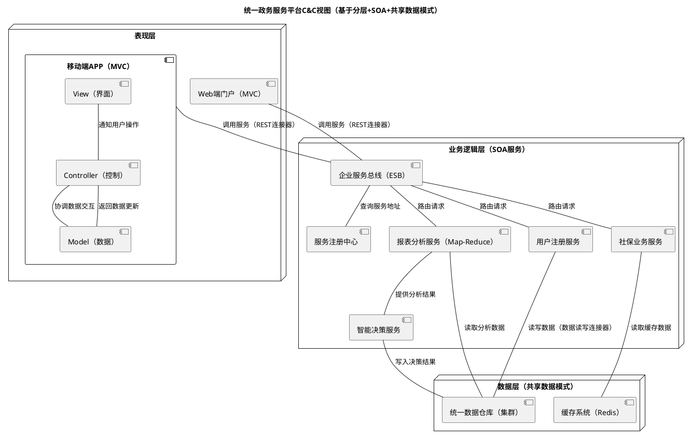

## 论文辨析题

与申论的大题技巧有些接近：

先申明自己的观点

默写课本内容（真金不怕火炼）

结合课本内容对材料进行分析，然后举例

总结观点，提出建议（我是大佬belike）

上题目：

一个可测试的系统是能最简单放弃错误的。换句话说，如果一个系统包含错误，那么（开发者）**不需要花费很长的时间或者很多的努力就可以让错误显现出来**。但从另一个方面来说，错误容忍度指的是**设计出隐藏缺陷的系统（ designing systems that jealously hide their faults ）**。如果从这个视角思考问题，那么（开发者）就应该让这系统难以展示错误。对于你来说，**有可能设计出一个既符合高可测试性，又符合高错误容忍度的系统吗**？或者说，这两种设计目标是不是**本质上不相容 （ inherently incompatible ）的呢**？请发表你的观点。

观点：我认为高测试性和高错误容忍度是可以在某些设计兼容的，只是两者的平衡需要谨慎把握，根据不同应用场景做出取舍。

分析：

高可测试性指的是系统在开发和维护阶段尽可能早的去发现和修复错误，高度可测试的系统通常设计为易于观察和检测其内部状态，并通过自动化测试快速暴露缺陷，有助于开发者尽可能早的发现和修正问题。

高测试容忍度设计旨在系统即便发生部分故障，依然能够维持部分功能继续运行，，毕竟设计完全崩溃；通过冗余、回滚机制和容错设计的极致，增强系统在异常情况下的可用性和稳定性。

兼容与不兼容：这两个看似是两个不同的目标，高可测试性要求系统故障暴露，便于修复，高错误容忍度要求隐藏错误，通过冗余和恢复措施来保证系统正常运行。

实际上，在实践中可以通过设计模块化、分层架构来兼顾二者，比如通过隔离故障组件，确保错误能够局部暴露并快速修复，同时也能保护系统保持高可用性。

结论：

作为架构师，建议在系统设计过程中根据需求对高可测性和错误容忍度进行权衡，对于关键业务系统，着重选择冗余设计来提高容错能力，对于迭代频繁、高速交付的系统，着重提高可测试性，尽早发现潜在缺陷。


### 1. Question: What is the difference between Uses Structure and Layered Structure?
**中文问题**：“Uses结构”和“分层结构”的区别是什么？
**Answer**：
- **Uses Structure** refers to a module organization where one module can rely on (use) another module freely, with no restrictions on which modules interact (no fixed hierarchy).
- **Layered Structure** is a specialized Uses Structure: modules are grouped into hierarchical layers, and upper-layer modules can only use **adjacent lower-layer modules** (lower layers cannot access upper layers; lower-layer details are hidden from upper layers).
**中文解释**：
- “Uses结构”是模块组织方式，一个模块可自由依赖（使用）另一个模块，模块间无交互限制（无固定层级）。
- “分层结构”是特殊的Uses结构：模块被划分为层级，上层模块仅能使用**相邻的下层模块**（下层无法访问上层，上层对下层细节不可见）。


### 2. Question: What is the difference between Data Warehouse and Blackboard (in Data-centered Style)?
**中文问题**：数据仓库和黑板（数据中心风格）的区别是什么？
**Answer**：
| Feature                | Data Warehouse                          | Blackboard                              |
|------------------------|-----------------------------------------|-----------------------------------------|
| Data Characteristics   | Subject-oriented, integrated, stable (non-volatile), time-variant (contains history) | Only stores data for "knowledge sources"; temporary & dynamic (updated/overwritten during processing) |
| Scenario               | Long-term data storage/analysis (e.g., enterprise business reports) | Collaborative problem-solving (e.g., AI systems sharing intermediate results) |
| Data Lifecycle         | Persisted long-term                     | Short-lived (discarded after task completion) |
**中文解释**：
| 特征                | 数据仓库                          | 黑板                              |
|---------------------|----------------------------------|----------------------------------|
| 数据特点            | 面向主题、集成化、稳定（非易失）、时变（含历史数据） | 仅存储“知识源”所需数据；临时且动态（处理中更新/覆盖） |
| 适用场景            | 长期数据存储/分析（如企业业务报表） | 协同问题解决（如AI系统共享中间结果） |
| 数据生命周期        | 长期持久化                       | 短期存在（任务完成后丢弃）|


### 3. Question: Generate one scenario for Business Quality and one for Architecture Quality.
**中文问题**：分别为业务质量和架构质量各生成一个场景。
**Answer**：

- **Business Quality Scenario**: A retail app’s "user retention rate" (business metric) rises by 15% after launching personalized recommendations.
  *Explanation*: Business quality reflects how well the system meets business goals (e.g., revenue, user engagement).
- **Architecture Quality Scenario**: A social media app maintains ≤2s response time when 100,000 concurrent users access it (architecture metric: performance).
  *Explanation*: Architecture quality refers to technical attributes (e.g., performance, availability) that support business goals.
  **中文解释**：
- **业务质量场景**：零售App上线个性化推荐后，“用户留存率”（业务指标）提升15%。
  解释：业务质量体现系统满足业务目标（如营收、用户活跃度）的能力。
- **架构质量场景**：社交媒体App在10万并发用户访问时，响应时间保持≤2秒（架构指标：性能）。
  解释：架构质量指支撑业务目标的技术属性（如性能、可用性）。


### 4. Question: What are the various types of dependencies that one module can have on another?
**中文问题**：一个模块对另一个模块可能存在哪些依赖类型？
**Answer**：

| Dependency Type         | Explanation                                                                 | Example                                                                 |
|-------------------------|-----------------------------------------------------------------------------|-------------------------------------------------------------------------|
| Functional Dependency   | Relies on another module’s functionality to complete tasks.                 | A tax module depends on a tax-rate module.                              |
| Data Dependency         | Relies on data output by another module.                                   | A report module depends on sales-statistics data.                       |
| Control Dependency      | Controls the execution flow of another module.                              | A controller directs a payment module to run after order confirmation.  |
| Service Dependency      | Relies on services from another module.                                     | A registration module depends on a logging service.                     |
| Communication Dependency | Communicates via network/messages.                                          | A mobile app depends on a backend API via HTTP.                         |
| Resource Dependency     | Shares common resources (e.g., database).                                   | Two modules depend on the same database server.                         |
| Version Dependency      | Relies on a specific version of another module/library.                     | A framework depends on plugin version 2.0.                              |
| Runtime Dependency      | Requires another module to be available at runtime.                         | A payment module depends on an active authentication module.            |
**中文解释**：
| 依赖类型               | 解释                                                                 | 示例                                                                 |
|------------------------|----------------------------------------------------------------------|----------------------------------------------------------------------|
| 功能依赖               | 依赖另一模块的功能完成自身任务                                        | 计税模块依赖税率模块                                                 |
| 数据依赖               | 依赖另一模块输出的数据                                                | 报表模块依赖销售统计数据                                             |
| 控制依赖               | 控制另一模块的执行流程                                                | 控制器在订单确认后触发支付模块执行                                   |
| 服务依赖               | 依赖另一模块提供的服务                                                | 注册模块依赖日志服务                                                 |
| 通信依赖               | 通过网络/消息进行通信                                                | 移动端App通过HTTP依赖后端API模块                                     |
| 资源依赖               | 共享公共资源（如数据库）                                              | 两个模块依赖同一数据库服务器                                         |
| 版本依赖               | 依赖另一模块/库的特定版本                                            | 框架依赖2.0版本的插件                                               |
| 运行时依赖             | 运行时需要另一模块处于可用状态                                        | 支付模块依赖处于活跃状态的认证模块                                   |


### 5. Question: How to create a skeletal system?
**中文问题**：如何创建一个骨架系统？
**Answer**：
A skeletal system is a minimal runnable system that implements core architecture/workflows. Steps:

1. Identify core workflows (e.g., login → query → display).
2. Implement minimal modules for these workflows (only essential logic).
3. Integrate modules per the target architecture (e.g., layered).
4. Verify end-to-end operation (e.g., user logs in and views data).
5. Iteratively add features while preserving the architecture.
**中文解释**：
骨架系统是实现核心架构/工作流的最小可运行系统，步骤如下：
1. 识别核心工作流（如登录→查询→展示）。
2. 为这些工作流实现最小模块（仅包含必要逻辑）。
3. 按目标架构（如分层）集成模块。
4. 验证端到端运行（如用户可登录并查看数据）。
5. 迭代添加功能，同时保留架构。


### 6. Question: Explain risk points in architectural decision and give an example.
**中文问题**：解释架构决策中的风险点并举例。
**Answer**：
Architectural decision risks are potential negative impacts of design choices. Common risks:
1. **Performance Risk**: Architecture fails to meet performance requirements.
   *Example*: A ticket-booking system uses a single server; 100,000 concurrent users cause a crash.
2. **Maintainability Risk**: Overly complex architecture increases maintenance cost.
   *Example*: A monolithic system requires modifying 10+ modules to update a payment method.
3. **Security Risk**: Architectural flaws lead to vulnerabilities.
   *Example*: A healthcare system does not encrypt patient data; attackers intercept and leak records.
4. **Resource Allocation Risk**: Inadequate resources delay implementation.
   *Example*: An AI system needs GPUs but uses CPUs; training takes 10x longer.
5. **Requirement Change Risk**: Frequent changes force architectural adjustments.
   *Example*: An e-commerce system designed for B2C switches to B2B; architecture must be redesigned.
   **中文解释**：
   架构决策风险是设计选择的潜在负面影响，常见风险：
1. **性能风险**：架构无法满足性能要求。
   示例：订票系统采用单服务器；10万并发用户导致服务器崩溃。
2. **可维护性风险**：架构过于复杂，增加维护成本。
   示例：单体系统需修改10+模块才能更新支付方式。
3. **安全风险**：架构缺陷导致漏洞。
   示例：医疗系统未加密患者数据；攻击者拦截并泄露记录。
4. **资源分配风险**：资源不足延迟实施。
   示例：AI系统需要GPU却使用CPU；训练耗时增加10倍。
5. **需求变更风险**：频繁变更迫使架构调整。
   示例：电商系统按B2C设计，后切换为B2B；架构需重新设计。


要不要我帮你整理一份**架构风险的中英文应对策略对照表**？


## 场景编写和场景策略实现

 阅读材料，结合质量属性场景的知识点回答问题 （1）请你为自动取款机（Automatic Teller Machine）写一组具体的安全性场景？ （2）你会如何修改这个机器的软件设计去满足题（1）提及的场景？

结合：

SSEARR来回答

刺激，刺激源，环境，系统，响应，响应度量

一、自动取款机（ATM）安全性场景（SEARR 模型）

安全性场景的核心是**抵御非授权访问、保护用户资产与信息不被窃取或篡改**，结合 ATM 的核心业务流程（身份验证、取款、转账、退卡），设计以下 5 组具体场景：

用户视角：用户进来存款

源：希望进行存款的用户

刺激：用户通过信封或者现金存款功能将现金存入ATM

环境：ATM机处在于正常运行状态，自身的硬件、软件和用户交互界面，通常处在于公共和半公共区域

工件：ATM现金存储系统，钞票进票口，钞票出票口，存款验证界面和收据打印功能

响应：ATM机有效的处理了存款需求，并且确保了现金的真实性，同时保证存款的整个过程绝对安全，避免了逻辑破坏和物理破坏。

响应衡量：从用户存款到机器响应，时间小于或者等于5秒，提醒用户存款成功，提供金额确认和数字收据，确保用户存款正确性，


银行观点：保护ATM网络

源：银行的网络架构和ATM系统

刺激：希望ATM和后台之间的通信安全，能够防止网络攻击和数据泄露。

环境：ATM与银行核心系统之间的网络连接正常，数据传输协议确定，当前系统处在于正常运行状态

工件：ATM网络接口、数据加密接口、防火墙、入侵防止系统

响应：银行成功通过实行端到端加密增加了系统的安全，防止未授权的中间人攻击或者数据窃取，用户输错密码会被锁定

响应度量：ATM与银行之间的通信无法被获取，数据准确率>=99百分数，实现大量漏洞测试，确保用户异常行为可以被检测到。

**纯纯的吹水，安全性策略其实也很吹水，主要还是结合实际，结合那些策略加以吹水！**


二、满足安全性场景的软件设计修改方案

需要增加端到端的加密过程，需要对卡片加一个鉴权功能。

进行防火墙的加固和加入防止入侵系统来识别恶意活动。

对软件进行更新：定期更新软件健全/

用户教育：提供有关于如何防止欺诈的准确说明；

结合生物识别集成

身份验证：生物识别，密码打乱

异常识别：如果输错，日志记录并操作

软件更新！

要实现上述场景的安全响应，需针对 ATM 软件的**身份鉴权、交易控制、异常检测、日志审计**四大核心模块进行修改，具体方案如下：
1. **增强卡片鉴权模块的软件逻辑**
    - 新增**卡片特征校验算法**：在软件中嵌入银行卡的物理特征（如磁条磁道数据格式、芯片加密密钥）校验规则，拒绝识别不符合银行标准的伪造卡数据。
    - 关联吞卡与警报的联动逻辑：软件接收到“伪造卡”信号后，直接触发硬件吞卡指令，并通过 SDK 调用 ATM 警报器接口，同时向银行后台发送攻击预警报文。

2. **优化密码验证的软件阈值控制**
    - 在软件中设置**密码错误次数计数器**（默认阈值 3 次），计数器与卡片唯一标识（卡号）绑定，每次输错后计数器加 1，达到阈值后立即锁定交易功能。
    - 增加**临时锁定的分级策略**：软件区分“用户误输”和“恶意攻击”——若 24 小时内同一卡号多次触发锁定，自动标记为高风险卡并同步至银行风控系统。

3. **构建交易参数的防篡改软件屏障**
    - 采用**加密签名机制**：对取款金额、转账账户等核心交易参数进行数字签名，软件在执行交易前验证签名的完整性，若签名被篡改则直接拒绝指令。
    - 设计**离线模式下的参数固化逻辑**：当 ATM 处于离线状态时，软件自动将交易参数锁定为预设的安全范围（如单次取款上限 5000 元），禁止任何超出范围的参数修改。

4. **新增异常行为检测的软件模块**
    - 开发**侧录设备检测算法**：通过软件分析键盘按键的电流信号波动——当检测到非用户正常操作的信号干扰（如侧录设备的电磁信号）时，立即屏蔽键盘输入并暂停服务。
    - 部署**交易日志审计组件**：软件自动记录所有操作指令（包括正常交易和异常攻击），日志包含时间戳、操作类型、设备状态等信息，且日志文件设置为“只读”属性，防止被篡改。

5. **完善超时回收的软件联动流程**
    - 在出钞模块软件中设置**倒计时计时器**，从现金吐出时开始计时，超时未取则触发回收指令，并同步修改交易状态为“失败”。
    - 增加**用户通知接口**：软件对接银行短信平台，回收现金后自动生成提醒短信，包含卡号后四位、交易时间、处理建议等信息。

## 现实世界的策略

寻找一个现实生活（并不是软件开发）的例子，这个例子**需要应用每一个管理资源的策略**。举个例子，假如你正在管理一个大型超市，请问，你如何**使用这些策略**使得**消费者能更快地通过结账**？

预防：能够通过提前预测问题并提前给出解决方案来防止瓶颈的发生。通过监控商店的客流模式并响应配备人员，确保在高峰时段能够有足够的结构通道开放，在客流量大的时候同时开通人工通道和自动自助通道。

高效分配：以优化吞吐量的方式分配资源。如用动态调度系统将实时客流量进行分配，如果一条线路的客流量大于其他，可以在收银台安排更多的工作人晕啊来辅助这条通道。

优先级：根据任务的紧急程度和重要性来确定事物的优先级。对购买物品较少的顾客开通快速通道，使得那些购买较少物品的顾客可以更快结账！最大的限度减少别人的拥堵并加快整个结账流程。

分解：将策略或者任务分解为更小的部分，以便能够同时处理多个流程。将结账进行拆分：如扫描商品、装袋、付款，并为每个阶段分配不同的工作人员加快流程，减少了总体等待的时间。

缓存：将经常访问的资源存储在更快或者更容易访问的位置。比如设置预扫描区域，能够更快的扫描商品，然后在最后的收银台在汇总支付，减少结账所花费的时间。

结论：在零售环境中可以使用这些资源管理策略，可以减少结账等待时间来改善客户体验，通过预测需求，使用技术和优化员工分配，我们可以给用户创造一个更加高效更加愉快的环境。


## 综合题

#### 材料原文：

The convergence and integration of information technology and economic society has led to the rapid growth of data. Data has become the basic strategic resources of the country. Big data is increasingly exerting an important influence onglobal production, circulation, distribution, consumption activities, economic operation mechanism, social life style and national governance capacity.

In order to implement the decision-making and deployment of the Central Government, comprehensively promote the development and application of big dataof Municipal Government X, and enhance the ability of government service andsupervision, Municipai Government X has conducted a special survey on the software systems.

The following problems were found in the survey:

(1) The systems of its subordinate organizations are relatively scattered, with more than 300 database systems.

下属机构系统分散，数据库系统超过300个。

(2) The types of database management system are complex.

数据库管理系统种类复杂。

(3) Some systems have big data volume close to 1000T.

部分系统数据量接近1000TB。

(4) A large number of citizens refect that their information registration systems arenumerous, and they often need to fill in personal information repeatedly. They have specific needs and must log in to a specific system. They hope to have aunified platform to handle all business, and the piatform can be used on themobile side.

市民反映信息注册系统众多，常需重复填写个人信息，希望有统一平台，支持移动端办理所有业务。

(5) The database system maintainers of government departments also constantlyrefect that there are too many systems related to social security, thephenomenon of data redundancy is serious, and the data interaction betweendatabases is also difficult to achieve.

政府部门数据库维护人员反映社会保障等相关系统过多，数据冗余严重，数据库间数据交互困难。

(6) Goverment leaders hope that there will be a platform to automatically generaterelevant data reports and data analysis results for their reference, and it is betterto give some intelligent decision-making suggestions.

政府领导希望有平台自动生成数据报表与分析结果，最好还能提供智能决策建议。

**Suppose you're an architect to solve these problems.**

1. #### 请你列出 5 个质量属性及其对应的通用（general）质量属性场景

可用性，可修改性，性能，易用性，安全性，

对上述质量属性进行一个填表格

| 质量属性     | Source（源头） | Stimulus（刺激）               | Environment（环境）          | Artifact（工件）   | Response（响应）                        | Response Measure（响应度量）                 |
| ------------ | -------------- | ------------------------------ | ---------------------------- | ------------------ | --------------------------------------- | -------------------------------------------- |
| **可用性**   | 市民用户       | 访问统一业务平台时遭遇系统故障 | 工作日高峰时段（8:00-10:00） | 统一政务服务平台   | 自动切换至备用服务器，恢复服务          | 故障恢复时间≤5 分钟，年度可用率≥99.9%        |
| **可修改性** | 系统维护人员   | 调整社保数据字段规则           | 平台正常运行状态             | 数据管理子系统     | 完成字段规则修改并部署                  | 修改及测试耗时≤5小时，不影响其他业务模块     |
| **性能**     | 大量市民用户   | 同时提交个人信息注册请求       | 并发用户数达 10000 人        | 用户注册子系统     | 处理所有请求并返回结果                  | 单请求响应时间≤2 秒，吞吐量≥2000 请求 / 分钟 |
| **易用性**   | 老年市民用户   | 首次使用移动端平台办理业务     | 无系统操作经验               | 移动端政务 APP     | 通过移动APP指引完成业务办理且无错误操作 | 首次操作成功率≥90%，平均办理时长≤10 分钟     |
| **安全性**   | 恶意攻击者     | 尝试窃取市民个人信息           | 平台网络连接正常             | 数据存储与传输模块 | 拦截攻击并记录行为                      | 攻击拦截率≥99.9%，敏感数据加密率 100%        |

1. #### 请你列出 5 个质量属性及其对应的具体 (concrete) 质量属性场景，并结合效能树（Utility Tree）的知识点将其展示出来

2. 第一层节点：七个质量属性选五个

   第二层节点：每个质量属性选一到两个定义指标

   第三层节点：抄材料（注意更改语法：第一人称 → 第三人称。主动 → 被动）

模仿这张图画出这道题的效能树：

最后别忘了（M, M）（商业价值，架构影响）

#### 第一层节点（质量属性）：可用性、可修改性、性能、易用性、安全性

#### 第二层节点（属性细化指标）：故障恢复能力、配置变更效率、并发处理能力、操作便捷性、数据防泄露能力

#### 第三层节点（具体场景，含商业价值 / 架构影响）：

```plaintext
Utility
├─ 可用性
│  └─ 故障恢复能力
│     └─ 市民访问统一平台时系统故障，平台自动切换至备用服务器恢复服务（H,M）
├─ 可修改性
│  └─ 配置变更效率
│     └─ 社保数据字段规则需调整，系统完成修改并部署（M,H）
├─ 性能
│  └─ 并发处理能力
│     └─ 10000名市民同时注册，系统在2秒内处理所有请求（H,M）
├─ 易用性
│  └─ 操作便捷性
│     └─ 老年市民首次使用移动端APP，10分钟内完成业务办理（M,L）
└─ 安全性
   └─ 数据防泄露能力
      └─ 攻击者尝试窃取信息，系统拦截攻击并加密敏感数据（H,H）
```


1. #### 为了实现 ASRs （架构重要需求），你将会采用哪些架构方法（architectural approaches）（包括架构模式 (architectural patterns) 和架构策略 (architectural tactics) ）?


1. #### 请你利用 UML 表示法为预期的系统展示一个 C & C 架构视图


### 三、结合《软件架构实践（第三版）》的架构方法（模式+策略）

#### 1. 核心架构模式
| 模式名称 | 选择理由（匹配问题） | 模式在本系统中的应用 |
|----------|----------------------|----------------------|
| **分层模式** | 解决“系统分散、模块独立开发”的问题，符合分层模式“关注点分离、单向依赖”的特点 | 将统一平台分为 **表现层（移动端/Web端）、业务逻辑层（注册/社保/报表服务）、数据层（统一数据仓库）**，每层通过公共接口通信，支持独立开发与维护 |
| **面向服务架构（SOA）模式** | 解决“300+分散系统的互操作性、数据交互困难”的问题，符合SOA“服务松耦合、跨平台调用”的特点 | 将各下属机构系统封装为标准化服务，通过 **服务注册中心** 统一管理；使用 **企业服务总线（ESB）** 实现服务路由、数据转换，支撑跨系统交互 |
| **共享数据模式** | 解决“数据冗余、多系统共享数据”的问题，符合共享数据模式“集中存储、多访问器共享”的特点 | 构建 **统一数据仓库** 作为共享数据存储，整合300+数据库的分散数据；各业务服务（社保、注册）作为“数据访问器”，通过“数据读写连接器”访问仓库，消除冗余 |
| **模型-视图-控制器（MVC）模式** | 解决“移动端统一平台的易用性、界面与业务分离”的问题，符合MVC“界面与逻辑解耦”的特点 | 移动端APP采用MVC：<br>- **模型**：封装用户信息、业务数据；<br>- **视图**：提供表单、按钮等交互界面；<br>- **控制器**：处理用户输入（如注册提交），协调模型与视图的交互 |
| **映射-归约（Map-Reduce）模式** | 解决“1000T数据的分析、智能决策报表生成”的问题，符合Map-Reduce“分布式并行处理海量数据”的特点 | 针对海量数据的分析需求，使用Map-Reduce框架：<br>- **Map**：分片处理数据（如统计社保业务量）；<br>- **Reduce**：合并结果生成报表；<br>- 依赖基础设施实现任务并行调度，支撑智能决策建议 |


#### 2. 配套架构策略（增强模式的质量属性）
结合“策略与模式的关系”（模式由策略构成，策略可优化模式劣势），补充以下策略：
- **针对SOA的“单一故障点”劣势**：采用 **“维护多个副本”策略**，对服务注册中心、ESB部署多实例，提升可用性。
- **针对共享数据模式的“性能瓶颈”劣势**：采用 **“增加资源+缓存”策略**，为数据仓库配置集群，同时用Redis缓存高频访问数据，降低仓库压力。
- **针对Map-Reduce的“数据分片不均”劣势**：采用 **“数据分区调度”策略**，确保数据分片大小均匀，最大化并行计算效率。
- **针对分层模式的“性能损耗”劣势**：采用 **“简化层间调用”策略**，减少非必要的跨层通信（如表现层直接调用缓存，而非每次请求都经过业务层）。

### 四、C&C架构视图（基于UML组件图，结合模式）





以下是你提供的《软件体系结构》期末考试（B卷）**综合题（第三大题，共40分）**的原文内容，包括：

------

## ✅ 一、中英文题目（中文 + English Translation）

------

### **综合题（Comprehensive Question）【共40分】**

------

#### **【背景材料 / Context】**

随着地质数据的不断积累以及充分利用这些数据的目标，有必要开发一个软件平台来共享此类科学数据，特别是在以下几个方面：

1. **从各个学术机构和科研科学家那里快速收集数据。** *(Collect data quickly from various academic organizations and research scientists.)*
2. **有效且高效地存储和管理海量地质数据。** *(Store and manage massive geological data effectively and efficiently.)*
3. **方便地浏览、搜索和下载所需数据。** *(Browse, search and download needed data conveniently.)*
4. **在必要时保护机密数据。** *(Protect confidential data as necessary.)*

> 假设你是一名软件架构师，要求你设计一个软件架构以实现这些目标。

------

### **问题 1 / Question 1（10分 / 10 Points）**

**请列出该系统的质量属性（Quality Attributes）。**

*(Please present the quality attributes of the system.)*

------

### **问题 2 / Question 2（10分 / 10 Points）**

**请为该系统提供一个参考模型（Reference Model）、架构风格（Architecture Style）和参考架构（Reference Architecture）。**

*(Please offer a reference model, architecture style and reference architecture for the system.)*

------

### **问题 3 / Question 3（10分 / 10 Points）**

**请解释参考架构实现了哪些质量属性，以及选择了哪些架构战术（Architectural Tactics）。**

*(Please explain which quality attributes the reference architecture achieved and which tactics are chosen.)*

------

### **问题 4 / Question 4（10分 / 10 Points）**

**请展示并解释该系统设计的**分解视图（Decomposition View）、并发视图（Concurrency View）和部署视图（Deployment View）。**

*(Please present and explain the decomposition view, concurrency view and deployment view of the system design.)*

------

# 三、综合题 中英文问题+中文答案
## 1. 题目与答案
**英文问题**：Present the quality attributes of the system (combining with SEARR model).
**中文问题**：列出该系统的质量属性（结合SEARR模型）。

**中文答案**
结合地质数据共享平台的核心需求（多源数据采集、海量数据存储、便捷查询下载、机密数据保护），提取**互操作性、性能、安全性、易用性、可用性**五大核心质量属性，对应的SEARR场景如下表：

| 质量属性 | 源头（Source） | 刺激（Stimulus） | 环境（Environment） | 工件（Artifact） | 响应（Response） | 响应度量（Response Measure） |
|----------|----------------|------------------|---------------------|------------------|------------------|------------------------------|
| 互操作性 | 各学术机构/科研人员 | 提交不同格式的地质数据（CSV/GIS/JSON） | 平台处于数据采集时段 | 多源数据接入模块 | 自动解析异构数据并完成格式转换 | 数据格式兼容率≥98%；单批次数据转换耗时≤5分钟 |
| 性能 | 普通用户 | 并发发起1000+条海量地质数据检索请求 | 峰值访问时段（工作日9:00-11:00） | 数据查询引擎 | 快速返回检索结果并支持批量下载 | 单条检索响应时间≤2秒；吞吐量≥500请求/分钟 |
| 安全性 | 未授权用户 | 尝试访问涉密地质勘探数据 | 平台网络正常运行 | 权限管控与数据加密模块 | 拦截访问请求并记录操作日志 | 涉密数据访问拦截率100%；日志留存时间≥90天 |
| 易用性 | 首次使用平台的科研人员 | 操作数据下载功能 | 无平台使用经验 | 可视化交互模块 | 提供引导式操作流程，完成一键下载 | 首次操作成功率≥90%；下载操作步骤≤3步 |
| 可用性 | 系统运维人员 | 检测到主存储服务器硬件故障 | 业务高峰期 | 核心服务集群 | 自动切换至备用服务器，无感知恢复服务 | 故障切换时间≤5分钟；年度系统可用率≥99.9% |

## 2. 题目与答案
**英文问题**：Offer a reference model, architecture style and reference architecture for the system.
**中文问题**：给出该系统的参考模型、架构风格与参考架构。

**中文答案**

### （1）参考模型（Reference Model）
采用**“四层地质数据共享参考模型”**，按数据流转链路划分层级，层间单向依赖，明确各层核心职责：
1. **数据采集层**：对接各学术机构、科研人员的数据源，提供标准化数据接入接口；
2. **数据存储层**：负责海量地质数据的分布式存储与管理，支撑数据高吞吐读写；
3. **数据管理层**：实现数据分类索引、权限管控、加密脱敏，保障数据安全与可用；
4. **数据服务层**：面向用户提供数据浏览、检索、下载等服务，支持Web端与API调用。

### （2）架构风格（Architecture Style）
结合需求选择三种核心架构风格，优势互补：
1. **分层模式（Layered Pattern）**：匹配四层参考模型，层间通过标准化接口通信，下层为上层提供服务，上层无需感知下层实现细节，提升系统可修改性与可维护性；
2. **面向服务架构（SOA）**：将数据采集、检索、下载等核心功能封装为标准化服务，注册到服务中心，实现跨机构、跨系统的数据共享与交互，解决多源数据互操作难题；
3. **共享数据模式（Shared-Data Pattern）**：构建统一的分布式数据仓库作为共享数据存储，整合分散的地质数据，支撑海量数据的高效管理与访问，降低数据冗余。

### （3）参考架构（Reference Architecture）
以**分层模式+SOA**为核心骨架，融合共享数据模式的技术架构：
- 数据采集层通过SOA服务接口，接收多源异构数据，经格式转换后写入数据存储层；
- 数据存储层采用“分布式数据库+缓存集群”架构，冷热数据分层存储，提升数据读写性能；
- 数据管理层部署权限管控、数据加密、索引管理等组件，对存储层数据进行统一治理；
- 数据服务层通过Web门户与开放API，向用户提供检索、下载服务，同时对接服务监控组件，保障服务质量。

## 3. 题目与答案
**英文问题**：Explain which quality attributes the reference architecture achieved and which tactics are chosen.
**中文问题**：说明该参考架构实现了哪些质量属性，以及选择了哪些架构策略。

**中文答案**
### （1）参考架构实现的质量属性
1. **互操作性**：通过SOA的标准化服务接口，实现不同学术机构、不同格式地质数据的无缝接入与共享；
2. **性能**：依托分布式存储与缓存集群，提升海量数据的检索与下载速度，支撑高并发用户访问；
3. **安全性**：通过权限管控、数据加密、操作日志审计等机制，保障涉密地质数据不被未授权访问；
4. **易用性**：通过可视化交互界面与引导式操作流程，降低用户使用门槛；
5. **可用性**：通过核心服务集群化部署、主备服务器自动切换，实现系统故障无感知恢复。

### （2）选择的架构策略（Tactics）
| 质量属性 | 架构策略 | 策略说明 |
|----------|----------|----------|
| 互操作性 | 标准化接口设计、数据格式转换 | 定义统一的数据接入与服务接口，内置多格式数据解析器，实现异构数据兼容 |
| 性能 | 资源池化、缓存、冷热数据分离 | 构建分布式存储资源池；缓存高频检索数据；将历史冷数据迁移至低成本存储介质 |
| 安全性 | 基于角色的访问控制（RBAC）、数据加密、日志审计 | 按用户角色分配数据访问权限；对涉密数据进行传输与存储双重加密；记录所有数据访问操作 |
| 易用性 | 界面简化、操作引导 | 优化交互流程，减少冗余操作步骤；为首次用户提供功能引导弹窗 |
| 可用性 | 冗余部署、故障自动切换、健康监控 | 核心服务多实例部署；主备服务器实时同步数据，故障时自动切换；部署监控组件，实时检测服务状态 |

## 4. 题目与答案
**英文问题**：Present and explain the decomposition view, concurrency view and deployment view of the system design.
**中文问题**：展示并解释系统设计的分解视图、并发视图与部署视图。

**中文答案**
### （1）分解视图（Decomposition View）
#### 视图内容
采用**“系统-子系统-模块”**的递归分解方式，将地质数据共享平台拆分为以下层级结构：
```
地质数据共享平台
├─ 数据采集子系统
│  ├─ 多源数据接入模块
│  ├─ 数据格式转换模块
│  └─ 数据质量校验模块
├─ 数据存储子系统
│  ├─ 分布式数据库模块
│  ├─ 缓存集群模块
│  └─ 冷热数据分层模块
├─ 数据管理子系统
│  ├─ 权限管控模块
│  ├─ 数据加密模块
│  └─ 索引构建模块
└─ 数据服务子系统
   ├─ 数据检索模块
   ├─ 数据下载模块
   └─ 可视化交互模块
```

#### 视图解释
分解视图的核心是**关注点分离**，将复杂系统拆分为功能内聚的子系统与模块，每个模块仅负责单一职责。该视图的价值在于：
- 降低系统复杂度，便于开发团队分工协作；
- 实现变更局部化，修改某一模块不会影响其他模块，提升系统可修改性。

### （2）并发视图（Concurrency View）
#### 视图内容
基于系统的业务流程，划分**4类逻辑线程**，实现任务并行处理，提升系统吞吐量：
1. **数据采集线程池**：并行处理多个学术机构的数据源接入请求，同时执行数据格式转换与质量校验；
2. **数据存储线程池**：并行完成数据写入、缓存更新、冷热数据迁移任务；
3. **用户请求线程池**：并行响应多个用户的检索、下载请求，避免单用户请求阻塞其他用户；
4. **系统监控线程**：独立线程运行，实时检测各模块状态，不占用业务线程资源。

#### 视图解释
并发视图的核心是**识别并行机会，规避资源争用**。该视图的价值在于：
- 充分利用硬件多核资源，提升系统处理效率，支撑高并发访问；
- 通过独立线程池隔离不同类型任务，避免任务间相互干扰，提升系统稳定性。

### （3）部署视图（Deployment View）
#### 视图内容
采用**分布式部署架构**，将软件组件分配到不同硬件节点，具体部署方案如下：
| 硬件节点类型 | 部署的软件组件 | 节点数量 |
|--------------|----------------|----------|
| 接入服务器 | 数据采集子系统 | 2台（主备） |
| 存储服务器集群 | 分布式数据库模块、冷热数据分层模块 | 5台（1主4从） |
| 缓存服务器 | 缓存集群模块 | 3台 |
| 应用服务器集群 | 数据管理子系统、数据服务子系统 | 4台（负载均衡） |
| 监控服务器 | 系统监控线程、日志审计模块 | 1台 |
| 用户终端 | Web门户、客户端软件 | 按需部署 |

#### 视图解释
部署视图的核心是**软件组件与硬件资源的映射关系**。该视图的价值在于：
- 明确软件组件的物理部署位置，支撑系统性能、可用性的评估与优化；
- 通过集群化部署与负载均衡，提升系统的并发处理能力与故障容错能力；
- 便于运维人员进行系统监控、故障排查与资源扩容。

---

要不要我帮你整理**该系统架构设计的核心亮点与潜在风险分析**？


综合题的套路其实很固定：

Attribute General 考一题

Utility Tree + Concrete Scenario 考一题

ASRs 或者 ATAM 考一题

Module，C & C，和 Allocation 考一题


### 大题：RFIDSale系统软件体系结构分析


#### 1. 问题：请明确系统的质量属性及其实现战术
**中文问题**：根据RFIDSale系统的架构与需求，分析系统的质量属性及对应的实现战术。

**中文答案**：
结合系统架构（PDA/PC双端交互、RFID卡片操作），核心质量属性及战术如下：

- **安全性**：
  *需求关联*：PDA仅用于下单，需保障订单数据、RFID卡片信息的机密性。
  *实现战术*：采用“访问控制（RBAC角色权限）”限制PDA功能范围；对PDA与服务器的通信数据进行“加密传输（HTTPS）”；记录PDA操作日志用于审计。
- **互操作性**：
  *需求关联*：PDA通过JMS与服务器交互，需支持跨设备/系统的数据交互。
  *实现战术*：采用“标准化接口（WebService）”定义PDA与服务器的通信协议；通过“消息中间件（JMS）”实现异步数据传输，兼容不同终端的消息格式。
- **性能**：
  *需求关联*：PC通过Internet与服务器交互，网络带宽限制性能，需提升数据处理效率。
  *实现战术*：使用“.NET缓冲池”复用数据库连接，减少资源创建开销；对高频访问的商品数据采用“缓存（MemoryCache）”；通过“异步处理”将订单导出Excel等耗时操作异步执行。
- **可用性**：
  *需求关联*：门店PDA需持续工作，避免服务器故障导致业务中断。
  *实现战术*：采用“冗余部署（服务器主备集群）”；PDA支持“本地缓存”，网络中断时暂存订单数据，恢复后同步。
- **可修改性**：
  *需求关联*：后续可能新增RFID卡片功能，需降低变更影响。
  *实现战术*：采用“模块化设计”将RFID操作封装为独立组件；通过“接口隔离”定义组件间依赖，变更时仅需修改对应模块。
- **易用性**：
  *需求关联*：PDA用于门店快速操作，需简化用户流程。
  *实现战术*：PDA界面采用“操作流程简化（一键下单）”；提供“错误提示引导”，降低操作失误率。

**解释**：从系统的终端交互、数据操作等需求出发，匹配对应的质量属性，并结合架构特点选择具体战术（如用JMS支撑互操作性、用缓冲池提升性能）。


#### 2. 问题：提出系统的参考模型、参考构架框架
**中文问题**：在全面质量管理思想下，基于质量属性与战术，提出系统的参考模型和构架框架。

**中文答案**：
- **参考模型**：采用“混合架构参考模型”，分为三层+双端交互层：
  1. *数据层*：负责SQL Server数据库的读写、RFID卡片数据存储；
  2. *业务逻辑层*：封装商品CRUD、订单管理、RFID卡片操作等核心逻辑；
  3. *服务层*：通过WebService/JMS提供接口，支撑PC（B/S）与PDA（C/S）的访问；
  4. *终端交互层*：包含PC端Web界面、PDA端本地应用。
- **参考构架框架**：采用“MVC三层架构+混合C/S/B/S”框架：
  - 整体基于“MVC三层架构”（数据层-逻辑层-表现层），实现层间分离；
  - PC端采用“B/S架构”（浏览器-Web服务器），降低终端部署成本；
  - PDA端采用“C/S架构”（客户端-服务器），提升本地操作响应速度。

**解释**：参考模型按数据/逻辑/服务/终端分层，明确各层职责；构架框架结合MVC三层架构的解耦优势，同时用C/S/B/S混合架构适配PC与PDA的不同场景。


#### 3. 问题：基于ADD方法，描述目标系统的软件体系结构
**中文问题**：基于ADD（架构驱动设计）方法，详细描述RFIDSale系统的软件体系结构。

**中文答案**：
ADD方法的核心是“以质量属性/需求为驱动选择架构”，具体步骤如下：
1. **识别架构驱动因素**：核心需求为“PC/PDA双端操作、RFID卡片管理、高并发订单处理”；核心质量属性为“互操作性、性能、可用性”。
2. **选择基础架构风格**：
   - 采用“混合C/S/B/S架构”：PC端用B/S（优势：无需安装客户端，维护成本低；劣势：依赖网络）；PDA端用C/S（优势：本地响应快，支持离线操作；劣势：终端部署复杂）；混合后兼顾双端场景的体验与维护性。
   - 结合“MVC三层架构”：将业务逻辑与界面分离，提升可修改性；同时采用“.NET框架”支撑快速开发（优势：组件丰富、集成度高；劣势：跨平台性弱）。
3. **分配功能模块**：
   - *数据层*：DB-Conn模块（数据库连接）、RFID数据存储模块；
   - *业务逻辑层*：Product-CRUD、Customer-CRUD、Order-CRUD、RFID卡片操作模块；
   - *服务层*：WebService（PC/PDA接口）、JMS消息模块；
   - *终端层*：PC端Web界面、PDA端本地应用（含ReadCard、Take_Stock功能）。

**解释**：ADD方法以需求/质量属性为驱动，先选架构风格（混合C/S/B/S+MVC），再分配功能模块，兼顾业务需求与技术特性。


#### 4. 问题：基于ATAM方法，提出系统架构的内部评估结果
**中文问题**：基于ATAM（架构权衡分析方法），给出RFIDSale系统架构的项目组内部评估结果。

**中文答案**：
ATAM评估聚焦“质量属性权衡、风险点”，结果如下：

1. **质量属性权衡**：
   - *性能-可用性*：采用缓存提升性能，但缓存一致性增加了可用性风险；通过主备集群保障可用性，但增加了部署成本。
   - *互操作性-安全性*：用WebService提升互操作性，但z开放接口增加了安全攻击面；通过加密传输平衡安全性。
2. **风险点**：
   - *技术风险*：.NET框架的跨平台性弱，后续扩展非Windows终端（如安卓PDA）成本高；
   - *架构风险*：JMS消息中间件可能成为性能瓶颈，高并发订单时消息堆积；
   - *业务风险*：PDA本地缓存的订单数据同步延迟，可能导致库存不一致。
3. **缓解策略**：
   - 对.NET框架风险：预留接口，后续可扩展为跨平台的WebAPI；
   - 对JMS瓶颈：增加消息队列分片，提升并发处理能力；
   - 对数据同步风险：PDA同步时增加库存校验逻辑，避免不一致。

**解释**：ATAM评估通过分析质量属性的权衡关系，识别架构的风险点并给出缓解策略，保障架构的可行性。


要不要我帮你整理**RFIDSale系统架构的风险缓解措施清单**？


### 例题二：购物中心RFID系统架构设计

#### 1. 问题：请分别给出5个安全相关的质量属性场景和5个可修改性相关的质量属性场景
**英文问题**：Please separately give 5 quality attribute scenarios to define the security and 5 scenarios to define the modifiability of the system.
**中文答案**：
- **安全相关场景**：
  1. 数据完整性：导购使用PDA提交订单后，系统拒绝任何未授权的订单修改操作。
  2. 数据机密性：导购仅能查看与当前订单相关的客户基础信息，无法访问客户的详细隐私数据（如联系方式）。
  3. 抗攻击能力：系统通过身份认证机制，仅允许已授权的导购登录PDA终端。
  4. 攻击检测：系统实时监控PDA的异常操作（如频繁尝试读取非权限内数据），并标记为恶意攻击行为。
  5. 攻击恢复：系统记录所有用户操作日志，当发生数据篡改时可追溯操作来源并恢复原始数据。

- **可修改性相关场景**：
  1. PDA终端适配：系统支持快速替换不同型号的PDA设备，无需修改核心业务逻辑。
  2. 用户权限调整：系统可灵活修改导购/管理员的操作权限，且修改范围仅局限于权限管理模块。
  3. RFID与产品信息更新：系统支持批量修改RFID卡片关联的产品数据，不影响其他业务流程。
  4. 订单流程变更：系统可调整订单提交的审批流程，无需重构整个销售模块。
  5. 数据库/服务器替换：系统支持切换数据库类型（如从SQL Server改为MySQL），仅需修改数据访问层配置。


#### 2. 问题：请分别提出5个实现安全的策略和5个实现可修改性的策略
**英文问题**：Please separately present 5 tactics to achieve the security and 5 tactics to achieve modifiability.
**中文答案**：
- **安全策略**：
  1. 采用RBAC（基于角色的访问控制）子系统，管控不同用户对客户、产品、订单数据的访问权限。
  2. 在PDA终端增加身份认证机制（如账号密码+设备绑定），防止未授权设备接入。
  3. 在服务器端部署用户行为监控组件，实时检测异常操作。
  4. 启用系统日志审计功能，记录所有用户操作的时间、内容与终端信息。
  5. 对敏感数据（如客户信息）进行权限分级，限制数据的暴露范围与访问深度。

- **可修改性策略**：
  1. 抽象公共服务（如统一身份认证），将变更范围局部化。
  2. 通过信息隐藏（如封装PDA终端交互逻辑）防止变更的连锁影响；通过配置文件延迟参数绑定（如枚举型数据配置）。
  3. 将系统分为数据展示层、业务逻辑层、数据访问层，层间通过接口通信，降低耦合。
  4. 引入中介组件（如消息队列），隔离不同模块的直接依赖，避免模块变更影响其他组件。
  5. 采用插件化设计，将PDA适配、权限管理等功能封装为独立插件，便于单独修改或替换。


#### 3. 问题：为平衡易用性与安全性，选择一个架构模式并详细解释
**英文问题**：To trade off the usability and the security, please choose an architecture pattern for the system with detail explanations.
**中文答案**：
选择**“分层分布+MVC+RBAC混合架构模式”**，具体说明：
1. 采用**分层分布架构**：将系统分为终端层（PDA/PC）、服务层、数据层，层间单向依赖，既保障PDA/PC的操作易用性（终端层简化交互），又通过服务层集中管控安全策略。
2. 结合**C/S与B/S混合模式**：PDA端用C/S模式（本地缓存+快速交互，提升易用性），PC管理端用B/S模式（统一安全管控）；同时通过WebService实现双端数据同步，兼顾易用性与安全集中管理。
3. 引入**MVC架构**：在PC端采用Asp.NET MVC框架，分离界面与业务逻辑，既提升界面操作的易用性，又通过控制器层嵌入安全校验逻辑（如权限检查）。
4. 集成**RBAC子系统**：在业务逻辑层统一管理用户权限，既保证导购操作的便捷性（无需重复认证），又通过权限分级保障数据安全。


#### 4. 问题：基于UML2.0提供系统的组件-连接器视图，并解释其技术原理
**英文问题**：Please present the component-and-connector view of the system design based on the modeling language of UML2.0 and explain the technical rationale of the view.
**中文答案**：
- **组件-连接器视图（UML组件图）**：
  ```plantuml
  @startuml
  title 购物中心RFID系统组件-连接器视图
  component "终端层" {
    component "PDA终端（WinForm）" as PDA {
      port "订单操作" as PDA_Order
      port "产品识别" as PDA_Product
    }
    component "PC管理端（ASP.NET MVC）" as PC {
      port "销售统计" as PC_Sale
      port "客户管理" as PC_CRM
    }
  }
  
  component "服务层" {
    component "WebService服务" as WebService {
      port "数据同步" as WS_Sync
    }
    component "业务逻辑组件" as Business {
      port "订单处理" as B_Order
      port "权限控制（RBAC）" as B_RBAC
    }
    component "公共服务组件（Spring.Net AOP）" as Common {
      port "日志审计" as C_Log
      port "事务处理" as C_Trans
    }
  }
  
  component "数据层" {
    component "数据访问组件（DAO）" as DAO
    component "SQL Server数据库" as DB
  }
  
  ' 连接器（交互关系）
  PDA_Order -- WS_Sync : 订单数据同步
  PDA_Product -- WS_Sync : 产品信息查询
  PC_Sale -- B_Order : 销售数据请求
  PC_CRM -- B_RBAC : 客户数据访问
  WebService -- B_Order : 业务逻辑调用
  Business -- Common : 公共服务调用
  Business -- DAO : 数据操作
  DAO -- DB : 数据读写
  @enduml
  ```

- **技术原理解释**：
  1. **参考模型**：采用分层模型（终端层-服务层-数据层），层间职责分离，提升可维护性。
  2. **架构模式**：C/S（PDA）+ B/S（PC）混合分布模式，平衡终端易用性与管理端安全管控；MVC模式分离PC端界面与业务逻辑。
  3. **参考框架**：
     - PDA端用WinForm框架实现本地快速交互；
     - PC端用Asp.NET MVC3框架简化界面开发；
     - 用WebService实现跨终端数据同步；
     - 用Spring.Net AOP框架抽象日志、事务等公共服务，提升可修改性；
     - 用ORM/DAO组件隔离业务逻辑与数据库，降低数据层变更影响。


