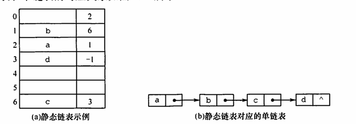

笔记部分参考于王道

## 2.1

线性表是一个逻辑结构，而顺序表和链表是指存储结构

线性表的特点

- 元素有限、有先后次序
- 每个元素数据类型相同，占用同样大小空间

### 2.1.3

- 线性表要求数据类型相同、元素个数有限。并且是一种逻辑结构而非存储结构，邻接表是存储结构，n个实数组成的集合（我觉得这里注意的是集合）不是一个线性表，而100个字符组成的序列是一个线性表（序列、有限）

## 2.2 线性表的顺序表示

顺序表，用地址连续的存储单元去存放线性表的数据元素，线性表中的逻辑顺序与顺序表物理顺序相同

可以实现随机存储，位序从1开始，不过数组下标从0开始

动态分配，只是指分配的空间大小在程序运行时动态决定，其仍是一个顺序表，一整块空间

存储密度较高，插入和删除操作要移动大量元素

### 基本操作的实现

- 插入

  先判断插入位置是否有效，然后将该位置之后的元素后移，线性表长度加1，再在指定位置放入插入目标元素

  - 最好情况，在表尾插入，无需后移元素，时间复杂度就是O（1）
  - 最坏情况在表头插入，要移动表中所有元素

- 删除

  第一步也是判断范围是否有效，然后再将该元素之后的元素前移，表长减1

- 按值查找

  遍历顺序表，找第一个出现目标值的位置

### 例题

序号没有按照题目顺序，只是想要标注讨论的点

1. 存储密度大也算顺序存储结构一个优点吗？不好说哦，我觉得主要是其它选项错得较多

2. 存取方式是指读写方式，而顺序存储结构的话，是一个随机存取的，可以根据元素序号乘以元素大小得到偏移量，只需要首地址就可以进行随机存取

3. 表长乘以元素大小

4. 存取下标已知的值，肯定优先用顺序表，实现随机存取，而无论哪种链表都是要从起始结点去开始查找的

5. 如果只在最后进行插入删除以及随机存取的操作，顺序表都是以O（1）的时间复杂度进行的

6. 顺序表的交换操作比链表也要更高效得多，链表要涉及指针的重定位，顺序表就是一个简单的swap

7. 插入操作 i 的合法值上界要到n + 1，相当于在表尾添加

8. 当线性表空间已满时，如果需要申请扩张分配空间，是要重新找一块区域，而非接到原来的后面

9. 元素逆置操作，可以直接将数组分为两半，两边同时向中间交换

10. 这个删除操作比较新颖哦，删除表中所有值为x的元素，遍历一次数组就可以了，用一个计数量k去记录值为x的元素个数，然后每次遇到该元素时，用后一个元素来代替这个位置就好，最后表长就为n - k

    此外还可以用头尾两个指针同时向中间移动去寻找，思路和上面一样，进行一个前移，一直进行到两指针相遇即可（就是一个计数器）


## 2.3 线性表的链式表示

### 单链表

为了解决顺序表删除、插入操作的低效率问题而采用的物理存储结构

不需要地址连续的存储单元，删除、插入时不需要移动元素，修改指针即可，但无法随机存取

单链表的结点结构，一个数据域一个指针域

在第一个结点前可以附加一个结点，称为头结点，可以不设任何信息，也可以记录表长等

头结点和头指针有一定的区别，无论是否有头结点，都会有头指针，指向链表的第一个结点，而头结点存在的话，其就是链表的第一个元素

引入头结点后有一定的优点：

- 第一个数据结点的位置是由头结点的指针指向的，因此第一个数据结点和其它数据结点并没有区别，在操作上都一致，不需要进行特殊处理
- 无论链表是否为空，其头指针都是指向头结点的，不需要特殊处理

#### 一些基本操作的的实现

##### 头插法建立单链表

将新结点插入到当前链表的表头，即头结点之后

该方法链表中元素的顺序与输入顺序相反

##### 尾插法建立单链表

增加一个尾指针，让操作更加高效

##### 按序号查找结点值

其实也就是遍历到该结点

##### 按值查找表结点

遍历，找到下个结点的值为目标时，返回该指针

##### 插入操作

时间复杂度为O（1）

但是要先按序号执行查找操作，找到后修改指针即可

一般使用的都是前插操作

##### 删除操作

查找位置，修改指针，然后释放空间

##### 求表长

遍历，直到空指针，用一个计数器去记录即可

### 双链表

两个指针，分别指向前驱和后继结点，方便访问某结点的前驱结点

相应的，实现一些操作

插入，需要涉及四个指针，前驱next，后继prior，该结点两个

删除，两个指针，前驱结点的next指针和后继结点的prior指针

### 循环单链表

与单链表的区别在于，最后一个结点的指针不是nullptr，而是指向头结点，在链表中形成一个环，在初始化时，头结点的next指针指向头结点。那么判空条件就不是头结点的指针为空，而是指向它本身

因为循环单链表是一个环，所以任意位置的插入和删除操作都是等价的，无需判断是否为表尾

循环单链表可以从表中任意一个结点开始遍历整个链表

### 循环双链表

双链表指的是有prior指针，然后循环双链表来说，头结点的prior指针指向尾结点

### 静态链表

用数组来描述线性表的链式存储结构，每个结点有一个int型的数据作为下标指针，指向下一个元素，然后每个结点对于一个下标

next为 -1 表示尾结点

### 顺序表和链表的比较

见书

### 例题

同样的，非题目序号，只是记录一些点

1. 链表拼接的时间复杂度，其实主要在前一个链表的遍历，遍历到最后一个结点后指向下一个表的头结点即可

2. 给定一维数组，建立一个有序单链表的最低时间复杂度

   方案1是每次寻找数组中最小的元素进行插入，那么时间复杂度会达到O(n^2)级别

   方案2是将数组排好序后再建立链表，那么前者最好时间复杂度是O(nlogn)，然后建立链表为n，最低则为nlogn

3. 增加一个头结点最重要的作用是方便运算的实现

4. 设置尾指针后，在最后一个元素后插入一个新元素只需要O(1)的时间

   尾指针到底指什么？其实就是指向最后一个结点的指针，解引用后得到最后一个结点

5. 有尾指针的链表，进行删除最后一个元素操作时，仍是需要O(n)的时间，因为要遍历找到其前驱结点，再让tail指针指向倒数第二个元素

6. 线性表中第一个/最后一个结点是没有前驱/后继结点的

7. 说实话，双链表的删除操作应该要方便一些，当设置有尾指针，删除最后一个元素时，可以直接找到其前驱结点，但是也算是访问前后相邻结点更灵活的一部分吧

8. 带头结点的双循环链表为空的条件是前后指针都指向它本身

   若不带头结点，那么就只是简单的判断空指针

9. 还是要双链表才能高效实现最后一个元素的删除，带有尾指针则更好，如果是双循环链表，不需要尾指针，因为头结点的prior指针本身就指向最后一个结点

10. 循环双链表对于首尾元素的插改查都是O(1)

11. 循环单链表若为空，head可以一直next，最终都指向head

# 学习指导题目

## 2.3.1

### 25

有尾指针的循环列表，删除开始结点只需要O(1)

### 29

这部分题目其实有点喜欢考执行哪些操作，相应的合适的数据结构

### 31

其实最少的比较就是，另外一个有序表的第一个元素已经大于了该表的最后一个元素，那么只需要遍历到最后，之后全部插入即可

### 32

最多的比较次数，其实就是交叉的情况

## 2.3.2

### 1

线性表的逻辑关系是如何反映的，在顺序表中是物理存储地址，在链表中是指针域的指向来反映

### 2

删除前移，累加再除以n麻，然后是n - 1累加到0

然后如果是插入的话，移动的数量是从n累加到1这样

### 6

遍历

### 8

这里答案的顺序有些反哦

```c
p->next = q->next;
free(q);
```

### 13

只能说时间开销主要是在搜索上，然后双链表的话可以进行双向搜索略快一点，但是存储密度较低

**存储密度**是指在存储结构中，**数据元素的数量与总存储空间的比值**

**单链表的存储密度较高**，因为每个结点只需要一个指针。

**双链表的存储密度较低**，但它支持双向遍历，灵活性和效率更高，因此在需要频繁插入、删除操作的场景中优于单链表。

### 14

修改上上个的next和本身的prior

### 15

插入，修改4个链域

### 18

单链表查找前驱结点的方法，其实比较妙的是在循环链表下，就是一个环，不用特判，用一条语句就完成了遍历找前驱结点

### 22

归并算法，其实可以回想一下课上的那种，分别用两个指针指向两个数组的第一个位置，然后逐个往后比较，一直到某个数组比较完，噢所以说最大的比较次数会是m + n -1

## 2.3.3

### 1.4

一维数组与顺序表，顺序表底层其实是一维数组，但是动态数据存储，现分配大小

### 1.5

对于程序而言，静态与动态其实简单来说就是直接声明a[10]和new/malloc

## 2.3.4

### 5

在不带头结点的循环单链表中设置尾指针比头指针更好，此时首结点和尾结点的查找时间都是O（1）

## 2.3.5 算法设计

略
