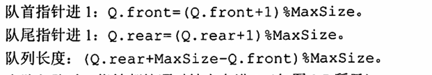
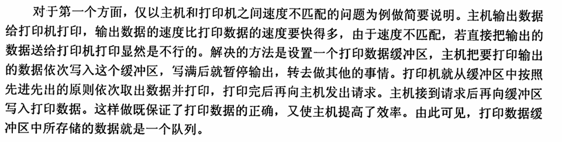
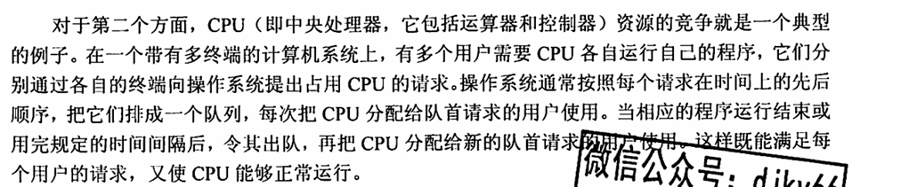
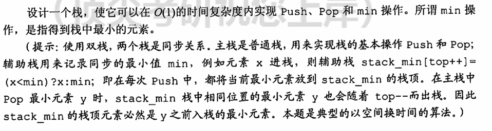

以下内容来自王道

## 栈

一种线性表，但只允许其在一端进行插入和删除操作

一个栈由栈顶和栈底组成，栈顶允许插入删除，栈底是固定的

拿到一种新的数据结构，从逻辑结构、存储结构以及运算三方面去进行分析，运算包括增删改查

### 栈的顺序存储结构

和顺序表类似，用一块连续的单元去存放数据，用一个指针（计数数据）去标记当前栈顶元素的位置，S.data[S.top]

初始化时，栈顶指针为-1

进栈操作，栈顶指针加1，然后赋值给栈顶元素

出栈操作，先返回栈顶值，栈顶指针再减1

栈空：top = -1， 栈满：top = maxsize - 1， 栈长 = top + 1

顺序存储结构来说，栈的大小、空间是固定的，只是栈顶指针没有移动到相应位置，那么类似的，当出栈后，其实也只是改变了栈顶指针位置，没有改变原来的值

实际应用时要特别注意top的实际含义，可能是栈顶的下一个位置

#### 基本运算

出入栈、
判空、读栈顶元素，其实都是通过top指针去实现的

#### 共享栈

利用栈底位置不变、顺序表大小不变的特性，可以让两个栈同时共享一个一维数组，一个栈顶为数组第一个最后，另外一个栈顶为数组最后一个位置，同时向中间扩展即可

### 栈的链式存储

多个栈共享存储空间，不存在栈满上溢的情况，所有操作在单链表表头实现，链栈无头结点

这里的共享存储空间，其实是基于链式存储结构特点而言的，因为每个元素是散落在内存空间中，不会产生碎片，也非顺序存储似的一整块区域

### 选例

- 栈与队列有着相同的逻辑结构，都是线性的，而存储结构是不一定相同的，两则均可以通过多种存储结构实现，顺序存储或者链表

  可以说两者都是，限制存取点的线性结构，只是限制的点不同而已

- 链栈的最大优势在于可以动态地分配大小，比起顺序栈而言

- 出栈序列种数求法，卡特兰公式$\frac{1}{n+1}C^n_{2n}$

- 上溢是指针超出了栈的最大范围

出栈序列问题，直接按照题目所给的序列找是如何操作的，不矛盾即可

## 队列

### 顺序存储结构

#### 顺序存储

两个指针，front指向队头，rear指向队尾下一个位置或者队尾都可以，看具体情况

如果指向队尾，那么当front = rear时，队列为空，当rear = MaxSize 时无法再存放元素，此时出现上溢出，但并不是真正的溢出，在队列数组的前面大概率还有存放元素的空间，称为假溢出

#### 循环队列

也就是将队列假想成一个环状空间，当指针指到MaxSize - 1时，再往下就指到0的位置，这种情况可以用取余操作实现

队空的条件为 front = rear，而队满时也有 front = rear， 如何区分呢，有什么方案

（1）牺牲一个存储单元来区分

那么队头指针在队尾指针的下一位置为队满的标志

（2）增加一个计数项，记录当前队列中的元素，那么front = rear时可以根据此数据项判断

（3）增加一个tag区分，如果因删除导致的front = rear，为空，如果因插入导致的，为满

### 链式存储结构

实际上就是带有头尾指针的单链表

有多个队列时用链式存储会更好，不会造成内存分配不合理或者溢出的情况

### 双端队列

两端都可以进行入队和出队。也可以控制一下，一端可以插入删除，另一端只能删除之类的

在特定情况下，其实就退化成了栈，比如只能在一端进行删除，那么就变成了栈底相邻的栈

### 选例

若用单链表去实现队列，队头一般在头结点，便于出队（删除）操作

利用一个栈可以实现队列中元素的逆置

## 栈与队列的运用

### 栈在括号匹配中的应用

算法设计思想如下

1)初始设置一个空栈，顺序读入括号。
2)若是右括号，与栈顶的左括号进行匹配，如果是不合法的情况(括号序列不匹配)，退出程序)
3)若是左括号，则作为一个新的更急迫的期待压入栈中。算法结束时，栈为空，否则括号序列不匹配。

### 栈在表达式求值的应用

如果是中序表达式，可以画出它的表达式树，然后得到先后序的表达式

后序表达式的话，从左到右扫描，遇到值就入栈，遇到操作数就取两个出来，计算后重新压入栈

先序表达式从右到左扫描即可

### 栈在递归中的应用

递归调用时，每层的返回点、局部变量、传入实参都开辟了递归工作栈，如果递归次数过多会造成栈溢出

优点是代码逻辑清晰，代码简单

缺点是过程中会有很多重复计算，效率低下

可以将递归算法转换为非递归算法，通常是用栈来实现这种转换的

### 栈的其它应用

DFS，

### 队列在层次遍历中的应用

其实这里，BFS算法同样是队列的应用

然后层次遍历里，每一步就是出队一个元素，然后将其子树入队，一直到所有结点都遍历完，初始化为根节点入队即可

### 队列在计算机系统的应用

第一个方面是解决主机与外部设备之间速度不匹配的问题，第二个方面是解决由多用户引起
的资源竞争问题。

## 矩阵的压缩

其实矩阵常规情况下就是一个二维数组，如果是特殊矩阵，可以将其压缩到一维或者行、列数较少的矩阵里

比较特别的是稀疏矩阵，可以用一个三元组，分别存储行、列号与值；也可以用十字链表去存储

## 小结

栈、队列都是线性表的应用、推广

一个拓展，空间换时间，实现O（1）的 min 操作

