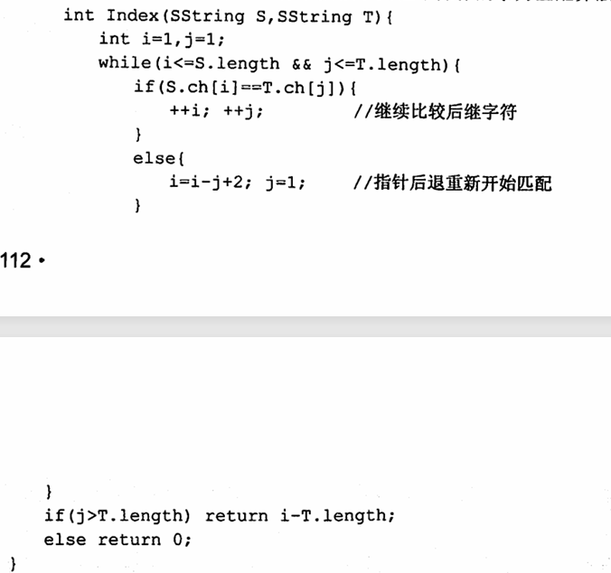

此章所指的皆是字符串

串与线性表的逻辑结构类似，但操作上有很大区别，串的操作单位通常都是子串。

子串在串中的位置，为第一个字符在串中的位置

### 三种存储方式

定长顺序存储 

堆分配

块链存储

前两种较常用

## 串的模式匹配

模式匹配是指子串的定位操作

### 暴力求解

时间复杂度为O（mn）

思路是逐个检查父串中的字符，当与子串第一个字符匹配时，往下继续匹配，开始不匹配时，回溯计数指针

### KMP算法

- 前缀表

  用来决定子串指针j在匹配失败时回溯的位置

  如果子串在第j个位置匹配失败，会检查前缀表a[j]的值，然后令j等于该值，i不变，继续匹配

那么算法其实就分为两步

KMP算法就可以整体上分为两步：

**一、计算前缀表。**

**二、根据前缀表移动两个指针进行匹配。**

时间复杂度为O（m+n），但其实一般的暴力匹配，在平均情况下也是O（m + n），KMP算法在主串与子串有很多“部分匹配”时才显得比普通算法快很多，优点是主串不回溯

优化，next和nextval数组

- next数组

  两种求解方法，一种是原理：

  next[j] = next[j - 1]，如果s[j] = s[j-1]的话，next[j] 再加一次 1

  另外一种，手工求解，求前后缀交集中最长字符串的长度，随后将数组整体右移，第一位用-1填充，是否加1视情况而定，如果串的位序从1开始则加，0开始则不加

- nextval数组

  求解方法：

  第一步，令nextval[1] = next[1] 

  从 j = 2开始，依次判断$p_j = p_{next[j]}？$如果相等，则将next[j]修正为next[next[j]]，直至两者不相等为止。当不相等时，nextval[j] = next[j]
