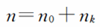

## 为什么需要树

### 首先回顾一下在本章之前接触到的数据结构

1. 数组

   分为固定的array和vector，其实vector也算是一个数组，通过其底层可以发现还是一个array，只是需要扩容的时候会把原来的拷贝过去，然后建立一个较大的数组

2. 栈

   一种后进先出的数据结构，常用于函数调用、计算式的运算。

   但是回顾一下书上的可以发现，还是通过一个数组去实现的，只是说增加了一个计数的"指针"，姑且称之为count，记录当前栈顶的位置。在无元素时候count为-1，入栈时，count ++，然后arr[count] = newdata

   如果是出栈的话，就是相反的，那似乎需要一个特别的值去标识空位置

3. 队列

   一种先进先出的数据结构

   常用于排队问题，其实也就是解决一个最小总用时，诶我记起来了，好像是叫做一个排序不等式，也就是说先处理最短用时可以得到全部总用时最短

   但是好像也没有太大关系，说说这种数据结构怎么进行构建的吧

   还是一个数组，不过这次有两个计数单位，可以称之为front和back吧（back在某些地方又叫做rear）

   在入队时候，back++然后arr[back] = newdata，在出队时，删除arr[front]，然后front++，在这种单向队列的情况下，若front = back + 1，则队列当前为空

   诶我突然记起来为什么说假溢出了，也就是说当back这个数据单位等于了队列的size时候，就无法再增加了。但是，当队列有出队操作的时候，前面的存储空间就会有空的，但是无法再存储信息了，最坏的情况是入一个，出一个，那由这样子判定了“溢出”的话，其实，队列里面一个都元素都没有

   

### 总结一下缺陷吧

- 均是线性的，没有层次结构。而比如文件系统、有层次结构的组织不便于使用这种数据结构


# 树

## 二叉树

### 构造

### 

### 删除 remove

分为三种情况

1. 该节点为树叶

   直接删除该节点，然后置为空指针即可，不用进行其它操作

2. 该节点只有一个孩子

   在进行上述操作之前，先像链表一样把根节点的指针直接指向该节点的子节点，然后对该节点实施1中操作即可

3. 该节点有两个孩子

   用该节点右子树中最小的数据去放到该节点的位置。一般来说，当某个根节点的leftchild指针为空的时候，该节点就是最小值

### 插入

其实怎么描述呢

要插入的数据肯定是放在根节点下面

那么从根节点入手来描述这个插入过程吧

1. 根节点为空，直接放入该数据即可

2. 根节点没有子树，和根节点比较大小，小放左大放右即可

3. 根节点有儿子

   有左无右：如果比根节点大，插入右儿子节点即可，如果比根节点小，那么将左儿子视为根节点，重复以上的操作即可

   有右无左：同理

   两个儿子都有：同理，往下寻找根节点即可


# 学习指导题目

对应学习指导书上的第七章

P173起

本章题目的结论、推论其实不必多记，遇到时从最简单的只有一两层的树推出规律即可，所以能读明白题比较重要，重在基本概念

## 7.2

### 1

- 树的高度是最长路径上的结点数，等于路径长加1

- 树的度m是指每个结点所具有的子结点数量都要小于这个数m

### 2

- 结点总数等于树的度数之和加1

### 3

双亲存储结构和孩子链存储结构，主要是说明了该结点所具有的指针域

如果指针域只有指向父节点的，那么就是双亲存储结构

如果指针域只有指向子节点的，就是孩子链存储结构

当然，实际编程其实是可以都包含的


二叉链存储结构：每个结点的指针域为左孩子、右孩子，在二叉树较稀疏的时候能够减少内存开销

顺序存储结构，适用于较满的树，空间能够有效利用，没有引入指针

孩子兄弟存储结构，两个指针，左指针指向该结点第一个孩子，右指针指向该结点下一个兄弟

### 4

这里树的构造我其实没懂它干嘛这样，可能是按照字母顺序

如果非要分析一下逻辑的话，应该是一个数组存储了顺序的字母，每次构造树将字母取出，检验其指针域，按序分配数组中剩余字母。遍历完字母数组完成构造

### 5

最小高度，其实对应的是树尽可能满的情况

当叶子结点全部在最底层的时候树的高度最小，由于满二叉树的最后一层叶子数最大为$2^{h-1}$

那么求所给叶子数 ≤ $2^{h-1}$ 时h向上取整的结果即可

### 6

已知某层叶子结点的数量求完全二叉树的最大、最小结点数

最大：该层以及网上的层数构成满二叉树，该层非叶子结点全满

最小：该层往上为满二叉树，该层只有叶子结点

### 7

注意满二叉树的定义，不等于完全二叉树，满二叉树最后一层必须全满

### 8

根据遍历的方法确定树的结构，思路是类似的

通过一个前/后序遍历找到根节点位置，在中序中划分左右子树。

**层序 + 中序** 也可以唯一确定树结构，层序遍历用于按层顺序选取子树节点。

### 9

哈夫曼树的构造

重复以下步骤，直到队列中只有一棵树为止：

- 从优先队列中**取出权值最小的两个节点**，设为 `A` 和 `B`。
- 创建一个新的节点 `C`，将 `A` 和 `B` 作为 `C` 的左右子节点，且 `C` 的权值为 `A` 和 `B` 的权值之和。
- 将新节点 `C` 插入到优先队列中。

当队列中只剩下一个节点时，该节点即为哈夫曼树的**根节点**。

**注意**：每次要将两个结点合成的新结点放入原来的队列中

### 10

将二叉链存储转换为顺序存储

数组中第i个位置的结点对应的左孩子在2 * i，右孩子在2 * i + 1

函数设计 CTree(v, a, i)

参数：结点v，顺序存储的数组a，要存放的位置i

> 初始化：将数组a先全部置为空
>
> 
>
> 递归的步骤：
>
> 第一步：检验当前结点是否为空，空则返回，不操作，非空进行一下步骤
>
> 第二步：a[i] = v->data
>
> 第三步：CTree(v->lchild, a, 2 * i)
>
> ​			   CTree(v->rchild, a, 2 * i + 1)

## 7.3.1 选择题

### 1

对于度为m的树，其结点数若为n，最大高度（链式，但是最起码要有一个结点度为m，不妨想象第二层度为m，然后往下只有一条链，那么最大高度应为n - m） 

### 2

同1

### 3

可以计算出具有n层的最大结点数为 $\frac{m^n-m}{m}+1$，写出递推公式计算即可

### 4

度数实际上就为边数，而结点数等于边数加1，便可以计算0度结点个数了

### 5

这里引入一种新的计算方法，

其实先要弄清下标含义，对应的是该结点的度数

而k度结点之积为n  - 1，由此可以得到$n_0$和n的关系

### 6

同样的，利用度数和顶点数的关系

但是注意和离散数学中的度数区分，这里其实算的是出度

### 7

what can i say

### 8

what can i say

### 9

### 10

在孩子链中，非空指针说明该结点有孩子，有边，n个结点就有n-1个非空指针

而总指针数就是结点数 * 度数

### 11

注意读题，问的是叶子结点数量，那么也就是没有孩子的结点数，即左指针域为空的结点数

### 12

直接硬数可以解决

也可以先把叶子结点数求出来，叶子结点的左指针为空，而兄弟结点为空的咋处理？

我自己总结下来为：叶子结点左指针必为空，非叶子结点具有孩子，必定有一个孩子的右指针为空，那么**空指针数就为结点数**（如果根结点没有兄弟指针域，那么空指针数为结点数减 1）

### 13 - 15

均和森林相关

好的，我们可以用简单的数字和结构来说明森林到二叉树的转换，并详细解释每个步骤。假设森林 \( F \) 中的三棵树分别用以下节点表示：

- 第一棵树（Tree 1）：节点 1、2、3
- 第二棵树（Tree 2）：节点 4、5
- 第三棵树（Tree 3）：节点 6、7

#### 步骤 1：森林到二叉树的转换规则
在将森林转换成二叉树时，我们遵循以下规则：
1. 每棵树的根节点成为二叉树中的某一个节点。
2. 在每棵树中，父节点的第一个孩子变成二叉树的“左孩子”。
3. 各树之间的兄弟关系在二叉树中通过“右孩子”链接。

#### 步骤 2：应用规则，将每棵树转换为二叉树结构
我们逐步把森林中的每棵树转换成二叉树：

##### 第一棵树（Tree 1）
- 根节点是 **1**，第一个孩子是 **2**，所以在二叉树中，节点 **1** 的左孩子是 **2**。
- 节点 **2** 的第一个孩子是 **3**，所以 **2** 的左孩子是 **3**。
  

转换后的二叉树结构（仅 Tree 1）：
```
     1
    /
   2
  /
 3
```

##### 第二棵树（Tree 2）
- 根节点是 **4**，在二叉树中将它作为节点 **1** 的右孩子。
- 节点 **4** 的第一个孩子是 **5**，因此 **4** 的左孩子是 **5**。

转换后的二叉树结构（包括 Tree 1 和 Tree 2）：
```
     1
    / \
   2   4
  /   /
 3   5
```

##### 第三棵树（Tree 3）
- 根节点是 **6**，将其作为节点 **4** 的右孩子（因为 Tree 2 是 Tree 1 的右子树，所以 Tree 3 作为 Tree 2 的右子树）。
- 节点 **6** 的第一个孩子是 **7**，因此 **6** 的左孩子是 **7**。

最终的二叉树结构：
```
     1
    / \
   2   4
  /   / \
 3   5   6
        /
       7
```

#### 步骤 3：统计二叉树根节点右子树上的节点个数
在二叉树中，**根节点 1 的右子树**是以下结构：
```
   4
  / \
 5   6
    /
   7
```

该右子树的节点包括 **4、5、6、7**，一共有 **4 个节点**。

结论

因此，森林 \( F \) 转换成二叉树后，根节点的右子树上的节点个数为 **4**。


14题可以简单的如上图所示，数一下右指针为空的结点数，其实就是原来森林的连通分支（树）数 + 1

### 16

有序树T转换为二叉树B

某层的第一个结点为父节点的左子树，其余结点依次在右子树上展开

那么简单举出实例判断即可咯


补充介绍：有序树的遍历方式

在有序树（即每个节点的子节点有固定顺序的树）中，常见的遍历方式有以下几种：

1. **前根遍历（Preorder Traversal）**：先访问根节点，然后依次遍历每个子树。
2. **后根遍历（Postorder Traversal）**：先依次遍历每个子树，最后访问根节点。
3. **层次遍历（Level Order Traversal）**：按层次从上到下，从左到右逐层访问节点。

在有序树中，不同的遍历方式会导致不同的访问顺序。以后根遍历为例，它的访问顺序是：先访问每个子节点的子树，然后再访问子节点，最后访问根节点。


前根遍历和层次遍历的区别主要在于它们访问节点的顺序和方式：

1. **前根遍历（Preorder Traversal）**：
   - **顺序**：先访问根节点，然后按固定顺序依次访问每个子节点。
   - **特点**：在前根遍历中，每次遇到一个节点就立即访问它，然后再递归地访问它的每个子节点。
   - **适用场景**：适合在遍历过程中需要优先处理每个节点（如生成树的复制、导出树结构）的情况。

   例如，对如下树进行前根遍历：

   ```
       A
     / | \
    B  C  D
   ```
   前根遍历的顺序是：`A -> B -> C -> D`

2. **层次遍历（Level Order Traversal）**：
   - **顺序**：逐层从上到下、从左到右访问每个节点。
   - **特点**：层次遍历需要借助队列数据结构，将每一层的节点按顺序加入队列，然后按层依次出队访问。
   - **适用场景**：适合在逐层处理树节点的情况，如计算树的宽度、进行分层处理等。

   对同样的树进行层次遍历，顺序是：`A -> B -> C -> D`

总结来看：
- 前根遍历是**递归地优先处理根节点**，然后逐个处理子节点。
- 层次遍历是**按层处理**，一层一层地访问每个节点，不依赖递归。


好的，以下是一个具体的例子，展示前根遍历和层次遍历的不同：

假设有这样一个树结构：

```
         A
       /   \
      B     C
     / \   / \
    D   E F   G
```

#### 前根遍历（Preorder Traversal）
前根遍历的顺序是：**根节点 -> 左子树 -> 右子树**，并递归进行。

- 先访问根节点 `A`，然后访问左子树（`B`），接着访问右子树（`C`）。
- 对于左子树 `B`，访问其根节点 `B`，然后访问 `B` 的左子树 `D` 和右子树 `E`。
- 对于右子树 `C`，访问其根节点 `C`，然后访问 `C` 的左子树 `F` 和右子树 `G`。

**前根遍历顺序**：`A -> B -> D -> E -> C -> F -> G`

#### 层次遍历（Level Order Traversal）
层次遍历的顺序是按层从上到下、从左到右。

- 第一层是根节点 `A`。
- 第二层是 `B` 和 `C`。
- 第三层是 `D`、`E`、`F` 和 `G`。

**层次遍历顺序**：`A -> B -> C -> D -> E -> F -> G`

#### 对比
- **前根遍历**：先访问根节点，再递归访问左子树和右子树。最终顺序是 `A -> B -> D -> E -> C -> F -> G`，这是一个深度优先遍历的顺序。
- **层次遍历**：按层次逐层访问节点，从上到下、从左到右。最终顺序是 `A -> B -> C -> D -> E -> F -> G`，这是一个广度优先遍历的顺序。

因此，这两种遍历的区别非常明显：前根遍历深度优先，先访问根节点，然后访问子树；层次遍历广度优先，按层逐一访问节点。

对于同样的树结构：

```
         A
       /   \
      B     C
     / \   / \
    D   E F   G
```

#### 后根遍历（Postorder Traversal）
后根遍历的顺序是：**左子树 -> 右子树 -> 根节点**，并递归进行。

- 对于根节点 `A`，先访问左子树（`B`），然后访问右子树（`C`），最后访问根节点 `A`。
- 对于左子树 `B`，先访问 `B` 的左子树 `D`，然后访问 `B` 的右子树 `E`，最后访问根节点 `B`。
- 对于右子树 `C`，先访问 `C` 的左子树 `F`，然后访问 `C` 的右子树 `G`，最后访问根节点 `C`。

**后根遍历顺序**：`D -> E -> B -> F -> G -> C -> A`

#### 总结：
- **后根遍历**：先访问子节点，再访问根节点，最终顺序是 `D -> E -> B -> F -> G -> C -> A`。这是一个深度优先遍历的顺序，但顺序与前根遍历相反，根节点是在所有子树访问完之后才被访问。

这样，你可以看到三种常见的遍历方式（前根遍历、后根遍历和层次遍历）的访问顺序是不同的。

### 18

由于T中的兄弟关系变为B中的右孩子，改变为父子关系,所以T中结点的层次序列与 B的先序、中序、后序和层次序列都没有对应关系。

### 19

层次遍历直接变成了按顺序遍历数组

### 20

这里很搞的一个概念是双亲结点，其实每个结点就只有一个父节点，是要性别平等对吗

### 21

还是用度数去计算吧

完全二叉树中度数为1的结点数只能为0或1

0度结点（叶子结点数）等于2度结点数加1


那么关于树的一个基本思路是，从度考虑，找到结点数与总度的关系，找到不同度之间的关系


补充概念：完全二叉树（平衡树）

#### 完全二叉树的定义：

1. **每一层都是满的**：除了最后一层，其他层的节点都必须是满的（即每层节点数达到该层最大节点数）。换句话说，除了最后一层，树中每一层的节点都应该填满。
2. **最后一层节点从左到右排列**：最后一层的节点不一定是满的，但必须从左到右依次排列，没有空隙。

#### 完全二叉树的特点：

- **高度**：一个完全二叉树的高度 `h` 是从根节点到叶子节点的最长路径的长度。完全二叉树的高度是由节点数 `n` 决定的，可以通过公式 `h = ⌊log₂n⌋` 来计算，其中 `⌊⌋` 表示向下取整。

- **节点位置的规律**：对于完全二叉树的节点，节点位置有一定规律：

  - 对于树中任意一个节点，假设该节点的下标为 i

    （从1开始编号）：

    - **左子节点**：其下标为 `2i`。
    - **右子节点**：其下标为 `2i + 1`。
    - **父节点**：其下标为 `⌊i / 2⌋`。

#### 完全二叉树的性质：

1. **节点数量**：对于一个高度为 `h` 的完全二叉树，最多有 `2^(h+1) - 1` 个节点。实际的节点数通常少于这个最大值，除非每一层都是满的。
2. **平衡性**：完全二叉树是一种非常平衡的树结构，除了最后一层可能没有完全填满，其他层的节点都被填满，因此其高度相对较小。
3. **节点排列**：完全二叉树的节点一般具有较为均匀的分布，这有助于保证其在一些操作（例如，查找、插入、删除）中的较高效率。

### 22

暂时没有特别理解，难道不可以将叶子结点全部放在最底层，那么该层对应的高度是8，那么上面是高度为7的满二叉树，总的结点数应该为 124 + 127 = 251呀

### 23

两个点

分支节点的定义：有子树

完全二叉树的定义：结点是顺序排列着加到树中的

### 24

本书中 树的度是指其出度

可以存在度为1的结点，但只能允许一个

### 25

简单推理易知

### 26

对于任意二叉树都满足这个公式吗

简单想了一下是的，然后这书中度数的标准和所学的不太一样，不用考虑从握手定理去解决

### 27

中序遍历，都是同理的，递归把树分成两边

若再加上一种遍历便可以得到整个树的树形

### 28

考察遍历特点，易知为C

### 29

根据先序遍历，画出两种可能情况，再根据中序遍历结果进行推理即可

### 30

注意a在b的左方这句话，包含了a是b的左子树以及b是a的右子树两种情况

### 31

直接画出来判断，A就对了

### 32

没太读懂

要交换二叉树所有分支节点的左右子树位置，可以使用 **遍历方法**，最合适的方法是 **后序遍历**（Post-order Traversal）。原因是：在交换左右子树时，我们需要先访问到当前节点的子树（即递归访问其左右子树），然后才能交换它们的位置，因此后序遍历的顺序非常适合。

------

### 后序遍历的顺序：

后序遍历的顺序是：**左子树 -> 右子树 -> 当前节点**。通过后序遍历，我们能够先处理每个节点的子树，再进行左右子树交换操作，确保每个节点的左右子树都被交换。

### 交换左右子树的步骤：

1. 对每个节点进行后序遍历。
2. 交换该节点的左右子树。

### 后序遍历交换左右子树的代码实现（Python）：

假设我们使用二叉链存储结构，每个节点有两个指针，分别指向左子树和右子树。

```python
class TreeNode:
    def __init__(self, value):
        self.value = value
        self.left = None
        self.right = None

def swap_children(root):
    # 后序遍历：先访问左子树，再访问右子树，最后交换左右子树
    if root is None:
        return
    
    # 递归交换左子树和右子树
    swap_children(root.left)
    swap_children(root.right)
    
    # 交换当前节点的左右子树
    root.left, root.right = root.right, root.left

# 辅助函数：创建二叉树并打印
def print_tree(root, level=0, label="Root:"):
    if root is not None:
        print(" " * (level * 4) + label, root.value)
        print_tree(root.left, level + 1, "L---")
        print_tree(root.right, level + 1, "R---")

# 示例
if __name__ == "__main__":
    # 构造一个简单的二叉树
    root = TreeNode(1)
    root.left = TreeNode(2)
    root.right = TreeNode(3)
    root.left.left = TreeNode(4)
    root.left.right = TreeNode(5)
    root.right.left = TreeNode(6)
    root.right.right = TreeNode(7)
    
    print("原始二叉树：")
    print_tree(root)

    # 交换左右子树
    swap_children(root)
    
    print("\n交换后的二叉树：")
    print_tree(root)
```

### 代码解释：

1. **TreeNode** 类表示二叉树的节点，包含 `value`、`left` 和 `right`。
2. **swap_children** 函数是递归实现的后序遍历。在递归过程中，首先交换左右子树，再交换当前节点的左右子树。
3. **print_tree** 函数用于打印二叉树的结构，帮助查看交换前后的效果。
4. 在 `main` 函数中，我们构造了一个简单的二叉树，并调用 `swap_children` 函数交换其左右子树。

### 交换前后的树结构：

```
原始二叉树：
Root: 1
    L--- 2
        L--- 4
        R--- 5
    R--- 3
        L--- 6
        R--- 7

交换后的二叉树：
Root: 1
    L--- 3
        L--- 7
        R--- 6
    R--- 2
        L--- 5
        R--- 4
```

### 总结：

- **后序遍历**是交换二叉树左右子树最合适的遍历方式，因为它能够保证在访问节点时，先处理完左右子树，再进行交换操作。

### 33

易知

### 34

这个答案的解析思路还蛮新奇的，给了一个二叉树各种遍历的固定模式吧，总结起来就是

前序：NLR，中序：LNR，后序：LRN

那么要让排序结果有一定规律的话，是要去掉某些项的

前序和后序正好相反，也即NLR = NRL

那么要去掉L项或者R项，也即该树是线性的，高度就等于结点数，只有单一地向左扩展或者向右扩展


- 二叉排序树，其实也就是左子树小于根节点，右子树大于根节点的树，大小关系可以自己修改，常规的如上

### 35

用前序和后序遍历的结果去查找很难想出不同情况（无法确定树形）

可以用选项中的中序遍历结果，结合前序遍历去构造树，然后检验是否符合后续遍历结果，符合则存在

那么检查一下，答案为C

### 36

由中序和层次遍历结果去构造树是没问题的，其实中序是个很好的突破口，它只要结合了其它的任意遍历结果就则构造出整棵树

然后从树导出原森林的树形


这里回顾一下由森林转化为一棵二叉树的方法

1、第一棵树的根结点A就作为该二叉树的根节点

2、对于根节点A，假设其有两个儿子B，C，那么C作为A的右子树，在转化为总的二叉树时，要连接到B的右子树上，对于B的子树，假设有D，E，那么E也是连到D的右子树上，由此递推下去，完成第一棵树到森林的添加

3、对于第二棵树，其根节点作为总二叉树的右子树插入，然后对树2进行步骤2

4、对于第三棵树，其根节点作为第二棵树的右子树插入，重复步骤2

由此递推便得到了总二叉树

在这种情况下，其实是一个斜平行的树形，有多少条平行边，原组成的树就有多少棵

### 37

假设可能是，推矛盾即可

A，C，D均不可能构成二叉树，B构成的二叉树比较特殊，只有右子树，退化为链表

### 38

先介绍一下线索二叉树

在二叉链表这种存储结构中，指针域是只有左右子树，无法直接找到该结点在某种遍历方法下的前驱和后继结点

线索二叉树利用了二叉树原本的空指针，存放了结点在某种遍历次序下，指向前驱和后继结点的指针，这些附加的指针就叫做线索

- 构造方法：

  中序线索化的具体步骤

  - 步骤一：定义线索二叉树的节点结构
    - 首先要扩展二叉树节点的结构，除了原有的数据域、左子节点指针和右子节点指针外，还需要增加两个标志位（用于区分指针是指向子节点还是前驱 / 后继节点）。例如，定义一个结构体如下：

  ```c
  typedef struct ThreadNode {
      int data;
      struct ThreadNode *lchild, *rchild;
      int ltag, rtag;  // 0表示指针指向子节点，1表示指针指向前驱/后继节点
  } ThreadNode, *ThreadTree;
  ```

  

  - 步骤二：中序遍历并线索化
    - 中序线索化过程通常采用递归的方式，需要一个全局变量（或者在函数参数中传递）来记录当前节点的前驱节点。
    - 首先对根节点的左子树进行线索化。在递归调用返回后，检查当前节点的左指针是否为空，如果为空，则将左指针指向前驱节点，并将左线索标志位（ltag）设为 1。
    - 然后检查前驱节点的右指针是否为空，如果为空，则将前驱节点的右指针指向当前节点，并将前驱节点的右线索标志位（rtag）设为 1。
    - 更新前驱节点为当前节点。
    - 最后对根节点的右子树进行线索化。
    - 以下是一个简单的 C 语言实现的中序线索化函数：

  ```c
  ThreadNode *pre = NULL;  // 全局变量，用于记录前驱节点
  void InThread(ThreadTree p) {
      if (p!= NULL) {
          InThread(p->lchild);
          if (p->lchild == NULL) {
              p->ltag = 1;
              p->lchild = pre;
          }
          if (pre!= NULL && pre->rchild == NULL) {
              pre->rtag = 1;
              pre->rchild = p;
          }
          pre = p;
          InThread(p->rchild);
      }
  }
  ```

  - 步骤三：添加头节点（可选但方便遍历）
    - 为了方便遍历线索二叉树，可以添加一个头节点。头节点的左指针指向二叉树的根节点，右指针指向中序遍历的最后一个节点。并且，中序遍历的第一个节点的左指针和最后一个节点的右指针都指向头节点

  前序和后序线索化

  - 前序线索化和后序线索化的基本思路与中序线索化类似，只是在遍历顺序和线索设置的时机上有所不同。
  - 对于前序线索化，在访问节点时，先处理当前节点的线索化（左线索和右线索），然后再递归地对左子树和右子树进行线索化。
  - 对于后序线索化，需要先递归地对左子树和右子树进行线索化，然后再处理当前节点的线索化。不过后序线索化相对复杂一些，因为后序遍历的顺序是左右根，要准确判断节点的后继比较复杂，需要考虑多种情况，如节点是左子树的根、右子树的根或者是叶子节点等。

  ⚽1.问题
  我们的二叉树学到现在，会产生两个问题：

  在n个结点的二叉树中，必定有n+1个空链域（叶子结点的左右子树空间浪费了）
  二叉树的遍历，无论是递归还是非递归算法，效率都不算高。
  那我们能不能利用原本浪费掉的空间，来解决第二个问题呢？

  倘若对下图二叉树进行中序遍历，可以得到1、3、6、8、10，我们可以知道3的前驱结点为1，后驱结点为6。但是，这种关系的建立是在完成遍历后得到的，那么，可不可以在建立二叉树的同时记录下前驱后继的关系，这样我们在寻找前驱后继结点时的效率将会大大提升！

  

  我们的前辈们给出了答案：线索化 

  🏐2.线索化
  现将某结点的空指针域指向该结点的前驱后继，定义规则如下：

  若结点的左子树为空，则该结点的左孩子指针指向其前驱结点
  若结点的右子树为空，则该结点的右孩子指针指向其后继结点
  这种指向前驱和后继的指针称为线索，将一棵普通的二叉树以某种次序遍历，并添加线索的过程称为线索化。

  

  🏀 3.线索化带来的问题与解决
  此时新的问题又产生了：我们如何区分一个lchild指针是指向左孩子还是前驱结点呢？

  为了解决这个问题，我们需要添加标志位ltag和rtag,并定义以下规则

  ltag == 0，指向左孩子；ltag ==1，指向前驱结点
  rtag == 0，指向右孩子；rtag ==1，指向后继结点

  


### 39

某个结点都有左右孩子指针，放在图中说，其实就是左右边，对于含有n个结点的树来说，不妨从1个结点开始递推，初始的空指针数为2，之后每增加一个结点，空指针数加1，那么n个结点就有n + 1个空指针，在线索树里便化为线索，指向相应的前驱或后继结点

### 40

哈夫曼树，这个题可以不管

### 41

可记，有n个叶子结点的哈夫曼树具有2n-1个结点，不妨以2、3的情况想象一下。哈夫曼树毕竟要不能有前缀相同的

### 42

哈夫曼编码，前缀不可能出现歧义的情况

### 43

留到数据结构解决

## 7.3.2 填空题

感觉填空题出得很没有水平我说实话

纯考试的，概念基本都是知道的，然后开始绕弯

选着收录一些

### 28

#### 非递归中序遍历

非递归中序遍历通常使用**栈**来模拟递归过程，遍历顺序是：**左子树 → 根节点 → 右子树**。

```python
def inorder_traversal(root):
    stack = []
    current = root
    result = []
    
    while current or stack:
        # 遍历到最左边
        while current:
            stack.append(current)
            current = current.left
        # 访问节点
        current = stack.pop()
        result.append(current.val)
        # 转向右子树
        current = current.right
    
    return result
```

#### 非递归后序遍历

非递归后序遍历的顺序是：**左子树 → 右子树 → 根节点**。
 这比中序遍历复杂一些，通常有两种实现方法：

#### 方法 1：双栈法

使用两个栈，一个用来存储节点，另一个存储节点的后序遍历结果。

```python
def postorder_traversal(root):
    if not root:
        return []
    
    stack1 = [root]
    stack2 = []
    result = []
    
    while stack1:
        node = stack1.pop()
        stack2.append(node)
        # 左子树入栈
        if node.left:
            stack1.append(node.left)
        # 右子树入栈
        if node.right:
            stack1.append(node.right)
    
    # stack2 中的元素是后序遍历顺序
    while stack2:
        result.append(stack2.pop().val)
    
    return result
```

#### 方法 2：单栈法

单栈法通过一个指针记录上一个访问的节点来避免访问重复节点。

```python
def postorder_traversal(root):
    stack = []
    result = []
    current = root
    last_visited = None
    
    while current or stack:
        # 遍历左子树
        while current:
            stack.append(current)
            current = current.left
        # 查看栈顶节点
        peek_node = stack[-1]
        # 如果右子树存在且未被访问，转向右子树
        if peek_node.right and last_visited != peek_node.right:
            current = peek_node.right
        else:
            # 否则访问栈顶节点
            result.append(peek_node.val)
            last_visited = stack.pop()
    
    return result
```

#### 对比

- **中序遍历**：较简单，直接模拟递归左-根-右的顺序。
- **后序遍历**：更复杂，因为需要记录访问状态，或者使用双栈方式完成。

### 30

具有权值的叶子节点构造哈夫曼树，带权路径长就是路径长 $\times$ 该点的权值

## 7.3.3 判断题

### 1.5

二叉树均满足 $n_0 = n_2 + 1$

### 1.10

哈夫曼树不存在度为1的结点，这样会导致前缀码出现歧义

### 1.12

权值较大的结点离根节点比较近

### 2.4

两个方程去求解

① 总结点数等于各度数结点数相加

② 总结点数减一等于度数之和

必要时，二叉树可用 $n_0 = n_2 + 1$

### 2.5

想根据遍历结果反推树的话，必须含一个中序

### 3.1

这个有点抽象了我只能说，啊对对对

## 7.3.4 简答题

### 1

简单来说，二叉树可以为空树，可以只有两个结点，根与结点之间左右必须严格区分

而度为2的树，必须有一个结点含有两个孩子，但无左右子树之分

### 2

还是两个方程去推

一个是结点数之和等于各度数结点相加

另外一个是度数之和等于各结点所具有度数之和，由此可以得到 n 与 n_0的表达式

### 3

m次树，那么要求每个结点都要具有m个指针

有n个结点，那么指针域总数为 nm

n个结点，无论是什么树，两个结点间始终是只有一条边的，那么只有n-1条边，实际上就是n-1度，那么空指针有 nm - n + 1个

### 4

（1）

这里两个思路，一方面可以找递推公式，第h层满的话，共有多少结点

但是所有结点之和本身就是可以计算的，直接求和就好，第i层就是k^i个，累加，等比数列求和

（2）

这个推理很厉害哦，编号为m的结点，就是前面所有和加上其在该层为第多少个，那么其第i个孩子也可以同理找到所对应的编号

（3）

还是先找到j与层数的表达式，然后去除以树的度，往下取整调整一下可以得到其双亲结点

### 5

（1）

树的顺序存储，不引入指针，直接采用数组存储，适用于较密集的树，空间利用率高的同时可以随机访问，实现简单

高度为h则需要2^h-1个数组空间，空间是给定的，该位置为空则记录空就好

（2）

在总二叉树中，某结点的右子树都是其在森林中的兄弟，左子树才是对应森林中的子树。根节点不存在兄弟一说，比如C，F，J

### 6

正确，恭喜

### 7

将二叉树还原成树T，其实和还原成森林是一个道理

这里要注意的说法是！！

树的后根序列对应所生成的二叉树的中序序列，树的先根序列对应所生成二叉树的先序序列

### 8

## 7.3.5 算法设计

先pass掉，代码的部分还没有怎么涉及

