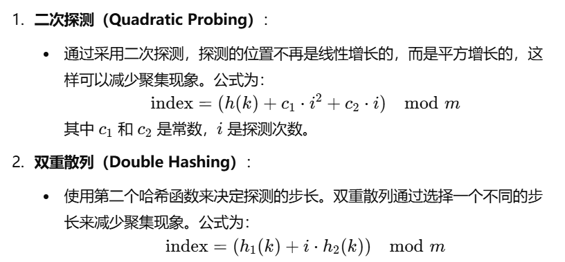

# 哈希函数的设计

## 1、字符ASCLL码值直接相加

```c++
int hash( const string & key, int tableSize)
{
    int hashVal = 0;

    for(char ch : key)
        hashVal += ch;
    
    return hashVal % tableSize;
}
```

这个哈希函数的设计较为简单，但有几个潜在的问题和不足：

1. **分布均匀性较差**：这个哈希函数只是简单地将字符串中每个字符的 ASCII 值相加，缺乏对字符位置的敏感性。例如，`"abc"` 和 `"cab"` 会得到相同的哈希值，因为字符的顺序没有被考虑。这会导致大量的哈希冲突，尤其是在字符相同但顺序不同的字符串之间。
2. **碰撞率高**：对于相似的字符串，特别是长度相同且组成相似的字符串，这个哈希函数产生的值差异很小，容易导致冲突。例如，`"abc"` 和 `"abd"` 的哈希值相差很小，这会增加冲突概率。
3. **哈希表大小敏感性**：虽然返回值被 `tableSize` 取模以适应哈希表大小，但如果 `tableSize` 不是素数，则哈希冲突可能会进一步增加。一个更好的做法是选择表的大小为素数。
4. **改进建议**：可以通过引入字符位置的加权来改进哈希函数。经典的哈希函数（如 BKDRHash）通常会利用一个较小的质数作为基数（例如 `31` 或 `37`），从而增加每个字符对哈希值的影响。一个改进的版本可以是：

```c++
int hash(const string & key, int tableSize) {
    int hashVal = 0;
    int prime = 31; // 选择一个较小的质数作为基数

    for (char ch : key)
        hashVal = prime * hashVal + ch;

    return hashVal % tableSize;
}

```

这样可以有效减少冲突，并且提升分布的均匀性


## 2、字符ASCLL码值加权相加

```c++
int hash2(const string & key, int tableSize)
{
    return (key[0] + 27 * key[1] + 729 * key[2]) % tableSize;
}
```

这个哈希函数 `hash2` 比较简单，通过对字符串前三个字符的位置进行加权处理生成哈希值。虽然相比之前的版本有所改进，但仍有一些局限性：

#### 优点

1. **加权处理**：相比于简单相加的哈希函数，这个哈希函数引入了加权处理，使得字符的相对位置对结果有一定影响。即使是相似的字符串，如果前三个字符的位置或内容不同，生成的哈希值也可能不同。

#### 局限性

1. **仅考虑前三个字符**：这个哈希函数只使用了 `key` 字符串的前三个字符。如果字符串较长，只根据前三个字符生成哈希值会丢失大量信息，导致相似的字符串可能产生相同的哈希值。例如，`"abc"` 和 `"abcdef"` 会生成相同的哈希值，容易产生冲突。
2. **冲突较多**：对于较短的字符串，可能会生成相同的哈希值。例如，单字符或双字符字符串无论内容如何，只使用前三个字符的哈希设计会导致更多冲突。
3. **对表大小敏感**：`tableSize` 的选择会影响到哈希分布的均匀性，建议选择为素数。

改进方法仍是如上，引入一个素数，这也是书上提到的第三种方法

# 避免冲突的方法

## 分离链接法

**分离链接法**（Separate Chaining）是一种用于处理哈希冲突的技术。哈希冲突是指当两个或多个键被映射到相同的哈希值时发生的冲突。分离链接法通过为每个哈希表位置创建一个链表来解决冲突。

### 分离链接法的原理

1. **哈希表数组存储指针**：哈希表的每个位置（桶）存储一个指向链表头的指针，而不是直接存储元素。
2. **链表存储冲突元素**：当多个键被映射到相同的位置时，这些键会被插入到同一个链表中。
3. **插入**：要插入一个新元素，先计算哈希值，找到对应的链表，再把元素插入该链表（通常插入到链表头，简单且高效）。
4. **查找**：查找某个键时，首先找到哈希表的对应桶，再遍历链表来查找目标元素。
5. **删除**：删除操作同样先找到对应桶，再在链表中查找和移除目标元素。

### 分离链接法的优缺点

**优点**：

- **避免重哈希**：分离链接法不会影响哈希表的负载因子（Load Factor），也就是说即使有冲突发生，也不会导致性能急剧下降。
- **灵活的存储**：可以动态增加每个桶的链表长度，适合处理大量冲突。

**缺点**：

- **需要额外的指针存储**：链表需要额外的内存来存储指针，增大了存储成本。
- **链表性能影响**：如果哈希表中的桶数量不足、链表过长，查找效率可能会下降。


### 两个insert函数的区别

[透彻理解C++11 移动语义：右值、右值引用、std::move、std::forward - KillerAery - 博客园](https://www.cnblogs.com/KillerAery/p/12802771.html#左值右值)

#### 先看一下左右值的区别

- **左值（lvalue）** ：表达式结束后依然存在的持久对象。
- **右值（rvalue）** ：表达式结束后就不再存在的临时对象。

字面量（字符字面量除外）、临时的表达式值、临时的函数返还值这些短暂存在的值都是右值。更直观的理解是：有变量名的对象都是左值，没有变量名的都是右值。（因为有无变量名意味着这个对象是否在下一行代码时依然存在）

> 值得注意的是，字符字面量是唯一不可算入右值的字面量，因为它实际存储在静态内存区，是持久存在的。

有了左值、右值的概念，我们就很清楚认识到右值都是些短暂存在的临时对象。

于是，C++11 为了匹配这些左右值，引入了右值引用类型 **&&** 。
右值引用类型负责匹配右值，左值引用则负责匹配左值。

因此刚刚的浅拷贝、深拷贝例子，我们可以无需显式调用浅拷贝或深拷贝函数，而是调用重载函数：


这两个 `insert` 函数的区别在于参数类型不同，一个是左值引用（`const HashedObj & x`），另一个是右值引用（`const HashedObj && x`）。它们的使用和性能表现各有不同，具体区别如下：

1. **左值引用（`const HashedObj & x`）**：

   - 接收一个**左值引用**（lvalue reference），即用于传递“具名的对象”或可重复使用的对象。
   - 左值引用用于处理已存在的对象，避免对象的拷贝开销。
   - 适合在哈希表中插入已存在的对象，函数内部不会对原对象进行修改。

   ```c++
   bool insert(const HashedObj & x);
   ```

2. **右值引用（`const HashedObj && x`）**：

   - 接收一个**右值引用**（rvalue reference），通常用于接收“临时对象”或不再需要的对象。
   - 在这种情况下，`const` 限制了右值引用的行为，意味着无法使用**移动语义**来避免拷贝，而只是接收一个右值，通常不会带来性能优化。
   - **一般情况下，不需要 `const HashedObj &&`，因为右值引用的意义在于能直接修改对象，这样才能进行移动**。将参数声明为 `const HashedObj && x` 会导致失去右值引用的优势，因此通常不常见。

   ```c++
   bool insert(const HashedObj && x);
   ```

3. **推荐用法**：

   - 左值引用 `const HashedObj & x` 是更常用的选择，因为它适用于已有对象，且不进行额外拷贝。
   - 如果希望对右值参数实现真正的移动语义优化（提高性能），可以去掉 `const`，并直接写成 `bool insert(HashedObj && x)`，这样可以使用 `std::move(x)` 来将右值引用对象转移到哈希表中，从而避免不必要的拷贝。

### const放在参数列表后，防止成员值被修改

`const` 关键字放在参数列表后，表示该成员函数是**常量成员函数**（`const member function`），表明该函数**不会修改所属类的任何成员变量**。在这个例子中：

```c++
size_t operator() (const Key & k) const;
```

`const` 关键字的作用是保证 `operator()` 函数**不修改当前对象**，即该函数仅用于**读取操作**，不会改变对象的状态。这样设计的原因主要是为了确保哈希函数的安全性和一致性，因为哈希计算一般是一个只读过程，不应更改对象的状态。

#### 常量成员函数的具体作用

1. **防止意外修改**：将成员函数声明为 `const` 后，编译器会在编译时检查该函数内是否有尝试修改类成员的操作，从而防止意外修改对象的数据。例如，如果函数中包含对成员变量的修改，编译器会报错。

2. **允许使用 `const` 对象调用**：常量成员函数可以被 `const` 对象调用，因为 `const` 对象只允许调用同样为 `const` 的成员函数。例如：

   ```c++
   obj.operator()(key); // 可以调用，因为 operator() 是 const 成员函数
   ```

   如果 `operator()` 没有声明为 `const`，则无法通过 `const` 对象来调用它。

#### 总结

在哈希函数（如 `operator()`）中加上 `const` 是一种良好实践，确保它在被调用时不会更改对象状态，提高代码的安全性和可读性。

### 为string类型特化hash类模板

你提供的代码片段展示了如何为 `std::string` 类型特化 `std::hash` 类模板。这个自定义的哈希函数使用了一个简单的哈希算法，通过对字符串中的每个字符进行加权计算来生成哈希值。以下是完整的代码，包括一些修正和必要的结构，以确保它可以正常工作：

#### 代码解释

1. **模板特化**：
   - `template <> class std::hash<std::string>` 表示对 `std::hash` 的特化，使得对于 `std::string` 类型，使用自定义的哈希函数。
2. **哈希函数实现**：
   - `size_t operator()(const std::string &key) const` 定义了一个常量成员函数，该函数接受一个 `std::string` 类型的引用参数并返回一个 `size_t` 类型的哈希值。
   - `hashVal` 初始化为 `0`，用于存储计算得到的哈希值。
   - 使用 `for (char ch : key)` 循环遍历字符串中的每个字符。
   - `hashVal = 37 * hashVal + ch;` 使用加权的方法来计算哈希值，这里使用 `37` 作为基数，这是一种常见的哈希计算方式，能够有效减少冲突。
3. **返回值**：
   - 函数最后返回计算得到的哈希值 `hashVal`。

#### 这种哈希函数的优点

- **均匀性**：使用权重（37）可以帮助分散哈希值，减少冲突的可能性。
- **效率**：简单且快速的哈希计算，适合处理字符串。

### 函数前的const用于修饰返回值类型

```c++
const string &getName() const;
```

1. **`const string &`**:
   - `const`：这个修饰符表示返回的字符串是**只读的**，调用该方法的代码不能修改返回的字符串内容。
   - `string &`：这是一个引用，表示该方法返回一个对 `std::string` 对象的引用，而不是复制该对象。这种做法在性能上是更优的，特别是在处理较大的字符串时，避免了不必要的复制开销。
2. **`getName() const`**:
   - `getName()`：方法的名称。
   - `const`（在方法尾部）：这个修饰符表示该方法是一个**常量成员函数**，它不会修改调用该方法的对象的任何成员变量。

#### 结合起来的意义

- 这个函数返回一个对 `std::string`对象的常量引用，确保：
  - 返回的字符串内容不能被修改（`const`）。
  - 不会对字符串进行复制，避免性能损耗（引用）。

### 声明完类之后记得加分号

### 类模板成员函数在类外的定义

在类外实现模板类的成员函数时，需要将实现代码和模板定义保持在同一个头文件中，因为编译器需要在编译时知道模板的具体实现。以下是你提供的 `HashTable` 模板类的成员函数实现方法示例。

#### 1. 重新定义类的模板前缀

每个成员函数的定义都需要使用 `template <typename HashedObj>` 来声明模板参数。

#### 2. 使用类名和作用域限定符

为了指定函数属于 `HashTable` 模板类，成员函数名前需加上 `HashTable<HashedObj>::`，指明该函数属于 `HashTable` 模板类。


**右值引用的 `insert` 函数**：如果右值引用用于优化，可以将 `x` 转换为 `std::move(x)` 以避免不必要的拷贝。

在哈希表中，**装填因子**（Load Factor）是一个非常重要的指标，用于衡量哈希表的空间利用情况。装填因子定义为哈希表中元素的数量与哈希表大小之间的比值：

装填因子=当前元素个数哈希表的桶数量\text{装填因子} = \frac{\text{当前元素个数}}{\text{哈希表的桶数量}}装填因子=哈希表的桶数量当前元素个数

用公式表示为：

Load Factor=nm\text{Load Factor} = \frac{n}{m}Load Factor=mn

其中：

- nnn 是哈希表中存储的元素数量。
- mmm 是哈希表中的桶（即槽位或链表头节点）数量。

### 装填因子

#### 装填因子的意义

1. **衡量空间利用率**：装填因子可以衡量哈希表的空间利用情况，装填因子越高，哈希表的空间利用率越高。
2. **影响性能**：装填因子与哈希表的查找、插入和删除效率密切相关。
   - 如果装填因子较小（例如小于 0.5），大多数操作的效率接近 O(1)O(1)O(1)。
   - 如果装填因子太大（接近 1 或更大），哈希表中的冲突会变多，查找效率下降到 O(n)O(n)O(n)。
3. **触发重哈希**：通常，在装填因子超过某个阈值时（比如 `0.75`），哈希表会进行**重哈希（rehashing）**操作。重哈希操作通过增加桶的数量，减少装填因子，使冲突概率降低，从而提升性能。

#### 装填因子的使用示例

假设我们有一个哈希表，初始时大小为 10 个桶：

- 插入 5 个元素后，装填因子为 $\frac{5}{10} =0.5$。
- 插入 8 个元素后，装填因子为$\frac{8}{10}=0.8$。

当装填因子达到 0.8 时，如果阈值设置为 0.75，哈希表会触发重哈希操作，将桶的数量翻倍为 20，并将原有元素重新分布在新的哈希表中。

#### 在代码中计算装填因子

在上面 `HashTable` 类的例子中，我们可以添加一个方法来计算装填因子：

```
cpp复制代码template <typename HashedObj>
double HashTable<HashedObj>::loadFactor() const {
    return static_cast<double>(currentSize) / theLists.size();
}
```

- `currentSize` 是当前存储的元素数量。
- `theLists.size()` 是哈希表中桶的数量。

除了链表，也可以使用任何合理的方案解决冲突，比如二叉树或者另外一个散列表都是可以的

## 基于5.3节所包含代码的整体、逐行解释

这段代码实现了一个基于**分离链接法**（Separate Chaining）的哈希表，主要包含两个类：`HashTable` 和 `customeredHash`。其中 `HashTable` 类管理哈希表的操作，包括插入、删除和查询，而 `customeredHash` 则定义了一个自定义的哈希函数。

### 思路概述

1. **分离链接法**：分离链接法是处理哈希冲突的一种方法。哈希表的每个槽位是一个链表（使用 `std::list` 容器），哈希值相同的元素会插入到相应链表中。
2. **自定义哈希函数**：使用 `customeredHash` 类模板来定义哈希函数。这样，`HashTable` 可以通过 `customeredHash` 计算元素的哈希值。代码中还特化了 `string` 类型的 `customeredHash`。

### 主要成员和函数解释

#### 1. `HashTable` 类

`HashTable` 是一个模板类，用于管理哈希表结构。它的主要成员和函数包括：

- **成员变量**：
  - `vector<list<HashedObj>> theLists`：一个 `vector`，每个元素都是一个 `list`，用于存储哈希表中不同槽位的数据。
  - `int currentSize`：当前哈希表中存储的元素个数。

- **成员函数**：
  - `HashTable(int size = 101)`：构造函数，初始化哈希表的大小。
  - `bool contains(const HashedObj & x) const`：判断哈希表中是否包含指定元素。
  - `void makeEmpty()`：清空哈希表中的所有元素。
  - `bool insert(const HashedObj & x)`：插入元素，返回是否插入成功。
  - `bool remove(const HashedObj & x)`：删除指定元素，返回是否删除成功。
  - `void rehash()`：扩展哈希表的大小，以减少冲突。
  - `size_t myhash(const HashedObj & x) const`：根据元素计算哈希值。

#### 2. `customeredHash` 类

`customeredHash` 是一个模板类，用于定义自定义的哈希函数，支持不同类型的键。代码中特化了 `string` 类型的哈希函数。

- `operator()`：定义了一个可调用操作符，用于计算给定键的哈希值。

### 逐行解释

#### `HashTable` 类构造函数

```cpp
template <typename HashedObj>
HashTable<HashedObj>::HashTable(int size) : theLists(size), currentSize(0) {}
```

- **功能**：初始化哈希表，`theLists` 的大小由 `size` 参数决定，默认为 `101`；`currentSize` 初始化为 `0`。

#### `contains` 函数

```cpp
template<typename HashedObj>
bool HashTable<HashedObj>::contains(const HashedObj & x) const
{
    auto & whichList = theLists[myhash(x)];
    return find(begin(whichList), end(whichList), x) != end(whichList);
}
```

- **功能**：检查哈希表是否包含某个元素 `x`。
- **逐行解释**：
  - `auto & whichList = theLists[myhash(x)]`：根据 `x` 的哈希值找到对应的链表。
  - `find(begin(whichList), end(whichList), x) != end(whichList)`：在链表中查找元素 `x`，如果找到则返回 `true`，否则返回 `false`。

#### `remove` 函数

```cpp
template<typename HashedObj>
bool HashTable<HashedObj>::remove(const HashedObj & x)
{
    auto & whichList = theLists[myhash(x)];
    auto itr = find(begin(whichList), end(whichList), x);

    if(itr == end(whichList))
        return false;
    
    whichList.erase(itr);
    --currentSize;
    return true;
}
```

- **功能**：删除哈希表中指定的元素 `x`。
- **逐行解释**：
  - `auto & whichList = theLists[myhash(x)]`：根据 `x` 的哈希值找到对应的链表。
  - `auto itr = find(begin(whichList), end(whichList), x)`：在链表中查找元素 `x`。
  - `if(itr == end(whichList)) return false;`：如果未找到 `x`，返回 `false`。
  - `whichList.erase(itr);`：找到 `x` 时，将其从链表中删除。
  - `--currentSize;`：元素数量减少。
  - `return true;`：成功删除后返回 `true`。

#### `makeEmpty` 函数

```cpp
template <typename HashedObj>
void HashTable<HashedObj>::makeEmpty()
{
    for(auto & thisList : theLists)
        thisList.clear();
    currentSize = 0;
}
```

- **功能**：清空哈希表中的所有元素。
- **逐行解释**：
  - `for(auto & thisList : theLists) thisList.clear();`：遍历 `theLists` 中的每个链表，并清空。
  - `currentSize = 0;`：将元素计数归零。

#### `insert` 函数（左值引用版本）

```cpp
template <typename HashedObj>
bool HashTable<HashedObj>::insert(const HashedObj & x)
{
    auto & whichList = theLists[myhash(x)];
    if(find(begin(whichList), end(whichList), x) != end(whichList))
        return false;
    
    whichList.push_back(x);

    if(++currentSize > theLists.size())
        rehash(); // 再哈希
    return true;
}
```

- **功能**：向哈希表中插入元素 `x`。
- **逐行解释**：
  - `auto & whichList = theLists[myhash(x)]`：根据 `x` 的哈希值找到对应的链表。
  - `if(find(begin(whichList), end(whichList), x) != end(whichList)) return false;`：如果 `x` 已存在，返回 `false`。
  - `whichList.push_back(x);`：将 `x` 插入链表末尾。
  - `if(++currentSize > theLists.size()) rehash();`：若装填因子超过某个阈值（即元素数量超过桶的数量），调用 `rehash()` 函数扩展哈希表。
  - `return true;`：插入成功返回 `true`。

#### `customeredHash` 类

```cpp
template <typename Key>
class customeredHash
{
public:
    size_t operator() (const Key & k) const;
};
```

- **功能**：定义了一个模板类 `customeredHash`，允许使用 `operator()` 计算哈希值。
- **逐行解释**：
  - `template <typename Key>`：定义模板参数 `Key`。
  - `size_t operator() (const Key & k) const;`：声明 `operator()`，它将会被用于计算哈希值。

#### `customeredHash` 的 `string` 特化

```cpp
template <>
class customeredHash<string>
{
public:
    size_t operator()(const string &key)
    {
        size_t hashVal = 0;
        for(char ch : key)
            hashVal += 37 * hashVal + ch;
        
        return hashVal;
    }
};
```

- **功能**：特化 `customeredHash` 类模板，用于处理 `string` 类型的哈希值计算。
- **逐行解释**：
  - `template <>`：表示这是 `customeredHash` 的一个特化版本。
  - `class customeredHash<string>`：特化 `string` 类型的 `customeredHash`。
  - `size_t operator()(const string &key)`：定义了 `operator()`，可以接受 `string` 参数并返回哈希值。
  - `size_t hashVal = 0;`：初始化哈希值。
  - `for(char ch : key) hashVal += 37 * hashVal + ch;`：遍历字符串 `key` 中的每个字符 `ch`，计算哈希值。
  - `return hashVal;`：返回计算后的哈希值。

这段代码的实现是针对 `Employee` 类的特化哈希函数，通过 `Employee` 的姓名属性来计算哈希值。它特化了 `customeredHash` 模板类，用于处理 `Employee` 类型的哈希值计算。这种做法允许我们根据 `Employee` 对象的 `name` 属性来生成哈希值，使得不同 `Employee` 对象可以根据姓名进行区分和存储。

### Employee类

#### 代码解释

1. **`Employee` 类**：
   - `Employee` 类包含三个私有成员变量：`name`、`salary` 和 `seniority`。
   - 提供了 `getName()` 成员函数，返回 `Employee` 对象的 `name` 引用。`getName` 是 `const` 函数，保证不会修改 `Employee` 对象的数据。

2. **`customeredHash<Employee>` 特化**：
   - 通过特化 `customeredHash` 模板类，使其能够处理 `Employee` 类型。 
   - **成员函数**：
     ```cpp
     size_t operator()(const Employee & item)
     {
         static customeredHash<string> hf; // hash function for string
         return hf(item.getName());
     } 
     ```
     - 这个 `operator()` 接受一个 `Employee` 类型的对象 `item`，返回计算出的哈希值。
     - `static customeredHash<string> hf;`：创建一个 `string` 类型的哈希函数对象 `hf`，它用于计算 `Employee` 对象的 `name` 字符串的哈希值。
     - `return hf(item.getName());`：调用 `hf` 的 `operator()` 函数，对 `Employee` 的 `name` 属性进行哈希计算，并返回生成的哈希值。

#### 工作原理

- 特化后的 `customeredHash<Employee>` 类可以将 `Employee` 对象的姓名字符串作为唯一标识，用于计算哈希值。这样在哈希表中插入或查询 `Employee` 对象时，`name` 字符串的哈希值会被用来选择适当的槽位。
  
#### 优点

- **实现灵活性**：可以对特定类型（如 `Employee`）定制哈希计算方式，避免了直接对整个对象进行哈希操作。
- **代码复用**：通过复用 `customeredHash<string>`，避免了重复写 `string` 类型的哈希计算代码。

## 探测散列表

探测散列（Open Addressing）是一种解决哈希表冲突的方法。与分离链接法不同，探测散列直接在哈希表的数组中寻找空位来存储元素。当发生冲突（即两个不同的键计算出相同的哈希值）时，探测散列会通过一系列探测步骤来查找下一个可用位置。

### 常见的探测方法

1. **线性探测（Linear Probing）**：
   - 在发生冲突时，线性探测将检查哈希表中的下一个位置。如果该位置也被占用，则继续检查下一个位置，直到找到一个空位或回到原始位置。
   - 公式：`index = (hash(key) + i) % table_size`，其中 `i` 是探测次数。
2. **二次探测（Quadratic Probing）**：
   - 二次探测的探测方式是使用平方函数，避免了线性探测可能造成的聚集现象。
   - 公式：`index = (hash(key) + c1*i^2 + c2*i) % table_size`，其中 `c1` 和 `c2` 是常数，`i` 是探测次数。
3. **双重散列（Double Hashing）**：
   - 双重散列使用两个哈希函数。如果发生冲突，则使用第二个哈希函数来确定下一个探测位置。
   - 公式：`index = (hash1(key) + i * hash2(key)) % table_size`，其中 `hash1` 和 `hash2` 是两个不同的哈希函数，`i` 是探测次数。

一次聚集（Primary Clustering）是指在使用线性探测（Linear Probing）解决哈希表冲突时，出现的一种现象。当多个键值冲突并且在哈希表中都被放置在同一位置或相邻位置时，会形成一个连续的占用块，称为聚集区。


### 一次聚集的原因

1. **线性探测的特性**：当发生冲突时，线性探测会依次查找下一个可用的位置。如果有多个键在哈希表中哈希到同一个索引，它们会依次填入后续的槽。这会导致这些元素在哈希表中聚集在一起。
2. **冲突增加**：一旦某个区域被占用，新的元素如果发生冲突，会继续向下查找，导致越来越多的元素集中在一个区域，这使得搜索操作变得更加不高效，因为查找时间可能会增加。

### 一次聚集的影响

- **降低性能**：由于聚集的存在，插入和查找操作的平均时间复杂度可能从常数时间（O(1)）增加到线性时间（O(n)），特别是在聚集区域很大的情况下。
- **增加空间浪费**：在极端情况下，聚集会导致哈希表的使用效率降低，许多槽可能是空的，但由于聚集的存在，仍然会使得插入操作变得复杂。

### 解决一次聚集的方法



3、**重新哈希（Rehashing）**：

- 当检测到聚集较多的情况时，可以选择扩大哈希表的大小并重新哈希所有现有的元素，以减少聚集现象。

