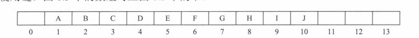
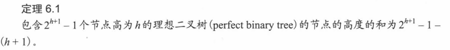
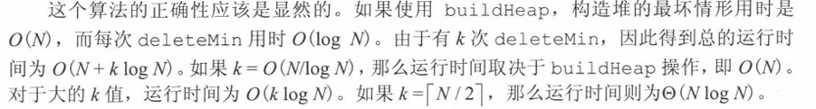
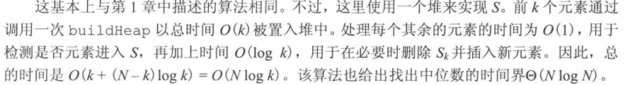

# Heaps 

## 为什么需要？

使得 **findmin**操作时间复杂度为$O（1）$

deletemin 和 insert 操作的时间复杂度为$O（\log{N}）$

## 堆的介绍

使用数组实现即可



- 对于数组中任一位置i上的元素,其左儿子在位置$2i$上,右儿子在左儿子后的单元$(2i+1)$中，它的父亲则在位置$|i/2|(向下取整)$上。因此，这里不仅不需要链，而且遍历该树所需要的操作也极为简单，在大部分计算机上运行很可能都非常快。这种实现的唯一问题在于，最大的堆大小需要事先估计，但一般这并不成问题(而且如果需要，可以重新调整大小)。在图6.3中，堆大小的限界是13个元素。该数组有一个位置0

### 堆序性质

最值在根节点

### 基本的堆操作

##### 插入

- 按照**上滤**的方式即可插入

  在末尾添加一个空穴，慢慢将空穴上移，替换即可

##### 删除

- 按照**下滤**的方式删除即可

  删除根节点后，产生一个空穴，将元素容量减一，最后一个元素寻找合适的位置插入即可，逐层下滤。

  也即每层比较过程中要比较三个对象：

  空穴的两个子代 + 最后一个元素

  如果最后一个元素一直没有插入，就逐层下滤

### 其它的一些堆操作

##### decreaseKey(p, delta)

降低位置p处的项的值，大小为delta

##### increaseKey(p, delta) 同理

##### remove(p)

删除位置p处的项，其实是先将它的值降到最低，可以用

$decrease(p, \infty)$，然后deletemin

下滤函数 $percolateDown(p)$，将位置p处的元素一直放到无法再下放为止

##### buildHeap操作

先将要处理的数据全部任意放入堆里，然后建立堆序性质，也即对N个元素逐层下滤，每次下滤操作的时间复杂度为$O(\log N)$

buildHeap操作时间复杂度：$O(N\log N)$

不完整伪代码：

```
for(int i = 0; i < heap.size(); i++ )
{
	percolate(i);
}
percolate //跟子代比较，每次*2
```

确定buildHeap运行时间

一个高度为h的完全二叉树有$2^h \sim 2^{h+1} -1 $个节点



## 应用

#### 选择问题

##### 查找第k个最小的元素

将N个元素读入一个数组，对该数组应用bulidHeap算法，随后执行$k$次deletemin操作（每次操作要记录当前值所以用了k次），如果将这些踢出的元素记录起来，实际上就得到了一个排序好的数组，这种排序方法便是 **堆排序**，时间复杂度为$O(N\log N)$

整个算法详细的时间复杂度分析：



##### 查找第k个最大的元素

将前k个元素进行bulidHeap置入堆中，记录其中最小项为$S_k$，随后对后面的$N-k$个元素操作：

比较与$S_k$的大小 -> 如果大于 $S_k$，那么对堆使用deletemin并将该元素入堆

对每个元素完成操作后，得到一个k元素的堆，其最小项就是整个数组中第k个最大项

整个算法详细的时间复杂度分析：



## d堆

单个插入操作时间复杂度为$O(\log_d N)$

单个删除操作时间复杂度为$O(d\log_d N)$ 这是因为每次要跟d个子代比较

- 在插入操作远多于删除操作时，采用d堆会更快一些

- 不能直接实现find操作（堆都是）
- 合并操作困难

下面讨论的是一些使得merge（合并）操作时间复杂度为$O(N)$的数据结构


# 课内内容到此为止

