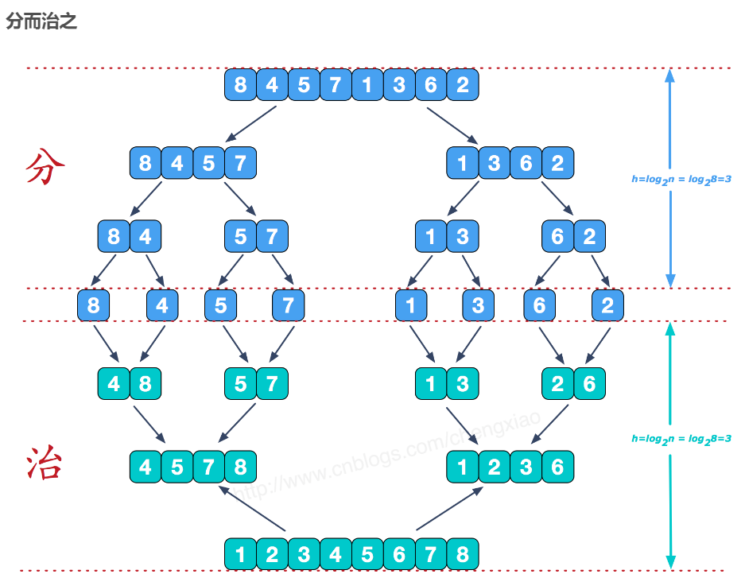

数据在内存则称为内排序算法，硬盘则称为外排序算法

# 预备知识

STL中的排序算法，用函数模板sort完成

sort的参数是迭代器的开始、终止标记

sort函数使用的算法一般是快速排序，默认升序排序

完成N个数据的排列，至少要对每个数据完成遍历，那么保底的时间复杂度就有了$O(N)$，而最坏的情况，每个元素都要跟其它元素比一遍，上界则为$O(N^2)$

基数排序和桶排序，在特殊情况下可以在线性时间内完成排序

也即所有的排序算法，时间复杂度在$O(N) \sim O(N^2)$之间

## 排序算法的稳定性

即为：对于一组数据，在完成排序后，若有重复的元素：

如果保留了原来的输入顺序，那么就是稳定的

如果记录里相同元素的相对顺序在完成排序后被改变，则是不稳定的

## 评价算法依据

时间、空间、稳定性

# $O(N^2)$算法

## 冒泡排序

蛮力、穷举法

从最后一个位置开始和前面的元素比较，每次比较$a[i]和a[i+1]$，如果是逆序的话就交换，继续往前走，每次完成把一个最小元素放到0号位置

#### 问题

交换次数（每次交换都对应两次赋值）过多，比其它$O(N^2)$的算法还要慢一些，最坏情况下，某一元素可能要做N次交换

有很多步骤是冗余的

## 选择排序

蛮力、穷举法

交换次数较少，每一轮选择只需要做一次交换

先跑一轮，把最小的元素找到，然后和第一个元素交换，然后从剩下的元素里找一个最小值，和第二个元素交换…..

**不稳定**，可能最小的那个元素和第一个元素交换时，改变了相对的顺序

## 插入排序

减秩法，分割成最小的问题规模，然后逐渐扩大，

在基本有序的情况下，非常有效，做插入的时候相当于只用比较一次

稳定的，在现实中还是可以用到的，比起前面两种

## 小结

数组的平均逆序数： $\frac{N(N-1)}{4}$ ，而上述简单算法都要完成逆序的交换，故时间复杂度也应为如上情况

如果要突破这个下界，必须让每次交换删除不止一个逆序（跳跃式或者分块）

# $O(N\log N)$算法

## 希尔排序

### 课程内介绍

分治法，把整个数组分成小数组，独立地进行排序，最后合成大数组

又称为缩小增量排序，增量即为步长。可以选择不同的增量，比如选定增量为5，那么把位置相隔5的元素排序

间隔为多少就可以分为多少组

完成一次增量排序可以使得不同的元素更接近正确的情况，而最后当间隔为1时，完成排序。

由于前面介绍的插入排序在相对有序的情况下时间复杂度接近N，在最后步长为1时便可以很快实现

选择步长大小考虑两方面：

过大：则小组多，小组合并之后并不能得到相对更有序的结果。但小组内快

过小：则小组少，但每个小组内花费时间仍然很大

传统的步长：从 $[\frac{N}{2}]$ 开始，每次除以2，逐渐减小到1

但上述步长选择并不是很好

### 换而言之

希尔排序也即，**改进版的插入排序**，引进了增量

### 注意

时间复杂度取决于增量序列的选择，选择$2^k-1$的增量序列（1,3,7），时间复杂度平均为$O(N^\frac{5}{4})$

选择 **Sedgewick's increments** 可以达到更低一些的时间复杂度，（1，5，19…）

不稳定，允许相同值交换位置

空间复杂度为$O(1)$，原地排序

### 简明过程

1. 将待排序序列分为若干子序列（每个子序列的元素在原始数组中间距相同）；
2. 对这些子序列进行插入排序；
3. 减小每个子序列中元素之间的间距，重复上述过程直至间距减少为1

## 堆排序

① 构建一个堆，花费$O(N)$的时间

② 对堆执行N次**deleteMin**操作，每次**deleteMin**需要花费$O(\log N)$的时间，故第二步运行时间复杂度为$O(N\log N)$

③ 将第二个数组复制回第一个数组的附加时间消耗$O(N)$

那么总的排序过程时间复杂度将会是$O(N\log N)$，耗时降低，然而空间消耗变大了，可以通过以下方法解决：

在每次**deleteMin**之后，堆中减少了一个位置，位于堆中的最后一个单元可以用来存放刚刚删去的元素

那么在最后一次**deleteMin**了之后，得到一个递减的数组（降序），避免了多一个数组的空间开销，那么如果想要得到升序的数组，需要执行的是**deleteMax**操作

## 归并排序

分治思想，利用递归

将两个有序的数组合并成一个完整的序列：利用三个参数，分别追踪两个数组以及目标数组的位置

有$log N$次递归调用，那么会生成$log N$个数组

每次都要生成一个临时的数组，空间利用率较低，当复制对象较大的时候会很慢，当足够小的时候已经没有必要再递归了，可以直接利用插入排序

比如定义一个阈值，当$right - left <= THRESHOLD$ 时就开始插入排序，

其次合并时可以这样做：

将两个数组先都拷贝到临时数组里，然后再将临时数组转到目标数组里，此时便不用考虑哪一方先拷贝完

不是原地排序算法，需要有辅助数组

是稳定的算法

算法设计的关键：

避免不必要的重复的计算

## 快速排序

找一个基准点，比其小、大的各自放在一边

再用递归，利用相同方式继续进行排序

也即：

基准情形：S中元素个数是0或1，则返回

① 随机在S中选择一个枢纽元v

② 根据枢纽元划分原数组为两个不相交的集合S1，S2

③ 对S1，S2再次进行快速排序，也即调用QuickSort(S1)，QuickSort(S2)

### 如何去选枢纽元

1、选择第一个数，但当数组相对有序时效率很低

2、随机数，随机数产生引擎的开销较大，减少不了算法其余部分的平均运行时间，但是可能产生较为劣质的分割（运气不太好）

3、中间的数

较好的方法：对比最左、最右、中间三个数，选择其中位数，能够减少较多的比较次数

### 划分

将枢纽值选出来之后，用$i,j$ 两个计数器去对去掉枢纽值的数组进行排序，方法如下：

$i$ 指向第一个，$j$ 指向第二个，同时往中间移动，每次移动都要判断$a[i]$、$a[j]$ 与枢纽值的大小，当 $i，j$ 分别扫描到比枢纽值$v$大，小的值时，各自暂停，两者都找到时，交换指向的数据，一直进行下去直到 $i,j$ 两个指针交叉

### 减少递归

当数组小于一定大小时，直接利用插入排序即可，减少快排中拷贝、递归造成的开销

### 与归并排序的比较

空间开销会小一些，也是分治法，但快排每次分的大小不一样，分得较平衡是理想的，如果每次分得都很不平衡，时间复杂度将会是$O(N^2)$，就跟选择排序一样

也即时间复杂度会在$O(N\log N) \sim O(N^2)$之间，不过平均时间复杂度证明为$O(N\log N)$，所以运用较为广泛

不稳定

数组尺寸一定小时，截断，用插入排序，通常在$5\sim 20$效果较好，同时还避免了小数组需要处理的情况，比如一两个元素，无法用中间、左右去选择枢纽值v

目前是最好的内部排序算法，比较次数较少便可以完成目标

- **性能：** 在平均和最好的情况下，快速排序和归并排序的时间复杂度都是$O(nlog⁡n)$，但快速排序在最坏情况下的时间复杂度会退化到$O(N^2)$，而归并排序始终保持$O(nlog⁡n)$
- **内存使用：** 快速排序的空间复杂度通常优于归并排序，因为它不需要额外的存储空间（除了递归的栈空间）。
- **稳定性：** 如果需要稳定的排序结果，归并排序是更好的选择。
- **实现复杂度：** 快速排序的实现通常比归并排序简单。

# O($N$)算法

分别适用于一些特殊的情况

## 桶排序

要求输入必须由一系列正整数构成，假设其全部小于正整数M

使用一个大小为M的数组count，开始扫描输入，读入$i$时将$a[i]$设为1即可，如果有重复元素，多次加1即可

但是这种算法在元素很多的情况下非常浪费空间，比如元素在一个很大的范围内，但元素很少

改进：给定固定数量的桶，一般用10个桶，对于给定的元素$k$，将其放入序号为 $k\%10$ 的桶中 

随后依次将桶回收，就可以得到一个个位有序的序列，接着将第一次排完的序列按照$k/10$入桶，最后将桶回收后便得到了后两位有序的序列

概述：按照一定规则，对元素进行分桶操作，最后回收桶便得到了序列

那么其实也不需要按照10来排，可以是任意数制

噢那便是下面说的基数排序

## 基数排序

> 时间复杂度是$O(N\log N)$，逐位对数字排序

有几个桶相当于把数转化为多少进制的数

比如基数为8的桶排序

有8个桶，那么需要排$\log_8M$趟，由最大项决定，可以先将最大项转为$b^p -1$

那么b就是桶数，p就是排的趟数

第n次排序相当于排k在8进制下的倒数第n位

基数排序还可以应用于字符串的排序，对于最大长度为L的一系列字符串，可以逐位比较，利用字符的ASCLL码去排序

中文字符的排序，要先引入一个拼音库，然后将字符串序列转化为拼音字符串，再对其进行排序，反向解析成中文即可

### 实现的方式：

- 让每个桶指向一个数组，有很多的数组开销，模n之后至少要用大小为$M/n$的数组去存元素，那么开销的空间是指数级别的，有很多没有用到

- 让每个桶指向一个链表，多了一个指针域，还是比较浪费空间
- 较好的：计数基数排序，只需要用一个数组a去存排序好的元素

总结一下第三个方法的步骤：

① 模运算，入桶

② 得到每个桶中的元素数，用一个count数组存，然后循环，让count后一位加上前一位

③ 从后往前扫描原来数组的元素，模运算得到k，然后放到a[count[k]]中，count[k] - - 即可 

④ 复制回原数组，完成回收

分析步骤：

第②步，目的是得到每个桶可以放在数组中的最后一个位置在哪里

第③步，每个桶可放位置不断前移

会比较复杂一些，如果范围较小的话就用方法2，每个桶存一个指针，指向一个数组

# 算法设计

蛮力法，不考虑算法效率，遍历即可，冒泡、选择、插入

分治法，分割成小问题，再合并为原来的的整体，希尔、归并、快速

转置法，把问题的形式转换一下，比如堆排序

特定方法，当输入有一定的特点时

# 决策树

用于刻画排序算法的步骤

最好、最坏的情况分别对应了叶子的深度
