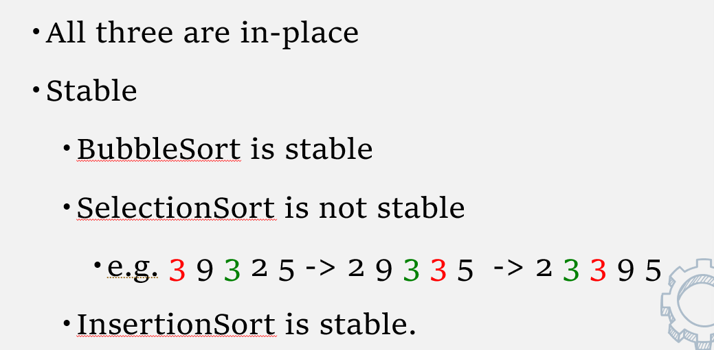

查缺补漏

## B(balanced)树的旋转

#### 插入产生的旋转

当插入导致B树不再平衡时，需要调整，此时称为旋转，其实我更倾向于把它看作一次像抖落的事件

如果让我进行分类，我会分成两种

一种是顺序的，比如插入到左子树的左子树上、右子树的右子树上，只需要做一次旋转就可以完成调整，哪个子树不平衡了，就往上抖一抖，让其根节点往下移，找到合适的位置即可，过程中注意二叉树特性的满足

另一种的非顺序的，那么就是插入到左子树的右子树上这种情况。我们先将左子树的右子树抖动一次，让其替代左子树的位置，再次抖动，让其代替不平衡的根节点的位置即可


再次回顾一下，顺序的，抖动根节点的子树一次即可，让其变换到根节点上

非顺序的，先抖动根节点子树的子树，代替子树的位置，再次抖动，代替根节点的位置


在判断不平衡的时候，找的是该次操作后，影响的最近的一个点使之不平衡，视作根节点，然后判断是哪种情况，开始操作


如果按照书上的符号来记忆，LL形不平衡就右旋一次，LR形不平衡就先右旋再左旋

#### 删除产生的旋转

大致是与插入类似的，旋转方法也相同，就是一个抖动，只是判定是LL之类的形式时略有不同

对于删除结点w，先往上寻找第一个不平衡的根结点z，然后y是z的高度最高的孩子结点，x是y的高度最高的孩子结点，对z，y，x进行形状判断后，执行与插入旋转方法相同的“抖动”

## 红黑树


## 时间复杂度的分析

都是找与n的关系

循环，看每层的继续执行条件与n的关系

if else语句、switch语句，看用时最长的模块

子程序要加上子程序的时间

递归子程序可以写成循环式去找到完成时间

## BST 二叉搜索树的删除操作

在删除某个结点时，会涉及到有无子树、有几个的问题

没有子树则直接删除，有一个子树就直接用子树替代该位置

如果有两棵子树，那么用右子树中最小的左子树去替代该结点，替代后删除该最小左子树，被删除的左子树要么没有子树，要么有一棵右子树，将被删除的子树的父节点与其右子树直接连起来就行

## 树的一些概念

满二叉树，每个结点要么没有孩子，要么有两个

完全二叉树，除了深度为d这层，上面的层都是满的，深度为d的这层从左到右填充即可

调整平衡的一些算法

AVL树、生长树、B树

### AVL树

好、但不完美的平衡，从这里引入了旋转的说法

引入了平衡因子这个说法。平衡因子等于左子树的高度减去右子树的高度

对于一棵AVL树，每个结点都要计算平衡因子，平衡因子的绝对值不能大于1 

#### Splay树

不完美平衡，利用了局部性原理，每次访问结点后会让它生长得更接近根节点

实现的想法：

① 每次访问结点后对该结点做多次单旋转，直至其到根节点的位置

​	会有logn次操作

② 做双旋转，该结点的祖先最1起码有两个，然后双旋分为之字形和一字形

先让Parent取代grandparent，再取代parent的位置就完成了双旋，不断地单双旋就将该结点移到了根节点处3

- 插入操作，正常插入到序号最小的叶子结点处，然后再上移即可
- 删除操作，先将要删除的结点上移到根节点，然后将根节点左子树中最大的数直接移动到根节点，根节点右子树直接连起来就行

有较好的局部性，一方面是最近获取过的结点直接到根节点，另一方面，该结点下的树也跟着上移

#### B树

为什么叫B树，全称为：

beyond binary search trees，也可以叫做Multi-way tree，多路搜索树

广泛用于数据库或者其它外部存储在磁盘上，需要让树比较浅的结构

M阶的B树有以下性质

- 根节点要么是叶子结点，要么有2 到 M个孩子，不存在只有一个孩子的情况

- 所有的非叶子结点（除了根节点外）都有 $ceil(M/2)$ 到 $M$ 个孩子

- 所有的叶子都在同一层，有相等的深度

- 所有的数据都存储在叶子上
- 内点有导向叶子的键值，键值是排好序的
- 叶子存储着$ceil(L / 2) $ 到 $L$个数据记录，$L$一般等于M，也可以是其它大小

**B+树是什么**，其实就是B树的基础上，所有的叶子结点是用链表连接的


图中冒号两边指的是分隔的数字，比如说根节点，把左右子树分成大于13和小于13

左子树的6：11，再次分成6之前、6到11、11到13，右子树的17分成13-17、大于17这样

##### 那么对于B树的操作如下：

###### 插入

如果这块叶子结点还没满，那么直接插入

如果叶子结点满了，分裂该叶子结点，选取中间关键字上升到根节点，关键字必须是有序的，然后每次插入按照每层分割情况加入到叶子结点中，叶子结点一满就分裂，用中间值作为根节点，其它的向下扩展成叶子结点。

然后注意的是，一般和根节点相等的话，到右子树中，也就是右边是大等于，左边小于

可以参照一下书上这个B树的构造，除了分割，数据也是要存进去的，叶子结点满了就取中间值向上作为根节点分割，但信息仍在叶子结点中，最后能保证平衡

###### 删除

如果发生了下溢，也就是叶子节点中的元素个数小于了$ceil(L)$

① 从邻居结点中借一个过来，然后调整根结点关键字

② 如果邻居借不到（借了也要下溢），那么合并这两个结点，删除掉一个根结点关键字即可

删除后的调整，其实主要是为了让其符合，删除该节点后，假设全部节点从头开始排，该是怎样的树形，所以下面扯出来的情况比较多，面向做题的话，实在不行咱就删完从头排进行全树的调整，因为涉及到的比较少


再按照GPT所说的理一下，但是感觉结构和书上不太一样，看看哈

**删除叶节点：** 简单，直接删除。

**删除内部节点：** 替换为前驱或后继关键字，然后递归处理。

如果目标关键字在内部节点，需用**前驱关键字**或**后继关键字**替代它，并递归删除对应的前驱或后继关键字。

初始状态：

         [10, 20]
        /   |    \
     [5]  [15]   [25, 30]

删除 `20`：

- `20` 是内部节点，选择用**前驱关键字** `15` 替代。
- 递归删除 `15`，转化为删除叶节点。

         [10, 15]
        /   |    \
     [5]   []   [25, 30]

**向兄弟节点借关键字：** 如果兄弟节点有额外的关键字，可以借用以平衡节点。

**合并节点：** 当兄弟节点也不足时，与兄弟节点合并，父节点关键字下移。

**调整根节点：** 当根节点为空时，树的高度减少，提升子节点作为新的根节点。


常规来说，在内存中，B树的阶为3到4就足够了，但是在磁盘中，可以选择M为磁盘中一个块的物理大小，一般为32到256

## 自组织链表

**自组织链表**是一种可以根据使用频率或访问模式动态调整顺序的链表数据结构。
其核心目标是：让**常用元素靠近链表头部**，从而减少平均查找时间。

### 自组织链表的常见调整策略

1. **移至头部（Move-to-Front, MTF）：**
   - 每次访问某个元素时，将该元素移动到链表头部。
   - 实现简单，适用于访问频率差异较大的情况。
2. **交换位置（Transpose）：**
   - 每次访问某个元素时，将其与前一个元素交换位置。
   - 重排成本较低，但收敛速度比 MTF 慢。
3. **基于计数（Count-Based）：**
   - 为每个元素维护一个访问计数器，每次访问时计数器加 1。
   - 按照访问次数的多少排序，访问次数多的元素靠前。
   - 需要额外存储计数器，重排过程稍复杂。
4. **基于频率（Frequency-Based）：**
   - 与计数法类似，但排序依据是访问的相对频率（即总访问次数的比例）。
   - 相对稳定，但对低频率访问可能不敏感。

### **优点**

- **提高平均查找效率：** 高频访问的元素被移动到前面，减少访问时间。
- **动态适应访问模式：** 随着访问行为的变化，链表顺序也会动态调整。
- **简单易实现：** 比平衡树等复杂数据结构容易实现。

### **缺点**

- **重排开销：** 每次访问可能触发链表的重新排列，增加操作开销。
- **均匀访问时无优势：** 如果所有元素被访问的频率差不多，自组织链表的性能与普通链表无异。
- **不支持随机访问：** 自组织链表查找仍然是 O(n)O(n)O(n) 的时间复杂度，不如哈希表高效。

## 哈希表

直接寻址表，每个存储单元存储一个值，不同的元素之间不会有冲突，其实就是数组吧，实现一个随机访问，但是当键值对较多特别是分布不均匀时，会导致数组很大，空间利用率极低，但是分布比较均匀时，这是效率、开销上都很优秀的方法

索引表方式，将键通过哈希函数映射到索引表上，这样减小了内存开销，但可能产生冲突问题，需要解决这些冲突

哈希表的核心思想是，利用数据的某方面信息作为数组的索引，那么O（1）的时间内就可以得到对应索引的数据

- 那么哈希函数要满足怎样的条件呢？

1. 能够让键值对随机分配，且产生的碰撞最少，均匀分布

2. 防止冲突，特别是在输入有规律的情况下

3. 全面地考虑输入，比如abc和acb，不能说只判断第一个字符，但也不应该过多，否则匹配效率会降低，如何均衡，有什么策略呢

   策略如下

   ### **使用适当的哈希函数算法**

   - **常用哈希算法**：如**DJB2**、**MurmurHash** 和 **CityHash** 等，它们被设计为在处理输入的每个字符时，能够有效地生成均匀分布的哈希值。
   - **分布均匀性**：这些算法会对输入字符串的每个字符进行处理，并利用某种数学运算（如位移、乘法和加法）生成哈希值，从而避免过度依赖某些字符，保证哈希值在输入的每个部分上都有影响。

   ### 2. **综合考虑每个字符及其位置**

   - **权重分配**：在哈希函数中，可以为每个字符赋予权重，使得不同位置的字符对最终哈希值的影响不同。例如，可以用一个多项式哈希函数，像 `hash = a_0 * p^0 + a_1 * p^1 + a_2 * p^2 + ... + a_n * p^n`，其中 `p` 是一个质数（如31或37），`a_i` 是输入字符串的每个字符的 ASCII 值。这种方法会考虑字符的位置，避免只依赖于首字符。
   - **避免过度计算**：虽然考虑每个字符是重要的，但为了提高性能，哈希函数应该避免计算过于复杂的权重。选择合理的算法（例如在某些情况下使用更简洁的位运算而非浮点数运算）可以保证哈希计算的高效性。

   ### 3. **避免过度依赖输入的某些部分**

   - **均匀性**：哈希函数应能均匀地分布哈希值，避免因输入中某些部分的变化微小而导致哈希值发生很大变化。例如，使用更复杂的哈希算法会避免只用字符串的前几个字符或固定长度的子字符串生成哈希值。
   - **组合特征**：哈希函数应综合考虑整个字符串的特征，而不是局限于某个子集。可以将整个字符串分块，并对每块进行哈希运算，然后将这些哈希值结合起来。

   ### 4. **预处理和混合**

   - **预处理输入**：在计算哈希值之前，对输入进行一些预处理，如对输入进行转换或替换，以消除一些不必要的模式，减少输入的冗余部分。
   - **混合技术**：可以使用“混合”函数来提高哈希值的分布质量，例如对输入的哈希值应用位移、位与或异或运算，使得每个输入字符的影响均匀分布到最终哈希值中。

### 一些哈希函数算法

当然，下面我将详细介绍一些常见的哈希函数算法，它们在不同的应用场景下被广泛使用，具有不同的特性和优点：

#### 1. **DJB2 哈希函数**

- **背景**：DJB2 是由 Daniel J. Bernstein 设计的哈希算法，因其简单和高效而被广泛使用，尤其在字符串哈希方面。

- **原理**：它使用了位移运算和加法来混合输入的每个字符，并且在每次迭代时都会将哈希值左移 5 位（等同于乘以 32），再加上当前字符的 ASCII 值，从而实现了哈希值的累加和混合。

- 代码实现

  （C 语言示例）：

  ```c
  unsigned long hash(unsigned char *str) {
      unsigned long hash = 5381;
      int c;
      while ((c = *str++)) {
          hash = ((hash << 5) + hash) + c; // hash * 33 + c
      }
      return hash;
  }
  ```

- 特点

  ：

  - **简单**：实现起来非常简单。
  - **高效**：具有良好的时间复杂度 O(n)O(n)。
  - **分布均匀**：对于大多数字符串，能够产生较好的哈希值分布。

- **应用**：常用于哈希表、缓存实现和其他需要快速查找的场景。

#### 2. **MurmurHash**

- **背景**：MurmurHash 是由 Austin Appleby 开发的哈希函数，专为高性能计算设计，广泛应用于分布式系统（如 Apache Hadoop、Apache Cassandra 等）。

- **原理**：它使用了一系列位运算、乘法和加法来混合输入数据，以确保哈希值的均匀分布。MurmurHash 在每一步都进行了多次位移和异或运算，从而有效地消除了输入数据的模式。

- 特点

  ：

  - **高性能**：在处理大数据量时性能优秀。
  - **均匀分布**：能生成均匀分布的哈希值，减少冲突。
  - **适用于非加密用途**：设计时不考虑加密，因此速度较快。

- 代码实现

  （MurmurHash 3 的简化示例）：

  ```c
  uint32_t murmur_hash(const void *key, int len, uint32_t seed) {
      const uint32_t m = 0x5bd1e995;
      const int r = 24;
      uint32_t h = seed ^ len;
      const unsigned char *data = (const unsigned char *)key;
      while (len >= 4) {
          uint32_t k = *(uint32_t *)data;
          k *= m;
          k ^= k >> r;
          k *= m;
          h *= m;
          h ^= k;
          data += 4;
          len -= 4;
      }
      if (len > 0) {
          uint32_t k = 0;
          for (int i = 0; i < len; i++) {
              k |= data[i] << (i * 8);
          }
          k *= m;
          k ^= k >> r;
          k *= m;
          h ^= k;
      }
      h ^= h >> 13;
      h *= m;
      h ^= h >> 15;
      return h;
  }
  ```

- **应用**：分布式系统、数据库索引、负载均衡等大规模数据处理场景。

#### 3. **CityHash**

- **背景**：CityHash 是 Google 提供的哈希函数，用于高效处理大数据的快速哈希计算，特别是对于长字符串。

- **原理**：CityHash 使用了多种位运算、乘法、异或等操作，并结合了特定的哈希算法来生成哈希值。它设计用于具有高计算速度和良好的哈希分布特性。

- 特点

  ：

  - **高效**：对长字符串和大数据的处理速度非常快。
  - **优良分布**：能生成均匀分布的哈希值。
  - **适用于非加密用途**：专为快速哈希设计，未考虑加密安全。

- **应用**：在 Google 的一些应用程序和开源项目中使用，如分布式数据库和分布式计算系统。

#### 4. **FNV (Fowler–Noll–Vo) 哈希**

- **背景**：FNV 哈希是一种简单且效率高的哈希函数，广泛用于哈希表和快速查找。

- **原理**：使用一个固定的质数（如 16777619）和一系列简单的位运算和加法来对输入数据进行哈希处理。

- 代码实现

  （FNV-1 32 位示例）：

  ```c
  uint32_t fnv_hash(const char *str) {
      uint32_t hash = 2166136261u;
      while (*str) {
          hash = (hash ^ *str) * 16777619;
          str++;
      }
      return hash;
  }
  ```

- 特点

  ：

  - **简单和快速**：实现简单，计算速度快。
  - **易于实现**：适合用在低复杂度的哈希计算中。
  - **分布均匀**：对于随机数据有良好的分布。

- **应用**：在网络协议、缓存系统和简单的哈希表实现中广泛使用。

#### 5. **CRC32**

- **背景**：CRC32 是一种广泛用于校验和计算的哈希函数，常用于数据完整性检查，如网络传输和文件校验。
- **原理**：使用循环冗余校验算法，基于多项式除法的原理生成哈希值。
- 特点
  - **快速计算**：计算速度较快，特别适合硬件实现。
  - **不适合复杂数据**：由于其主要用于检测错误，分布特性可能不如其他哈希算法。
- **应用**：文件校验、数据传输中的错误检测。

#### **选择哈希函数的策略**

- **性能和分布**：根据应用的需求，选择性能和哈希值分布最优的哈希函数。例如，对于大数据集，MurmurHash 和 CityHash 更为合适；而对于较小的数据，DJB2 可能更为简单和高效。
- **用途**：如果涉及到加密和安全性，则需要使用专门设计的加密哈希函数，如 SHA 系列（例如 SHA-256）。
- **可实现性**：在编程实现时，可以选择成熟的库和算法来避免手动实现时可能出现的缺陷。

#### **总结**

不同的哈希函数适用于不同的场景。对于大数据量的处理，MurmurHash 和 CityHash 是不错的选择；而对于一般的字符串哈希，DJB2 和 FNV 是简单且高效的选择。每种哈希函数都有其独特的实现方式和优化目标，选择时应根据具体需求权衡其性能、均匀性和实现复杂度。

### 简单的哈希函数

假如已知键的一些信息，比如随机分布在0到1之间，一个简单的哈希函数可以是这样，用键乘以键的个数


### 模运算的哈希函数

一般来说是对于键为整数的情况

然后选择的TableSize要为一个质数，能够有效地避免冲突

另外可以将键平方后再进行模运算，也能有效解决冲突的情况

#### 处理字符串的情况

对于非数字的这些实际键，在哈希前把它们转换为自然数，一般来说用ASCLL码去解决string转换为数字的情况

策略1：将所有字符的ASCLL码值相加再去对表大小进行模运算，但是可能出现如下问题

- 表很大，但是字符串的长度有限，比如只有8位，那么总的ASCLL码全部加起来也就只有1000多，假如表大小为10000，会有很多空间浪费掉，需要将键均匀地分布到整个表空间中
- 不同的字符串可能有相同的键，这是因为每位字符没有权重，当字符串有相同的字符而只是顺序不同时，会产生相同的键

### 解决冲突的方法

#### ① 链地址法 seperate chaining

哈希表的槽位是一个指针，指向该槽位的链表头而非一个元素，插入时将元素添加到链表末尾，查找时先进行键匹配，然后遍历链表查找目标元素

**优点**：

- 实现简单，动态扩展方便。
- 不会因为冲突导致性能问题，只要链表长度不超过合理范围。

**缺点**：

- 如果链表很长（例如，哈希函数不好，导致大量冲突），查找和插入的性能会退化到 O(n)O(n)O(n)。
- 内存使用较大，因为需要额外的指针来存储链表的节点。

也可以用二叉搜索树去补充槽位

在哈希表中使用 BST 来解决冲突在理论上是 O(log⁡N)O(\log N)O(logN) 的时间复杂度，比链表的 O(N)O(N)O(N) 更优，但在实际应用中，维护树结构和处理大量冲突的开销可能会抵消这一优势。如果哈希表的负载因子较低，冲突不频繁，使用链地址法或开放地址法可能更简单且效率更高。因此，当处理的数据量较大时，如果发现哈希表的槽位有频繁冲突，应该考虑是否改进哈希函数或扩大哈希表的大小，而不是单纯使用 BST。

#### ② 开放地址法 open addressing

在发生冲突时，再利用一个函数去探测空的位置

所有的键都在表中，而非链表里，逐次检测$h_0(x)、h_1(x)...$

不同的开放地址法区别只是在于探测函数，如下图

p是每次探测失败后给键加上一定大小再去做模运算


#### 线性探测

当表比较稀疏时，其实和链地址法接近

当表比较满时，要用线性的时间去搜索空位

当表满时，无限循环


容易形成聚集现象，后续插入和查找需要检查较长的连续槽位，形成一大块极慢的空间区域，称为主聚集问题（专属线性探测这样）

**性能降低**：当哈希表中有较大块的连续已占用槽位时，查找和插入的操作必须扫描较长的范围，降低了哈希表的平均性能。

**高负载因子**：在负载因子接近或超过 1 的情况下，主聚集问题变得尤为明显，导致冲突频繁，性能大幅下降。


略微改善的方法是增加步长，每次线性探测指定步长的槽

- 如何选择一个合适的步长呢？

需要满足在回到其初始槽位前，尽可能多地去访问每个槽位，那么这个步长c 满足：不是TableSize的因数


但是引入步长依旧没有解决线性探测的问题，理想的探测要求能够在未装入键的槽内随机挑选一个

#### 伪随机探测

设定一个perm数组，perm[i]是第i次探测要加上的值


#### 二次探测

与线性探测类似，但每次加 i 的平方，也可以是多项式，最高次为二次，并搭配系数，那么在初始值不同的情况下，能够得到不同的探测序列

此时能够极大削弱主聚集问题，当表的尺寸为质数，表最起码有一半没填满时，一个新的元素总是能插入

不过会产生次聚集问题，对于二次探测和伪随机探测都会这样，当两个键相同时，其探测序列也是相同的

#### 再哈希

$h_2(X)$不能为 0 或者表大小的因数


#### 扩大哈希表

当负载因子大于某个给定值时，将哈希表扩大为原来两倍，

操作如下

1. 遍历原来的哈希表，忽略掉已删除的键

2. 对每个未删除的键，重新计算哈希值，再放入新的哈希表中

   切记不能直接复制过来，因为新表有新的哈希函数，一般哈希函数都是模运算嘛，模的大小为哈希表大小

   

时间复杂度为O（N），但很少发生，可以接受，只是实时性强的系统无法采用该方法，运算耗时还是比较高的

一般在哈希表半满时执行，或者当插入失败时执行


### 哈希表中的删除操作

为懒惰删除，并没有直接删除该位置的元素，而是将其标记为已删除，多用一个数据来表示，但是当删除操作过多时，效率极低，寻找一个元素的时间复杂度接近O(N)


### 负载系数

存储的键值对个数除以表的大小，记为$\lambda$

那么用哈希表进行查找的时间为O(1) + O($\lambda$)

比较好的情况是让负载系数接近1

### 再哈希函数具体应用


- home是第一次哈希得到的键，第 i 次再哈希，内层为home加上 i 乘以第 2 个哈希函数


本题中，再哈希的函数，11满足不是13的因数，第二次再哈希就用 2 去乘以第二个哈希函数

## 堆 & 优先队列

在实际应用中，很多事件需要优先级，或者很快找最值

对于链表，如果需要排序，那么插入是O（N）而找最值是O（1），如果不需要排序则相反

对于二叉搜索树BST，插入和查找都是O(log n)

对于哈希表，插入为O（1），但找最值很麻烦

那么看起来，BST会是一个比较好的选择，但是其查找任意一个元素都是O(logn)，如果只需要最值，只执行对最值的插入、查找、删除操作，有没有更好的策略呢


**引入二叉堆这种结构**

### 堆序

最大堆/最小堆要满足每个节点都大于/小于其子节点，根节点永远是最大/最小节点

兄弟之间没有大小要求，不是BST

结构上永远是一个完全二叉树

### 维持堆序性质

首先明确，堆的相关操作只有findmin、deletemin和insert

#### deletemin

删除最小值后，将堆尾部的元素放到根节点上，然后对根节点执行下沉操作

#### insert

先将需要插入的值放到堆末尾，然后进行上浮操作

#### 建堆 build heap

先将待处理的元素输入，然后对于非叶子结点逐个进行下滤操作，而非上浮

## 排序

### 空间分析

**O(n) 额外空间**：需要复制整个输入数据，通常较为简单直观，但占用内存多。

**O(1) 额外空间（原地排序）**：内存占用最低，适合大规模数据，但实现可能稍复杂。

**O(log n) 额外空间**：一种折中方案，常用于递归算法中的临时存储。

### 稳定性

在数据库里特别的重要

### O(N^2)的排序算法

#### 冒泡排序

能够想到，然后可以从后往前也可以从前往后冒泡

内循环是遍历数组，挨个交换，每次确定一个

外循环是递减，每次减少一个比较的，因为确定下来过了

#### 选择排序

对于没有排好的部分，每次选一个最值出来排列，优点是只需要执行一次交换，只有这点优于冒泡

#### 插入排序

每次插入前，数据都是排好序的，将该元素找位置插入即可，满足条件就交换，一直到不可交换为止

该算法的效率取决于输入数组的性质，如果无序的较多，其实退化成冒泡的情况


#### 小结

以上三种算法，都是与邻接的元素进行比较，比较和移动都是单步长

三个算法都是原地排序

冒泡和插入排序都是稳定的，选择排序不稳定



#### 希尔排序

分治法，先分成子序列，对子序列进行排序后再合并

由于每个子序列都会使得原序列更加有序，最后一步插入排序将相当高效

##### **算法的关键**：

**间隔序列（gap sequence）**

- 最简单的间隔序列是按固定倍数缩小，如 `n/2, n/4, ..., 1`（Shell 原始序列）。
- 更高效的间隔序列，如 **Hibbard 序列**（1, 3, 7, 15,...$2^k - 1$），或 **Knuth 序列**（1, 4, 13, 40,...），Sedgewick序列（1, 5, 19, 41, 109, . . ., (9 · 4i − 9 · 2i + 1 or 4i − 3 · 2i + 1)）（目前最高效的）能进一步提升性能。

##### 性质

原地，但不稳定

### O(NlogN)算法

#### 堆排序

分为两步

建堆 + N次delete操作，delete返回值复制到数组

那么时间复杂度为O(N+NlogN)

##### 能不能不用额外的空间呢？

可以，将第 i 次删除的值赋到堆数组中倒数第 i 个位置

那么最大堆会得到一个升序，最小堆会得到一个降序

##### 性质

原地、但不稳定

#### 分治法


#### 归并排序

需要辅助数组，不断将该步数组二分，然后再进行合并，合并操作利用

当数组尺寸小于一定值时，可以直接插入排序，减少递归的次数，避免栈溢出

非原地，稳定的

#### 快排

不需要额外空间，每次需要一个枢纽值，pivot，每次合并只需要O(1)的时间，不像归并那样还要进行两数组间的组合，快排基于枢纽值的话左右已经相对有序了

##### 划分的策略

有三路分区和两路分区的说法

三路分区是指将数组划分成小于、等于、大于枢纽值的三部分，等于部分的数组不用再操作，能够提高效率，处理重复值较多的情况

二路分区是分成小于等于、大于枢纽值的两部分，重复值多时效率低

选取一个能够让划分的两边元素个数相等的枢纽值最好，假如每次选到的枢纽值都是最差的，那么快排其实退化成了选择排序

- 如何选择枢纽值

  - 如果每次选第一个，在数组相对有序的情况下极其低效
  - 如果随机选，会产生随机数的开销

  最终采用选择三个数的中间值，三个数为数组中的left right mid

- 选取枢纽值后，对实际的数组是怎样进行操作的？
  1. 将枢纽值放到数组末尾
  2. 首尾两个指针i，j分别向中间移动，首指针找到大于枢纽值的时候停止，j指针找到小于枢纽值的元素时停止，两个指针都找到了就进行元素交换，继续往中间移动，当两个指针交叉时完成排序

#### 外部排序

由于一些大数据不能直接放入内存排序，需要借助磁盘，通过IO操作完成排序

##### 基础模型

每次算法需要在四个磁带上运行

首先在Ta1上初始化，然后第一次归并排序，假设内存一次可以排序M个元素，那么将Ta1上的元素分成多个M小块放入Tb1和Tb2，进行排序，完成第一趟

将Tb1和Tb2同一位置的元素进行归并，交叉着放入Ta1、Ta2

不断地交换，到最后归并到一个磁带上即可，需要$ceil(log(N/M))$次排序

##### 改进

尽可能增大初始化中每块的大小

###### 多路归并

每一轮中处理更多的归并段


以三路归并为例，那么需要6个磁带去完成操作，每次归并都是三个磁带同位置的数据，第i次完成同列 3^i 个数据的归并


##### 替换算法

平均上，初始化时创建2M长度的记录写入Tb1、Tb2

替换算法可以看作堆排序的一种变式，利用一个变量LAST记录输出位置

其中LAST也可以是FIRST，最小堆也可以是最大堆，得到不同的升降序结果


首先将M条记录读入内存，再把这M条记录放入一个最小堆，堆不为空时循环执行以下操作

每次弹出一个最小值到输出磁带中，R是输入磁带中的下一条记录（如果有的话），如果R大于刚刚的输出，就将R放在根节点位置，然后重新调整堆；如果R小于刚刚的输出，那么用R替换刚刚弹出到磁带的最小值，刚刚弹出的重新入堆，LAST变量减一、


运行一次的长度平均上是堆数组大小的两倍，而堆数组大小一般就为M

运行长度的范围是大于M，然后理想情况可以无限增大

无限增大时，意味着每次都是弹出根节点数据，然后下一个输入插入堆里

M时意味着，每次弹出的数据都比下一个输入大，下一个输入数据滞留在数组中，当堆弹完了重新建堆，比如下图弹出81时，12只是在数组中而没有入堆


也可以进行读写策略的优化，提前读入内存、增大缓冲区都可以

#### 

## 不相关集类

通过等价关系拓展而来

是一些互不相交的集合，每个集合以其中一个元素作为该集合的“名字”

- find操作会返回该元素所在集合的“名字”

- 合并操作以“名字”作为参数，取两不相交集合并集

### Up-Tree

每个元素有一个父节点指针，如果是根节点的话指针值为-1，非根结点指向自己的父节点元素

以下是并查集生成Up-Tree的过程

先初始化每个元素为单独的一个并查集，然后通过Union合并操作构造

Union ( i, j )，让 j 指向 i


通过Up-Tree可以实现find操作，返回该元素的根节点，即为类的名字

算法实现如下，可以看到只需要简单的赋值操作，常数时间完成


而查找操作，由于根节点对应的值为-1，也很简单可以实现


在最坏的情况下，查找操作会为n次，也就是退化成链时

#### 由权重进行并集

总是让权重更小的结点指向值大的结点，Union的两个参数没有顺序之分，那么如何去记录权重呢，采用额外的数组的话内存开销大一些，可以在原来的s[i]数组上记录，负值不仅代表了根节点，也代表其权重。正值依旧表示非根结点的父节点


带权重的情况下，每次查找为O(logN)的时间

#### 由高度进行并集


让高度较大的作为根结点，相等时让第一个参数作为根节点


#### 路径压缩

进行一次查找后，路径上的所有结点直接指向根结点，完成了自调整操作


#### 利用不相交集生成迷宫


初始化时，每个结点为单独的集合

然后随机地从边集中选择一条，对该边关联的两个单元进行操作

首先先找两个点的name（根节点）是否一样，如果一样，该边加入迷宫，如果不一样，对根节点执行取并集操作。无论是否一样，该边都从边集中移除，不再进行下一次的随机选择操作

循环执行到 S 中只有单个结点集合，也即所有的结点都在同一个集合中，将剩下的边加入迷宫即可

## 图

### 图的遍历

需要一个标记位。然后三种遍历方法吧，DFS、BFS、拓扑排序

DFS，可以利用栈或者递归实现，有比较多的应用

BFS，利用队列实现，可以找到最短路径

DAG，有向无环图，可以进行拓扑排序


### 最小生成树

#### kruskal算法

利用并查集实现，初始化所有结点为单个不相交集，然后类似迷宫那样，先选择一条最小的边，对边的两端顶点执行find操作，找到各自的"name"即根节点，如果不相同就将这条边加入到最小生成树中，如果相同就不加入，从边集中找下一条最小边
