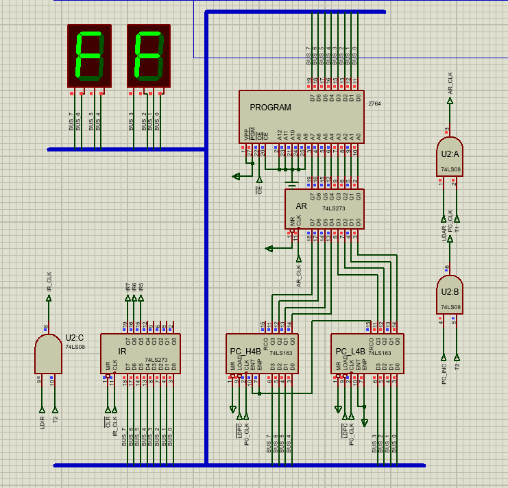

## 实验3

烧制后用菜单栏Debug查看0024地址开始的内容，应该是从55开始

第二步的ABUS_[0..11]在电路图中间，拨动观察下方调整结果即可

第三步，地址总线上的024H打入地址锁存器，然后再让ROM输出数据，此时在红色数码管上便看到了存储单元[024H]中的内容，与上图ROM中内容一致，55

第四步，再次调整地址线，锁定RAM中的地址并让RAM输入，数据便完成了从[024H]的位置写入到了[F80H]中

第五步，再次调整电路信号，禁止ROM输出，允许RAM输出，观察存储单元[F80H]位置写入的内容，但是这里是如何确定是否正确呢，我点击RAM中的信息，只看到了[080H]中写入了55，[F80H]是？

第二轮

第三轮

第四轮

至此完成所有的数据写入，再次和ROM中内容核对：

55，01，FF，01 

完全正确

重新启动，模仿断电后RAM的状态，确实存储的信息都消失了，体现其易失性，而ROM中烧入的数据断电后依旧存在，那么build过程是否就是模仿了烧入呢

## 实验4

### part 1

运行第一条指令

观察结果

运行第二条指令的结果

运行第三条指令的结果

运行第四条指令的结果

五、六条

第七条

第八条

第九条

第十条，此时红色管显示的是0

第十一条

第十二条

第十三

14、15、16、17，均不再变化

然后改接auto-clock，reset调节0->1->0，指令往下执行，跳出断点，多次运行和上述结果保持一致

### part 2

前四条指令，仍是JMP1，故猜测与part 1中一致

下面是五到八条指令运行结果

第五条指令，开始和part 1中不一样，因为开始执行了JMP3指令，从机器码中可观察出必然不同，然后猜测应该有12条指令可执行，在第12条后结果不变

下面九到十二条开始执行JMP2指令，与part1中一致，但是操作数变了之后得到结果预计也是不一样的

十三、十四，这里已经没有指令可执行，猜测FF想表达的应该是溢出了

原来绿色数字显示的是指令的十六进制表达形式，那么指令相同时绿色数字也相同，反映的是DB后面的二进制数字

### 修改EPROM后的结果

#### 前四条

#### 5-8条

#### 9-12条

