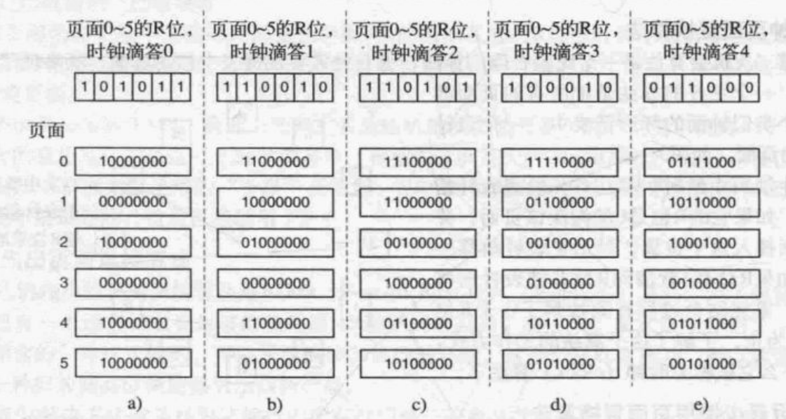
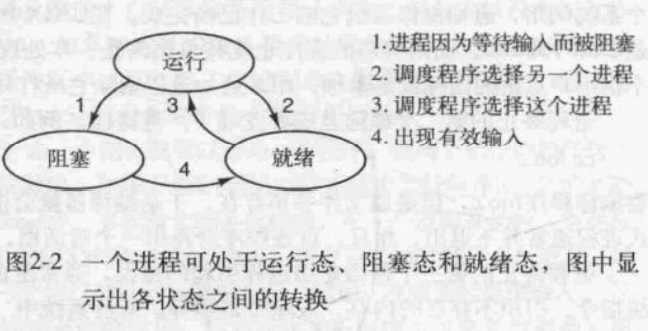
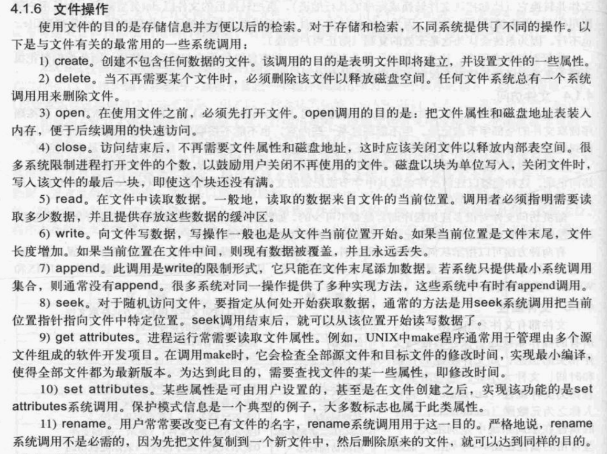
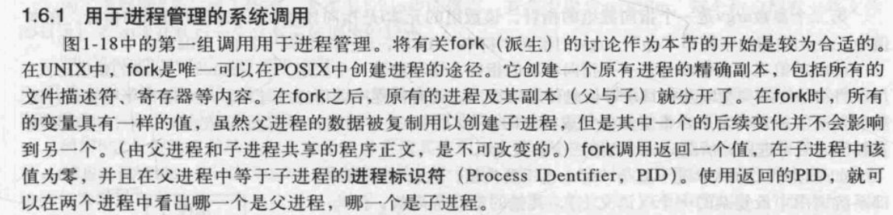

### 阻塞图

### 调度 [scheduling]

周转时间（turnaround time）：一个批处理作业从提交到完成的统计平均时间。

忽略进程切换（process switch，又称上下文切换context switch）的时间，一个进程从提交到完成的时间等于等待时间与运行时间之和。原因：一个进程从提交到完成要么在等待，要么在运行。（答题时最好抄一下原因，证明一下再用）

A. 先来先服务（First-Come First-Served, FCFS）：顾名思义。有护航效果（Convoy Effect）。

B. 最短作业优先（Shortest Job First, SJF）：顾名思义。

C. 最短剩余时间优先（Shortest Remaining Time Next）：顾名思义。与最短作业优先的区别：假如一个长作业（进程）正在运行时，有一个短作业（进程）到达，SJF不会将正在运行的长作业中断然后让短作业先运行，而最短剩余时间优先会。

D. 转轮调度（Round Robin）：先设定时间片（quantum）的值，让进程按照先来后到排队，将队首的进程运行一个时间片后，把它放到队尾，然后运行下一个在队首的进程。

E. 优先级调度（Priority Scheduling）：顾名思义。低优先级进程可能会有饥饿（starvation）现象。

F. Multi-Queue Scheduling：设定好每一级队列占用CPU时间的比例，每个优先级都有一个队列，把不同优先级的进程放入到不同队列中。

G. 多级队列（Multi-Level Feedback Queue）：一个运行时间很长的进程刚开始被放在最高优先级的队列，运行1个时间片，然后被放入次高优先级的队列中，运行2个时间片……最后到达最低优先级的队列，或者在中途就运行完了。在最低优先级的队列中用FCFS或者其他算法调度。

H. 最短进程优先（Shortest Process First，SPF）：顾名思义。

I. 保证调度（Guaranteed Scheduling）：向用户做出明确的性能保证，然后去实现它。计算各个进程应得的CPU时间，跟踪每个进程，算出实际获得的时间与应得的时间之比，然后转向最低的进程，直到该进程的比率超过最接近的进程。

J. 彩票调度（Lottery Scheduling）：将一些彩票分配给不同进程，每个进程获得的数量由优先级决定，然后随机抽出一张，拥有这张彩票的进程获得一定的资源。

K. 公平分享调度（Fair-Share Scheduling）：考虑每个用户，让使用CPU时间少于应得份额的用户优先运行进程。

### 死锁

**四个必要条件**

1） 互斥条件。每个资源要么已经分配给了一个进程，要么就是可用的
2） 占有和等待条件。已经得到了某个资源的进程可以再请求新的资源
3） 不可抢占条件。已经分配给一个进程的资源不能强制性地被抢占，它只能被占有它的进程显式地释放。
4） 环路等待条件。死锁发生时，系统中一定有由两个或两个以上的进程组成的一条环路，该环路中 
的毎个进程都在等待着下一个进程所占有的资源

内存分配

###  页面置换算法

p131 

**最优页面置换算法**

页面调度由未来的顺序决定，替换出未来最后才用到的页面

 **最近未使用页面置换算法 Not Recently Used**

可以用R位和M位来构造一个简单的页面置换算法：

当启动一个进程时，它的所有页面的两个位都由操作系统设置成0 , R位被定期地（比如在每次时钟中断时）清零

当发生缺页中断时，操作系统检査所有的页面并根据它们当前的R位和M位的值，把它们分为4类 ： 

•第0类 ：没有被访问，没有被修改。 

•第1类 ：没有被访问，已被修改。 

•第2类 ：已被访问，没有被修改。

•第3类 ：已被访问 .已被修改。

NRU 算法随机地从类编号最小的非空类中挑选一个页面淘汰。

**先进先出页面置换算法 First In First Out**

**第二次机会页面置换算法**

检査最老**装入时间**页面的R位。如果R位是0 , 那么这个页面既老又没有被使用，可以立刻置换掉，如果是1 , 就  将R位清0 , 并把该页面放到链表的尾端，修改它的**装入时间**使它就像刚装入的一样，然后继续捜索。

第二次机会算法就是寻找一个在最近的时钟间隔内没有被访问过的页面。如果所有的页面都被访问  过了，该算法就简化为纯粹的FIFO算法。

**时钟页面置换算法**

尽管第二次机会算法是一个比较合理的算法，但它经常要在链表中移动页面，既降低了效率又不是 很有必要。一个更好的办法是把所有的页面都  保存在一个类似钟面的环形链表中，一个表针  指向最老的页面，如图3 16所示。

当发生缺页中断时，算法首先检査表针指  向的页面，如果它的R位是0就淘汰该页面，并  把新的页面插入这个位置，然后把表针前移一 个位置；如果R位是 1就清除R位并把表针前移  一个位置。重复这个过程直到找到了一个R位  为0的页面为止。了解了这个算法的工作方式，  就明白为什么它被称为时钟（clock） 算法了。

**最近最少使用页面置换算法 LRU**

最久访问中R为0的页面

**为老化（aging） 算法** ，图3 17解释了它是如何工作的。假设在第一个时钟滴答  后 ，页面0 ~ 5 的R位值分别是1、0、1、0、1、1 （页面0为 1 , 页面1为0 , 页面2为1 , 以此类推）。要清空R

### 分页 & 分段

分页有内部碎片 [internal fragmentation]

分段有外部碎片 [external fragmentation]

### 空闲内存管理

**使用位图的存储管理**

**使用链表的存储管理**

首次适配 （first fit） 有大量小内存（外部碎片）

下次适配（next fit ） 算法

最佳适配（best fit）

最差适配 （worst fit） 算法

快速适配（quick fit）算法

### 阻塞调度

### 分页表的计算

### inode

### 内核态 & 用户态

​    User-level thread

l Managed by application

l Kernel not aware of thread

l Context switching cheap

l Create as many as needed

l Must be used with care

Kernel-level thread

l Managed by kernel

l Consumes kernel resources

l Context switching expensive 

l Number limited by kernel resources

l Simpler to use

P操作：申请资源操作。

V操作：释放资源操作。

信号量S：用来记录资源数量，看是否能满足申请资源的操作。例如：S=3 表示三个可用空闲资源，S<0表示可用空闲资源无，进程申请要进入等待队列中。

P(S)：S <—— S - 1 

          如果S >= 0，进程继续执行
    
          如果S < 0，进程停止执行，放入信号量等待队列中。

V(S)：S <—— S +1 

           如果S > 0，进程继续执行；
    
           如果S <= 0，唤醒等待队列中的一个进程。

### 银行家算法

### 资源分配图

### MISC

Operating system can be viewed from two viewpoints: **extended machine and resource manager**

我们把对共享内存逬行访问的程序片段称作临界区域（critical region） 或 临界区 （critical  section） 如果我们能够适当地安排，使得两个进程不可能同时处于临界区中，就能够避免竞爭条件。

multiprogramming  The ability of a computer system to switch execution among several jobs that are in memory at the same time is called _

在设计I/O 软 件 时 一 个 关 键 的 概 念 是 设 备 独 立 性 (device independence) o 它 的 意 思 是 应 该 能 够 编 写  出 这 样 的 程 序 ：它 可 以 访 问 任 意 I/O 设 备 而 无 需 事 先 指 定 设 备 。例 如 ，读 取 一 个 文 件 作 为 输 入 的 程 序 应  该 能 够 在 硬 盘 、D V D 或 者 USB盘 上 读 取 文 件 ，、无 需 为 每 一 种 不 同 的 设 备 修 改 程 序 。

