### README

页数说明：P开头中文版UML和模式应用原书第3版页数，电子版页数应当增加17 E开头表示是电子中文版UML和模式应用原书第3版页数

制作时间为2022年

### **状态机图** 

事件（event）是指一件值得注意的事情的发生。例如： • 电话接线员拿起话筒。 

状态（state）是指对象在事件发生之间某时刻所处的情形。例如： •接线员挂机之后再次拿起话筒之前电话处于“idle” 状态。 

转换（transition）是两个状态之间的关系。它表明当某事件发生时，对象从先前的状态转换  到后来的状态。例如： •当 事 件 "off h o o k "发生时，电 话 从 " id le "状 态 转 换 为 "active” 状态。

P352 会画

**监护条件** 

用中括号 监护逻辑测试或布尔测试。只有测试通过时，转换才发生

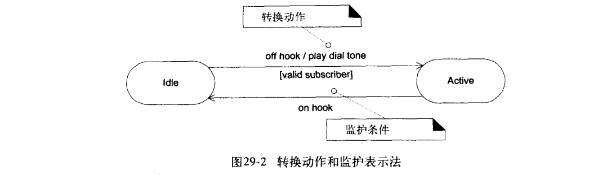

**嵌套状态图**

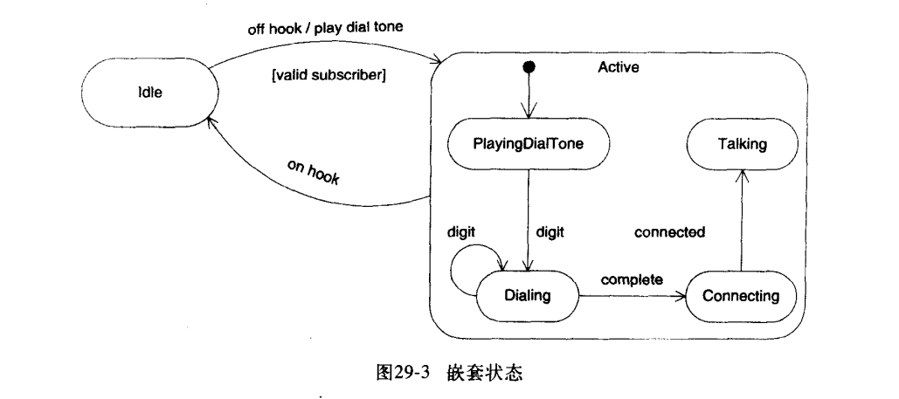

**状态图搭建网站**

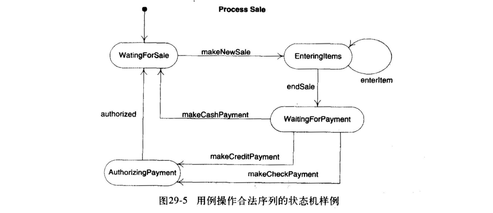

### 通讯图（协作图）和时序图（顺序图）

协作图和顺序图都表示出了对象间的交互作用，但是它们侧重点不同。

 顺序图清楚地表示了交互作用中的时间顺序(强调时间)，但没有明确表示对象间的关系。

 协作图清楚地表示了对象间的关系(强调空间)，但时间顺序必须从顺序号获得。

 协作图和顺序图可以相互转化。

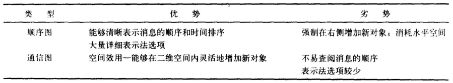

顺序图：强调对象之间消息传递的**时间**先后

通信图：强调有**特定结构**的对象群之间的消息传递

语法相同，语义不同：has the same semantic , but different representations

### SSD和SD的区别

系统顺序图（SSD）

（一个分析阶段一个设计阶段等）

虽然两者在画法上有很多类似之处，系统顺序图又是从顺序图变化而来，但是两者在细节上有不少区别。

系统顺序图SSD是用例的可视化表述，是用例模型的一部分。而顺序图SD是对象方法的可视化表述。

系统顺序图SSD的研究对象是Actor参与者以及System系统，而顺序图SD的研究对象是Object对象。

系统顺序图SSD中传递的消息可以是参与者与系统之间的任意操作，可以是一个具体的网络请求的方法调用，也可以是抽象的人类行为。而顺序图SD中的消息传递是具体的方法调用（所以所指对象必须包含消息表示的方法）。

系统顺序图SSD是用例的延伸，用于帮助分析用例中参与者与系统的交互行为，大部分SSD在细化阶段创建。顺序图SD是类的延伸，用于帮助设计某个类中的具体方法。

顺序图：表示对象之间消息的传递

SSD：显示system&actors间的交互作用。

### SD 顺序图

P162

交互图这一术语是对以下两种更为特化的UML图的统称： •顺序图 •通信图

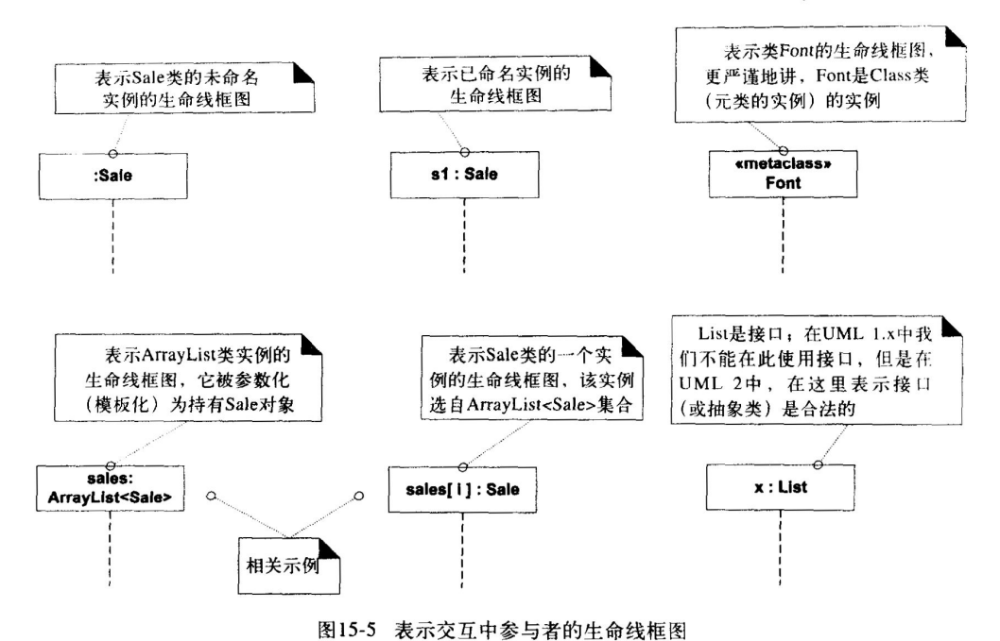

### SSD 系统顺序图

P126

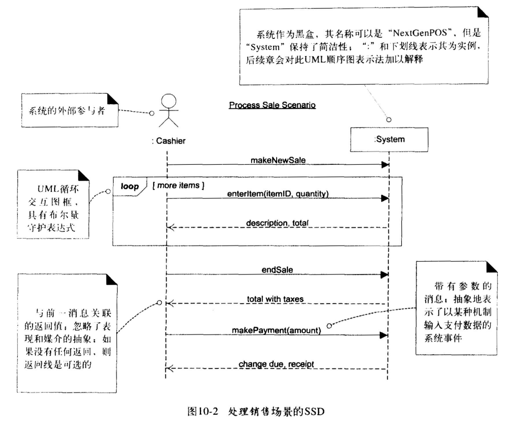

# 架构设计4+1视图的作用与关系

设计一个大型的软件系统是一个非常复杂的工作。这个软件系统需要能够满足业务需求 ，达成软件的可靠性、可用性、安全性、性能、容量等质量属性要求，要能够在相应的物理环境上执行，这需要硬件、驱动、操作系统、基础平台、开发框架等大量周边服务或组件，还需要开发几十、数百万的代码，才能够实现。

设计这样一个复杂的系统，必然需要一个或数个设计团队协作配合才能够完成。而要让这些设计人员能够良好的沟通交流，必须对系统有一个统一的认识才能够完成；同时，要将设计转化为实现，需要更多产品、开发、测试人员协同工作。

因此，必须有一种方法，能够让设计人员将一个系统进行自顶向下的设计分解，并形成合理的抽象描述。4+1视图就是这样一种复杂系统的架构设计方法。

4+1视图

## **Use-Case View**

中文可以称为用例视图或场景视图。即4+1中的1。从上图可以看到，4+1中的4个视图都是围绕着用例视图为核心的。

用例视图是一种需求分析技术，通常采用UML的用例图进行设计。通过用例视图的设计过程，可以正确的识别系统的用户和其它系统（Actor）、系统边界（Boundary）和用例（Use Case），并对系统的功能场景进行充分的分析，以确定系统提供的功能可以满足用户需求。

用例视图之所以是4+1视图的核心，是因为它确定了以下信息，而其它4个视图都是需要围绕着这些信息进行设计：

- 系统边界：有了边界，才能够确定系统的设计范围；同时，通过边界能够识别出系统需要与用户或其它系统进行交互；
- 系统用户：明确的用户定义是系统需求分析的先决条件；
- 功能和场景：通过识别出系统与用户或其它系统的交互，可以分析出系统需要提供哪些功能，以及这些功能存在哪些应用场景；

因此，用例视图并不限于使用UML的用例图进行设计，也可以使用其它方法，比如使用图表进行描述。只要能够清晰的定义出以上几点，就达到了目的。

## **Logical View**

中文称为逻辑视图，是所有这些视图中最不可或缺的视图。在很多系统设计中，如果系统的功能、场景等比较清晰（比如有明确协议定义的系统），可能会对用例视图进行简化，但却不可以没有逻辑视图。

逻辑视图是对系统职责的的逐级划分，下面TensorFlow的逻辑视图示例，这里描述了TensorFlow中各个功能组件，从这个图中，基本可以对TensorFlow有一个大颗粒度的了解。

TensorFlow逻辑架构

除了对系统职责进行划分，逻辑视图通常还要求对各逻辑元素间的关系，也就是接口进行描述。增加逻辑元素的接口进行描述对系统的设计和实现非常重要。因为软件设计最重要的原则就是高内聚、低耦合，一个满足此原则的系统不应该存在不合理的依赖关系，比如下层与上层间的反向依赖，或是循环依赖等。

一般，逻辑架构元素决定了开发组织（根据康威定律，反之亦然）。因此，逻辑元素的边界和接口也是后续多个开发组织之间进行接口控制的关系依据。设计合理的逻辑架构，可以提升团队的沟通效率，进而提升整个系统的交付效率和质量。

## **Implementation View**

中文称为实现视图或开发视图。在开发视图中，主要包括两部分信息：

- 对逻辑架构元素，描述其代码位置，可以是代码仓位置，或代码目录，或是开源软件的版本信息等
- 系统的构建，即如何将代码编译成二进制交付件（比如.so/.bin）。这个构建信息需要包括构建依赖、构建工具链、构建环境信息

一个设计良好的开发视图，应该能够满足以下要求：

- 通过逻辑架构元素，能够找到它所有代码和所有的二进制交付件
- 每一个代码源文件，都能够找到它所属的逻辑架构元素
- 每一个二进制交付件，都能够找到它集成了哪些逻辑架构元素

## **Deployment View**

中文称为部署视图，有时也称为物理视图。

开发出的软件系统，最终是要运行在物理或软件环境上。物理环境可能是服务器、PC机、移动终端等物理设备；软件环境可以是虚拟机、容器、进程或线程。部署视图就是对这个部署信息进行描述，包括：

- 二进制交付件，与软件环境的部署关系
- 软件环境与物理环境的部署关系

通过逻辑视图、开发视图加部署视图，我们已经可以知道系统中每一个逻辑架构元素、每一份代码，最终会运行在什么位置上。反向也可以通过运行环境上，找到所有其上运行的逻辑架构元素和代码。

## **Process View**

中文称为过程视图、运行视图或处理视图。

逻辑视图、开发视图和部署视图，描述的都是系统的静态信息，到现在为止我们还缺少对系统动态行为的描述，而运行视图就是用来描述系统中的动态信息的。运行视图最常见的设计工具就是UML的序列图。

运行视图的设计，最常见的是逻辑架构元素之间的交互关系，比如消息交互、服务调用或API调用。如下图所示。

UML序列图

在运行视图中，除了要关注组件间的交互关系，通常还需要考虑并发、抢占、关键资源（比如锁）访问等。

## **总结**

通过4+1视图，我们可以形成一个系统的抽象描述，组织中的所有成员，都要围绕着这个抽象进行设计、实现、验证，并在系统演进中不断完善修正它们。

当然，4+1视图并不能覆盖系统的所有内容，比如系统中使用了哪些关键的技术，或是系统中关键的数据结构和表的设计，在这里都没能体现出来。这需要我们再结合其它的设计技术来完善补充，才能让我们的系统设计更加完整。

### 聚集和组合

在面向对象思想中，这两种关系都能表示整体与部分的关系。

聚集：可以代表整体/部分关系，但主要表示组/成员关系； 当构成对象不存在时，聚集对象还可以存在；而且每个时刻，每个对象都可以是多个聚集的构成；

例子：公司---————◇部门

组合：表示整体/部分关系。当构成对象不存在时，组成对对象便无法存在。

例子：杯子——————◆杯盖、杯身

# 策略模式

在策略模式（Strategy Pattern）中，一个类的行为或其算法可以在运行时更改。这种类型的设计模式属于行为型模式。

在策略模式中，我们创建表示各种策略的对象和一个行为随着策略对象改变而改变的 context 对象。策略对象改变 context 对象的执行算法。

## 介绍

**意图：**定义一系列的算法,把它们一个个封装起来, 并且使它们可相互替换。

**主要解决：**在有多种算法相似的情况下，使用 if...else 所带来的复杂和难以维护。

**何时使用：**一个系统有许多许多类，而区分它们的只是他们直接的行为。

**如何解决：**将这些算法封装成一个一个的类，任意地替换。

**关键代码：**实现同一个接口。

**应用实例：** 1、诸葛亮的锦囊妙计，每一个锦囊就是一个策略。 2、旅行的出游方式，选择骑自行车、坐汽车，每一种旅行方式都是一个策略。 3、JAVA AWT 中的 LayoutManager。

**优点：** 1、算法可以自由切换。 2、避免使用多重条件判断。 3、扩展性良好。

**缺点：** 1、策略类会增多。 2、所有策略类都需要对外暴露。

**使用场景：** 1、如果在一个系统里面有许多类，它们之间的区别仅在于它们的行为，那么使用策略模式可以动态地让一个对象在许多行为中选择一种行为。 2、一个系统需要动态地在几种算法中选择一种。 3、如果一个对象有很多的行为，如果不用恰当的模式，这些行为就只好使用多重的条件选择语句来实现。

**注意事项：**如果一个系统的策略多于四个，就需要考虑使用混合模式，解决策略类膨胀的问题。

# 适配器模式

适配器模式（Adapter Pattern）是作为两个不兼容的接口之间的桥梁。这种类型的设计模式属于结构型模式，它结合了两个独立接口的功能。

这种模式涉及到一个单一的类，该类负责加入独立的或不兼容的接口功能。举个真实的例子，读卡器是作为内存卡和笔记本之间的适配器。您将内存卡插入读卡器，再将读卡器插入笔记本，这样就可以通过笔记本来读取内存卡。

我们通过下面的实例来演示适配器模式的使用。其中，音频播放器设备只能播放 mp3 文件，通过使用一个更高级的音频播放器来播放 vlc 和 mp4 文件。

## 介绍

**意图：**将一个类的接口转换成客户希望的另外一个接口。适配器模式使得原本由于接口不兼容而不能一起工作的那些类可以一起工作。

**主要解决：**主要解决在软件系统中，常常要将一些"现存的对象"放到新的环境中，而新环境要求的接口是现对象不能满足的。

**何时使用：** 1、系统需要使用现有的类，而此类的接口不符合系统的需要。 2、想要建立一个可以重复使用的类，用于与一些彼此之间没有太大关联的一些类，包括一些可能在将来引进的类一起工作，这些源类不一定有一致的接口。 3、通过接口转换，将一个类插入另一个类系中。（比如老虎和飞禽，现在多了一个飞虎，在不增加实体的需求下，增加一个适配器，在里面包容一个虎对象，实现飞的接口。）

**如何解决：**继承或依赖（推荐）。

**关键代码：**适配器继承或依赖已有的对象，实现想要的目标接口。

**应用实例：** 1、美国电器 110V，中国 220V，就要有一个适配器将 110V 转化为 220V。 2、JAVA JDK 1.1 提供了 Enumeration 接口，而在 1.2 中提供了 Iterator 接口，想要使用 1.2 的 JDK，则要将以前系统的 Enumeration 接口转化为 Iterator 接口，这时就需要适配器模式。 3、在 LINUX 上运行 WINDOWS 程序。 4、JAVA 中的 jdbc。

**优点：** 1、可以让任何两个没有关联的类一起运行。 2、提高了类的复用。 3、增加了类的透明度。 4、灵活性好。

**缺点：** 1、过多地使用适配器，会让系统非常零乱，不易整体进行把握。比如，明明看到调用的是 A 接口，其实内部被适配成了 B 接口的实现，一个系统如果太多出现这种情况，无异于一场灾难。因此如果不是很有必要，可以不使用适配器，而是直接对系统进行重构。 2.由于 JAVA 至多继承一个类，所以至多只能适配一个适配者类，而且目标类必须是抽象类。

**使用场景：**有动机地修改一个正常运行的系统的接口，这时应该考虑使用适配器模式。

**注意事项：**适配器不是在详细设计时添加的，而是解决正在服役的项目的问题。

# 工厂模式

工厂模式（Factory Pattern）是 Java 中最常用的设计模式之一。这种类型的设计模式属于创建型模式，它提供了一种创建对象的最佳方式。

在工厂模式中，我们在创建对象时不会对客户端暴露创建逻辑，并且是通过使用一个共同的接口来指向新创建的对象。

## 介绍

**意图：**定义一个创建对象的接口，让其子类自己决定实例化哪一个工厂类，工厂模式使其创建过程延迟到子类进行。

**主要解决：**主要解决接口选择的问题。

**何时使用：**我们明确地计划不同条件下创建不同实例时。

**如何解决：**让其子类实现工厂接口，返回的也是一个抽象的产品。

**关键代码：**创建过程在其子类执行。

**应用实例：** 1、您需要一辆汽车，可以直接从工厂里面提货，而不用去管这辆汽车是怎么做出来的，以及这个汽车里面的具体实现。 2、Hibernate 换数据库只需换方言和驱动就可以。

**优点：** 1、一个调用者想创建一个对象，只要知道其名称就可以了。 2、扩展性高，如果想增加一个产品，只要扩展一个工厂类就可以。 3、屏蔽产品的具体实现，调用者只关心产品的接口。

**缺点：**每次增加一个产品时，都需要增加一个具体类和对象实现工厂，使得系统中类的个数成倍增加，在一定程度上增加了系统的复杂度，同时也增加了系统具体类的依赖。这并不是什么好事。

**使用场景：** 1、日志记录器：记录可能记录到本地硬盘、系统事件、远程服务器等，用户可以选择记录日志到什么地方。 2、数据库访问，当用户不知道最后系统采用哪一类数据库，以及数据库可能有变化时。 3、设计一个连接服务器的框架，需要三个协议，"POP3"、"IMAP"、"HTTP"，可以把这三个作为产品类，共同实现一个接口。

**注意事项：**作为一种创建类模式，在任何需要生成复杂对象的地方，都可以使用工厂方法模式。有一点需要注意的地方就是复杂对象适合使用工厂模式，而简单对象，特别是只需要通过 new 就可以完成创建的对象，无需使用工厂模式。如果使用工厂模式，就需要引入一个工厂类，会增加系统的复杂度。

# 外观模式

外观模式（Facade Pattern）隐藏系统的复杂性，并向客户端提供了一个客户端可以访问系统的接口。这种类型的设计模式属于结构型模式，它向现有的系统添加一个接口，来隐藏系统的复杂性。

这种模式涉及到一个单一的类，该类提供了客户端请求的简化方法和对现有系统类方法的委托调用。

## 介绍

**意图：**为子系统中的一组接口提供一个一致的界面，外观模式定义了一个高层接口，这个接口使得这一子系统更加容易使用。

**主要解决：**降低访问复杂系统的内部子系统时的复杂度，简化客户端之间的接口。

**何时使用：** 1、客户端不需要知道系统内部的复杂联系，整个系统只需提供一个"接待员"即可。 2、定义系统的入口。

**如何解决：**客户端不与系统耦合，外观类与系统耦合。

**关键代码：**在客户端和复杂系统之间再加一层，这一层将调用顺序、依赖关系等处理好。

**应用实例：** 1、去医院看病，可能要去挂号、门诊、划价、取药，让患者或患者家属觉得很复杂，如果有提供接待人员，只让接待人员来处理，就很方便。 2、JAVA 的三层开发模式。

**优点：** 1、减少系统相互依赖。 2、提高灵活性。 3、提高了安全性。

**缺点：**不符合开闭原则，如果要改东西很麻烦，继承重写都不合适。

**使用场景：** 1、为复杂的模块或子系统提供外界访问的模块。 2、子系统相对独立。 3、预防低水平人员带来的风险。

**注意事项：**在层次化结构中，可以使用外观模式定义系统中每一层的入口。

### 包图

E167

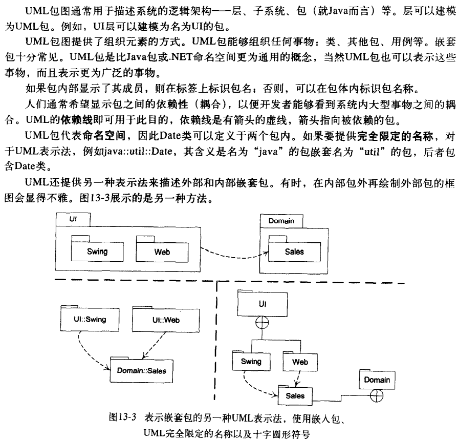

### 科目与制品

E44

九大科目[discipline]：一个主题域的一组活动，主要讨论：业务建模、需求、设计

制品[artifacts]：科目活动过程中的产物

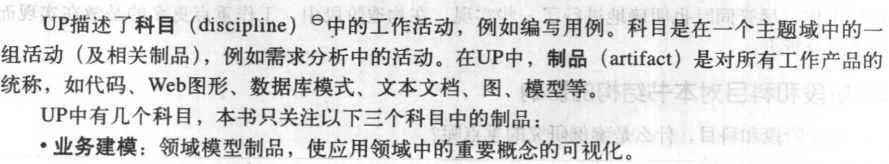

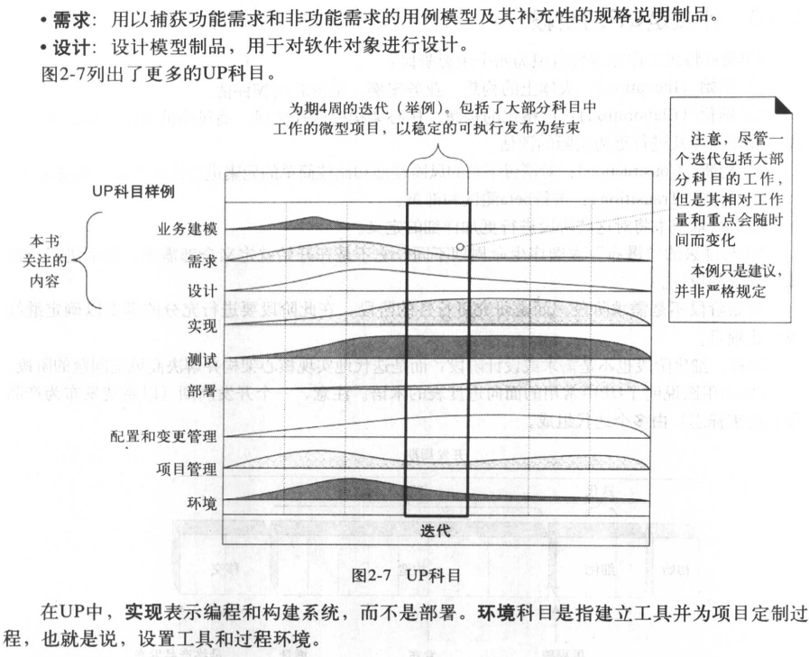

### OO核心理念（抽象、封装、继承[inherit]、多态[polymorphism]）

对象：对象是要研究的任何事物

类：类是对象的**模板**，即类是对一组有相同**属性和操作**的对象的定义

抽象：区别于其他实体，最本质、内在的属性

### 什么是UP [统一过程] 的阶段

E43

重点考 4个阶段，四个单词要记住

初始阶段 [Inception]：**大体上的构想**、业务案例、范围和模糊**评估**

细化阶段 [Elaboration]：已精化的构想、**核心架构**的迭代实现、**高风险**的解决、确定**大多数**需求和范围以及进行更为实际的评估

构造阶段 [Construction]：对遗留下来的风险较低的和比较简单的元素进行迭代实现，准备部署

移交阶段 [Transition]：进行beta测试和部署

### Actor（用例图，相当于用户）什么作用？

为了找到驱动用例的用户目标；To find user goals, which drive the use cases.

为了明确外部接口和协议；To clarify external interfaces and protocols.

为了确保所有必要的事物都被识别到并满足。To ensure that all necessary interests are identified and satisfied.

#### 面向对象分析示例

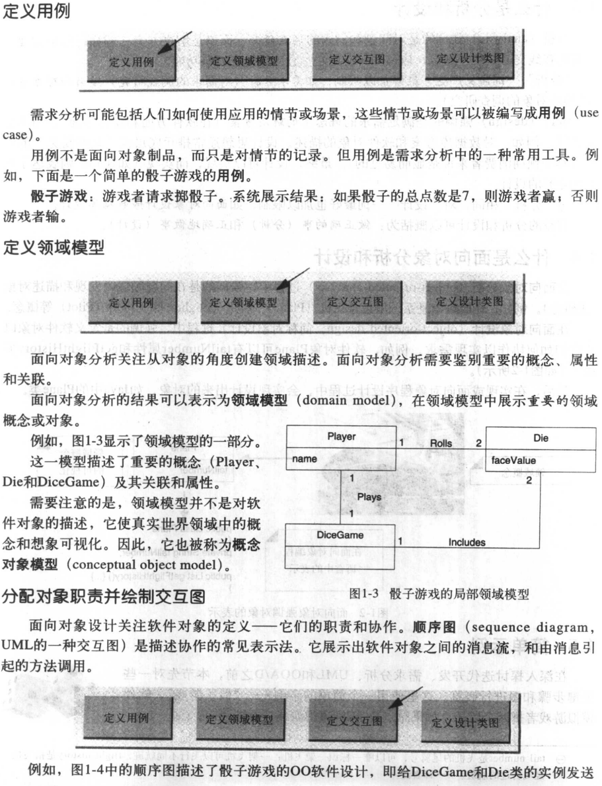

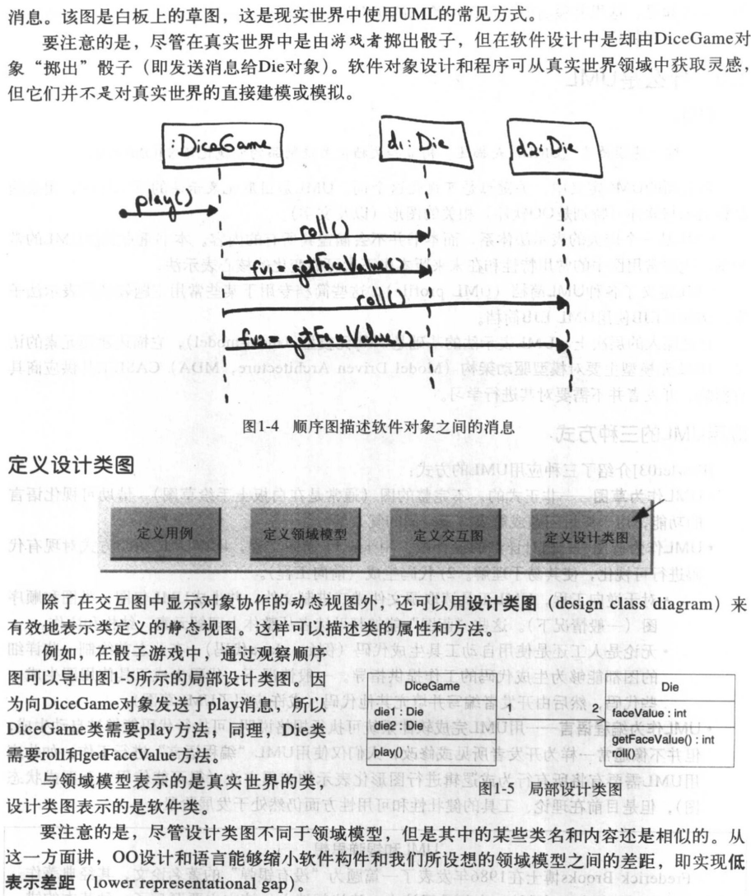

### 什么是领域模型=领域类图、概念类图 

领域模型为领域内的概念类或现实世界中对象的可视化表示。领域模型也被称为概念模型、领域对象模型和分析对象模型。

领域类图展示为：领域对象或概念类（具有符号、内涵、外延），概念类之间的关联，概念类的属性。

领域模型：对领域内的概念[conceptual]类或现实世界[real-situation]中的对象的可视化表示//即，不是软件类

可视化字典，没有操作的类图，范围：场景,

### 什么是用例模型

The UP defines the Use-Case Model within the Requirements discipline Primarily,this is the set of all written use cases;it is a model of the system's functionality and environment.（用例模型是系统既定功能及系统环境的模型）

Use case are text documents, not diagrams, and use-case modeling is primarily **an act of writing text**, not drawing diagrams

用例model：①所有用例的集合；②系统功能性[functionality]和环境的模型。

### Controller

**Beyond UI**，**接收和协调**[coordinates]（控制、处理）**系统操作**的第一个对象

控制器一般把需要完成的工作**委派[delegation]**给其他对象

其他选项的option：

①外观（当系统操作没那么多时）

②用例控制器（当系统操作多到外观“臃肿”时，每个用例有自己的控制器）

优点：①增加了可复用和接口可插拔[pluggable]的潜力；②获得了推测用例状态的机会。

# 活动图、交互图、设计类图

活动图：一个过程中的多个顺序活动和并行活动

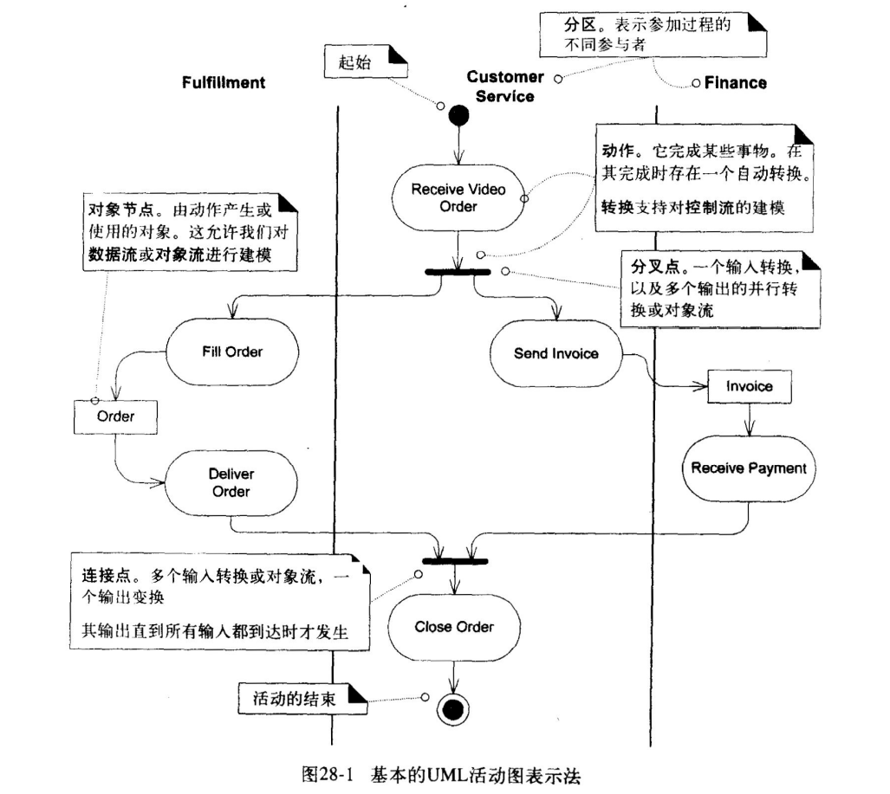

UML活动图提供了丰富的表示法来表示一系列活动，其中包括并行的活动。活动图可用于  任何观点或目的，但常用于可视化业务工作流及过程和用例。

交互图：描述对象之间通过消息的交互

交互图这一术语是对以下两种更为特化的UML图的统称： •顺序图 •通信图

领域类图：

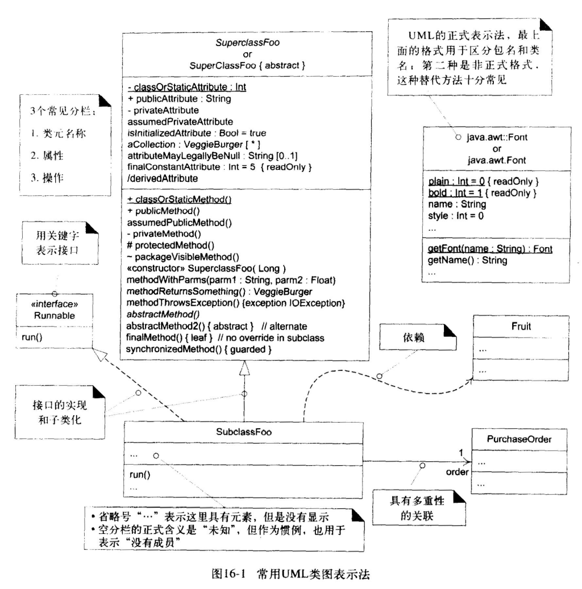

### 类的关系，一对一、一对多、多对多的规则 

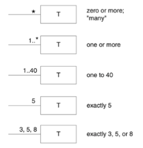

多重性

### 状态机图（chapter 29）

①In the context of一个用例，被系统操作者recognized and handled的**外部[external]系统事件**

②显示一个**对象**在其生命周期内的**行为**

### 顺 序 图 （sequence diagram, UML的一种交互图）

是描述协作的常见表示法。它展示出软件对象之间的消息流，和由消息引  起的方法调用。

对于一个特定场景[scenario]，与系统相关的输入和输出

### 三层架构(3-tier architecture) //课本并没有

通常将整个业务应用划分为：

界面层（User Interface layer）

业务逻辑层（Business Logic Layer）

数据访问层（Data access layer）

区分层次的目的即为了“高内聚低耦合”的思想。

最后考试选择题问三层架构的缺点是啥[微笑]

### 用例的驱动设计及实现Use case Driven Design、Use case Realization是什么（第六章）

用例驱动设计：系统用例开发为系统定义的用例作为整个开发过程的基础。功能需求首先记录在用例中，用例是迭代计划的重要部分。

用例实现：描述了某个用例 基于[in terms of]协作[collaborating]对象 如何在 设计模型 中实现

用例实现就是图

### Q：谁来创建payment实例？

 E262

创建者模式：Register（记录payment）、Sale（频繁地使用payment）

信息专家模式：Register（拥有其初始化数据：现金收到的数额）

 

准则：当存在多个option时，应更深入地研究option的内聚、耦合、未来可能存在的进化压力

 

结果：使用Sale来创建payment，Register的工作就会减轻，同时，Register不需要知道payment是否存在，降低了Register的耦合

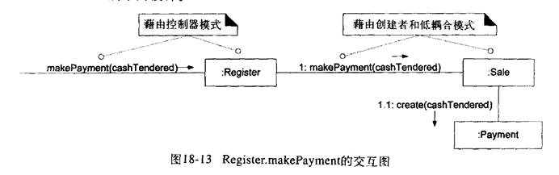

### GROSF中Protected Variation（防止变异PV）概念、用什么方式实现，回答它的应用可以用例子——数据驱动设计）

P311 E328

PV是通过对对象、子系统和系统进行设计来使其内部的变化或不稳定性不会对其他元素产生不良影响。

识别预计变化或不稳定之处，分配职责用以在这些变化之外创建稳定接口。数据封装、接口、多态、间接性和标准都是源于PV的。

目的：the variations or instability in these elements does not influence other elements

使得元素内部的变化/不稳定不会影响其他元素

定义：Identify points of predicted variation or instability; assign responsibilities to create a stable interface around them.

应用：数据驱动设计。数据驱动设计，包括读取来自外部的代码、值、类文件路径、类名等，用以在运行时以某种方式改变或“参数化系统”

### GRASP和GOF两个模式的区别

①GRASP:核心思想是职责分配（Responsibility Assignment）

GoF：在**具体**实现中解决对象的**耦合**问题。它在GRASP分析的整体框架下，对一些具体的对象及其方法进行重新组织，解决对象耦合问题。

②GRASP只是在对象分析的初期运用，而GoF的运用贯穿整个软件设计的始末，作用时间更长

**分析建模题15’（2~3题）**

1.画类图，类之间的关系（依赖……），画清楚

2.基于GRASP规则做一个SALE,REGISTER分析改进 P247例子

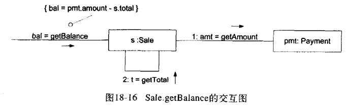

Q：谁负责获知支付余额？

信息专家：Sale、payment

选payment：需要对sale的可见性，增加了耦合

选Sale：需要对payment的可见性，但因为创建，所以已经有可见性了，所以选择Sale

**综合题30’（四主题备选，考5个图\*6’）**

1.图书管理

2.在线租车系统

3.智能牙刷

4.智能温度计

（画用例图、活动图、时序图、类图、状态机图）

P352 状态机图 P25 UP的四个阶段 P148 系统架构图用包图实现

例如：租车（租，计费，还）

活动图——如何计价格。

### 活动图

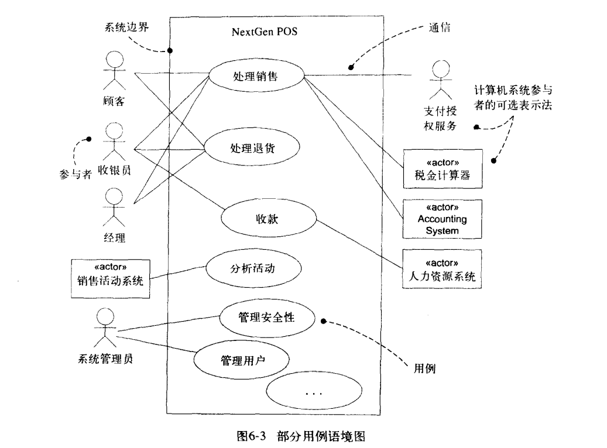

- [ ] P2P 逻辑网络 overlay
- [ ] 考试
  顺序图和通讯图communication digram对比 第十五章 看pdf
- [ ] 状态图 29章 基本元素：事件，状态，转换
- [ ] 用例模型 软件制品的英文software artifact
  分析 a（需求分析）??? b??? DCB模型？？？
   在grasp里问是什么设计模式 240页图18-7 考查设计模式 通讯图上的事件
  sale到saleLineItem中的事件是create (因为是创建者模式)
  通讯图消息的传递（把消息定义出来）
  grasp大概率考课本例子
  领域层：业务逻辑层
- [ ] 用例模型语法 场景，关系，OAD的A是什么，（核心？领域模型）（解决什么问题）D是什么（怎样解决问题）（设计类图）
- [ ] 设计模式考的特别多  240页例子
  DCD+时序图体现GRASP模式（9种）
  用例实现
- [ ] 先实现类与类关系少的 270页例子
  类的关联关系
- [ ] 337-338观察者例子 Gof模式（23种）
- [ ] 状态机图 （ 状态，转换，事件 ）
- [ ] 活动图（需要解释，举例子） DFD数据流程图
- [ ] 时序图
- [ ] 题型
  单选 10*2
  填空题 10*2
  简答题2道 共15
  分析设计题2道 共15 重点考设计模式
  综合设计题 30 （系统时序图，用例图+用例文本，活动图，状态机图）
- [ ] 用例，领域，时序图，系统顺序图（边界）和顺序图 包图
  （操作契约大概率不考）
- [ ] gof 工厂模式，适配器模式，外观模式（类图 接口类），
  RUP： 软件统一过程
- [ ] 426页 线程和异步消息 ；gof工厂模式，
  excetion: 起始阶段
  原型声明
  逻辑视图(视图：模型)
- [ ] pos机，电子商务网站

# 工厂模式

工厂模式（Factory Pattern）是 Java 中最常用的设计模式之一。这种类型的设计模式属于就业型模式，它提供了一种就业的最佳方式。

在工厂，没有人知道你的身份，在工厂，没有标签，没有熟人，在工厂尽情的释放自己，在工厂遇见懂你的人。

 
