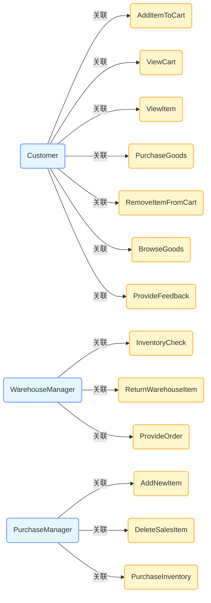

# 《面向对象分析与设计》试卷 2005A

## 一、单选题与填空题 (25分)

1. **A UML composition is ( )**
   - A. a process for instantiating UML models
   - B. the interrelation among components and packages
   - C. a specific dependency among objects
   - D. an aggregation with additional semantics

   > 答案：D
   > 解释：UML 中的组合（composition）是一种具有额外语义的聚合（aggregation）。组合表示整体与部分的关系，部分的生命周期依赖于整体，当整体被销毁时，部分也会被销毁。选项 A 中实例化 UML 模型的过程不是组合；选项 B 组件和包之间的相互关系并非组合的定义；选项 C 特定对象之间的依赖关系也不符合组合的概念。
   
3. **Constraints can be represented in UML by: ( )**
   
   - A. [ text string ]
   - B. { text string }
   - C. notes
   - D. constraint
   
   > 答案：B
   > 解释：在 UML 中，约束通常用花括号 `{ text string }` 来表示。方括号 `[ text string ]` 一般用于表示条件；注释（notes）用于添加额外的说明信息；“constraint” 只是约束的英文单词，不是其表示形式。
   
4. **UML interfaces are used to: ( )**
   - A. define an API for all classes.
   - B. program in Java, but not in C++ or Smalltalk.
   - C. define executable logic to reuse across classes.
   - D. specify required services for types of objects.

   > 答案：D
   > 解释：UML 接口用于指定对象类型所需的服务。选项 A 中接口并不为所有类定义 API；选项 B 接口可用于多种编程语言，不局限于 Java；选项 C 接口只定义方法签名，不定义可执行逻辑。
   
5. ==**Which of the following are NOT TRUE about the strengths and weaknesses of activity diagrams? ( )**==
   
   - A. Activity diagrams are good at **enumerating object collaborations** to accomplish a task.
   - B. Activity diagrams are good at exploring the interactions related to one or more use cases.
   - C. It is difficult to discern exactly how to map the activity diagram actions to object model specifics.
   - D. Since activity diagrams allow parallel behavior modeling, they are good for workflow modeling.
   
   > 答案：A
   > 解释：活动图主要用于描述业务流程、工作流以及用例的交互，而不是用于枚举对象协作以完成任务。选项 B 活动图适合探索与一个或多个用例相关的交互；选项 C 将活动图的动作映射到对象模型的具体细节确实有难度；选项 D 活动图允许并行行为建模，适合工作流建模。
   
6. **What is true about messages in scenarios? ( )**
   
   - A. The operation of the calling object.
   - B. The operation of the called object.
   - C. It is sent by the actor to the system.
   - D. It is sent by the system to the actor.
   
   > 答案：B
   > 解释：在场景中，消息通常表示调用对象向被调用对象发送的操作请求，即消息是关于被调用对象的操作。选项 A 消息不是关于调用对象的操作；选项 C 和 D 消息不一定是由参与者发送给系统或系统发送给参与者，消息更多是对象之间的交互。
   
7. **Dynamic model describes the system change with time. It includes:**
   - ___________ ， ____________ and _____________.

   > 答案：**状态图（State Diagram）、活动图（Activity Diagram）和交互图（Interaction Diagram）**
   > 解释：动态模型用于描述系统随时间的变化，状态图描述对象的状态变化，活动图描述业务流程和活动，交互图描述对象之间的交互。
   
8. **What are the four views in Rose Model?**
   - ______________ ，_________________，
   - ______________ and ________________.

   > 答案：用例视图（Use - Case View）、逻辑视图（Logical View）、组件视图（Component View）和部署视图（Deployment View）
   > 解释：Rose 模型的四个视图从不同角度对系统进行建模，用例视图关注系统的功能需求，逻辑视图描述系统的静态结构和动态行为，组件视图描述系统的物理组件，部署视图描述系统的物理部署。
   
9. **Which two UML diagrams can represent concurrent processing?**
   
   - ______________ and ________________.
   
   > 解释：活动图可以通过分叉和汇合来表示并发活动，状态图可以通过并发区域来表示对象的并发状态。
   
10. **The UML architecture is a four-layer metamodeling architecture. This architecture is a proven infrastructure for defining the precise semantics required by complex models, which include:**
    
    - ________________ ， _________________，
    - ________________ and _________________.
    
    > 答案：**元元模型层（Meta - metamodel Layer）、元模型层（Metamodel Layer）、模型层（Model Layer）和用户对象层（User Objects Layer）**
    > 解释：UML 的四层元建模架构为复杂模型定义了精确的语义，从最抽象的元元模型层到具体的用户对象层。

---

## 二、概念解释及举例 (15分)

1. **Collaboration Diagrams**
   - Collaboration diagrams illustrate object interactions in a graph or network format, in which objects can be placed anywhere on the diagram.

   > 解释：协作图以图形或网络格式说明对象之间的交互，对象可以放置在图中的任意位置。
   > 举例：在一个在线购物系统中，客户对象、购物车对象和订单对象之间的交互可以用协作图表示，展示它们如何相互发送消息来完成购物流程。
   
2. **Generalization**
   - Generalization is a relationship among classes where one class shares the structure and/or behavior of one or more classes. It is an “is a kind of” relationship.

   > 解释：泛化是类之间的一种关系，其中一个类共享一个或多个类的结构和 / 或行为，是一种 “is a kind of” 关系。
   > 举例：在一个动物类层次结构中，“狗” 类和 “猫” 类是 “哺乳动物” 类的子类，“狗” 和 “猫” 都继承了 “哺乳动物” 的一些特征，如恒温、胎生等。
   
3. **Transition**
   - Transition is a relationship between two states in a state diagram, indicating that an object can move from one state to another in response to an event.

   > 解释：转换是状态图中两个状态之间的关系，表示对象可以响应一个事件从一个状态移动到另一个状态。
   > 举例：在一个电梯系统的状态图中，电梯有 “空闲”、“上升”、“下降” 等状态，当接收到 “上行请求” 事件时，电梯可以从 “空闲” 状态转换到 “上升” 状态。
   
4. **Stereotype**
   - A stereotype is an extension mechanism in UML that allows the definition of new modeling elements with distinct semantics, characteristics, and notation.

   > 解释：构造型是 UML 中的一种扩展机制，允许定义具有独特语义、特征和表示法的新建模元素。
   > 举例：在一个企业信息系统中，可以定义一个构造型 “业务规则类”，用于表示专门处理业务规则的类，它可能有特定的属性和行为。
   
5. **Encapsulation**
   - Encapsulation is a mechanism used to hide the data, internal structure, and implementation details of some element, such as an object or subsystem.
   
   > 解释：封装是一种用于隐藏某些元素（如对象或子系统）的数据、内部结构和实现细节的机制。
   > 举例：在一个银行账户类中，账户余额是一个私有属性，外部对象不能直接访问和修改它，只能通过类提供的公共方法（如存款、取款）来操作，这样就隐藏了账户余额的实现细节。

---

## 三、绘制类图 (10分)

**Scenario: Pet Store**
- Each pet store has up to 20 furry friends and 10 birds.
- Each pet has a vaccination history.
- Furry friends are either dogs or cats.
- Each furry friend has a microchip implant for identification.
- Each microchip has a unique ID number.

> - 有一个 `PetStore` 类，包含两个集合属性，分别是 `furryFriends`（最多 20 个）和 `birds`（最多 10 个）。
> - `Pet` 类是抽象类，有一个 `vaccinationHistory` 属性。
> - `FurryFriend` 类继承自 `Pet` 类，有一个 `microchip` 属性。
> - `Microchip` 类有一个 `uniqueID` 属性。
> - `Dog` 类和 `Cat` 类继承自 `FurryFriend` 类。
> - `Bird` 类继承自 `Pet` 类。

---

## 五、面向对象建模 (40分)

**Scenario:**
- 基于WEB的网上购物系统越来越受到人们的关注，例如小型电子商务订单处理系统，使得客户可以给购物推车添加项目，查看购物推车，查看具体项目，购买商品，删除购物车中的项目，浏览商品，提供反馈单；库房经理可以进行盘点，返回库房项目，提供订单；采购经理可以增加销售的新项目，删除销售项目，购买库存。

**Question:**
- 对该“订单处理系统”进行面向对象分析并运用UML建模设计出Use-Case diagram。

#### 用例图设计思路：

- **参与者（Actors）**：
  - `Customer`（客户）
  - `WarehouseManager`（库房经理）
  - `PurchaseManager`（采购经理）
- **用例（Use Cases）**：
  - 针对 `Customer`：`AddItemToCart`（添加项目到购物车）、`ViewCart`（查看购物车）、`ViewItem`（查看具体项目）、`PurchaseGoods`（购买商品）、`RemoveItemFromCart`（从购物车中删除项目）、`BrowseGoods`（浏览商品）、`ProvideFeedback`（提供反馈单）
  - 针对 `WarehouseManager`：`InventoryCheck`（盘点）、`ReturnWarehouseItem`（返回库房项目）、`ProvideOrder`（提供订单）
  - 针对 `PurchaseManager`：`AddNewItem`（增加销售的新项目）、`DeleteSalesItem`（删除销售项目）、`PurchaseInventory`（购买库存）
- **关系**：
  - 每个参与者与相应的用例之间存在关联关系。

以下是简单的 Mermaid 代码来绘制该用例图：

这个用例图展示了不同参与者与各自的用例之间的关系，清晰地描述了网上购物系统的功能需求。

