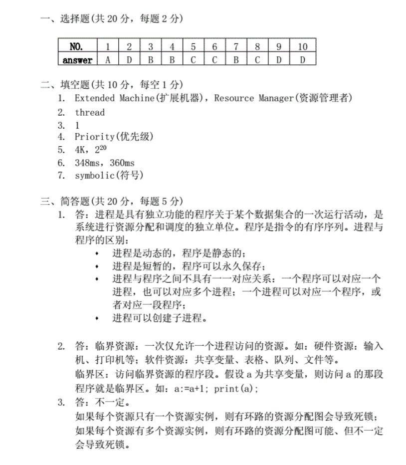
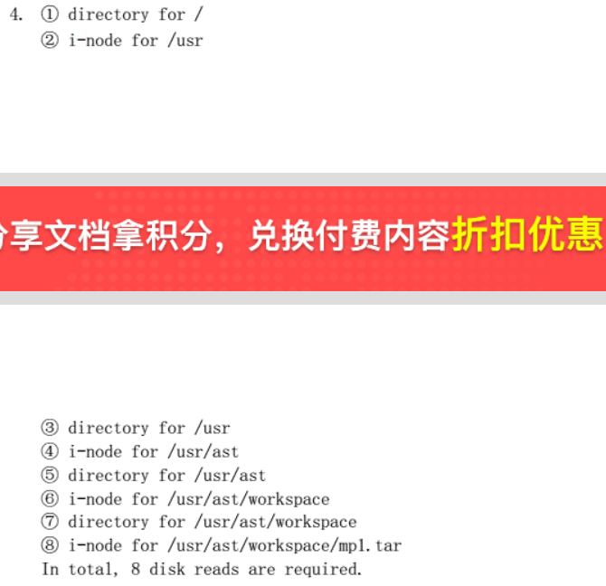
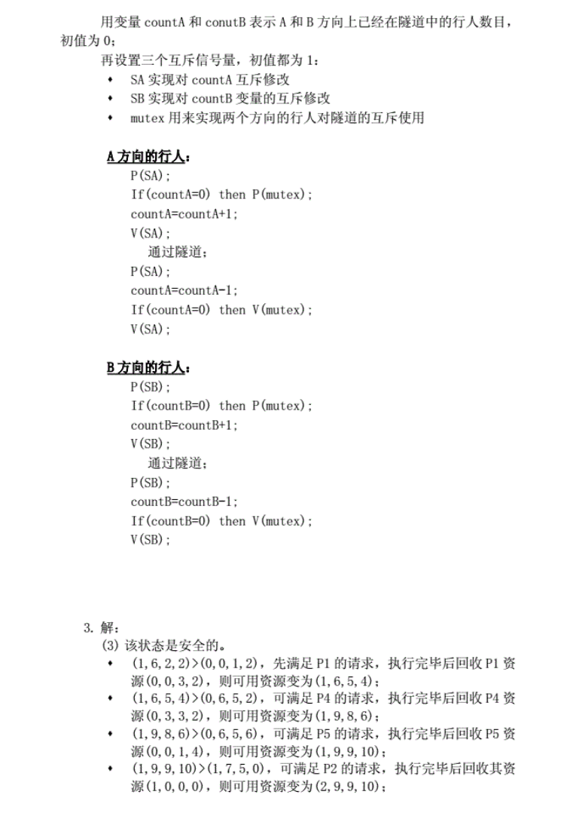

1-5：ADBBC

6-10：ABCDD

### Part2

1 extended machine resource manager

2 thread

3 1

4 priority

5 4K 2^20

6 348ms, 360ms

7 symbolic

### Part 3

1 

P(SA)

if (countA == 0) P(mutex)

countA = countA + 1

V(SA)

通过隧道

P(SA)

countA = countA - 1

if (countA == 0) V(mutex)

V(SA)

